# 🚀用 AWS API 网关和 AWS Lambda 构建电报机器人

> 原文：<https://dev.to/nqcm/-building-a-telegram-bot-with-aws-api-gateway-and-aws-lambda-27fg>

[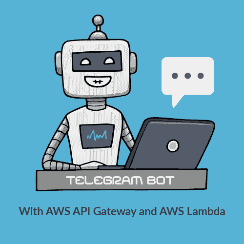](https://res.cloudinary.com/practicaldev/image/fetch/s--9-9iaVoy--/c_limit%2Cf_auto%2Cfl_progressive%2Cq_auto%2Cw_880/https://blog.naveeraashraf.com/img/telegram-bot-with-aws-lambda.png)

在过去的一年里，我制造了很多机器人。我使用 Chatfuel 和 Flowxo 等服务制作了机器人，我用 Python 和 Nodejs 从头开始制作了机器人，我还使用了像微软 Bot Framework 这样的框架。我还为我的从头编码的机器人试验了不同的部署选项，包括 VPS、web 服务器和无服务器架构。

在所有这些选项中，我不断回到[无服务器](https://en.wikipedia.org/wiki/Serverless_computing)部署。在许多情况下，使用无服务器计算架构不仅非常经济，而且维护成本也非常低。你根本不用担心维护一个服务器。只要写下你的代码，上传到云端，然后你就可以把它忘得一干二净了。

## 带有 AWS API 网关和 AWS Lambda 的 Echo Telegram bot

在本指南中，我将演示使用 AWS API Gateway 和 AWS Lambda 制作一个简单的无服务电报机器人，它可以回应用户输入的所有内容。但是首先，我们将使用一些服务。

### 什么是 API 网关

Amazon API Gateway 是一个公共可用的端点，用于运行在 AWS Lambda、Amazon EC2 或其他可公开寻址的 web 服务上的代码。它帮助我们以安全和可扩展的方式交付移动和 web 应用程序后端。

### 什么是 AWS Lambda

AWS Lambda 是一项服务，它让我们在云中创建[无状态](https://en.wikipedia.org/wiki/Stateless_protocol)功能(或代码块),可以通过大量触发器调用(或运行)。除了 AWS，还有许多其他服务让我们创建云功能，比如[谷歌云功能](https://cloud.google.com/functions/)和 [Azure 功能](https://cloud.google.com/functions/)。

机器人或聊天机器人是这种计算服务的理想候选，因为本质上聊天机器人只是一段通过用户交互触发的代码。许多流行的聊天机器人制作平台已经在使用云功能作为其服务的基础。

介绍完毕，让我们开始吧！

### 在电报上注册一个机器人

按照这个指南，你需要一个电报机器人。在 Telegram 中注册一个新的 bot 真的很简单。只需向 Telegram 自己的 bot [BotFather](https://t.me/BotFather) 发送一个“/newbot”命令，然后按照指示操作即可。你会收到一个机器人令牌，复制这个令牌，并把它放在手边。

您可以自定义机器人的描述和“关于”部分，以及通过机器人父亲更改机器人的个人资料图片。一旦你对你的机器人的设置满意，你就可以继续了。

Telegram bot 的工作方式是，当用户向我们的 bot 帐户发送消息时，Telegram 会将该消息发送给我们的代码。我们的代码处理该消息，在完成所有需要做的事情后，它向电报服务器发回一条消息，然后该消息被发送给用户。

我们有两种方法可以从 Telegram 服务器获得新的更新。

1.  长轮询，我们的代码不断询问电报服务器是否有新的更新。
2.  设置 webhooks，其中我们要求电报服务器通过 HTTP 请求向我们发送收到的任何新消息/更新。

设置 webhooks 是接收新更新的最资源友好和可伸缩的方式。这就是我们将要做的。但为此，我们需要一个安全的网址，电报服务器可以推送所有更新。输入 AWS API 网关。

### 创建 API 网关

如果你没有亚马逊账户，注册一个。你需要提供你的信用卡详细信息，但亚马逊有一个非常好的免费层，按照这个指南应该不会花费你任何东西。

登录到 [AWS 控制台](https://aws.amazon.com)并从服务中搜索 API 网关。

点击“创建 API”

[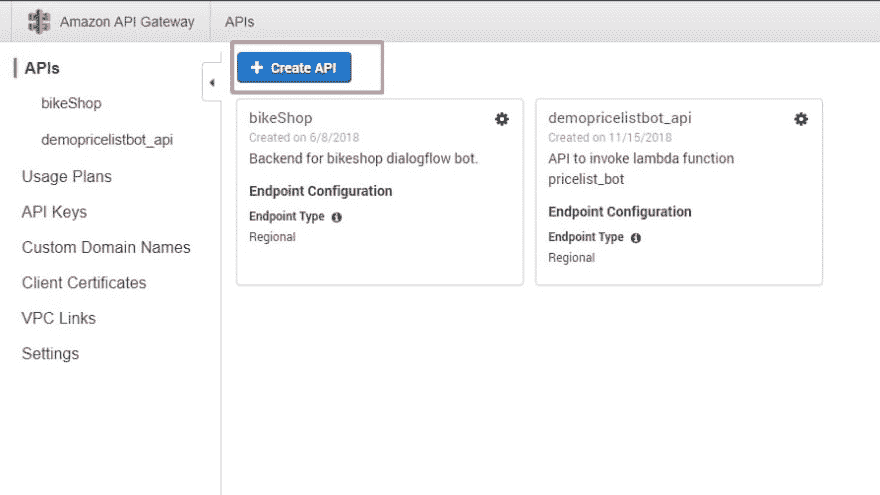](https://res.cloudinary.com/practicaldev/image/fetch/s--mZ0yp3Sl--/c_limit%2Cf_auto%2Cfl_progressive%2Cq_auto%2Cw_880/https://blog.naveeraashraf.com/img/telegram-aws-1.jpg)

给你的 API 一个名称和描述，然后点击创建 API。

[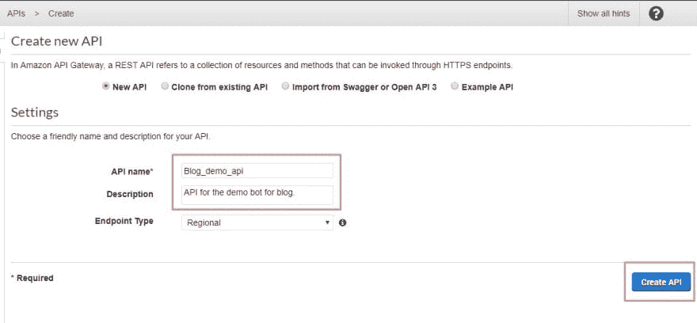](https://res.cloudinary.com/practicaldev/image/fetch/s--ILhHqlra--/c_limit%2Cf_auto%2Cfl_progressive%2Cq_auto%2Cw_880/https://blog.naveeraashraf.com/img/telegram-aws-2.jpg)

在为这个 API 定义任何资源之前，让我们首先创建我们的 Lambda 函数。

### 创建 lambda 函数

登录到 [AWS 控制台](https://aws.amazon.com)并从服务中选择 Lambda。点击“创建功能”。

[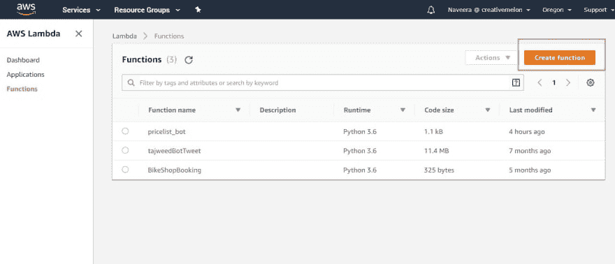](https://res.cloudinary.com/practicaldev/image/fetch/s--IuLryTie--/c_limit%2Cf_auto%2Cfl_progressive%2Cq_auto%2Cw_880/https://blog.naveeraashraf.com/img/telegram-aws-3.jpg)

现在选择“从头开始创作”选项。一旦你一直遵循这个指南，你可以尝试探索亚马逊提供的不同蓝图。

[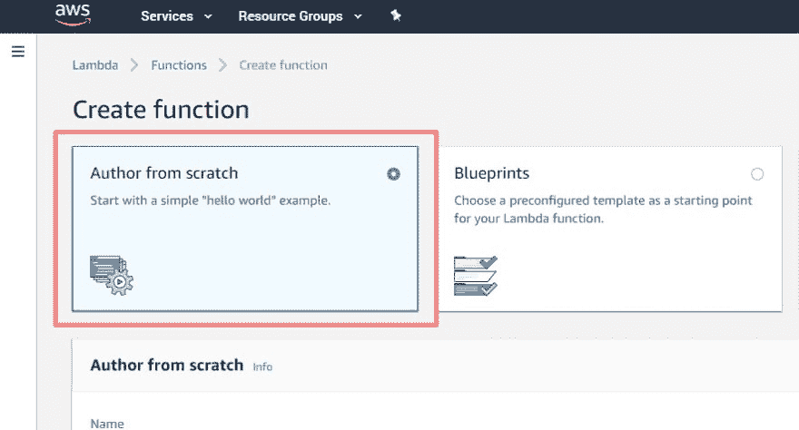](https://res.cloudinary.com/practicaldev/image/fetch/s--2pEE88cA--/c_limit%2Cf_auto%2Cfl_progressive%2Cq_auto%2Cw_880/https://blog.naveeraashraf.com/img/telegram-aws-5.jpg)

给你的函数起个名字，选择你最喜欢的运行时(在本指南中选择 Python3.6)。

[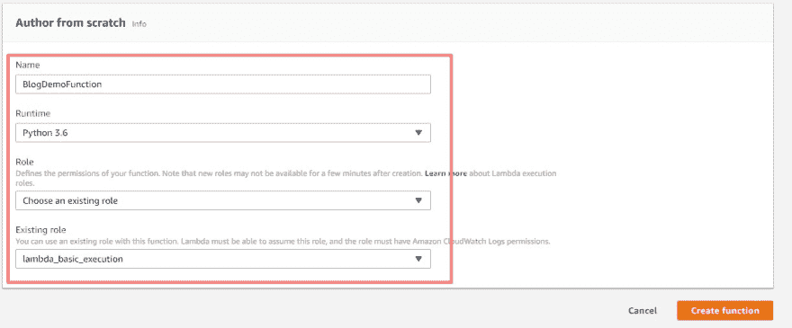](https://res.cloudinary.com/practicaldev/image/fetch/s--NRQv3iQ4--/c_limit%2Cf_auto%2Cfl_progressive%2Cq_auto%2Cw_880/https://blog.naveeraashraf.com/img/telegram-aws-4.jpg)

每个 Lambda 函数都有一个与之关联的 IAM 角色(执行角色)。在创建 Lambda 函数时指定 IAM 角色。您授予该角色的权限决定了 AWS Lambda 在承担该角色时可以做什么。你可以在这里阅读更多关于管理权限[的内容。](https://docs.aws.amazon.com/lambda/latest/dg/intro-permission-model.html#lambda-intro-execution-role)

出于本指南的目的，我们将从下拉菜单中选择“从模板创建新角色”。为您的角色命名，然后在“策略模板”下拉列表中搜索“基本”。选择“基本 Lambda @ Edge 权限”。然后点击“创建功能”。

[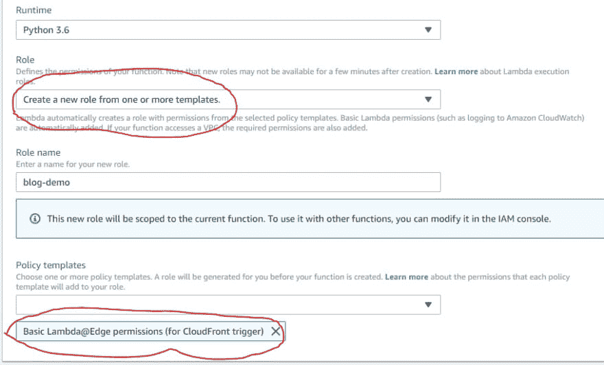](https://res.cloudinary.com/practicaldev/image/fetch/s--zRnQMCvS--/c_limit%2Cf_auto%2Cfl_progressive%2Cq_auto%2Cw_880/https://blog.naveeraashraf.com/img/telegram-aws-13.jpg)

这将带你到你的功能。向下滚动，熟悉不同的选项。您需要特别注意几个选项:

1.  环境变量-代码使用的任何环境变量都必须在这里声明。
2.  基本设置，您可以在其中更改分配的内存和超时。请注意，更改这些设置可能会影响成本。你可以在这里了解更多关于 Lambda 定价的信息。

[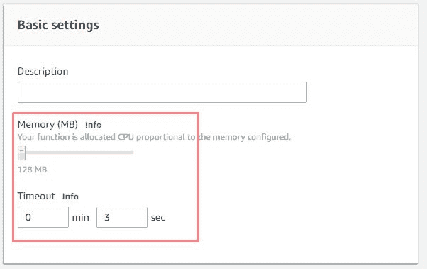](https://res.cloudinary.com/practicaldev/image/fetch/s--0q_nInm9--/c_limit%2Cf_auto%2Cfl_progressive%2Cq_auto%2Cw_880/https://blog.naveeraashraf.com/img/telegram-aws-6.jpg)

在我们给函数添加任何代码之前，让我们先给它添加一个触发器。我们希望每次有人在 Telegram 上向我们的机器人发送消息时，Telegram 服务器应该在托管我们的代码时将消息推送到我们的 URL。换句话说，我们想要一个 HTTP GET/POST 请求来触发我们的代码，我们将通过我们的 API 网关来实现这一点。

您也可以从 Lambda 自己的页面向 Lambda 函数添加触发器，但现在我们将前往 API 网关页面，将 Lambda 函数与 API 连接起来并配置 API。

### 将 Lambda 函数连接到 API 网关

登录到 [AWS 控制台](https://aws.amazon.com)并从服务中搜索 API 网关。

选择我们之前创建的 API。我们需要给这个 API 添加一些方法。从下拉“操作”列表中选择“创建方法”

[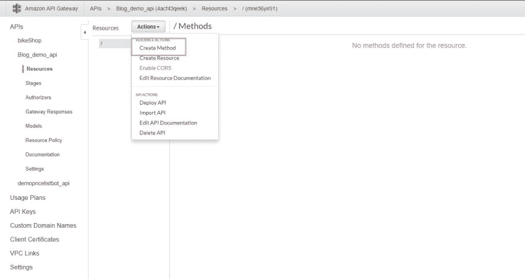](https://res.cloudinary.com/practicaldev/image/fetch/s--9ZIVyoMJ--/c_limit%2Cf_auto%2Cfl_progressive%2Cq_auto%2Cw_880/https://blog.naveeraashraf.com/img/telegram-aws-7.jpg)

您将看到另一个下拉列表出现在“/”下。在这里，您可以添加诸如“GET”和“POST”之类的方法。因为我们正在制作一个非常简单的机器人，所以我们不想要一堆不同的方法。因此，为了简单起见，我们将只选择“任何”方法。意思是不管向这个 URL 发送什么样的请求，都会一直触发相同的代码。

[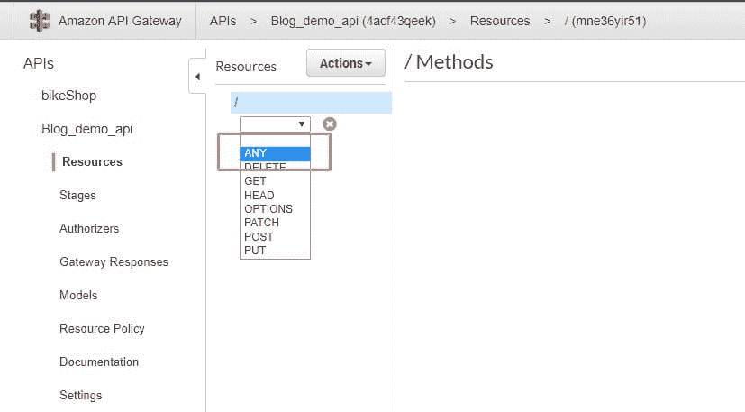](https://res.cloudinary.com/practicaldev/image/fetch/s--SVaGnMcN--/c_limit%2Cf_auto%2Cfl_progressive%2Cq_auto%2Cw_880/https://blog.naveeraashraf.com/img/telegram-aws-8.jpg)

点击“ANY”旁边的小复选标记，它会将您带到一个新的屏幕，在这里您可以选择一旦该端点接收到任何类型的请求时要做什么。从这里选择“Lambda Function”作为集成类型，并从列表中选择 Lambda 函数的名称。还要检查“使用 Lambda 代理集成”选项，这将使我们能够访问 Lambda 函数中的请求细节。

[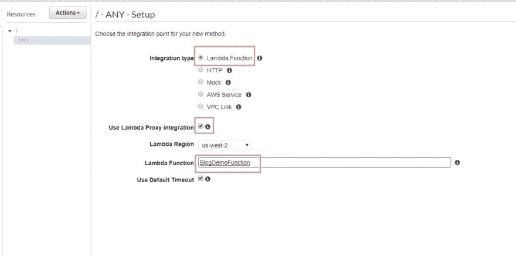](https://res.cloudinary.com/practicaldev/image/fetch/s--zYfPHsO2--/c_limit%2Cf_auto%2Cfl_progressive%2Cq_auto%2Cw_880/https://blog.naveeraashraf.com/img/telegram-aws-9.jpg)

单击保存。在下一个屏幕上测试您的 API，检查是否一切正常。

[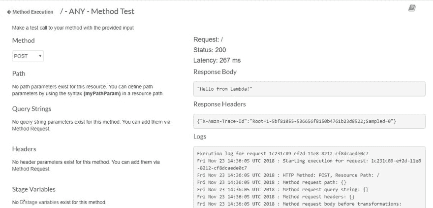](https://res.cloudinary.com/practicaldev/image/fetch/s--Mhn8mO_M--/c_limit%2Cf_auto%2Cfl_progressive%2Cq_auto%2Cw_880/https://blog.naveeraashraf.com/img/telegram-aws-10.jpg)

然后从“操作”列表中单击“部署 API”。

[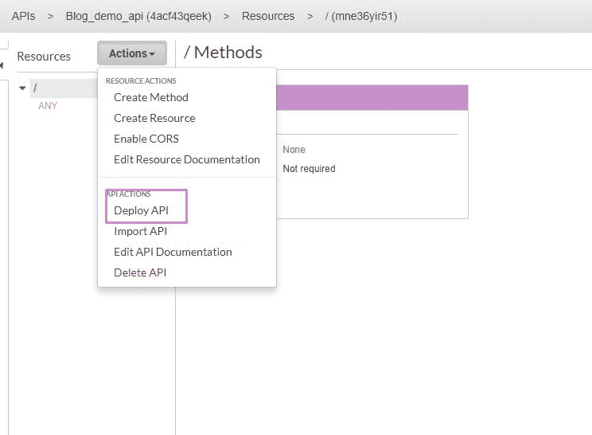](https://res.cloudinary.com/practicaldev/image/fetch/s--k2yOuQhs--/c_limit%2Cf_auto%2Cfl_progressive%2Cq_auto%2Cw_880/https://blog.naveeraashraf.com/img/telegram-aws-11.jpg)

选择一个艺名，如“V1”或“贝塔”作为艺名。一旦部署了 API，您将获得一个调用 URL。如果你点击这个 URL，你应该得到一个简单的网页，上面写着“你好，来自 Lambda！”。记下这个网址。

### 设置 Webhooks

所以现在我们有了一个安全的 URL，它连接到我们在云函数中的代码。酷！我们可以让 Telegram 将我们的机器人将来收到的任何消息发送到这个地址。

设置 webhook 非常简单，只需在浏览器中键入以下内容，然后按回车键。(确保替换占位符文本)

```
"https://api.telegram.org/bot<your-bot-token>/setWebHook?url=<your-API-invoke-URL>" 
```

你将从 Telegram 收到一条确认消息，从现在开始，任何发送到你的机器人的消息都将被推送到这个 URL。

### 给 Lambda 函数添加代码

继续，试着从你自己的电报账户向机器人发送一条消息。

所以显然什么都没发生🤔这是因为我们的代码还没有做任何事情。但是如果您想确保您的函数是通过接收 webhook 触发的，您可以通过检查 CloudWatch 日志来实现。选择 Lambda 函数页面上的“Monitoring”选项卡，然后选择“View logs in CloudWatch”。

[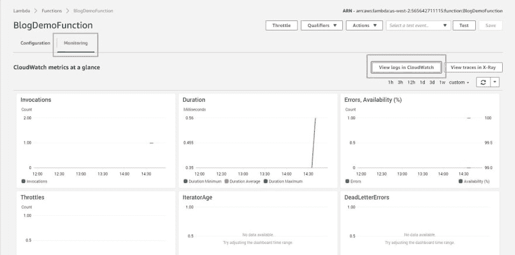](https://res.cloudinary.com/practicaldev/image/fetch/s--KA1YZmoa--/c_limit%2Cf_auto%2Cfl_progressive%2Cq_auto%2Cw_880/https://blog.naveeraashraf.com/img/telegram-aws-12.jpg)

我们将编写一些非常基本的代码，这些代码将返回用户发送的消息。用以下代码替换 Lambda 函数的可视化编辑器中的代码:

```
import json
from botocore.vendored import requests

TELE_TOKEN='<YOUR-BOT-TOKEN>'
URL = "https://api.telegram.org/bot{}/".format(TELE_TOKEN)

def send_message(text, chat_id):
    final_text = "You said: " + text
    url = URL + "sendMessage?text={}&chat_id={}".format(final_text, chat_id)
    requests.get(url)

def lambda_handler(event, context):
    message = json.loads(event['body'])
    chat_id = message['message']['chat']['id']
    reply = message['message']['text']
    send_message(reply, chat_id)
    return {
        'statusCode': 200
    } 
```

如你所见，这是一段非常简单的代码。我们只是从事件对象中提取消息和聊天 id，并通过我们的令牌在 HTTP GET 请求中将它作为查询字符串和聊天 id 一起发送回给[https://api.telegram.org](https://api.telegram.org)。我们还返回一个 JSON 对象，其“statusCode”为“200 ”,这样电报服务器就可以知道请求被成功接收了。

你可以在这里阅读更多关于与电报 API [交互的内容。](https://core.telegram.org/bots/api)

继续给你的机器人发送一些消息，它应该会返回同样的消息。

[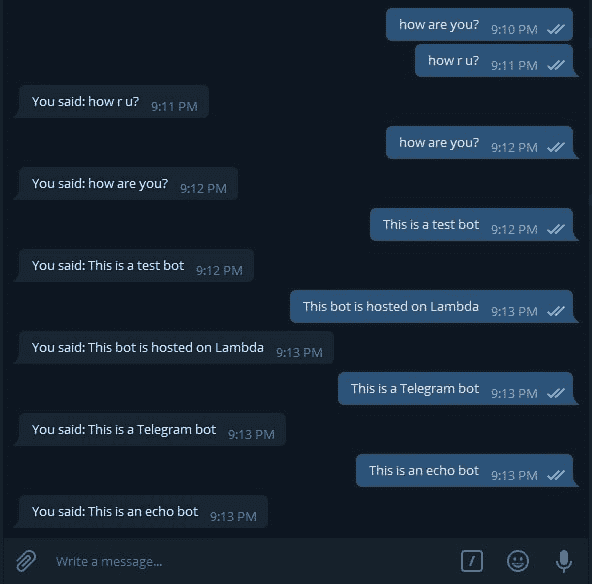](https://res.cloudinary.com/practicaldev/image/fetch/s--x2hUC-Lv--/c_limit%2Cf_auto%2Cfl_progressive%2Cq_auto%2Cw_880/https://blog.naveeraashraf.com/img/telegram-aws-14.jpg)

当然，对于生产 bot，我们将做一些不同的事情，例如添加 bot 令牌作为环境变量和添加安全层。但是这超出了本简单教程的范围。

### 结论

这就把我们带到了本指南的结尾。我们学会了如何为 Telegram 创建一个简单的 echo bot，但更重要的是，我们学会了如何在云中完全无服务器地托管它。

传统上，要运行这种机器人，我们需要编写代码，而不是简单的脚本，而是在像 Flask 这样的微服务框架内。我们需要像 web 服务器这样的基础架构来提供代码，SSL 证书来保证我们的连接安全等等。但是由于强大的 Lambda 函数和 API 网关，我们的任务变得简单多了。

* * *

*图片来源* [由 Freepik](https://www.freepik.com/free-vector/chatbot-concept-background-with-happy-robot_2411604.htm) 设计