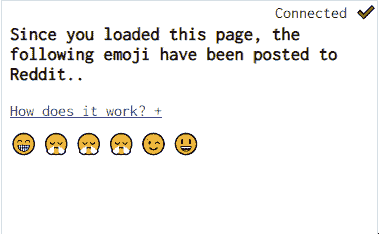

# 作为对 Reddit.com 的评论发布的每个表情符号的实时流🔥

> 原文：<https://dev.to/healeycodes/-real-time-streaming-of-every-emoji-posted-as-a-comment-to-redditcom--3b94>

[](https://github.com/healeycodes/EmojiStreamer)

假设我们想找到发布到 Reddit 的每一个表情符号。首先，我们将定义什么是表情符号。Unicode 联合会保持他们的[数据列表](http://unicode.org/Public/emoji/12.0/)可用。我们将通过 JSON 文件引入它们。该文件包含描述和其他我们不需要的东西，因此我们将稍微清理一下数据，并将其存储在一个高效的`Set`中。如果我们每秒钟检查一个字符是否超过 5k 次表情符号，我们将需要`O(1)`查找时间！

```
import json

with open('emojis/emoji.json', encoding='utf8') as emoji_db:
    cleaned = filter(lambda e: 'emoji' in e, json.load(emoji_db))
    emojis = set(map(lambda e: e['emoji'], cleaned)) 
```

为了检查每个 Reddit 评论，我们将使用[PRAW](https://praw.readthedocs.io/en/latest/)(Python Reddit API 包装器)。这是与 Reddit API 交互的事实标准。它有很好的文档记录，使用起来很简单。

```
import praw

client_id = os.environ['CLIENTID']
client_secret = os.environ['CLIENTSECRET']
reddit = praw.Reddit(client_id=client_id,
                     client_secret=client_secret,
                     user_agent='emoji-tracker v0.1')
while True:
    try:
        for comment in reddit.subreddit('all').stream.comments():
            for char in comment.body:
                if char in emojis:
                    print(char, flush=True)
    except Exception as e:
        print(e, file=sys.stderr) 
```

在这里，我们用我们的 Reddit 应用程序的 ID 和秘密设置 PRAW。一旦我们有了 Reddit 实例，我们就可以开始扫描了。PRAW 在为我们管理空气污染指数的时候会收到所有的评论。每分钟大约 30 万个字符，这对于一个人来说是相当多的数据，但对于一台 PC 来说，只要设置得当，这是微不足道的。

让我们把找到的表情符号发送到`stdout`，确保每个`print`都清空，这样我们就不会留下任何悬挂。表情符号有时出现得很慢，一次一个——我们希望确保我们的 UI 尽快更新，以保持用户的注意力更久一点(对于那些喜欢看着一串表情符号不断增长的用户)。

对了，你们谁是一次贴 40 只螃蟹，为什么！？

🦀🦀🦀🦀🦀🦀🦀🦀🦀🦀🦀🦀🦀🦀🦀🦀🦀🦀🦀🦀🦀🦀🦀🦀🦀🦀🦀🦀🦀🦀🦀🦀🦀🦀🦀🦀🦀🦀🦀🦀

我们将在 Node.js 中捕捉这些表情符号。选择 express/express-ws 是为了让我们可以简单地托管静态文件，同时还可以通过 WebSocket 提供表情符号流。`emoji-piper.py`文件将作为子进程被调用。让我们附加一些事件监听器来捕捉发送到`stdout`的表情符号。

```
/* Whenever new emojis are ready, clear up CLOSING/CLOSED connections
    while sending emojis to the remaining clients */
const emojiStreamer = process;
emojiStreamer.stdout.on('data', (emoji) => {
    emoji = `${emoji}`;
    Array.from(clients, client => {
        if (client.readyState > 1) {
            clients.delete(client);
            return
        }
        client.send(emoji);
    });
}); 
```

我们将数据转换成一个`String`，清理关闭的或正在关闭的连接，并散布热门的表情符号。如果表情符号发布的频率更高，比如说十倍，那么在传递之前将它们分组是有意义的(在 Node.js 或 Python 中，无论哪里是最近的瓶颈)。

在前端领域，我们让用户知道他们何时连接，并释放新的表情符号。我们在这里`split('\n')`的原因是修复一些与`stdout`管道不同步的问题——这是我们设计中的一个缺陷，但对于快速原型开发是必要的。

```
ws.onopen = () => {
    status.innerHTML = 'Connected ✔️';
}

ws.onmessage = (emojis) => {
    // Multiple emoji may arrive delimited by a new-line char
    emojiList = emojis.data.split('\n');
    emojiList.splice(emojiList.length - 1);
    emojiList.forEach(emoji => {
        render(emoji);
    });
} 
```

你知道表情符号的复数是什么吗？如果你不喜欢我使用*表情符号，请通过 [@healeycodes](https://twitter.com/healeycodes) 告诉我！*

这个项目在[表情符号流](https://github.com/healeycodes/EmojiStreamer)开源，Travis CI 计算表情符号并确保我们的测试通过👍

* * *

加入我的关于编程和个人成长的[时事通讯](https://buttondown.email/healeycodes)的 150 多人注册！

我发关于科技的微博。