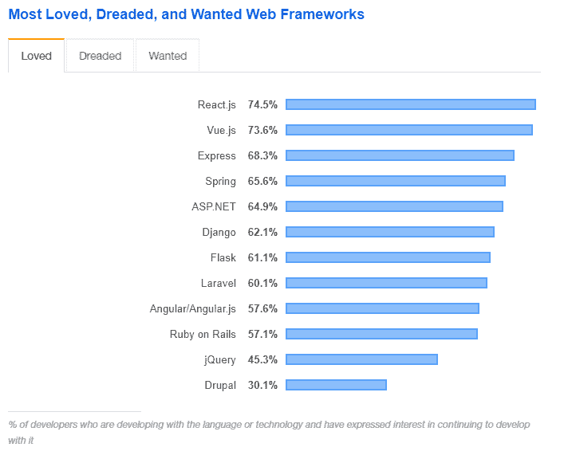
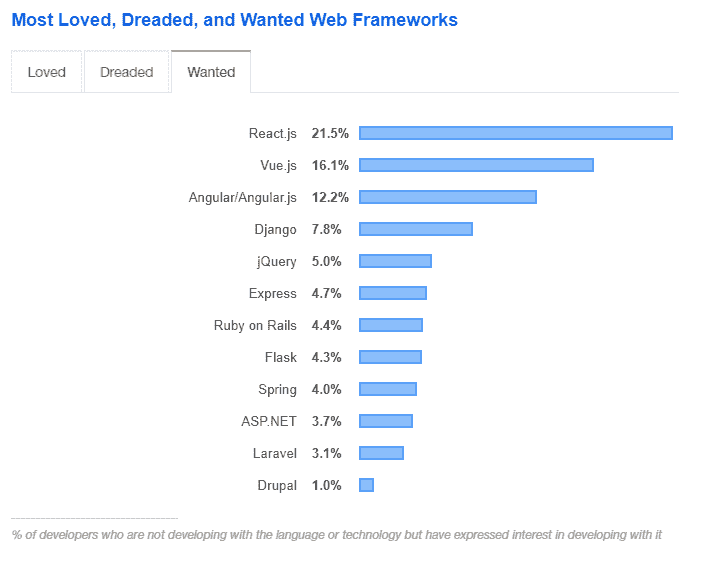

# 反应与角度-快速比较

> 原文：<https://dev.to/pagepro_agency/react-vs-angular-quick-comparison-54i7>

简单来说， **React** 是脸书做的库，而 **Angular** 是 Google 开发的一个成熟的 MVC 框架。

从教育的角度来看， **React** 要容易学得多，但它仍然只是一个库。 **Angular** 可能比较难，但是一旦你学会了，你就拥有了整个 MVC 框架的知识。

从技术的角度来看， **Angular** 在某种程度上决定了你应该如何使用你的应用程序结构，而 **React** 作为一个构建界面(只有视图)的库，在选择模型和控制器库方面给了你更多的自由。

**React** 的人气在不断增长，而 **Angular** 前阵子已经下降了。

其次，根据 2019 年[栈溢出开发者调查， **React** 是市场上最受欢迎和最受欢迎的技术。](https://insights.stackoverflow.com/survey/2019#technology)

[T6】](https://res.cloudinary.com/practicaldev/image/fetch/s--rTBZJros--/c_limit%2Cf_auto%2Cfl_progressive%2Cq_auto%2Cw_880/https://thepracticaldev.s3.amazonaws.com/i/5mpbe4jtlarhavd5myvv.PNG)

即使对 React 开发商的巨大需求使其成为目前市场上最热门的技术，我们也可以肯定, **React 和 Angular** 将长期伴随我们。

但是，让我们看看在选择技术组合时您可能会发现至关重要的其他差异。

## **速度**

**家**

**React** 正在使用虚拟 DOM，这意味着它不必更新所有的 HTML。他只是在寻找当前和旧 HTML 之间的差异，并相应地更新它。

**Angular** 正在使用增量 DOM，这意味着它将遍历 HTML 的整个结构，以找到需要更改的内容，并“改变”树以应用更改。

**反应纤维**

前阵子(v16 版) **React** 把它的引擎从“刚刚快”提升到“快得惊人”。
不仅如此，React Fiber 启用了基于优先级的更新系统，因此您可以微调您的渲染，以确保最重要的更新首先完成。还有，你可以随意暂停和开始你的工作。

## **数据绑定**

**Angular** 正在使用双向数据绑定。每当您更改界面的任何元素时，您的模型状态也会自动更改。

这听起来很简单，但是如果您从事一个大型项目，并且想要有一个好的数据概览和更容易的调试，最好使用带有单向数据绑定的 **React** 。只有在模型状态被首先更新之后，它才会在界面元素中呈现更改。无论何时更改 UI 元素，模型状态都保持不变。

## **模板**

**HTML**

**Angular** 使用基于 HTML 扩展版本的模板，带有 Angular 指令。你还必须学习一种特定的语法。

**JSX**

另一方面，使用 **React** ，您需要的只是 JavaScript 知识。JSX 是由同一文件中的标记和 JavaScript 逻辑组成的 genius 组件。由于使用了类似 XML 的语言，您可以用 JavaScript 代码编写标记，所以一切都在一个地方，代码补全工作得更好。

## **离子 vs 反应原生**

**Ionic** 是一个在 Cordova 容器中构建混合移动应用的框架，这仍然使它成为一个混合应用:原生 web view 容器内的 web 应用。

**React Native** 是一个平台，在这里你可以创建一个真正的原生移动应用。您还可以创建自己的组件，并将其绑定到 Java 或 Swift 中的本地代码。

## **检测**

**React** 使用 Jest(有时使用 Enzyme-JavaScript 测试工具)。Jest 有一个强大的模仿库，不需要任何配置，包含在每个 React 项目中。

《Angular》用的是茉莉，这个结局被很多人认为是最难读懂的，太复杂了。

## **结论**

和往常一样，这两个平台各有利弊。很大程度上取决于需求、未来计划和个人偏好。

虽然 **Angular** 给了你一个完整和固定的 MVC 框架的可能性，但是 **React** 给了你更多的自由，并且更容易学习和使用。
最重要的是，未来肯定有利于**反应**，因为我们都旨在用更少的努力和斗争更有效地做事。

这也是为什么我们喜欢 **React** ，并选择它作为我们业务的核心已经有 3 年多了。

**想跟**反应过来**建个项目？看看[我们已经和别人做了什么。](https://clutch.co/profile/pagepro)**