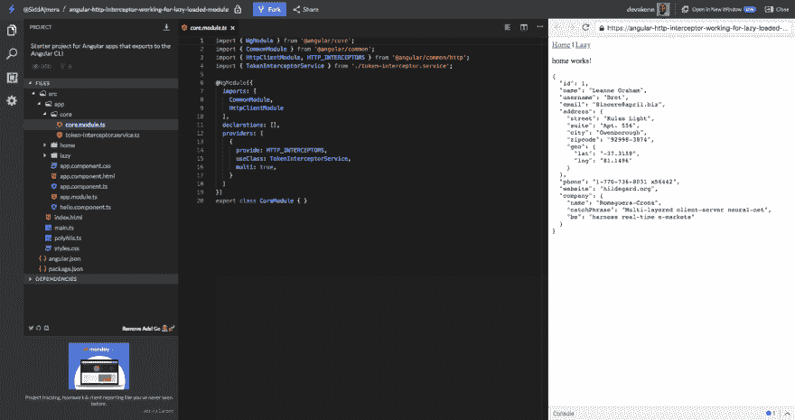

# Angular:当 HttpInterceptor 不支持延迟加载的模块时

> 原文：<https://dev.to/devakone/angular-when-httpinterceptor-doesn-t-work-with-lazy-loaded-modules-3ipg>

 
Http 拦截器与一个惰性加载模块一起工作

如果你做 Angular 的方式是正确的，你应该使用某种 httpinterceptor。一个 [HttpInterceptor](https://angular.io/api/common/http/HttpInterceptor) 提供了一种标准的方法来拦截 HTTP 请求和响应，并根据您的应用程序需求应用定制的转换。如果您不熟悉 HttpInterceptor 的不同用例，[这篇来自 Angular In Depth](https://blog.angularindepth.com/top-10-ways-to-use-interceptors-in-angular-db450f8a62d6) 的文章将帮助您了解如何将它应用到您的应用程序中，您应该这样做。总而言之，您可以使用拦截器来完成以下任务:

*   动态替换/URL
*   装载物品时隐藏/显示装载机
*   添加请求标题(CORS)
*   处理错误
*   记录 http 操作
*   创建一个假后端
*   证明

如您所见，这是处理大多数现代应用程序的一些经典需求的一种非常好的方式。

### 设置 HttpInterceptor

创建 HttpInterceptor 非常[直接](https://itnext.io/angular-tutorial-implement-refresh-token-with-httpinterceptor-bfa27b966f57)。一般来说，你希望创建一个单例拦截器，这样[它可以在你的应用程序中使用，并且只需要 Angular 的 DI](https://angular.io/guide/singleton-services) 实例化一次。这涉及到您的平均角度应用程序:

*   将提供者定义添加到`CoreModule`的`providers`配置
*   将`HttpClientModule`导入到`CoreModule`的`imports`配置中
*   确保一旦`CoreModule`被导入到您的`AppModule`中，没有其他模块导入到您的应用程序中。如果你不使用 CoreModule ( [最佳实践警告，你应该](https://medium.com/@benmohamehdi/angular-best-practices-coremodule-vs-sharedmodule-25f6721aa2ef)，你可以直接将`HttpClientModule`和你的拦截器提供者定义导入到`AppModule.`

这里的一个关键要求是`HttpClientModule`在您的应用程序中只被导入一次。您希望这个模块只被导入一次的原因是，这是我们从其中导入`HttpClient`服务的模块，该服务在整个应用程序中用于进行 HTTP 调用。这个服务被设置为处理拦截器(如果它们存在的话),但是所有的拦截器都被设置为在 HttpClient 服务的单个实例上工作。理解这一点对下一节很重要。

### 懒惰加载模块和 HttpInterceptor

[惰性加载模块](https://angular.io/guide/lazy-loading-ngmodules)是一个与性能相关的角度特性，允许模块只在它们的路径被访问时才被加载。这使得您的应用程序可以更快地引导，只需下载必要的代码，就可以让用户看到应用程序的第一个可操作屏幕。惰性加载模块的一个特征是在`providers`配置中声明的任何服务只对该模块可用，换句话说:“[惰性加载模块的提供者是模块范围的](https://angular.io/guide/ngmodule-faq#why-is-a-service-provided-in-a-lazy-loaded-module-visible-only-to-that-module) *”。*
更确切地说:

> 当路由器在惰性加载的上下文中创建组件时，Angular
> 更喜欢从这些提供者创建的服务实例，而不是应用程序根注入器的服务实例。

### 没用！

在我的例子中，我设置了一个令牌拦截器，它应该在整个应用程序范围内共享，并为所有 API 绑定请求添加一个身份验证令牌。调试表明，对于一些调用，拦截器正在被使用，但是来自我的任何功能模块中的任何其他 HTTP 请求根本不通过拦截器。通过更多的调试和研究，其中包括对 CORS 预检请求规范的一些有趣的补充说明(你知道请求被预检[的条件之一是它是否在请求](https://stackoverflow.com/questions/39075370/preflight-request-triggers-based-on-content-type)中设置了自定义头(例如，请求使用了自定义头，如`x-auth-token`)？)，我开始更好地理解为什么我的拦截器没有被击中。

### 这个为什么

这归结为我在我的惰性加载模块中使用的其他 NPM 包之一也导入了`HttpClientModule`。每次发生这种情况，一个新的`HttpClient`服务实例被注入到模块中，这个模块当然没有被配置成使用在`CoreModule`中配置的拦截器。
对于这种情况，我找不到一个好的解决方法，除了在每个延迟加载的模块上重新声明拦截器提供者配置，作为一个短期的解决方法，同时我要弄清楚哪个包正在导入`HttpClientModule`，或者 Angular 是否考虑了这个用例，并且只允许模块在以前没有被加载的情况下被加载。

### 修罗

到目前为止，除了不使用导入`HttpClientModule`的库或者向每个延迟加载的特性添加拦截器提供者的模块范围定义之外，我没有明确的方法来解决这个问题。

如果你遇到了这个问题或类似的问题，并找到了一种优雅的方式来解决它，并在评论中分享，我将不胜感激。