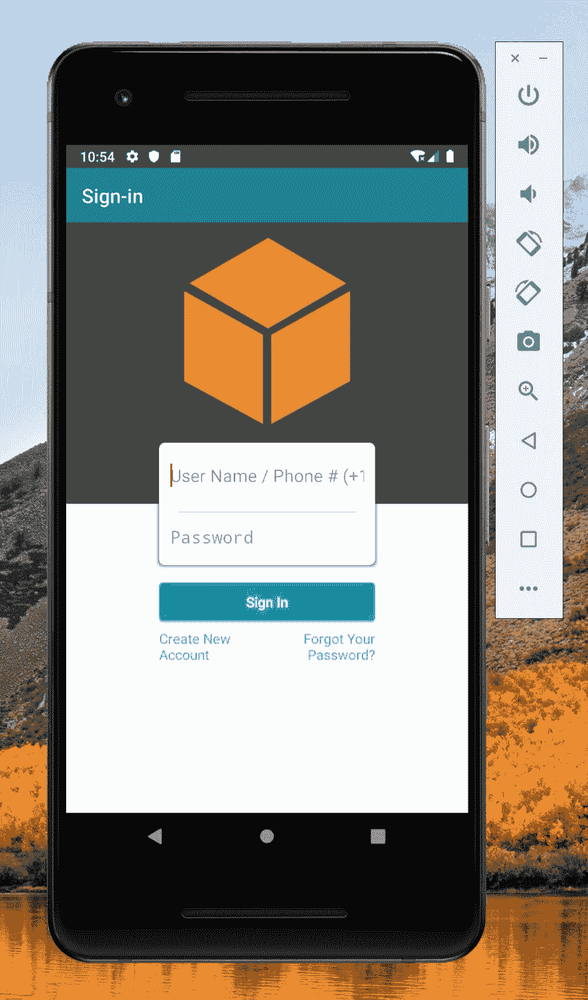

# 使用 AWS Amplify 为您的 Android 应用程序添加 Drop In 身份验证

> 原文：<https://dev.to/theworstdev/adding-drop-in-authentication-to-your-android-apps-with-aws-amplify-4kbd>

AWS Amplify 身份验证模块为开发人员提供了身份验证 API 和构建模块，这些开发人员希望创建具有现实生产就绪用户身份验证的应用程序。使用 Amplify，您可以整合基于用户名/密码的身份验证以及与脸书、谷歌或亚马逊的 OAuth。

> 我们还提供了一个预构建的“托管 UI ”,它提供了完整的 OAuth +用户名/密码流。查看[此处](https://aws-amplify.github.io/docs/android/authentication#using-hosted-ui-for-authentication)了解更多关于托管 UI 的信息。

## 亚马逊 Cognito 简介

Amplify 框架使用 [Amazon Cognito](https://aws.amazon.com/cognito/) 作为主要的认证提供者。Amazon Cognito User 是一个强大的用户目录服务，处理用户注册、认证、账户恢复&等操作。

扩大与 Cognito 的接口以存储用户数据，包括与其他 OpenID 提供商如脸书和谷歌的联盟。

Amplify CLI 自动执行这些 AWS 资源的访问控制策略，并通过 GraphQL 提供细粒度的访问控制，以保护 API 中的数据。

大多数现代应用程序需要多个身份验证选项，即脸书登录+用户名/密码登录。Amazon Cognito 允许使用一个用户注册中心跨多种身份验证类型对用户进行身份验证，从而简化了这个过程。

在这篇文章中，您将了解如何使用 Amazon Cognito 和用户名/密码登录向您的应用程序添加身份验证。

## 设置项目

如果您还没有想要用于本教程的项目，第一步是在 Android Studio 中创建新项目。你可以到`File > New > New Project`去做。出现提示时，选择`Java`作为语言，选择`Empty Activity`作为活动类型，选择默认的目标版本。

既然已经建立了一个项目，下一步就是在项目的根目录下运行`amplify init`来初始化 Amplify。

> 通常，这与您的根 build.gradle 文件位于同一个目录中。

如果您还没有安装 Amplify CLI，您可以通过运行:
来安装

```
npm i -g @aws-amplify/cli

# OR

yarn global add @aws-amplify/cli 
```

Enter fullscreen mode Exit fullscreen mode

当您运行此命令时，会发生以下两种情况之一。如果您的计算机上有一些 AWS 用户配置文件，它会询问您是否要使用配置文件。(如果您有一个具有管理和编程权限的配置文件，请随意选择。)如果您还没有创建任何用户配置文件，或者您不确定当前的配置文件是否有效，那么 CLI 将指导您如何创建一个用户配置文件，甚至会为您打开 AWS 控制台并预先填充任何字段。(你基本上只需要点击几个按钮，很简单。)

> 要更深入地了解如何创建新的用户资料，请查看 Nader Dabit 的视频。

现在 Amplify 已经正确配置，您可以开始在您的应用程序中设置 AWS 服务了！

## 设置认证

Amplify 使得添加 Cognito 等认证服务变得非常简单和直接。要设置认证，请运行以下命令:

```
amplify add auth 
```

Enter fullscreen mode Exit fullscreen mode

运行该命令后，系统会询问您是否要使用默认配置来设置应用程序的身份验证。这是 AWS 的推荐身份验证设置。(如果您不熟悉如何配置自己的用户池和 Cognito 配置，请选择此选项。)

接下来，您需要运行 amplify push，以便可以在 AWS 中创建和配置资源。在 Amplify 为您的认证服务创建远程资源之后，您需要在您的博客中设置 Amplify。为此，您需要将必要的依赖项添加到您的 app/build.gradle 文件中:

```
//For AWSMobileClient only:
implementation 'com.amazonaws:aws-android-sdk-mobile-client:2.13.+'

// Cognito UserPools for SignIn 
implementation 'com.amazonaws:aws-android-sdk-auth-userpools:2.13.+'

//For the drop-in UI also:
implementation 'com.amazonaws:aws-android-sdk-auth-ui:2.13.+' 
```

Enter fullscreen mode Exit fullscreen mode

为了插件认证正常工作，您需要将`minSdkVersion`设置为 23。

接下来，您需要创建另一个活动，该活动将作为身份验证活动，在用户访问您的应用程序时启动，而不是主活动。为此，首先在您的项目中创建一个新的活动，方法是转到`New -> Activity -> Empty Activity`。将活动命名为`AuthenticationActivity`，选中`Launcher Activity`复选框，点击`Finish`。

将以下内容添加到您的新`AuthenticationActivity` :

```
public class AuthenticationActivity extends AppCompatActivity {

    private final String TAG = AuthenticationActivity.class.getSimpleName();

    @Override
    protected void onCreate(Bundle savedInstanceState) {
        super.onCreate(savedInstanceState);
        setContentView(R.layout.activity_authentication);

        AWSMobileClient.getInstance().initialize(getApplicationContext(), new Callback<UserStateDetails>() {

            @Override
            public void onResult(UserStateDetails userStateDetails) {
                Log.i(TAG, userStateDetails.getUserState().toString());
                switch (userStateDetails.getUserState()){
                    case SIGNED_IN:
                        Intent i = new Intent(AuthenticationActivity.this, MainActivity.class);
                        startActivity(i);
                        break;
                    case SIGNED_OUT:
                        showSignIn();
                        break;
                    default:
                        AWSMobileClient.getInstance().signOut();
                        showSignIn();
                        break;
                }
            }

            @Override
            public void onError(Exception e) {
                Log.e(TAG, e.toString());
            }
        });
    }

    private void showSignIn() {
        try {
            AWSMobileClient.getInstance().showSignIn(this,
                 SignInUIOptions.builder().nextActivity(MainActivity.class).build());
        } catch (Exception e) {
            Log.e(TAG, e.toString());
        }
    }
} 
```

Enter fullscreen mode Exit fullscreen mode

现在确保`AuthenticationActivity`是您的启动器活动。打开`AndroidManifest.xml`，确保`AuthenticationActivity`指定了`<intent-filter>`块，如下:

```
<!-- ... Other Code... -->
<activity
    android:name=".MainActivity"
    android:label="@string/app_name">
</activity>
<activity
    android:name=".AuthenticationActivity"
    android:noHistory="true">
    <intent-filter>
        <action android:name="android.intent.action.MAIN" />
        <category android:name="android.intent.category.LAUNCHER" />
    </intent-filter>
</activity> 
```

Enter fullscreen mode Exit fullscreen mode

最后，通过向您的`AndroidManifest.xml` :
添加以下权限，确保您的应用能够访问网络

```
<uses-permission android:name="android.permission.INTERNET" />
<uses-permission android:name="android.permission.ACCESS_NETWORK_STATE" /> 
```

Enter fullscreen mode Exit fullscreen mode

## 测试出来

在模拟器中构建并启动应用程序。登录用户界面应该如下所示:

[](https://res.cloudinary.com/practicaldev/image/fetch/s--Gw_SBLBl--/c_limit%2Cf_auto%2Cfl_progressive%2Cq_auto%2Cw_880/https://thepracticaldev.s3.amazonaws.com/i/wa9vmnlf3onpzaag634o.png)

这就是全部了！你现在可以让用户注册你的 Android 应用，而不用写一行验证码。将其与 API 和存储等其他扩展类别结合起来，您就拥有了一个强大的工具集来快速构建您的 Android 应用程序！

> 此外，您应该查看 AWS Device Farm，以便在各种设备和操作系统上测试您的应用程序([https://dev . to/kk emple/how-to-set-up-end-to-end-tests-for-Android-with zero-code-1ka](https://dev.to/kkemple/how-to-set-up-end-to-end-tests-for-android-with-zero-code-1ka))。

最后，你可以在这里找到更多关于 Android 的信息:

*   [https://aws-amplify.github.io/docs/android/start](https://aws-amplify.github.io/docs/android/start)
*   [https://amplify.aws/community/posts](https://amplify.aws/community/posts)