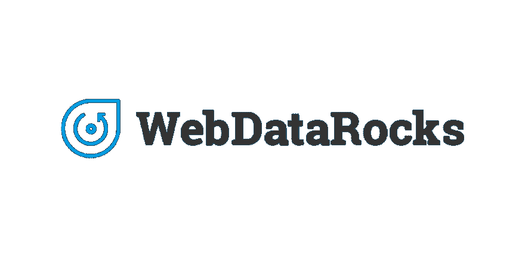
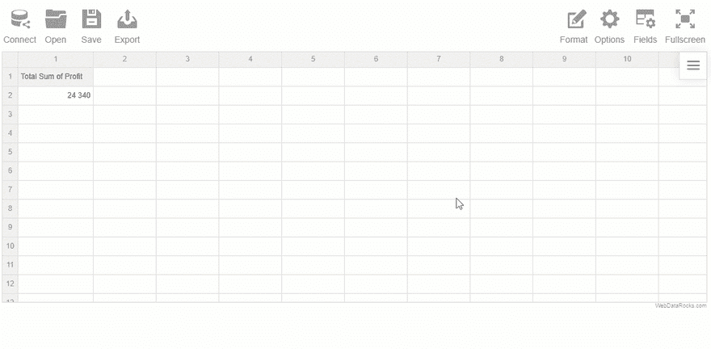

# 免费 JavaScript 库的可视化:WebDataRocks 和 ChartJS

> 原文：<https://dev.to/veronikaro/visualization-with-free-javascript-libraries-webdatarocks-and-chartjs-4k0k>

[](https://res.cloudinary.com/practicaldev/image/fetch/s--yzjyTCbn--/c_limit%2Cf_auto%2Cfl_progressive%2Cq_auto%2Cw_880/https://www.webdatarocks.com/wd_uploads/2019/06/Copy-of-Copy-of-Pivot-Table-with-chart.js-4.png)

今天我想分享我使用两个免费的 JavaScript 库创建一个强大的数据可视化工具的经验。

掌握数据可视化是职业发展的一项关键技能，但在我们这个快节奏的数字世界中，这一点很容易被忽视。以可理解的形式呈现数据并回答有关业务的重要问题的能力在任何领域都受到高度重视。作为数据可视化的一种类型，**数据仪表板**对于交流见解非常有用。

希望在本教程结束时，您将学会如何使用交互式和可定制的**仪表板**来帮助跟踪特定的业务指标，从而增强您的项目。

要完成这个教程，你只需要具备基本的 **JavaScript** 编程技能。
如果你现在就想看演示，这里有[链接](https://codepen.io/ronika/pen/yWxQMr)到它。

## 数据可视化工具

让我们从探索我将使用的第一个工具的功能开始，即一个**数据透视表组件**。

[](https://res.cloudinary.com/practicaldev/image/fetch/s--4OfxFTE_--/c_limit%2Cf_auto%2Cfl_progressive%2Cq_auto%2Cw_880/https://www.webdatarocks.com/wd_uploads/2019/06/webdatarocks-1024x512-20181212.png)

**[WebDataRocks](https://www.webdatarocks.com/?r=dt3)** 是一个 JavaScript 数据透视表，可以轻松集成 [React](https://reactjs.org/?r=dt3) 、 [Angular](https://angular.io/?r=dt3) 和 [AngularJS](https://angularjs.org/?r=dt3) 框架。它允许您基于 CSV & JSON 数据创建报告，并将它们导出到 PDF、Excel 或 HTML。

您可能注意到的第一件事是组件的交互性:您可以通过字段列表添加字段以组成一个报告，并将它们拖放到网格上以获得数据的全新视图。此外，还可以钻取单元格以查看原始数据，应用过滤器并按成员或值对记录进行排序。

[](https://res.cloudinary.com/practicaldev/image/fetch/s--7gJekI6C--/c_limit%2Cf_auto%2Cfl_progressive%2Cq_66%2Cw_880/https://www.webdatarocks.com/wd_uploads/2019/06/WorkWithWDR.gif)

所有这些功能都有助于轻松分割数据。我鼓励你通过玩它的[演示](https://www.webdatarocks.com/demos/javascript-pivot-table-demo/?r=dt3)来探索它的功能。

在我看来，这个工具对于开发人员和最终用户来说都是完美的:通过 JavaScript API 可以获得许多高级特性，并且可以从 UI 访问报告特性。

我最喜欢的是针对所有口味的各种定制选项。我已经设法改变了组件的主题和工具栏的图标。

第二个工具是一个**图表库**，你很可能听说过或者甚至在你的项目中使用过。

[](https://res.cloudinary.com/practicaldev/image/fetch/s--hMAHpptR--/c_limit%2Cf_auto%2Cfl_progressive%2Cq_auto%2Cw_880/https://www.webdatarocks.com/wd_uploads/2019/06/chartjs.png)

[Chartjs](https://www.chartjs.org/?r=dt3) 是一个开源的 **JavaScript** 图表库，它与 [Vue](https://vue-chartjs.org/?r=dt3) 集成，并在包装器的帮助下做出反应。

如今它在开发人员中非常流行，这是有原因的。ChartJS 深受开发者喜爱的主要特性:

*   它是轻量级的，只有 10 KB。
*   迷人的可视化可以增加任何数据可视化项目的趣味。
*   图表反应灵敏，可在任何设备上流畅运行。
*   一切都可以通过 API 定制——动画、工具提示、图例和颜色。此外，您可以控制与图表中每个元素的交互。

我想提请注意的另一个特性是它的*简短而全面的文档*。浏览这些文章，我设法找到了使用图表所需的一切。每个教程中关于数据结构的部分特别有用——它包含的信息帮助我找到了某些类型的图表所需的数据格式。

总而言之，无论你是初学者还是专业开发人员，使用 ChartJS 对你来说都会很容易。

现在我们去练习吧！

## 添加 web 数据块

通过[下载一个包](https://www.webdatarocks.com/doc/download/?r=dt3)到你的项目中或者简单地使用 WebDataRocks CDN:
来安装一个数据透视表

```
<link href="https://cdn.webdatarocks.com/latest/webdatarocks.min.css" rel="stylesheet"> <script src="https://cdn.webdatarocks.com/latest/webdatarocks.toolbar.min.js"></script> <script src="https://cdn.webdatarocks.com/latest/webdatarocks.js"></script> 
```

创建一个容器，数据透视表应该呈现在这个容器中:

```
<div id="pivot-table-container"></div> 
```

定义一个返回 JSON 数据的函数。我建议在第一个对象中明确指定数据类型:

```
function getData() {
    return [{
            "Channel": {
                "type": "string"
            },
            "Segment": {
                "type": "string"
            },
            "Profit": {
                "type": "number"
            },
            "Actual Expenses": {
                "type": "number"
            },
            "Budgeted Expenses": {
                "type": "number"
            },
            "Date": {
                "type": "date"
            }
        },
        {
            "Channel": "Other",
            "Segment": "Stores",
            "Profit": 455,
            "Actual Expenses": 250,
            "Budgeted Expenses": 55,
            "Date": "2015-02-14T07:34:08"
        },
        {
            "Channel": "Other",
            "Segment": "Stores",
            "Profit": 156,
            "Actual Expenses": 501,
            "Budgeted Expenses": 55,
            "Date": "2015-02-14T07:34:08"
        }
    ]
} 
```

初始化数据透视表的一些基本配置，包括数据源和容器:

```
var pivot = new WebDataRocks({
    container: "#pivot-table-container",
    toolbar: true,
    report: {
        dataSource: {
            data: getData()
        }
    }
}); 
```

## 📘定义要在网格上显示的切片

用数据填充数据透视表后，定义一个切片，它是应该显示在报表中的数据的子集。将层次结构放到行和列中，并用合适的聚合定义度量。如果需要组合聚合，请为度量创建计算值。

下面是切片的一个例子:

```
"slice": {
    "reportFilters": [{
        "uniqueName": "Date.Month"
    }],
    "rows": [{
            "uniqueName": "Channel"
        },
        {
            "uniqueName": "Segment"
        }
    ],
    "columns": [{
            "uniqueName": "Measures"
        },
        {
            "uniqueName": "Date.Year"
        }
    ],
    "measures": [{
        "uniqueName": "Profit",
        "aggregation": "sum"
    }]
} 
```

## 🖌️凸显重要价值观

如果您需要关注报表的单个值，例如，最高和最低收入水平，现在是最好的时机。通过 UI 应用*条件格式*。
T3T5】

或者将`conditions`添加到报告:

```
"conditions": [{
        "formula": "#value > 2000",
        "measure": "Profit",
        "format": {
            "backgroundColor": "#66BA5F",
            "color": "#FFFFFF"
        }
    },
    {
        "formula": "#value < 500",
        "measure": "Profit",
        "format": {
            "backgroundColor": "#D32F2F",
            "color": "#FFFFFF"
        }
    }
] 
```

## 💻安装图表

最简单的方法是通过使用它的 CDN:
来包含这个库

```
<script src="https://cdnjs.cloudflare.com/ajax/libs/Chart.js/2.7.2/Chart.js"></> 
```

然后，您需要为图表创建两个单独的容器:

```
<canvas id="lineChart"></canvas>
<canvas id="doughnutChart"></canvas> 
```

不要忘记指定 id，以便告诉库图表将在哪里呈现。

## 📊初始化图表

要将组件绑定在一起，我们需要等到数据透视表成功呈现并填充数据，请求这些数据，根据折线图和圆环图所需的格式对其进行预处理，并创建图表。如果对 pivot 的报告进行任何更改，我们需要将更新的数据发送到图表中。

让我们看看如何实现这种行为。

定义两个函数- `createLineChart()`和`createDougnutChart()`。为了简单起见，我将展示如何定义其中一个函数——另一个可以用类似的方式实现。

在`createLineChart()`中，首先，您需要通过使用 [getData()](https://www.webdatarocks.com/doc/getdata/?r=dt3) 方法从 pivot 控件获取数据，该方法检索数据并将其异步传递给它的`callbackHandler`和`updateHandler`。这两个处理程序定义了数据透视表创建并相应更新后应该发生的事情。如果您想要指定切片，您可以将它作为`options`参数的属性传递给`getData()`。

```
function createLineChart() {
    webdatarocks.getData({
        "slice": {
            "rows": [{
                "uniqueName": "Channel",
                "sort": "asc"
            }],
            "columns": [{
                "uniqueName": "Measures"
            }],
            "measures": [{
                "uniqueName": "Profit",
                "aggregation": "sum"
            }]
        },
    }, drawLineChart, updateLineChart);
} 
```

其次，您需要定义绘制图表的函数，并将其作为`callbackHandler`传递给`getData()`。

```
function drawLineChart(rawData) {
    var data = prepareDataFunction(rawData);
    var data_for_charts = {
        datasets: [{
            data: data.data,
            borderColor: "rgba(193,46,12,1)",
            fill: false,
            backgroundColor: "rgba(193,46,12,1)",
            label: data.label
        }],
        labels: data.labels
    };
    options = {
        responsive: true,
        legend: {
            position: 'right',
        },
        title: {
            display: true,
            fontSize: 18,
            text: 'Profit by Channel'
        },
        scale: {
            ticks: {
                beginAtZero: true
            },
            reverse: false
        },
        animation: {
            animateRotate: false,
            animateScale: true
        }
    };
    var ctx_linechart = document.getElementById("lineChart").getContext("2d");
    line_chart = new Chart(ctx_linechart, {
        data: data_for_charts,
        type: 'line',
        options: options
    });
} 
```

类似地，定义一个函数，当报表以某种方式改变时，该函数重新绘制图表。

```
function updateLineChart(rawData) {
    line_chart.destroy();
    drawLineChart(rawData);
} 
```

在演示中，您可以看到`prepareDataFunction`的实现，它遍历记录并为折线图和圆环图准备数据。

我想提一下，选择是否在折线图中使用贝塞尔曲线的功能很酷。众所周知，禁用此功能可以稍微提高性能，因为绘制直线的资源成本更低。

## 🎨享受仪表板

因此，您有一个顶级的数据仪表板，让您可以快速捕捉见解并与您的数据进行交互-尝试过滤数据，以查看切片在报告和图表中是如何变化的。

您可以将其添加到任何项目，包括 React、Angular 和 Vue。表格中的报告可以导出为 PDF 和 HTML 格式。此外，这款仪表盘的两个组件都是免费的，这使得它们非常适合初创公司。

感谢您的阅读！

我会很高兴看到你的结果:)

### 玩试玩

参见 [CodePen](https://codepen.io/ronika/pen/yWxQMr/?r=dt3) 上的完整代码💡

## 有用的链接

关于 WebDataRocks:

*   [与 React 整合](https://www.webdatarocks.com/doc/integration-with-react/?r=dt3)
*   [与角度 4+的整合](https://www.webdatarocks.com/doc/integration-with-angular/?r=dt3)

关于图表:

*   [文档](https://www.chartjs.org/docs/latest/?r=dt3)
*   [图表演示](https://www.chartjs.org/samples/latest/?r=dt3)