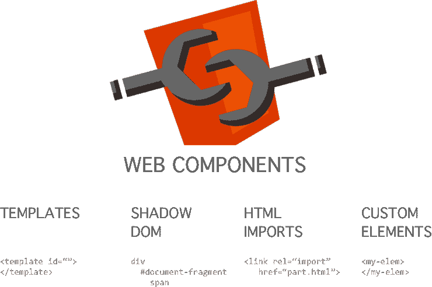

# Web 组件——让我们一起来构建它们

> 原文：<https://dev.to/karx_brb/web-components-let-s-build-em-all-3eb0>

# Web 组件-用于微前端和可重用组件

让我们一起建造它们吧！

## 什么是 Web 组件？

> Web 组件是一组 web 平台 API，允许您创建新的自定义的、可重用的、封装的 HTML 标记，以便在网页和 web 应用程序中使用。

来源:https://www.webcomponents.org/introduction

> Web Components 是一套不同的技术，允许您创建可重用的自定义元素(将它们的功能封装在代码的其余部分之外)，并在您的 Web 应用程序中使用它们。

来源:https://developer.mozilla.org/en-US/docs/Web/Web_Components

> (web)组件是现代 Web 应用程序的构建块。

来源:[https://developers . Google . com/web/fundamentals/we B- components/](https://developers.google.com/web/fundamentals/web-components/)

[另一个有图的博客](https://medium.freecodecamp.org/use-web-components-to-create-gradient-transitions-f9aad648824a)

Web 组件是 web 社区努力为这些“web 构建块”制定通用规范的结果,
有两大类可以使用 web 组件:

*   用于构建**微前端**——这些微前端很小，但包含详细的业务逻辑
*   用于构建**可重用组件**——这些组件很少包含任何业务逻辑。高度针对性和可重用的组件

## 基本概念

为了理解和讨论使 Web 组件成为现实的 3 种技术，我们需要首先看看在呈现 HTML 页面时通常会发生什么。

...一旦服务器批准了你的请求，服务器就会把网站文件以数据块的形式发送出去，这就是所谓的数据包。然后，这些数据包被你的浏览器组装成一个完整的网站并展示给我们。

这些块基本上来自 HTML、CSS 和 JavaScript，尽管其他技术也是可用的。
浏览步骤包括:

*   处理 HTML 标记并构建 DOM 树。
*   处理 CSS 标记并构建 CSSOM 树。
*   将 DOM 和 CSSOM 组合成一个渲染树。
*   在渲染树上运行 layout 来计算每个节点的几何体。
*   将各个节点绘制到屏幕上。

JavaScript 是一种在浏览器中运行的动态语言，允许我们改变页面行为的方方面面:

*   JavaScript 可以查询和修改 DOM 和 CSSOM。
*   CSSOM 上的 JavaScript 执行块。
*   JavaScript 阻止 DOM 构造，除非显式声明为 async。

注意:这个页面通常是我所说的基础:[网络技术](https://developer.mozilla.org/en-US/docs/Web)

我建议每一个与 Web 开发相关的开发人员每三个月重新访问一次这个页面，否则黑暗面就会获胜！

## Web 组件由什么组成

因此，使 web 组件成为可能的套装是

*   定制元素——JavaScript API 定义定制元素并告诉浏览器。

*   shadow DOM——这样脚本和样式就不用担心冲突了

*   HTML 模板-<template></template>

## 入门

要创建一个组件，大致的步骤如下

*   创建一个类-把你的逻辑
*   告诉浏览器这个新的自定义元素
*   可选:附加阴影 DOM
*   可选:定义模板，然后附加
*   使用新部件！

为了进行构建，我们有很多选择，这要感谢超级活跃的 JavaScript 社区，
我们的选择:

*   使用原生 JavaScript。最佳 Web 组件来源[谷歌开发者文档](https://developers.google.com/web/fundamentals/web-components/)
*   [Polymer - Google 的 web 组件框架](https://www.polymer-project.org/)
*   [角元素](https://angular.io/guide/elements)
*   Hybrids 是一个 UI 库，用简单而实用的 API 创建 Web 组件
*   一个简单的基类，用于创建快速、轻量级的 web 组件
*   Slim.js 是一个轻量级的 web 组件创作库

## 时间构建

在这一节，我们将建立一个使用-口袋妖怪！！！
[kaaro-pokemon web component 的 github 共享代码库](https://github.com/karx/webcomponents/tree/master/Pokemon)

## 好读/链接:

*   [自定义元素无处不在](https://custom-elements-everywhere.com/)
*   [自定义元素反应图](https://andyogo.github.io/custom-element-reactions-diagram/)
*   [w3 规范定制元素](https://w3c.github.io/webcomponents/spec/custom/)
*   [Github 问题](https://github.com/w3c/webcomponents/issues)
*   [谷歌模型浏览器](https://developers.google.com/web/updates/2019/02/model-viewer)
*   [网页的历史](https://home.cern/science/computing/birth-web/short-history-web)

[链接到幻灯片@ 3 月 24 日 LPU MozillaPunjab](https://slides.com/kartikarora-1/web-componentss)
[链接到 GitHub 回购使用的](http://github.com/karx/webcomponents)