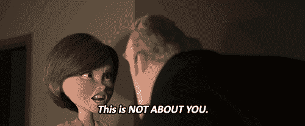
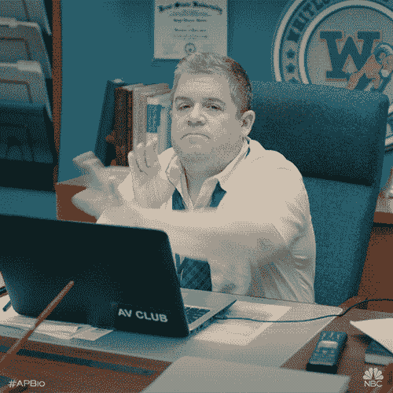
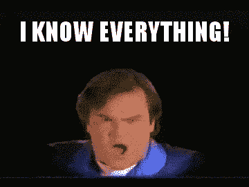

# 嘿面试官，别把事情搞复杂了！

> 原文：<https://dev.to/atapas/hey-interviewer-don-t-make-it-complicated-4eg2>

这个术语对我们任何人来说都不陌生。根据定义，面试可以被描述为，

> 面试是一个正式的会议，会上有人被问到一些问题，以确定他们是否适合一份工作或一门课程。

面试包括两个主要角色。

*   面试官:面试某人的人，尤指作为一份工作。
*   被面试者(又名候选人):被面试官面试的人。我将在这里交替使用术语`Interviewee`和`Candidate`。

作为一个面试者，有很多关于如何准备面试的读物。然而，需求来自两端。一个面试官在让一个面试变得精彩或者对某些人来说是一次可怕的经历方面有很大的利害关系。

这里有几个要点/提示，面试官必须记住，以使面试有效。

### 你也需要准备

是的，你作为面试官需要为面试做准备。你必须了解你要见的候选人。阅读候选人的简介/简历/履历。从简介中勾勒出您对他/她的技术优势、探查点和模糊之处的理解。

如果你事先没有一份个人资料，向你的经理或人力资源部表明，在这种情况下，你可能无法正常工作。

### 问候好，我的态度是基于你如何对待我

作为面试官，你将会遇到一个(大部分)你不了解的人，不了解你的性格和习惯。纠正你的第一印象的最好方法是，用有力的握手问候对方并介绍你自己。

你可以做一个小的/随意的谈话来让候选人保持紧张，然后进入通常的面试。然而，不要过度！恰当的问候/欢迎为整个面试定下了一个很好的基调。

### 与其说是过程，不如说是一种“技能”

信不信由你，*面试*是一项需要掌握的技能。除非你学得很好，否则你会浪费，

*   你宝贵的时间
*   您组织的资源/时间/金钱
*   考生的时间。

你需要学习判断在哪里停下来的技巧，什么时候决定，它已经完成了，当它没有去任何地方时该做什么，如何把它带到下一个层次。这些都是需要学习的纯技能。

### 这不是关于你的

记住面试非常非常少是关于你的。你必须介绍你的工作、组织、职位等。但是，请不要过度销售。这是真的不需要，因为这将是浪费时间。此外，你可能会给求职者留下你是一个“吹牛大王”的坏印象。

让面试围绕候选人展开。他/她的优势、劣势、机会、学识、经验等。与工作和空缺职位相关的信息。

### 你唯一的工作就是在面试的时候进行面试

当你告诉某人一些重要的事情，而那个人没有听你说话时，你有什么感觉？可能他只是在玩游戏，回复邮件等等？很疼，对吧？

我见过很多面试官做的一模一样。他们在进行采访时，将笔记本电脑/小工具放在面前。这对作为面试官的你来说非常分散注意力，对被面试者来说也很烦人。所以，请关掉它。

### 受访者不是什么都知道，你也是！

不要假设受访者(候选人)会知道一切。有这样的假设或期望会扼杀整个积极的面试结果。

有自己的标杆。保持一定的灵活性。从各个方面来判断面试者，而不仅仅是一两个具体的项目。面试结束后，和你的同事开一个简短的会议，讨论优势和劣势。不要因为他/她不能回答特定的问题就打有偏见的电话。他/她不会知道一切，你也一样！

### 你是组织，介意吗

有一种流行的说法，

> 第一印象是最后的印象。

在面试室，你代表你的组织。因此，试着给人留下一个近乎完美的第一印象，这符合你公司的理念。如果你在这方面做得不好，你的组织可能会在很多社交求职论坛上得到很多负面评价，比如， [GlassDoor](https://www.glassdoor.co.in/index.htm) ，[every](https://www.indeed.co.in/)， [LinkedIn](https://linkedin.com) 等。

### 保持积极心态

我建议在开始面试的时候要有一个积极的心态。所需的心态应该是，*如果他/她能达到我的基准，并有一定的灵活性*，我将雇用这个人。这很有帮助。

从一开始就有消极的心态会让你陷入一个陷阱，你将无法出来倾听或感受候选人真正能提供的优势。

### 不要把事情复杂化

即使在做了上述所有可能的事情后，如果受访者没有按照预期表现，也不要拖延。早点结束面试。让他知道，你的高水平反馈。如果人力资源人员应该与候选人沟通，请适当地授权。

当你知道面试不会给你带来任何进展时，不要因为拖延而使情况复杂化。

### 那边面试没搞定

面试作为一个过程并没有就此结束。如果候选人被发现非常适合，你必须采取必要的步骤跟进，直到这个人加入你。

面试过程在时间、资源、后勤等方面是昂贵的。你必须确保这些都在你的控制之下，并降低雇佣和寻找合适候选人的成本。

* * *

Hope you agree with most of the above and Liked the post 🍻🍻.

我相信，你会从自己的经历中得到更多的补充。在下面评论分享一下怎么样👇。

这篇文章最初发表在我的博客上。

封面图片来源:*尼克·麦克米伦在 Unsplash 上拍摄的照片*