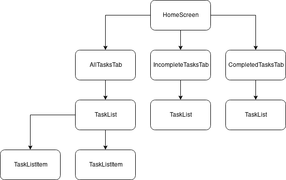

# 使用 Flutter 和 Provider 创建 Todos 应用程序

> 原文：<https://dev.to/shakib609/create-a-todos-app-with-flutter-and-provider-jdh>

对于初学者来说，Todo 应用程序一直是学习新事物的好的第一个应用程序。我创建这个应用程序也仅仅是为了学习。我使用了`provider`包，这是现在[推荐的在](https://www.youtube.com/watch?v=d_m5csmrf7I) [Flutter](https://flutter.dev) 应用中管理你的状态的方式。所以，我将向你展示如何使用`provider`作为状态管理系统，用 flutter 自己创建一个 Todo 应用程序。

你可以在这里找到完成的 app [。](https://github.com/shakib609/todos-flutter)

## 先决条件

*   对颤振和省道的基本理解
*   颤振正确安装在您的系统上

## 创建和安装依赖关系

我们将首先创建一个 flutter 应用程序。你可以使用你喜欢的 IDE( [Android Studio](https://developer.android.com/studio) 、 [Intellij IDEA](https://www.jetbrains.com/idea/) 、 [VS Code](https://code.visualstudio.com/) )来创建你的 flutter app。但是，我将通过终端创建应用程序。您可以从您的工作区运行下面的命令来创建一个新的`flutter`项目。

```
$ flutter create todos 
```

Enter fullscreen mode Exit fullscreen mode

创建应用程序后。转到您的项目目录并打开`pubspec.yaml`文件。并为我们将用于管理应用程序状态的`provider`包添加依赖项。您可以从文件中删除`cupertino-icons`依赖项。我们不会在这个项目中使用该包中的任何东西。

```
dependencies:
  flutter:
    sdk: flutter
  provider: ^2.0.1+1 
```

Enter fullscreen mode Exit fullscreen mode

更新文件后，运行下面的命令来获取所有在`pubspec.yaml`文件中登记的包。

```
$ flutter packages get 
```

Enter fullscreen mode Exit fullscreen mode

上面的命令将在您的工作区中创建一个名为`todos`的新目录。我们现在可以开始开发我们的 todos 应用了。

## 创建模型

我们将在我们的应用程序中使用单一模型。由于这是一个非常简单的应用程序，我们只需要创建一个**任务**的`title`，不管它是不是`completed`。

我喜欢让我的项目有条理。因此，我在`lib/models`目录下的一个单独的文件中创建了这个模型。我的`lib/models/task.dart`文件是这样的。我假设当一个`completed`参数没有传递给构造函数的时候`Task`是不完整的。

**P.S.** 我在这里导入了`material`包，用来注释`Todo`类构造函数所需的参数。还有，这里的

```
import 'package:flutter/material.dart';

class Task {
  String title;
  bool completed;

  Task({@required this.title, this.completed = false});

  void toggleCompleted() {
    completed = !completed;
  }
} 
```

Enter fullscreen mode Exit fullscreen mode

## 创建`TodosModel`提供者

这是我创建了扩展了`ChangeNotifier`类的`TodosModel`类的部分。这是一个`provider`包特定的类。这个模型将帮助我们改变应用程序的状态，并通知 flutter 何时重新渲染我们的应用程序或应用程序部分。所以，让我们创建一个新文件`lib/providers/todos_model.dart`。

这里，我使用来自`dart:collection`的`UnmodifiableListView`来创建我的 getters。这是为了确保我们的吸气剂不能在`TodosModel`宣言之外被以任何方式操纵。

你可能注意到的另一件重要的事情是`notifyListeners`的频繁使用。该方法通知 flutter 状态变化是否需要重新呈现 UI。

**P.S.** 只有监听提供者的 UI 小部件才会被重新呈现。

```
import 'dart:collection';

import 'package:flutter/material.dart';

import 'package:todos/models/task.dart';

class TodosModel extends ChangeNotifier {
  final List<Task> _tasks = [];

  UnmodifiableListView<Task> get allTasks => UnmodifiableListView(_tasks);
  UnmodifiableListView<Task> get incompleteTasks =>
      UnmodifiableListView(_tasks.where((todo) => !todo.completed));
  UnmodifiableListView<Task> get completedTasks =>
      UnmodifiableListView(_tasks.where((todo) => todo.completed));

  void addTodo(Task task) {
    _tasks.add(task);
    notifyListeners();
  }

  void toggleTodo(Task task) {
    final taskIndex = _tasks.indexOf(task);
    _tasks[taskIndex].toggleCompleted();
    notifyListeners();
  }

  void deleteTodo(Task task) {
    _tasks.remove(task);
    notifyListeners();
  }
} 
```

Enter fullscreen mode Exit fullscreen mode

## 最终用户界面

在这最后一节，我将讨论我如何设计 UI，以及我如何插入我在上一节创建的`TodosModel`。

首先让我们看看应用程序的结构。

该应用程序将主要由两个屏幕组成。

*   主屏幕
*   添加任务屏幕

同样，主屏幕将有一个包含这些选项卡的选项卡视图

*   所有任务
*   未完成的任务
*   完成任务

让我们来看看为了制作我们的应用程序而必须创建的`HomeScreen`小部件的小部件树。

[](https://res.cloudinary.com/practicaldev/image/fetch/s--wpnp4M2U--/c_limit%2Cf_auto%2Cfl_progressive%2Cq_auto%2Cw_880/https://thepracticaldev.s3.amazonaws.com/i/22f3etejazo2unvhi499.png)

所有三个选项卡都将显示类似的小部件。仅根据选定的选项卡进行过滤。

让我们开始编写我们的`TaskListItem`小部件。我们将使用一个`ListTile`小部件来创建这个小部件。`TaskListItem`类将被一个`Task`实例实例化，该实例稍后将被处理并呈现给 UI。我在这个位置为这个小部件创建了一个新文件:`lib/widgets/task_list_item.dart`。

这里需要注意的另一个新东西是在`onChanged`和`onPressed`参数中使用了`Provider.of<TodosModel>(context, listen: false)`。`provider`包非常依赖 Dart 的静态类型系统。这里`Provider.of<TodosModel>(context, listen: false)`揭示了`TodosModel`实例的实例，我们稍后将提供给我们的应用程序。然后，这个实例可用于调用该类的任何方法。`listen: false`参数告诉 flutter 这个小部件不需要在状态改变时重新呈现。

```
import 'package:flutter/material.dart';
import 'package:provider/provider.dart';

import 'package:todos/models/task.dart';
import 'package:todos/providers/todos_model.dart';

class TaskListItem extends StatelessWidget {
  final Task task;

  TaskListItem({@required this.task});

  @override
  Widget build(BuildContext context) {
    return ListTile(
      leading: Checkbox(
        value: task.completed,
        onChanged: (bool checked) {
          Provider.of<TodosModel>(context, listen: false).toggleTodo(task);
        },
      ),
      title: Text(task.title),
      trailing: IconButton(
        icon: Icon(
          Icons.delete,
          color: Colors.red,
        ),
        onPressed: () {
          Provider.of<TodosModel>(context, listen: false).deleteTodo(task);
        },
      ),
    );
  }
} 
```

Enter fullscreen mode Exit fullscreen mode

现在，我们将创建`TaskList`小部件，它将使用之前创建的`TaskListItem`小部件来显示`ListView`小部件中的任务列表。目前，我没有提供任何占位符`Text`或任何指示空列表的东西，但是欢迎您继续并在这里插入一个新的小部件来告诉用户当前的`TaskList`小部件是空的。

```
import 'package:flutter/material.dart';

import 'package:todos/models/task.dart';
import 'package:todos/widgets/task_list_item.dart';

class TaskList extends StatelessWidget {
  final List<Task> tasks;

  TaskList({@required this.tasks});

  @override
  Widget build(BuildContext context) {
    return ListView(
      children: getChildrenTasks(),
    );
  }

  List<Widget> getChildrenTasks() {
    return tasks.map((todo) => TaskListItem(task: todo)).toList();
  }
} 
```

Enter fullscreen mode Exit fullscreen mode

我们现在准备为我们的`HomeScreen`小部件创建所有必要的选项卡。我们将把我们的`HomeScreen`小部件的标签保存在一个单独的目录中。让我们首先创建我们的`AllTasksTab`小部件。(`lib/tabs/all_tasks.dart` )

```
import 'package:flutter/material.dart';
import 'package:provider/provider.dart';

import 'package:todos/providers/todos_model.dart';
import 'package:todos/widgets/task_list.dart';

class AllTasksTab extends StatelessWidget {
  @override
  Widget build(BuildContext context) {
    return Container(
      child: Consumer<TodosModel>(
        builder: (context, todos, child) => TaskList(
              tasks: todos.allTasks,
            ),
      ),
    );
  }
} 
```

Enter fullscreen mode Exit fullscreen mode

`Consumer`是由`provider`包提供的一个新的小部件。这个小部件提供了一种简单的方法来监听提供者状态的变化并相应地重新呈现。在`Consumer`小部件中包含巨大的小部件树通常被认为是一种不好的做法。这个小部件应该尽可能深地插入到小部件树中，以防止不必要的重新渲染。欲了解更多信息，请点击[这里](https://flutter.dev/docs/development/data-and-backend/state-mgmt/simple#consumer)。

我们需要重新呈现所有列表项，以防任何任务项发生变化。这就是为什么我在`Consumer`中使用了`TaskList`小部件。现在每当我们的提供商在其模型中调用`notifyListener`时。它将重新呈现我们的`TaskList`小部件。

类似地，在继续之前，尝试创建剩余的两个选项卡小部件。为了以防万一，我在下面给出了我的代码。

```
// lib/tabs/completed_tasks.dart
import 'package:flutter/material.dart';
import 'package:provider/provider.dart';

import 'package:todos/providers/todos_model.dart';
import 'package:todos/widgets/task_list.dart';

class CompletedTasksTab extends StatelessWidget {
  @override
  Widget build(BuildContext context) {
    return Container(
      child: Consumer<TodosModel>(
        builder: (context, todos, child) => TaskList(
              tasks: todos.completedTasks,
            ),
      ),
    );
  }
} 
```

Enter fullscreen mode Exit fullscreen mode

```
// lib/tabs/incomplete_tasks.dart
import 'package:flutter/material.dart';
import 'package:provider/provider.dart';

import 'package:todos/providers/todos_model.dart';
import 'package:todos/widgets/task_list.dart';

class IncompleteTasksTab extends StatelessWidget {
  @override
  Widget build(BuildContext context) {
    return Container(
      child: Consumer<TodosModel>(
        builder: (context, todos, child) => TaskList(
              tasks: todos.incompleteTasks,
            ),
      ),
    );
  }
} 
```

Enter fullscreen mode Exit fullscreen mode

现在我们可以创建我们的`HomeScreen`小部件了。这将是一个相当简单的部件，将使用我们以前为我们的应用程序创建的部件。

我们来看代码:

```
import 'package:flutter/material.dart';

import 'package:todos/tabs/all_tasks.dart';
import 'package:todos/tabs/completed_tasks.dart';
import 'package:todos/tabs/incomplete_tasks.dart';

class HomeScreen extends StatefulWidget {
  @override
  _HomeScreenState createState() => _HomeScreenState();
}

class _HomeScreenState extends State<HomeScreen>
    with SingleTickerProviderStateMixin {
  TabController controller;

  @override
  void initState() {
    super.initState();
    controller = TabController(length: 3, vsync: this);
  }

  @override
  Widget build(BuildContext context) {
    return Scaffold(
      appBar: AppBar(
        title: Text('Todos'),
        actions: <Widget>[
          IconButton(
            icon: Icon(Icons.add),
            onPressed: () {
            },
          ),
        ],
        bottom: TabBar(
          controller: controller,
          tabs: <Widget>[
            Tab(text: 'All'),
            Tab(text: 'Incomplete'),
            Tab(text: 'Complete'),
          ],
        ),
      ),
      body: TabBarView(
        controller: controller,
        children: <Widget>[
          AllTasksTab(),
          IncompleteTasksTab(),
          CompletedTasksTab(),
        ],
      ),
    );
  }
} 
```

Enter fullscreen mode Exit fullscreen mode

该应用程序现在应该可以正确显示所有已完成和未完成的任务，并且您应该能够切换任务的`completed`属性的状态。但是我们还不能测试我们的应用程序。我们需要一些演示任务来检查我们的应用程序是否正常工作。再补充一些吧。

打开您的`provider/todos_model.dart`文件，并将`Task`模型的一些实例添加到`_tasks`属性中。

```
 final List<Task> _tasks = [
    Task(title: 'Finish the app'),
    Task(title: 'Write a blog post'),
    Task(title: 'Share with community'),
  ]; 
```

Enter fullscreen mode Exit fullscreen mode

现在试试你的应用吧。我们创建的所有任务都是不完整的。点击复选框尝试切换它们。我们的应用程序现在应该工作正常。您应该能够通过 UI 更新、删除我们创建的任务。现在，我们需要做的最后一件事是创建一个向我们的应用程序添加任务的屏幕。我们将创建一个简单的`AddTaskScreen`有状态小部件来为我们的用户提供这个功能。我们使用有状态的小部件，因为在创建新任务时，我们需要来自这个小部件的`TextField`和`Checkbox`小部件的值。

```
import 'package:flutter/material.dart';
import 'package:provider/provider.dart';

import 'package:todos/providers/todos_model.dart';
import 'package:todos/models/task.dart';

class AddTaskScreen extends StatefulWidget {
  @override
  _AddTaskScreenState createState() => _AddTaskScreenState();
}

class _AddTaskScreenState extends State<AddTaskScreen> {
  final taskTitleController = TextEditingController();
  bool completedStatus = false;

  @override
  void dispose() {
    taskTitleController.dispose();
    super.dispose();
  }

  void onAdd() {
    final String textVal = taskTitleController.text;
    final bool completed = completedStatus;
    if (textVal.isNotEmpty) {
      final Task todo = Task(
        title: textVal,
        completed: completed,
      );
      Provider.of<TodosModel>(context, listen: false).addTodo(todo);
      Navigator.pop(context);
    }
  }

  @override
  Widget build(BuildContext context) {
    return Scaffold(
      appBar: AppBar(
        title: Text('Add Task'),
      ),
      body: ListView(
        children: <Widget>[
          Padding(
            padding: EdgeInsets.all(15.0),
            child: Container(
              child: Column(
                crossAxisAlignment: CrossAxisAlignment.stretch,
                children: <Widget>[
                  TextField(controller: taskTitleController),
                  CheckboxListTile(
                    value: completedStatus,
                    onChanged: (checked) => setState(() {
                          completedStatus = checked;
                        }),
                    title: Text('Complete?'),
                  ),
                  RaisedButton(
                    child: Text('Add'),
                    onPressed: onAdd,
                  ),
                ],
              ),
            ),
          )
        ],
      ),
    );
  }
} 
```

Enter fullscreen mode Exit fullscreen mode

我们再次使用`provider`包中的`Provider.of<TodosModel>(context, listen: false)`来调用`TodosModel`上的`addTodo`方法。这确保了我们的应用程序状态发生变化，并且所有监听窗口小部件都被通知到这一变化并被重新呈现。

现在，我们需要做的就是用我们的`HomeScreen`小部件连接这个屏幕，瞧！就这么办吧。打开您的`lib/screens/home_screen.dart`文件并更新`IconButton`小部件`onPressed`参数以包含这个。

```
import 'package:flutter/material.dart';

import 'package:todos/screens/add_task_screen.dart';

...
...

            onPressed: () {
              Navigator.push(
                context,
                MaterialPageRoute(
                  builder: (context) => AddTaskScreen(),
                ),
              );
            },

...
... 
```

Enter fullscreen mode Exit fullscreen mode

每当按下`Appbar`上的 **+** 按钮时，用户将进入`AddTaskScreen`。现在，我们需要做的就是将我们在`lib/main.dart`的主应用程序包装在一个`ChangeNotifierProvider`小部件中，这个小部件将把我们的`TodosModel`实例传递给我们应用程序中的所有小部件。更新你的`lib/main.dart`文件如下:

```
import 'package:flutter/material.dart';
import 'package:provider/provider.dart';

import 'package:todos/screens/home_screen.dart';
import 'package:todos/providers/todos_model.dart';

void main() => runApp(TodosApp());

class TodosApp extends StatelessWidget {
  @override
  Widget build(BuildContext context) {
    return ChangeNotifierProvider(
      builder: (context) => TodosModel(),
      child: MaterialApp(
        title: 'Todos',
        theme: ThemeData.dark(),
        home: HomeScreen(),
      ),
    );
  }
} 
```

Enter fullscreen mode Exit fullscreen mode

现在，我们的应用程序已经准备好了。恭喜你使用 Provider 创建了第一个使用 Flutter 的 Todo 应用程序。

感谢您阅读帖子。我提供了更多的资源，你可以从中了解更多关于使用`flutter`的`provider`包的信息。

*   [Github 回购`provider`包](https://github.com/rrousselGit/provider)
*   [简单状态管理-官方颤振文档](https://flutter.dev/docs/development/data-and-backend/state-mgmt/simple)
*   [在 5 分钟内了解提供商/集团模式:开发者学校](https://developer.school/posts/flutter-provider-and-bloc-in-5-minutes/)

 <small>本文首发于[我的个人网站](https://www.shakib609.gq/create-a-todos-app-with-flutter-and-provider)。</small>