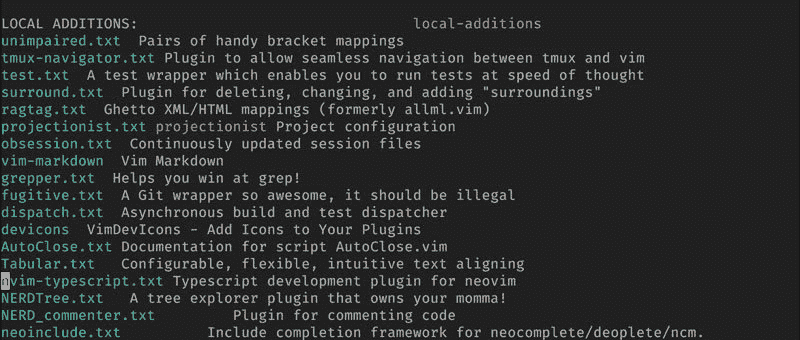

# 探索 Vim 插件:每周提高 1%的方法

> 原文：<https://dev.to/vintharas/exploring-vim-plugins-a-methodology-to-become-1-better-every-week-3m3n>

*本文最初发布于[barbarianmeetscoding.com](https://www.barbarianmeetscoding.com/blog/2019/05/31/exploring-vim-plugins-a-methodology-to-become-1-percent-better-every-week)。😊这些视频应该可以自动播放，但看起来我不能添加一个链接到我博客的视频标签，所以我把它们上传到 youtube，你需要手动播放它们😅。*

如果你已经在你的编辑器里安装了一堆插件，请举手，只记得其中的一半左右，并且勉强使用那好的一半的一小部分。如果你有这个问题，那么我可能正好有你需要的东西来更好地利用你的插件，让**变得更棒。**

> 大多数建议都是针对 Vim 的，但是最后的总结适用于任何编辑器。

Vim 最强大的特性之一是它的可定制性和可扩展性。这两个特性在现代文本编辑器中很常见，但是 Vim 为两者都带来了自己的特色。在 Vim 中，您可以通过定义自己的操作符、动作、命令、映射、设置、宏等来自定义和扩展您的体验。任何有经验的 Vim 用户都可以轻松地使用`vimrc`来更新和定制他们的 Vim 配置，以包含上面提到的任何内容。有趣的是，为了定制 Vim，您会发现经常会使用与编程时相同的编辑器特性。例如，Vim 宏是可重用的文本编辑单元，您可以通过记录与代码的交互来创建这些单元，以后您可以在自己的内容中重用这些单元。因此，它们是由您每天用于编码的常见操作符和动作构建的。定制命令和映射也是如此。

只使用 Vim 核心特性可以走得非常远。您可以通过使用前面提到的方法慢慢地定制和扩展 Vim，随着您使 Vim 适应您的开发工作流，您还可以做得更好。但是还有另一种令人惊奇(也更快)的方法可以增强你的 Vim 体验:**插件**。像其他编辑器一样，插件用令人兴奋的新功能扩展和定制你的编辑器。Vim 插件很酷的一点是，它们融入了 Vim 的精神，并利用了它的模态特性、它对命令组合的偏好以及它的社区在编码时对高效性的痴迷。正因为如此，使用 Vim 插件可以真正改善你的工作方式。

然而，通常你会安装一个插件，但不会充分利用它。事实上，大多数时候你会安装一个插件，然后忘记它。这篇文章和关于 Vim 插件的整个系列试图结束 Vim 插件的使用不足。它将为您提供一种方法和指南，让您最大限度地利用 Vim 插件，这样您在使用 Vim 时会更有效率。

## 如何发现插件

找到 Vim 插件的最好地方是[vima some](https://vimawesome.com/)。[vima some](https://vimawesome.com/)是一个插件目录，来源于 [GitHub](https://github.com) (这些天你会在 GitHub 里找到大部分 Vim 插件)[vim.org](https://vim.org)，也包括用户提交的插件[。](https://vimawesome.com/submit)

因此，如果您在 Vim 中缺少某些功能，您可以访问[vima some](https://vimawesome.com/)并搜索该缺少的功能。或者，你可以四处逛逛，看看是否有什么感兴趣的东西。Vim 与其他编辑器非常不同，所以很可能你会发现一些意想不到的(但很棒的)东西，如 [vim-surround](https://vimawesome.com/plugin/surround-vim) 、 [targets.vim](https://vimawesome.com/plugin/targets-vim) 或[vim-sleep](https://vimawesome.com/plugin/vim-sneak)。

如果你正在寻找一种更有条理的方法来发现插件，那么在接下来的几周和几个月里，请留意更多关于我最喜欢的插件的文章。

## 安装插件

Vim 用 Vim 8 改进了管理插件的方式，并增加了包(一种在 Vim 编辑器中分组和加载插件的方式)。然而，安装、移除和更新插件仍然需要相当多的手工工作，因此，Vim 用户通常依赖于插件管理器。使用插件管理器，您可以:

*   在您的`vimrc`中声明性地配置您的插件(就像您配置任何其他 Vim 一样)
*   安装，删除和更新插件与轻扫的命令(这是非常方便的)

这些是一些流行的选项，具有非常相似的功能集和理念:

*   [Vundle](https://github.com/VundleVim/Vundle.vim)
*   [vim-plug](https://github.com/junegunn/vim-plug)
*   [戴恩](https://github.com/Shougo/dein.vim)

只需遵循这些插件管理器的安装说明，并相应地更新您的`vimrc`。一旦你这样做了，添加一个新的插件到 Vim 将会很容易:

1.  将类似这样的内容添加到您的`vimrc`中，在这里您声明了在您的 Vim 编辑器中使用该插件的意图:

```
Plug 'scrooloose/nerdtree' 
```

1.  执行命令(例如 *vim-plug* 中的`:PlugInstall`)

## 配置插件

一些插件有合理的默认设置，并且开箱即用。但是你会发现，为了充分利用插件的优势，经常需要一些额外的配置。在这种情况下，你会对网上信息的缺乏感到惊讶(在大多数情况下)。然后你会对着天空举起你的拳头，愤怒和沮丧地大叫，并且想知道人们怎么会喜欢使用 Vim 而不是其他不那么痛苦的编辑器。深呼吸。它总是有帮助的。如果你有耐心，再深入一点，你会发现大多数 Vim 插件都有非常好的文档记录。文件不在你期望的地方(*因为为什么要用万维网，对吗？*)。

那么，在哪里可以找到这些优秀的文档呢？右内 Vim<sup id="fnref1">T1 1T3。</sup>

如果你键入`:help` ex-command，你将被传送到 Vim 的帮助。如果你向下滚动主帮助页面，你会很高兴地发现你所有本地安装的插件都有一个帮助，列在标题**本地附加**下:

[](https://res.cloudinary.com/practicaldev/image/fetch/s--jroIihRr--/c_limit%2Cf_auto%2Cfl_progressive%2Cq_auto%2Cw_880/https://www.barbarianmeetscoding.cimg/learning-vim-plugin-help.jpg)

事实上，你会发现你经常可以通过键入`:help {name-of-the-plugin}`(例如`:h unimpaired`)来访问特定插件的文档。

> ### 找不到一个插件的文档？
> 
> 您可以使用`helptags ALL`命令从插件加载文档。但是你并不真的想手动操作。相反，使用一个插件管理器，它会自动加载你的插件的所有文档。

好了，你已经找到了一个插件的文档。下一步是什么？最重要的部分，至少在开始时，通常围绕着映射、命令和配置:

*   **映射和命令**将是访问插件功能的两个不同的 API。有些插件会附带映射，你可以马上开始使用，或者你可以根据自己的喜好进行配置。其他插件将只提供命令，你可以直接使用或映射到你自己的映射。
*   **配置**让你可以大规模定制映射，启用和禁用插件特性，或者随心所欲地配置它们。

您可以搜索这些术语中的任何一个(例如`/mappings`、`/commands`、`/configuration`)，或者查看文档目录，找到您想要的内容，然后将光标放在一个链接(右侧突出显示的文本)上，键入`C-]`以传输到文档的该部分。

### 自定义插件映射

大多数插件利用`<Plug>`关键字(`:h <Plug>`)来简化映射定制。使用`<Plug>`的插件将如下定义其映射:

```
" This is an example taken from the coc.vim plugin
" https://github.com/neoclide/coc.nvim

nnoremap <Plug>(coc-rename) :<C-u>call CocActionAsync('rename')<CR>

" nnoremap           => Create a non recursive normal mode mapping
" <Plug>(coc-rename) => so that when <Plug>(coc-rename) is typed
" :<C-u>call ...     => the function CocActionAsync('rename') is called
"                       to rename something in your code 
```

这实际上意味着`<Plug>(coc-rename)`是一个可以被用户改变的占位符。一些插件会提供一个默认的键映射来关联这个占位符，但是如果他们没有，你可以像这样定义你自己的映射:

```
" Remap for rename current word
nmap <leader>rn <Plug>(coc-rename)

" nmap               => create a normal mode mapping
" <leader>rn         => to map <leader>rn
" <Plug>(coc-rename) => to the <Plug>(coc-rename) placeholder
" so that when you type <leader>rn you'll rename some code 
```

如果你正在使用的插件不依赖于`<Plug>`,你总是可以根据自己的喜好重新映射插件映射(但这并不方便)。

### 绘制插件命令

另一个常见的插件 API 是 Vim 命令。例如， [NERDTree](https://github.com/scrooloose/nerdtree) ，Vim 最常见的文件浏览器只提供命令 <sup id="fnref2">[2](#fn2)</sup> 。例如:

*   `:NERDTreeToggle`打开文件浏览器
*   `:NERDTreeFind`在当前文件中打开文件浏览器

在这种情况下，为您经常使用的命令提供一个映射是很方便的:

```
nnoremap <leader>n :NERDTreeFind<CR>

" nnoremap          => create normal mode mapping
" <leader>n         => so that when I type <leader>n
" :NERDTreeFind<CR> => the :NERDTreeFind command will be executed and I'll open the file explorer
"                   => on the current file 
```

现在你可以输入`<leader>n`并打开当前文件的文件浏览器。这比输入完整的`:NERDTreeFind`命令更快更方便。

## 学习和练习插件

采用和利用插件的一个重要部分是花一些时间阅读文档和练习。在 Vim 中有很多做事的方法，并且**很容易以一种非最佳的方式做事，仅仅是因为这种方式很舒服，这就是你一直以来的做事方式**。

拿这段文字来说:

```
What a wonderful age we're living in 
```

你可以通过键入`I"<ESC>A"<ESC>`用引号将其括起来，或者你可以学习有效地使用`vim-surround`并键入`yss"`(用引号将句子括起来)。

```
"What a wonderful age we're living in" 
```

这种方法更优越，不仅因为您需要键入的内容更少，还因为它是可重复的，只需键入点命令`.`就可以应用于多个句子。从大的方面来看，围绕操作符的**的存在本身就有回报，因为你可以将它与你已经知道的所有 Vim 运动结合起来，以获得更大的效果。**

一般来说，当采用一个新的插件时，你可以**遵循这个过程:**

1.  浏览文档，找到有用的东西
2.  用那东西做一个备忘单
3.  挑选最有用的并开始使用它。如果您发现它真的有帮助，请考虑创建合适的映射。
4.  当它是你工作流程的一部分时，回到 3。选择下一个最有用的东西。

真正专注于某个功能的一个很好的方法就是把它写在一张海报上，用大写字母写下来，然后贴在你的电脑屏幕下。这将是你接下来一周要练习的事情。

你不需要总是遵循这个过程。事实上，许多插件将适合你当前的开发工作流程，你不能不使用它们。你也不需要限制自己每周只学一件事。但是有一个基线目标是很好的，这样你就可以每周都有一点进步，变得越来越好。

## 修剪插件

就像利用你使用的插件来提高效率是很好的一样，留意你不使用的插件也很重要。发生这种情况有两个原因:

1.  你安装它是因为你认为它很酷，你会需要它，但你没有
2.  您找到了一种更好的方法来解决插件试图使用 Vim 核心特性或其他插件解决的问题

不管是哪种原因，你都不再需要这个插件了，最好删除它。插件不是免费的。有些会影响 Vim 的性能和速度(Vim 最大的特性之一)，有些会与其他插件冲突，还有一些会占用宝贵的 keymap 真实状态。所以如果你没有从一个插件中得到任何好处，就让它被遗忘吧。

## 总结结束

Vim 插件是增强您的 Vim 开发体验的绝佳方式。可悲的是，你会发现你经常会安装大量很少使用或者根本不会使用的插件。**为了利用这些插件并真正提高您的开发效率，您需要更有意识地采用插件**:

1.  仔细阅读插件文档(`:h {name-of-plugin}`)，找到对你有用的东西
2.  用这些东西做一个备忘单
3.  挑一个最有用的，练一练。这通常包括取代以前的习惯来解决一个不如新习惯有效的问题。那需要时间和努力。坚持下去！
4.  如果真的有用，确保有一个易于访问的映射
5.  当你把它融入你的工作流程时，庆祝一下吧！**你现在比**前提高了 1%。Wihoo！！现在选择下一个最有用的东西并练习它
6.  无限重复*和*
7.  经常删除你不使用的插件。

接下来，我们将浏览一堆令人惊叹的不同插件，我们将遵循这种方法来学习如何真正利用它们并进行出色的编码。在那之前，请保重并善待他人。

* * *

1.  如果你仍然想使用网络，你可以在 docs 文件夹下的 GitHub repo 中找到插件的文档。这不是最佳选择，从 Vim 中访问文档会更快更方便。 [↩](#fnref1)

2.  尽管在文件浏览器内部，NERDTree 确实有很多映射。 [↩](#fnref2)