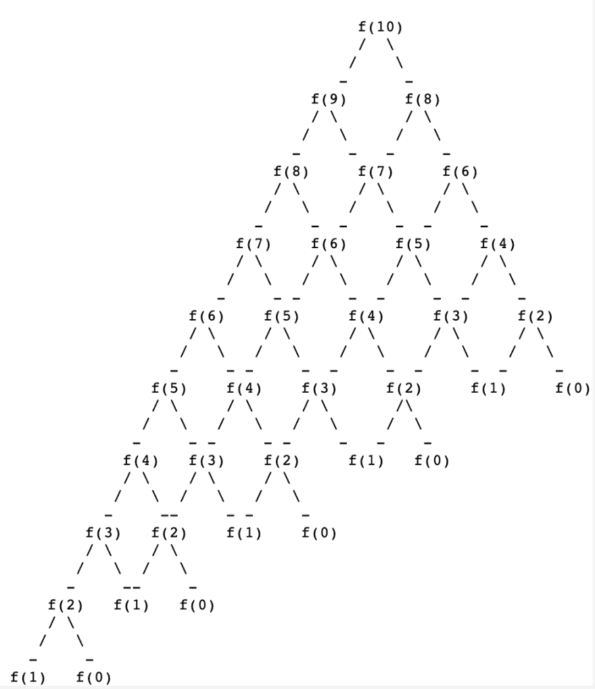

# 求解第 n 个斐波那契数

> 原文：<https://dev.to/theisomorphic/solving-for-the-nth-fibonacci-number-2pda>

*封面图片来源:克洛伊·埃文斯在 Unsplash 上*

一个经典的面试问题:“请写一个函数`fibonacci`，它接受一个整数`n`，并返回第 n 个斐波那契数。”斐波那契数列遵循以下模式:

```
0, 1, 1, 2, 3, 5, 8, 13… 
```

该模式继续将前面两个斐波纳契数相加，因此，上面的下一个值将是`21`。现在让我们写一个函数来得到第`n`个斐波那契值，这样，

```
// base Fibonacci numbers
fibonacci(0) // returns 0
fibonacci(1) // returns 1
// generated Fibonacci numbers
fibonacci(2) // returns 1
fibonacci(3) // returns 2
fibonacci(4) // returns 3
fibonacci(5) // returns 5
fibonacci(6) // returns 8
// ... 
```

## 解决方案 1:递归

这是解决这个问题最流行的方法，因为它更容易推理

```
fibonacci(n) = fibonacci(n - 1) + fibonacci(n - 2) 
```

我们把这个写成一个函数:

```
function fibonacci(n) {
  return fibonacci(n - 1) + fibonacci(n - 2)
} 
```

这是伟大的，但是，这没有停止的条件，所以它将永远继续下去。我们需要指定，如果`n`是`0`或`1`(我们的基本斐波那契数)，我们将分别返回`0`和`1`。

```
function fibonacci(n) {
  if (n === 0) return 0
  else if (n === 1) return 1
  else return fibonacci(n - 1) + fibonacci(n - 2)
} 
```

太好了！尝试`n = 1`、`n = 5`和`n = 50`的功能。

*   `fibonacci(1)`应该返回`1`。
*   `fibonacci(5)`应该返回`5`。
*   `fibonacci(50)`应该返回`12586269025`。

你可能已经注意到`fibonacci(50)`在控制台中挂起了一段时间。事实上，我的控制台花了大约八分钟才执行完毕！

[](https://res.cloudinary.com/practicaldev/image/fetch/s--iQIZ26n3--/c_limit%2Cf_auto%2Cfl_progressive%2Cq_auto%2Cw_880/https://thepracticaldev.s3.amazonaws.com/i/04yp9ugitae7cltf5xs0.png)

这是这个解决方案的缺点。对于大的`n`，计算时间太长。第二种解决方案解决了这个问题。

## 解决方案二:使用生成器功能

因此，之前的解决方案是可行的，但是对于大值的`n`来说非常慢。
为什么会这样？好吧，让我们以手工计算`fibonacci(10)`为例(为了简单起见，我将`fibonacci`表示为`f`。)

[](https://res.cloudinary.com/practicaldev/image/fetch/s--Nw2n5qj9--/c_limit%2Cf_auto%2Cfl_progressive%2Cq_auto%2Cw_880/https://thepracticaldev.s3.amazonaws.com/i/kem1ys3rhbl3ebs7dj9g.png)

我们不得不一遍又一遍地潜入一堆相同的兔子洞来计算`fibonacci(10)`。如果我们只需要前面两个斐波纳契数，为什么还要这样做？有没有一种方法可以让我们只需要*记住*前两个斐波那契数列，然后*生成*数列中的下一个斐波那契数列？是啊！我们可以使用[生成器](https://developer.mozilla.org/en-US/docs/Web/JavaScript/Reference/Global_Objects/Generator)来创建一个无限的`Fibonacci`数字序列。发电机很有趣。它们就像普通的函数，但是拥有超能力。它们能够在不完全结束函数执行的情况下返回值。它通过使用特殊的`yield`语句来实现这一点。让我们看一个简单的生成器函数的例子。

```
function* x() {
  // the "*" denotes that function x is a generator
  yield 'One taught me love'
  yield 'One taught me patience'
  yield 'And one taught me pain'
} 
```

太好了！让我们调用这个函数来看看它是如何工作的:

```
const thanku = x() // we invoke the generator

// invoke the `next` method on the generator prototype
thanku.next() // returns {value: "One taught me love", done: false}
thanku.next() // {value: "One taught me patience", done: false}
thanku.next() // {value: "And one taught me pain", done: false}
thanku.next() // {value: undefined, done: true}

// Now aren't you grateful for your x? 
```

[](https://res.cloudinary.com/practicaldev/image/fetch/s--xNIfbx3t--/c_limit%2Cf_auto%2Cfl_progressive%2Cq_auto%2Cw_880/https://i.giphy.com/media/1gUWdf8Z8HCxpM8cUR/giphy.webp)

对于生成器原型上对`next`方法的每一次调用，我们都会得到一个具有两个属性的对象:`value`和`done`，这两个属性分别是您从生成器生成的值和您的生成器是否完成了值的生成。让我们看一个更有趣的例子。让我们生成一个偶数的无限序列:

```
function* even() {
  let start = 0
  yield start // yield 0 as our first even number
  while (true) {
    // the start of our infinite sequence!
    start += 2 // add 2 to start
    yield start
  }
}

function helper() {
  const value = evenNumbers.next()
  console.log(`NEXT: ${JSON.stringify(value)}`)
}

const evenNumbers = even()

setTimeout(helper, 1000)
setTimeout(helper, 2000) 
```

让我们一起来看看上面代码的执行过程:

1.  我们首先通过调用`even`生成器来初始化变量`evenNumbers`。
2.  然后我们等待`helper`的第一次调用`1000`毫秒。
3.  `1000`毫秒过去，调用`helper`
    1.  我们通过调用`evenNumbers.next`来初始化`value`
        1.  我们用`0`初始化`start`
        2.  然后我们`yield` `start`和*暂停*发电机。
    2.  现在我们`console.log`该`value`了
4.  再次等待`1000`毫秒，等待`helper`的第二次调用
    1.  我们进入`while`循环
        1.  将`start`增加 2。
        2.  `yield` `start`并暂停发电机。
    2.  现在我们`console.log`该`value`了。

太好了！那么我们如何使用生成器函数来得到第 n 个斐波那契数呢？我们想做的是

1.  使用生成器创建无限的斐波纳契数列。
2.  继续调用`Fibonacci.next`直到我们得到第 n 个斐波那契数。

### 1。使用生成器创建无限的斐波那契数列

```
function* Fibonacci() {
  let a = 0,
    b = 1 // base Fibonacci numbers
  while (true) {
    const c = a + b // next Fibonacci number
    yield c
    a = b // new a will be what used to be b
    b = c // new b will be what used to be c
  }
} 
```

### 2。继续调用`Fibonacci.next`直到我们得到第 n 个数字

我们可以通过使用标准的`for`循环:
来实现这一点

```
function fibonacci(n) {
  if (n === 0) return 0
  else if (n === 1) return 1
  else {
    const Fib = Fibonacci()
    let value
    for (let i = 0; i < n - 1; i++) {
      value = Fib.next().value
    }
    return value
  }
} 
```

现在你有了:一个更快的函数来寻找第 n 个斐波那契数。看速度的差别！约 8 分钟 vs 约 0.029 毫秒！

[](https://res.cloudinary.com/practicaldev/image/fetch/s--d95cbs2K--/c_limit%2Cf_auto%2Cfl_progressive%2Cq_auto%2Cw_880/https://thepracticaldev.s3.amazonaws.com/i/8qs0see6qjy2uuezfpat.png)