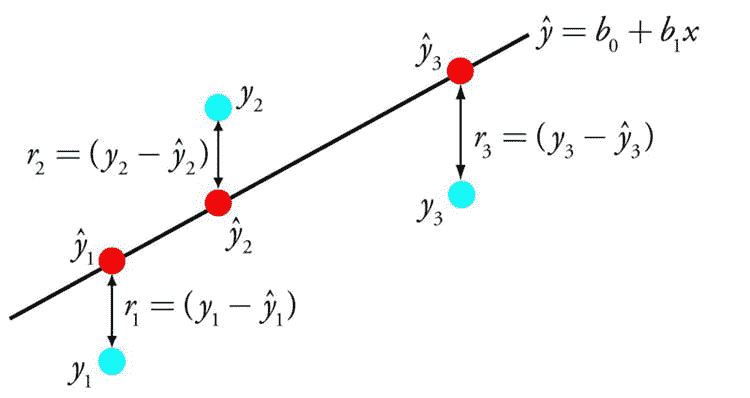
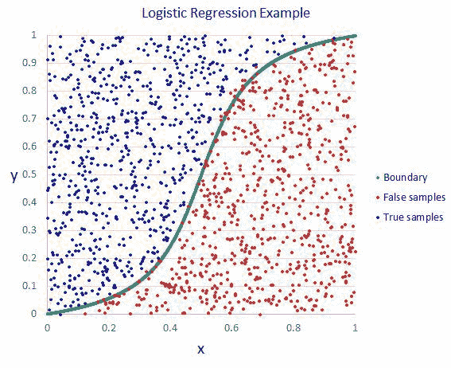
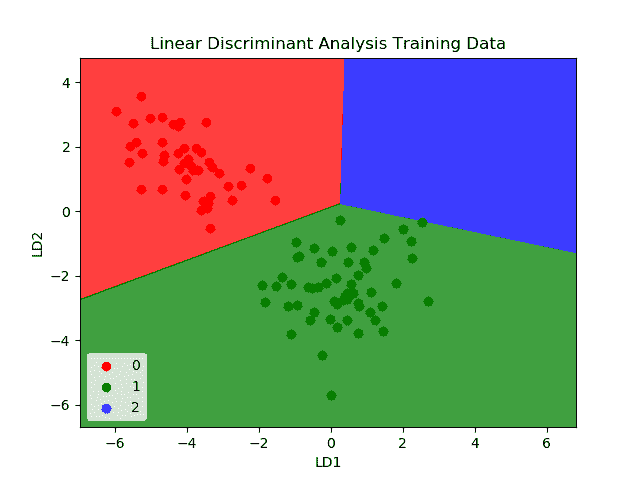
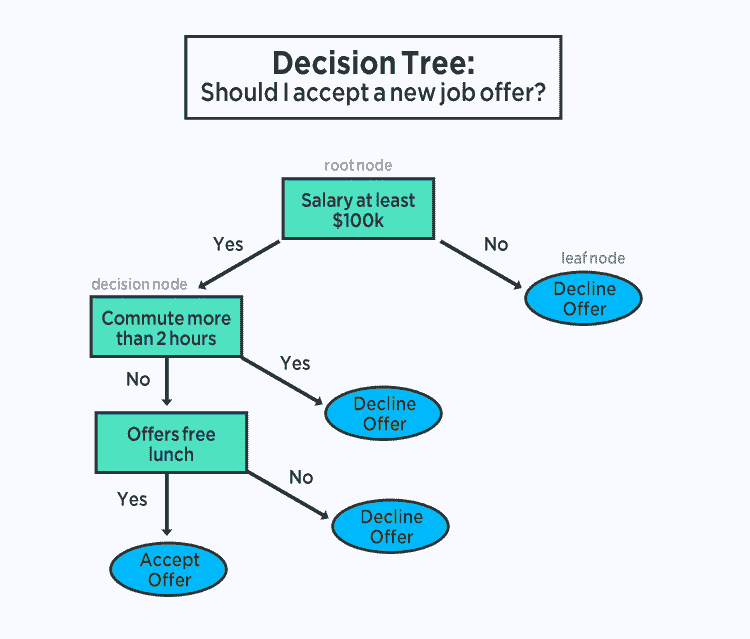
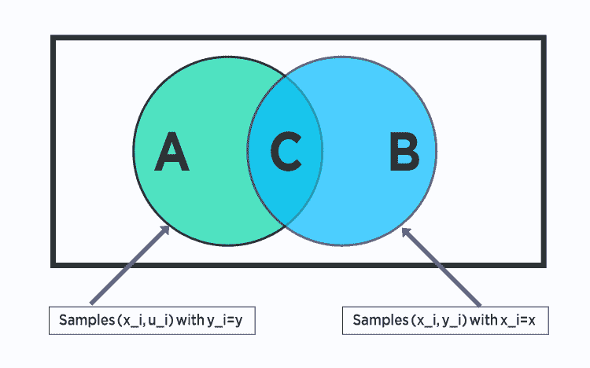

# 机器学习新手的 10 大算法之旅

> 原文：<https://dev.to/adamcalica/a-tour-of-the-top-10-algorithms-for-machine-learning-newbies-155f>

在[机器学习](https://builtin.com/data-science/introduction-to-machine-learning)中，有一个东西叫做“没有免费的午餐”定理。简而言之，它指出没有一种算法对每个问题都是最好的，并且它特别适用于监督学习(即预测建模)。

例如，你不能说神经网络总是比决策树好，反之亦然。有许多因素在起作用，例如数据集的大小和结构。

因此，您应该尝试许多不同的算法来解决您的问题，同时使用一个“测试集”来评估性能并选择获胜者。

当然，你尝试的算法必须适合你的问题，这就是选择正确的机器学习任务的原因。打个比方，如果你需要打扫房子，你可能会用吸尘器、扫帚或拖把，但你不会拿出铲子开始挖。

**大原则**

然而，所有用于预测建模的监督机器学习算法都有一个共同的原则。

机器学习算法被描述为学习将输入变量(X)最佳映射到输出变量(Y)的目标函数(f):Y = f(X)

这是一个一般的学习任务，在给定输入变量(X)的新示例的情况下，我们希望对未来(Y)做出预测。我们不知道函数(f)是什么样子，也不知道它的形式。如果我们有，我们会直接使用它，而不需要使用机器学习算法从数据中学习它。

最常见的机器学习类型是学习映射 Y = f(X ),以便为新的 X 预测 Y。这被称为预测建模或预测分析，我们的目标是尽可能做出最准确的预测。

对于渴望了解机器学习基础的机器学习新手来说，这里有一个数据科学家使用的 10 大机器学习算法的快速浏览。

**1 —线性回归**
线性回归可能是统计学和机器学习中最著名和最容易理解的算法之一。

预测建模主要关注最小化模型的误差或尽可能做出最准确的预测，但以可解释性为代价。我们将借用、重用和窃取许多不同领域的算法，包括统计学，并将它们用于这些目的。

线性回归的表示是一个方程，它描述了一条最符合输入变量(x)和输出变量(y)之间关系的直线，通过找到称为系数(B)的输入变量的特定权重。

例如:y = B0 + B1 * x

给定输入 x，我们将预测 y，线性回归学习算法的目标是找到系数 B0 和 B1 的值。

可以使用不同的技术从数据中学习线性回归模型，例如用于普通最小二乘法和梯度下降优化的线性代数解。

线性回归已经存在了 200 多年，并得到了广泛的研究。使用这种技术的一些好的经验法则是，如果可能的话，删除非常相似(相关)的变量，并从数据中删除噪声。这是一种快速简单的技术，也是一种不错的首选算法。

**2 —逻辑回归**

逻辑回归是机器学习从统计学领域借用的另一种技术。这是二元分类问题(具有两个类值的问题)的常用方法。

逻辑回归类似于线性回归，因为它的目标是找到加权每个输入变量的系数的值。与线性回归不同，输出预测是使用一种称为逻辑函数的非线性函数进行转换的。

逻辑函数看起来像一个大 s，将把任何值转换成 0 到 1 的范围。这很有用，因为我们可以对逻辑函数的输出应用规则，将值捕捉到 0 和 1(例如，如果小于 0.5，则输出 1)并预测类值。

由于模型的学习方式，逻辑回归所做的预测也可以用作给定数据实例属于类 0 或类 1 的概率。这对于需要给出更多预测理由的问题非常有用。

与线性回归一样，当您移除与输出变量无关的属性以及彼此非常相似(相关)的属性时，逻辑回归的效果会更好。这是一个快速学习的模型，在二分类问题上是有效的。

**3 —线性判别分析**
Logistic 回归是一种传统上仅限于两类分类问题的分类算法。如果您有两个以上的类，那么线性判别分析算法是首选的线性分类技术。

LDA 的表示非常直接。它包含为每个类计算的数据的统计属性。对于单个输入变量，这包括:

每类的平均值。

跨所有类计算的方差。

通过计算每个类别的判别值并对具有最大值的类别进行预测来进行预测。该技术假设数据具有高斯分布(钟形曲线)，因此事先从数据中移除异常值是一个好主意。对于分类预测建模问题，这是一种简单而强大的方法。

**4 —分类和回归树**
决策树是预测建模机器学习的一种重要算法类型。

决策树模型的表示是二叉树。这是你从算法到数据结构的二叉树，没什么太花哨的。每个节点代表一个输入变量(x)和该变量上的一个分割点(假设变量是数字)。

树的叶节点包含用于进行预测的输出变量(y)。通过遍历树的分裂直到到达叶节点并在该叶节点输出类值来进行预测。

树学起来很快，做预测也很快。它们通常对各种问题都很准确，并且不需要对数据做任何特殊的准备。

**5 —朴素贝叶斯**

朴素贝叶斯是一种简单但惊人强大的预测建模算法。

该模型由两种类型的概率组成，它们可以直接从你的训练数据中计算出来:1)每个类的概率；以及 2)给定每个 x 值的每个类别的条件概率。计算完成后，概率模型可用于使用贝叶斯定理对新数据进行预测。当您的数据是实值时，通常假设为高斯分布(钟形曲线),以便您可以轻松地估计这些概率。

朴素贝叶斯之所以称为朴素贝叶斯，是因为它假设每个输入变量都是独立的。这是一个强有力的假设，对于真实数据来说是不现实的，然而，这种技术对于大范围的复杂问题是非常有效的。

查看其余在 builtin . com:
[https://builtin . com/data-science/tour-top-10-algorithms-machine-learning-newbies](https://builtin.com/data-science/tour-top-10-algorithms-machine-learning-newbies)