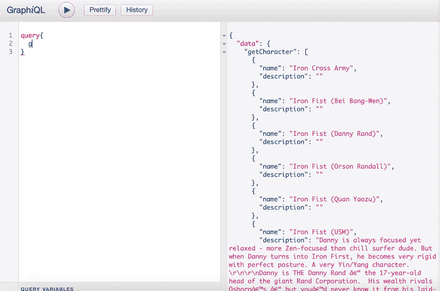
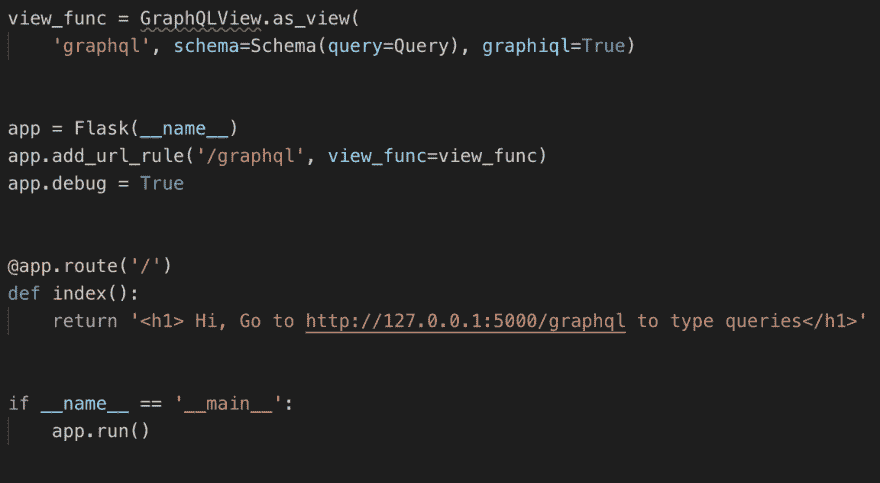
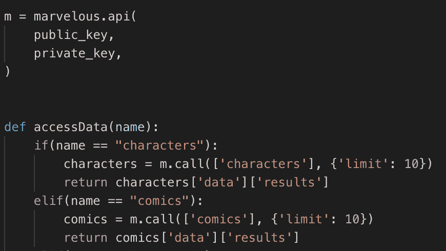
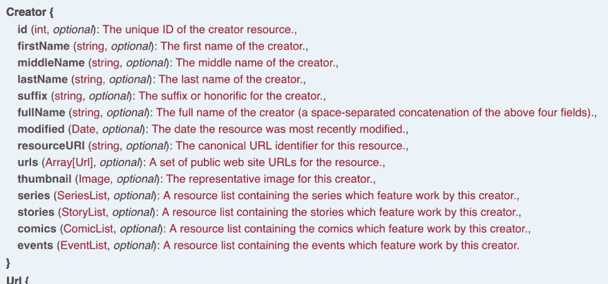
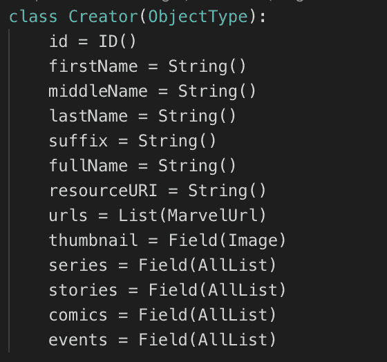

# python+Marvell+graph QL = pymarvell QL

> [https://dev . to/novvum/python-Marvell SQL-pymarvell QL-3ia 7](https://dev.to/novvum/python-marvel-graphql-pymarvelql-3ia7)图形

# 介绍🌋

随着《复仇者联盟》Endgame 的发布，现在是构建 PyMarvelQL 的最佳时机，这个程序允许您使用 GraphQL 查询漫威数据库。

PyMarvelQL 允许您向漫威的 REST API 发送 GraphQL 查询，以获取有关角色、漫画系列、故事、创作者等更多信息。

# 尝试一下😲

以下是对名称以 Captain 开头的字符的查询。查询 getCharacter()接受参数 nameStartsWith，该参数可以设置为您想要的任何值。在查询中，您可以包含任何要从漫威 API 获取的字段。可用的查询和参数基于漫威 API 文档。

如果你想下载这个工具，请到这个 [Github 库。](https://github.com/Novvum/MarvelQL/tree/master/packages/python)

# 它是如何工作的🏗

PyMarvelQL 是用 5 个工具构建的——Graphene 2.1、Python 3.7、Flask、flask-graphql 和 Marvelous。烧瓶和石墨烯是这个项目的主要工具。flask-graphQl 用于托管本地 graphQl 服务器，Graphene 用于创建允许用户从漫威数据库查询 JSON 数据的 GraphQL 解析器和对象类型。

# 烧瓶和烧瓶-GraphQL 🧪

Flask 是 python 的一个 web 框架，它为您提供了工具、库和技术，允许您构建 web 应用程序这个项目依赖 Flask 来支持在浏览器中运行 GraphiQL。它使用 flask-graphql 包中的 GraphQLView 向 flask 应用程序添加/graphql 端点。这是 flask-graphql 的安装文件的样子。

导航到/graphql 端点，访问 graphql 游乐场，查询漫画、人物、创作者和事件。

# 神奇的🦸

“神奇是一个漫威的 python API 包装器”。PyMarvelQL 使用 Marvel 调用一个漫威端点，并检索一个 JSON 对象，其中包含解析器所需的所有数据。PyMarvelQL 附带了我们的 API 密匙，但是您可以通过访问漫威的网站来注册自己的密匙。获得 API 键后，您可以像这样获取 JSON 对象:

变量 m 包含一个了不起的 API 实例，它从漫威数据库中获取数据，从漫威数据库中获取数据。如上所示，函数 accessData 根据变量名返回一个 JSON 对象。

# 石墨烯-Python 2.1👌

Graphene-Python 是一个用于在 Python 中轻松构建 GraphQL APIs 的库，其主要目标是提供一个简单但可扩展的 API，使开发人员的生活更加轻松。“石墨烯的主要特性之一是它允许我们创建解析器方法和对象类型。PyGraphQL 中的解析器方法将 JSON 数据返回给查询。例如，当获取漫威字符时，调用 accessData 函数(如上所述), JSON 对象存储在变量 characters 中。然后，使用这两个函数返回数据:

[T6】](https://res.cloudinary.com/practicaldev/image/fetch/s--rVjva1Jj--/c_limit%2Cf_auto%2Cfl_progressive%2Cq_auto%2Cw_880/https://cdn-images-1.medium.com/max/1600/1%2Az3xaYTdqlYuwqju9JozZKw.png)

这些助手函数将对象作为字符串读取，并将查询作为对象返回。ObjectType 对于返回被查询的数据也是必不可少的。正如 Graphene 文档中所述，“它是关于您的数据的唯一权威信息来源。它包含您正在查询的数据的基本字段和行为。

创建 ObjectType 时，必须创建与 API 文档中显示的完全相同的“字段和行为”。这将确保正确返回数据。

例如，[漫威 API 文档](https://developer.marvel.com/ %0A)列出了创建者对象拥有的字段..最重要的是，它显示了字段是什么数据类型。使用这些信息，您可以创建一个对象类型，如下所示:

如上所示，ObjectType 类似于漫威创建他们的 Creator 类的方式。主要区别在于每个字段的数据类型是用 Graphene 函数声明的:String()、List()和 field()。所有不同石墨烯功能的详细解释可在其[文档中找到。](https://docs.graphene-python.org/en/latest/types/scalars/)

# 联系我们

如果你喜欢 PyMarvelQL，请在 twitter 上关注我们 [(@novvumio)](https://twitter.com/novvumio) 给我们一颗星🌟在 [Github 上！](https://github.com/Novvum/MarvelQL/tree/master/packages/python)如果您发现任何问题，我们很乐意解决！你可以在这里提交他们[。](https://github.com/Novvum/MarvelQL/issues)