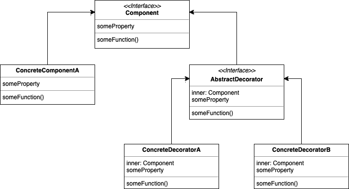

# 实践中的快速设计模式:装饰者模式

> 原文：<https://dev.to/imaccallum/swift-design-patterns-in-practice-the-decorator-pattern-2195>

欢迎阅读“实践中的 Swift 设计模式”的第一期出版物，这是一个旨在通过提供真实世界 iOS 应用中设计模式的具体用例来超越抽象示例的系列。今天，我们将讨论装饰模式，以及在实现 iOS 应用程序的 repo 层以与 RESTful API 和缓存机制交互时如何使用它。repo 层是[存储库设计模式](https://medium.com/@pererikbergman/repository-design-pattern-e28c0f3e4a30)的实现，用于抽象与我们的实体层的所有交互。我们将给出装饰模式的概述，包括它的结构、应用和好处。然后，我们将为一个具有模拟实现的模拟环境和一个具有 HTTP 和缓存层实现的生产环境，演示一个单一资源类型的 repo 层实现。在我们开始之前，我想对[稳定内核](https://stablekernel.com/about-us/)给我时间写这些博文表示感谢。好了，我们开始吧！

## 概述

装饰模式允许您动态地、透明地添加或扩展对象的功能。主要思想是为一些对象(组件)提供一个接口，您通过构造器注入用实现相同接口的对象(装饰器)来“包装”或装饰这些对象。然后使用 decorators 代替原始对象，因为它们共享一个公共接口(yay 多态性)。这允许装饰者在运行时修改组件的功能，而不改变它的任何代码。对于喜欢图表的人，这里有一个图表:

[](https://res.cloudinary.com/practicaldev/image/fetch/s--7J39jIEW--/c_limit%2Cf_auto%2Cfl_progressive%2Cq_auto%2Cw_880/https://thepracticaldev.s3.amazonaws.com/i/6tz1wb510231ds6v5w5l.png)

## 好处

#### 替代继承

继承在子类和超类之间产生了不必要的耦合。当对超类进行更改时，它们会破坏子类中的预期行为。几乎在所有场景中，继承都是次优的解决方案。装饰模式减轻了对子类化的需求，它让我们能够注入对象来获得功能，而不是被迫使用超类。

#### 解耦的可扩展代码

组件对扩展是开放的，但对修改是封闭的(开放封闭原则)，因为功能是通过用新对象装饰组件而不是直接修改它来添加的。装饰者应该服务于扩展组件功能的单一目的(单一责任原则)。这是对代码的一个小的结构改变，确保了组件的解耦和可扩展。

#### 避免组合领域问题的类爆炸

类爆炸发生在可能存在许多自定义项的问题中，尤其是当这些自定义项的应用顺序很重要，或者当这些自定义项的功能依赖于其他自定义项时，对于每个添加的新自定义项，导致类层次结构呈指数级增长。这篇[文章](https://dzone.com/articles/is-inheritance-dead)深入探讨了爆炸式的类层次结构，但这不是这篇文章的重点，所以我们就说到这里。

#### 编译器强制对运行时可动态改变的对象进行类型检查

组件是一个接口。因此，在使用该接口的地方，任何组件(无论是否经过修饰)都可以安全地使用。当组件接口改变时，编译器会对你大喊大叫，直到在所有具体的组件和装饰器中为任何改变定义了功能。

#### 测试单个单元的功能

测试单独的具体组件或装饰器变得非常容易，因为功能是隔离的。模拟混凝土组件可用于测试单个装饰器的功能，并且测试可重复用于装饰组件的不同组合。

## 用例:回购层

以前，我会使用一个对象来保存所有的网络呼叫。每个函数负责访问 API、解析响应、缓存数据并返回结果。这种方法很死板，伸缩性也很差。随着越来越多的调用，这个文件越来越大。您发现自己正在将这些函数组织成与特定资源的 HTTP 方法(GET、POST、PUT、DELETE 等)相关的集群。这是一个好迹象，表明这些函数实际上完全属于单独的类。进入回购层。在我们的实现中，我们将创建一个 repo 来访问每种资源类型。repo 意味着在给定的 URL 路径上镜像 HTTP 方法。

### 实现

我们将在`/posts[/:id]`路由上查看单个`Post`资源的实现。为了简洁起见，我们的实现仅限于创建和获取 post 对象(GET 和 POST 方法)。让我们从我们的`Post`结构开始:

```
// If we put our initializers in extensions
// this object will maintain its automatically 
// synthesized initializer
struct Post: Codable {
    let id: Int
    let title: String
    let body: String
} 
```

装饰模式从一个接口开始。我们的`PostRepo`协议将定义一个`getPost(id:completion:)`和`createPost(title:body:completion:)`，使用一个闭包和一个通用的`Result`类型来异步处理每个请求的成功和错误状态。同样的概念也适用于观察、未来、承诺等...

```
// Result.swift
enum Result<T> {
    case value(T)
    case error(Error)
}

// PostRepo.swift
protocol PostRepo {
    func getPost(id: Int, completion: (Result<Post>) -> Void)
    func createPost(title: String, body: String, completion: (Result<Post>) -> Void)
} 
```

我们可以不费吹灰之力就模拟出来。我们不再需要等待后端团队来实现我们工作所需的终端。

```
// An in-memory mock repo
class MockPostRepo: PostRepo {

    private var id = 0
    private var posts: [Int: Post] = [:]

    func getPost(id: Int, completion: (Result<Post>) -> Void) {

        if let post = posts[id] {
            // The post exists in memory
            completion(.value(post))
        } else {
            let error = NSError(domain: "Network error", code: 1, userInfo: nil) // 404 presumably
            completion(.error(error))
        }
    }

    func createPost(title: String, body: String, completion: (Result<Post>) -> Void) {
        let post = Post(id: id, title: title, body: body)
        posts[id] = post
        id += 1 // Like a db would autoincrement unique identifiers
        completion(.value(post))
    }
} 
```

然后我们可以初始化`PostRepo`的一个实例，以便在我们的应用程序中使用:

```
let postRepo: PostRepo = MockPostRepo() 
```

此时，我们的回购层正在运行。我们的数据被模拟，我们准备好建立我们的用户界面。现在可以将`postRepo`注入到视图控制器、视图模型、协调器或任何架构组件中。

```
/// For displaying a single post by id
class PostViewController: UIViewController {

    @IBOutlet weak var titleLabel: UILabel!
    @IBOutlet weak var bodyTextView: UITextView!

    private let postRepo: PostRepo
    private let postId: Int

    init(postRepo: PostRepo, postId: Int) {
        self.postRepo = postRepo
        self.postId = postId
        super.init(nibName: nil, bundle: nil)
    }

    required init?(coder aDecoder: NSCoder) { ... }

    override func viewDidLoad() {
        super.viewDidLoad()
        loadPost()
    }

    private func loadPost() {
        // We don't care if the post comes from a cache or
        // the network, only if we have one to display. Any
        // cache invalidation policy should be abstracted
        // away from us.
        postRepo.getPost(id: postId) { [weak self] result in
            switch result {
            case .value(let post):
                self?.update(with: post)
            case .error(let error):
                // Present error
            }
        }
    }

    private func update(with post: Post) {
        titleLabel.text = post.title
        bodyTextView.text = post.body
    }
} 
```

我们的视图控制器依赖于抽象的`PostRepo`协议，而不是它的任何具体实现(依赖倒置原则)。

现在，如果我们考虑我们的缓存层，它是一个与我们的回购层完全不同的实体。我们的 repo 层有一个异步获取 post 的方法，但是我们的缓存层需要能够同步存储 post 和获取缓存的 post。我们可以很容易地制作一个具体的`PostRepo`装饰器来执行缓存，但是我们可以通过使用一个`PostCache`协议来定义缓存层的接口，并使用一个对所使用的特定缓存不偏不倚的`PostRepo`装饰器来进一步抽象我们的缓存层。这是我们的`PostCacheProtocol`:

```
protocol PostCache {
    func getPost(id: Int) -> Post?
    func store(post: Post)
} 
```

同样，这很容易被模仿。我们可以毫不费力地在内存中实现`PostCache`:

```
// An in-memory post cache
class MockPostCache: PostCache {

    private var posts: [Int: Post] = [:]

    func getPost(id: Int) -> Post? {
        return posts[id]
    }

    func store(post: Post) {
        posts[post.id] = post
    }
} 
```

现在我们来看看用缓存层来装饰一个`PostRepo`。为此，我们将通过实现一个协议来定义我们的抽象装饰器，该协议扩展了`PostRepo`协议(组件),并持有对某个内部`PostRepo`对象的引用。在实现装饰模式时，这一步完全是可选的。创建符合`PostRepo`并具有内部`PostRepo`属性的具体装饰器并不稀奇，但是我们必须为每个具体装饰器实现每个`PostRepo`函数，而不是抽象装饰器。

借助 Swift，我们使用协议扩展来提供合理的默认值，因此无需重新实现不适用于特定装饰者的功能。我们的协议扩展将具有默认的功能，将所有对的调用代理到内部的`Component`对象。这类似于在具有抽象类的语言中提供非抽象函数或使用 mix-in。

```
// MARK: - Abstract Decorator
protocol PostRepoDecorator: PostRepo {
    var inner: PostRepo { get }
}

// Forward all calls to the inner object by default
extension PostRepoDecorator {
    func getPost(id: Int, completion: (Result<Post>) -> Void) {
        inner.getPost(id: id, completion: completion)
    }

    func createPost(title: String, body: String, completion: (Result<Post>) -> Void) {
        inner.createPost(title: title, body: body, completion: completion)
    }
} 
```

```
class PostRepoCacheDecorator: PostRepoDecorator {

    private let cache: PostCache
    let inner: PostRepo

    init(inner: PostRepo, cache: PostCache) {
        self.inner = inner
        self.cache = cache
    }

    func getPost(id: Int, completion: (Result<Post>) -> Void) {

        guard let cachedPost = cache.getPost(id: id) else {

            // Hit the network to get posts
            return inner.getPost(id: id) { result in

                // Cache posts from network for next time
                if case .value(let post) = result {
                    cache.store(post: post)
                }

                // Forward the result
                completion(result)
            }
        }

        completion(.value(cachedPost))
    }

    func createPost(title: String, body: String,
                    completion: (Result<Post>) -> Void) {

        inner.createPost(title: title, body: body) { result in

            // Cache the newly created post
            if case .value(let createdPost) = result {
                cache.store(post: createdPost)
            }

            // Forward the response
            completion(result)
        }
    }
} 
```

我们使用这个`PostRepoCacheDecorator`通过包装一个现有的`PostRepo`对象和一些`PostCache`对象来动态地将缓存功能附加到任何`PostRepo`类型上。现在，当我们建立我们的后回购时，我们对我们正在使用的`PostRepo`和`PostCache`漠不关心:

```
let cache = MockPostCache()
let api = MockPostRepo()
let postRepo: PostRepo = PostRepoCacheDecorator(inner: api, cache: cache) 
```

我们现在有一个带有模拟 API 和内存缓存的 post repo。如果我们想要实现一个非模拟缓存和 API repo，我们需要做的就是创建更多的`PostRepo`和`PostCacheProtocol`的具体实现。唯一将改变的现有代码是我们最初设置`PostRepo`实例的地方，我们将在整个应用程序中使用该实例。我们可以独立测试新的实现，而不必重构现有的实现来添加所需的功能。

让我们用一个`HttpPostRepo`来进行网络调用，用一个`UserDefaultsPostCache`来保存应用程序启动之间的数据。

```
// Some abstraction around URLSession
protocol HttpClient {
    func get<T: Codable>(_ path: String, completion: (Result<T>) -> Void)
    func post<T: Codable>(_ path: String, body: [String: Any], completion: (Result<T>) -> Void)
    // put, delete...
}

class HttpPostRepo: PostRepo {

    private let http: HttpClient

    init(http: HttpClient) {
        self.http = http
    }

    func getPost(id: Int, completion: (Result<Post>) -> Void) {
        http.get("/posts/\(id)", completion: completion)
    }

    func createPost(title: String, body: String, completion: (Result<Post>) -> Void) {

        let httpBody: [String: Any] = [
            "title": title,
            "body": body
        ]

        http.post("/posts", body: httpBody, completion: completion)
    }
} 
```

```
class UserDefaultsPostCache: PostCache {

    private let defaults: UserDefaults

    init(defaults: UserDefaults) {
        self.defaults = defaults
    }

    // MARK: - PostCache

    func store(post: Post) {
        let encoder = JSONEncoder()
        if let encoded = try? encoder.encode(post) {
            defaults.set(encoded, forKey: keyForPost(with: post.id))
        }
    }

    func getPost(id: Int) -> Post? {
        let decoder = JSONDecoder()
        let data = defaults.object(forKey: keyForPost(with: id)) as? Data
        return data.flatMap { try? decoder.decode(Post.self, from: $0) }
    }

    // MARK: - Helpers
    private func keyForPost(with id: Int) -> String {
        return "kPostKey:\(id)"
    }
} 
```

这在处理未来变化时变得特别有用。我们可以为核心数据、领域或 SQLite 实现具体的`PostCache`类，只需一行代码就可以将它们集成到我们的应用程序中。

```
let defaults: UserDefaults = .standard
let httpClient: HttpClient = // ...

lazy var postRepo: PostRepo = {
    let cache = UserDefaultsPostCache(defaults: defaults)
    let api = HttpPostRepo(http: httpClient)
    return PostRepoCacheDecorator(inner: api, cache: cache)
}() 
```

这就是它的全部内容。我们现在有了一个实现不可知的 repo 层，它不会将我们束缚于任何框架、库或依赖项。包含模拟和生产方案配置的 Xcode 项目、所有这些源代码和一个示例操场可以在 [GitHub](https://github.com/stablekernel/swift-repo-layer-example) 上找到。