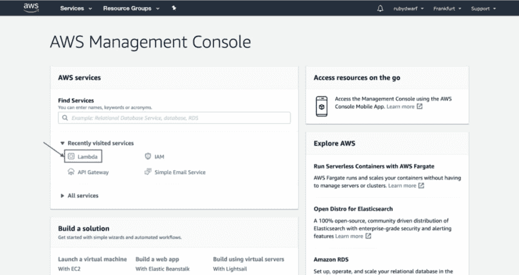
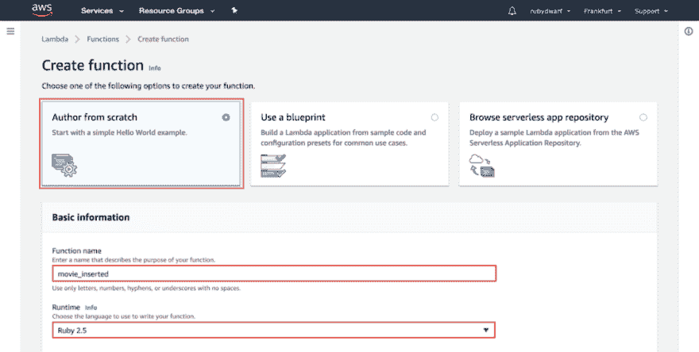
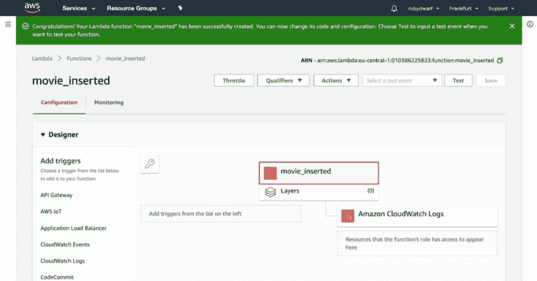
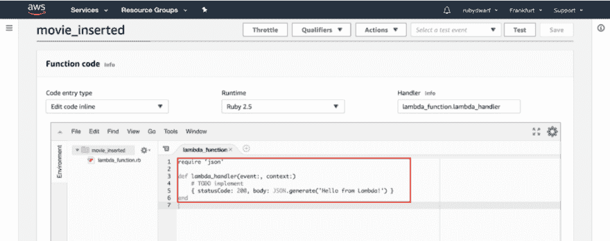

# GraphQL &无服务器 Ruby

> [https://dev . to/傀儡磨煤机/graph QL-server less-ruby-348 p](https://dev.to/marionschleifer/graphql-serverless-ruby-348p)

随着 GraphQL 和 serverless 变得越来越流行，我们将看看如何用 serverless Ruby 构建这样一个应用程序。这篇文章中提出的选择是使用一个简单的 GraphQL 后端和一个现代前端框架(例如 Vue 或 React ),并使用无服务器的 Ruby 来添加定制的业务逻辑。

#### 目录

*   [3 因素应用架构](https://medium.com/p/25cac1e09dec#f470)
*   [无服务器功能](https://medium.com/p/25cac1e09dec#72b5)
*   [没有基础设施管理](https://medium.com/p/25cac1e09dec#6812)
*   [成本效率](https://medium.com/p/25cac1e09dec#26f0)
*   [可靠性](https://medium.com/p/25cac1e09dec#ecfb)
*   [云提供商](https://medium.com/p/25cac1e09dec#b45c)
*   [我们的任务](https://medium.com/p/25cac1e09dec#cb30)
*   [创建我们的第一个无服务器功能](https://medium.com/p/25cac1e09dec#a0f7)
*   [添加事件触发器](https://medium.com/p/25cac1e09dec#f119)
*   让我们来测试一下！
*   [远程模式](https://medium.com/p/25cac1e09dec#6df5)
*   [加入社区](https://medium.com/p/25cac1e09dec#ed2a)

### 3 因素应用架构

这篇博文中提出的架构是使用 3 因素应用架构([https://3factor.app/](https://3factor.app/))。我们使用 Hasura 实现实时 GraphQL 和可靠事件，使用 AWS lambdas 实现异步无服务器。要设置你的 GraphQL 后端，请阅读本教程:[https://medium . com/@ Marion . schleifer/初学者-graphql 指南-api-d5ec68c69f69](https://dev.to/marionschleifer/beginners-guide-to-graphql-api-8ke) 。在这篇文章中，我们将关注如何使用 Ruby 在 AWS 上添加无服务器业务逻辑。前端集成不在这里讨论，但是你可以在这里阅读:[https://medium . com/@ Marion . schleifer/how-to-connect-your-graph QL-API-to-your-vue js-frontend-61 D8 E8 e 455 db](https://medium.com/@marion.schleifer/how-to-connect-your-graphql-api-to-your-vuejs-frontend-61d8e8e455db)。

### 无服务器功能

无服务器功能是运行在云中的代码。我们将把它们和 Hasura 事件触发器一起使用。在 Hasura 项目中，我们可以添加事件触发器，在突变(插入、更新、删除)后调用无服务器函数。例如，这可以用于发送电子邮件、添加支付 API 或处理异步业务逻辑。使用无服务器架构，我们可以获得以下优势:

#### 没有基础设施管理

如果你在云中运行你的代码，维护的责任由云提供商承担，这样你就可以专注于前端而不用担心维护服务器。

#### 成本效率

借助所有现代云提供商，您可以免费开始。当你开始获得更多的流量，成本是按比例设计的。这意味着你要根据你的无服务器功能被触发的次数付费。

#### 可靠性

您可以依靠云提供商来确保没有(或只有很短的)停机时间。常见的云提供商是大型企业，他们围绕云服务构建了庞大的基础设施，并确保正常运行时间。

### 云提供商

您可以将无服务器功能部署到任何云提供商。以下是最常与 Hasura 结合使用的方法:

*   Glitch(简单、免费、只有 JavaScript，最适合原型开发)
*   谷歌云(谷歌，大规模成本，多种语言)
*   Azure(微软，大规模成本，多种语言)
*   AWS(亚马逊，大规模成本，包括 Ruby 在内的几种语言)

### 我们的任务

在我们的哈利波特 API([https://medium . com/@ Marion . schleifer/初学者-指南-到-graphql-api-d5ec68c69f69](https://dev.to/marionschleifer/beginners-guide-to-graphql-api-8ke) )中，我们有一个电影表。我们现在想写一个无服务器的函数，当一部新电影被插入时，这个函数就会被触发。这个函数所做的就是将标题和发布日期发送回服务器，我们将在那里对其进行检查。让我们开始吧。

### 创建我们第一个无服务器功能

由于 AWS 是目前唯一支持 Ruby 的云提供商，我们会选择这个，因为我们都喜欢 Ruby，对吗？首先，在 AWS 上创建一个帐户，如果你还没有的话。第一年将是免费的，所以你不必担心成本，只要你的功能没有巨大的流量。

登录后，进入 AWS 管理控制台，点击“Lambda”。

现在点击按钮创建一个新功能:

由于我们还没有蓝图或现有的存储库，我们将从头开始创作我们的功能。在下面，你可以输入你的函数名(没有空格和小写字母)。我们将调用我们的函数“movie_inserted ”,因为我们希望每当插入一部新电影时触发它。至于运行时，有一个 Ruby 版本可供选择，我们将选择“Ruby 2.5”。

现在点击“创建功能”按钮。正如您在下一页看到的，我们的函数已经创建:

当您向下滚动时，可以看到我们的第一个 AWS 函数的定义。

在函数内部，我们希望从传递给函数的事件中读取电影信息。然后，我们希望将新插入的电影的标题和发行日期发送回服务器。

让我们将函数更改如下: