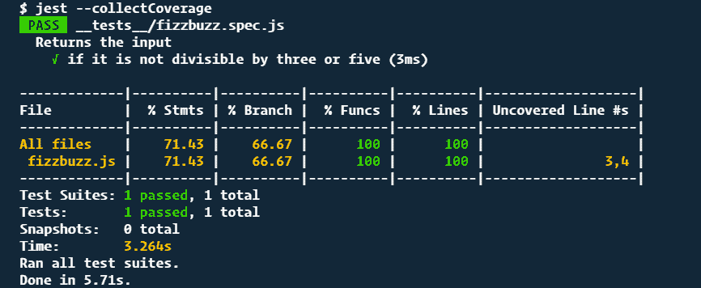
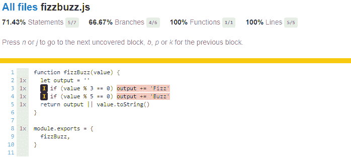
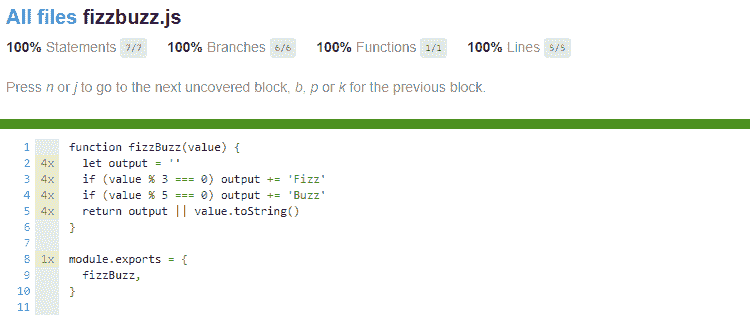

# 阅读代码覆盖率

> 原文：<https://dev.to/timdeschryver/reading-code-coverage-58nc>

这篇文章不是说你必须在你的代码库中有 X 到 Y 的百分比覆盖率。这是一篇介绍代码覆盖率、如何阅读代码覆盖率以及如何在工作流程中使用代码覆盖率的文章。

## 代码覆盖率

代码覆盖率告诉你在测试中执行了哪些代码，执行了多少次。我不是说要达到 X %的覆盖率，因为这完全取决于你在创造什么。以 100%的代码覆盖率为目标通常是一个错误，因为这将花费大量的时间(达到和维护)，并且它可能导致有问题的测试实践。高覆盖率并不一定会提高质量，错误总是会出现。

我将代码覆盖率作为一种工具，作为验证代码是否准备好的最后检查。它可以发现我们没有想到的边缘情况，并且可以让糟糕的代码变得可见。

## 如何

我目前使用的测试框架是 [Jest](https://jestjs.io) ，这个框架内置了代码覆盖率。要生成项目的代码覆盖率，您可以使用`--collectCoverage`标志。

```
jest --collectCoverage 
```

Enter fullscreen mode Exit fullscreen mode

Jest 配置允许您配置一些参数，如设置阈值、从覆盖范围中排除的路径等。

## 举个例子

让我们把这个付诸实践。作为测试，我们将看看 fizz buzz 函数的代码覆盖率。FizzBuzz 是一个小函数，根据不同的输入会返回不同的输出。
如果输入值:

*   能被 3 整除，它返回`Fizz`，例如 6
*   能被 5 整除，则返回`Buzz`，例如 20
*   能被 3 和 5 整除，它返回`FizzBuzz`，例如 15
*   否则，它返回输入值，例如 7

fizz buzz 函数的一个可能的解决方案如下:

```
function fizzBuzz(value) {
  let output = ''
  if (value % 3 == 0) output += 'Fizz'
  if (value % 5 == 0) output += 'Buss'
  return output || value.toString()
} 
```

Enter fullscreen mode Exit fullscreen mode

### 我们的第一次测试

作为我们的第一个测试，我们覆盖了最简单的情况，一个不可分的输入，简单地返回输入值:

```
describe('Returns the input', () => {
  it('if it is not divisible by three or five', () => {
    expect(fizzbuzz(7)).toBe('7')
  })
}) 
```

Enter fullscreen mode Exit fullscreen mode

如果我们现在生成我们看到的代码覆盖率

直接在 CLI 中的覆盖报告:

[](https://res.cloudinary.com/practicaldev/image/fetch/s--JCPR4oKd--/c_limit%2Cf_auto%2Cfl_progressive%2Cq_auto%2Cw_880/https://thepracticaldev.s3.amazonaws.com/i/hwtyunrfism5jcfguwj4.png)

可以在浏览器中打开的覆盖报告(通过`./coverage/lcov-report/index.html`):

[](https://res.cloudinary.com/practicaldev/image/fetch/s--hlH78HYb--/c_limit%2Cf_auto%2Cfl_progressive%2Cq_auto%2Cw_880/https://thepracticaldev.s3.amazonaws.com/i/rm2ahft3vbufrfruiqd8.png)

甚至可以点击文件查看哪些行被覆盖，哪些行没有被覆盖:

[](https://res.cloudinary.com/practicaldev/image/fetch/s--R5UPBhu3--/c_limit%2Cf_auto%2Cfl_progressive%2Cq_auto%2Cw_880/https://thepracticaldev.s3.amazonaws.com/i/kr3xj8gmhyxqcufofg6j.png)

在上面所有的截图中，你可以看到四个不同的百分比
。

来自[维基百科](https://en.wikipedia.org/wiki/Code_coverage):

*   语句覆盖–程序中的每条语句都被执行了吗？
*   分支覆盖——每个控制结构(如 if 和 case 语句)的每个分支(也称为 DD-path)都被执行了吗？例如，给定一个 if 语句，真分支和假分支都被执行了吗？请注意，这是边覆盖的一个子集。
*   函数覆盖——程序中的每个函数(或子程序)都被调用了吗？
*   行覆盖率源文件中的每个可执行行都被执行了吗？

### 解读我们的代码覆盖率

我们可以从覆盖范围中注意到，我们所有的行都被覆盖了，但不是所有的语句都被覆盖了。更具体地说，输入值可被 3 和/或 5 整除的行。

如果我们写测试来覆盖`Fizz`规格，我们看到我们现在有 100%的覆盖率🎉！。

```
describe('Fizz', () => {
  describe('Prints Fizz', () => {
    it('if it is divisible by three', () => {
      expect(fizzBuzz(3)).toBe('Fizz')
    })
  })

  describe('Does not print Fizz', () => {
    it('if it is not divisible by three', () => {
      expect(fizzBuzz(1)).not.toBe('Fizz')
    })

    it('if it is divisible by three and five', () => {
      expect(fizzBuzz(15)).not.toBe('Fizz')
    })
  })
}) 
```

Enter fullscreen mode Exit fullscreen mode

[](https://res.cloudinary.com/practicaldev/image/fetch/s---qkuw-WL--/c_limit%2Cf_auto%2Cfl_progressive%2Cq_auto%2Cw_880/https://thepracticaldev.s3.amazonaws.com/i/lans53kxk00te6bsjade.png)

奇怪的是，我们现在有 100%的覆盖率，但是我们没有适当的测试来覆盖`Buzz`和`FizzBuzz`输出。
这是因为在我们的`Fizz`测试中，我们验证了“不能被 3 整除”输入和“能被 3 和 5 整除”输入的输出都不会导致`Fizz`。通过这样做，我们的所有语句都被执行，从而实现 100%的代码覆盖率。但是这并不能证明我们所有的代码都是正确的。在这个特定的例子中，它不会在我们的程序中发现拼错的`Buzz`(我们把它拼为`Buss`)，但是它仍然显示了 100%的覆盖率。

## 工作流中的代码覆盖率

使用代码覆盖率来验证您自己的代码，或者在代码审查过程中提供帮助，会从不同的角度看待代码。对我来说，看到高亮显示的线条常常会引出几个我以前没有想到的问题。问自己为什么一些代码没有被执行，是这些问题中的一个，尤其是当我认为它应该被执行的时候。

复杂的和不可维护的将变得可见，因为这些将被突出显示。有更好的工具来跟踪复杂的代码块，但是代码覆盖率查看器可能是一个很好的指示。

## 结论

虽然代码覆盖率肯定有其价值，但很容易误解这些数字。它们确实给了发布代码的信心，并且在大多数情况下会导致一个更加经得起考验的应用程序，但是它们**不会验证所有的业务需求都已经得到满足，也不会被正确地实现**。

使用代码覆盖率作为工具来验证你的想法已经让我节省了好几次，防止了意想不到的错误。复杂的代码，不可读的代码会在查看代码覆盖率时出现，因为它可能只占很低的百分比。一个可能的原因是代码混乱，被称为意大利面条代码。这是您必须决定重构代码还是保持原样的地方。