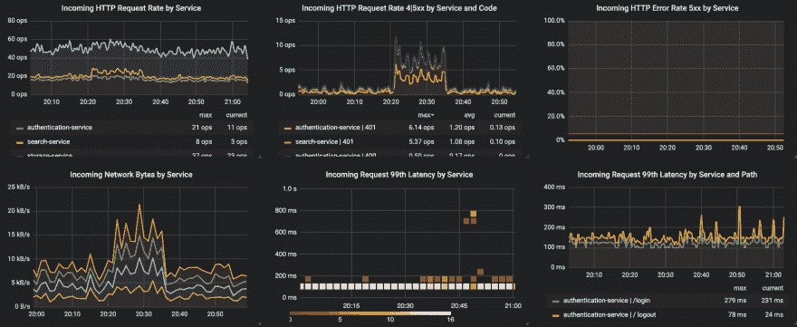
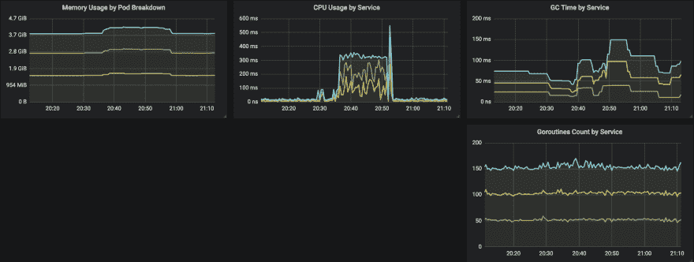
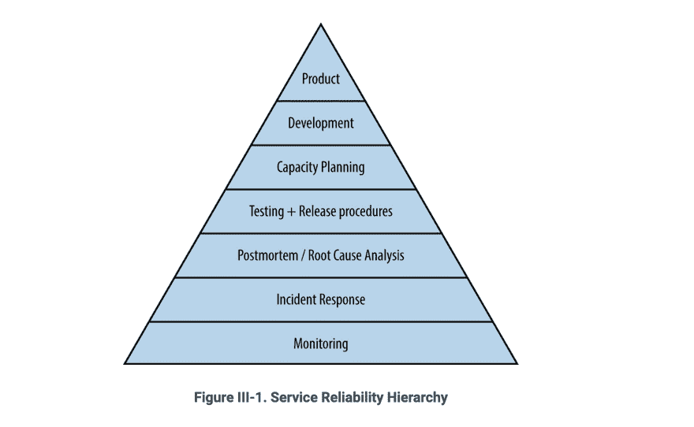

# 生产服务的最低限度监控

> 原文：<https://dev.to/rafaeljesus/minimal-monitoring-for-production-services-10nd>

本文将帮助您理解，如果您已经拥有或正在将一个新的服务引入生产环境，那么应该监视什么。

# 动机

监控使我们能够了解系统的健康状况，根据数据解决性能和可用性问题。我想提一下您现在需要监控的几个原因:

*   没有监控软件所有权是不可能的。
*   你不能说在发生中断时你的服务有多少可用性。
*   您不知道您的服务是否会随着时间的推移而变慢，也不知道为什么会这样。是内存高还是依赖影响了您的服务？或者是你的服务依赖的一个依赖？
*   可能需要几个月甚至几年的时间来调查为什么你的一部分客户会从你的网站上注销，为什么他们不能在晚上列出他们的账户偏好等等。
*   在停机期间，工程师需要使用数据来做出决策，否则他们将不得不完全依赖周围最高级工程师的意见和感觉。
*   缺乏监控对于基础设施工程团队来说是一个巨大的反模式。

# 监控什么？

谷歌 SRE 的书定义了这个术语的四个黄金信号，即延迟、流量、错误和饱和度。

**出错率**:因为出错会立即影响客户。
**反应时间**:因为慢是新下来的。
**吞吐量**:流量有助于您了解错误率和延迟增加的背景。

饱和度&利用率:它告诉你的服务有多满。如果内存使用率为 95%，你的响应时间能保持稳定吗？进程:使用的线程、状态、运行和阻塞、磁盘 I/O 利用率。

# 怎么能监控？

Prometheus 是一个开源工具包，可以大规模地处理指标和警报。这是目前全球发展最快的基于指标的监控系统。

主机指标(CPU、内存、网络和磁盘 I/O 以及进程)通常可以在 linux 上通过 [procfs](https://en.wikipedia.org/wiki/Procfs) 获得，它们可以通过[node _ exporter](https://github.com/prometheus/node_exporter)Prometheus integration 收集。普罗米修斯通过在各自的主机上调用`/metrics`端点来设法清除他们的目标。

http 吞吐量、错误和响应时间指标可以由 prometheus [客户端库](https://prometheus.io/docs/instrumenting/clientlibs)进行检测。我强烈建议看看谷歌的[公开人口普查](https://opencensus.io)项目。它是一个库的集合，收集服务的度量和分布式跟踪。每当 http 请求到达您的服务端点或您的服务执行传出请求时，都会生成现成的指标和跟踪，这太神奇了。最后但同样重要的是，您可以同时导出多个后端的指标和跟踪。

# 要警惕什么？

有效的预警很难得到，绝对不是一件容易的事情。工程团队必须确保足够警觉，以意识到监控系统检测到的所有问题，同时注意潜在的过度噪声。

**什么时候预警？**

*   有东西坏了，需要有人马上修理它！

或者

*   有些东西可能很快就会坏掉，所以有人应该马上去看看。

理想情况下，应该在客户受到影响时发出警报。对于在线服务，即 HTTP API 服务器，在栈中尽可能高的位置警告类似`high response times`和`high error rates`的条件，例如:如果可能，使用来自负载平衡器而不是来自服务内部的指标，如果服务关闭，指标不会丢失。

对于容量，它们应该检测主机何时耗尽将导致停机的资源，例如:`DiskWillFillIn4Hours`、`SSLCertificateWillExpireIn2Days`等等。

避免就根本原因或低门槛呼叫随叫随到的工程师，仅举几个例子:`NodeCPUTooHigh`、`NodeMemoryTooHigh`、`ConnectionRefused`。取而代之的是描述症状，说出问题所在，而不是原因— `TooManySlowCustomersQueries`、`TooManyCustomersCheckoutErrors`，见下表:

| 症状 | 原因 |
| --- | --- |
| 太多 HTTP 500s 或 404 | tcp 连接超时，错误的反向代理配置 |
| 太多缓慢的 HTTP 查询 | 节点资源匮乏导致 CPU 过载 |

它还没有结束，警报应该链接到相关的仪表板和控制台，这些仪表板和控制台回答关于被警报的服务的基本问题。

# 写运行手册

通常，操作手册包含排除系统故障的步骤。它们应该链接到可以找到服务指标、日志和跟踪的仪表板。通过将操作手册附加到系统的每个警报来减少 MTTR(平均解决时间)。

# 结论

监控是生产需求层次的底层。这是在生产中运行服务的基本要求，没有它，服务所有者甚至无法判断服务是否在工作。

我推荐阅读[https://landing.google.com/sre/books](https://landing.google.com/sre/books)

我希望你喜欢，谢谢！