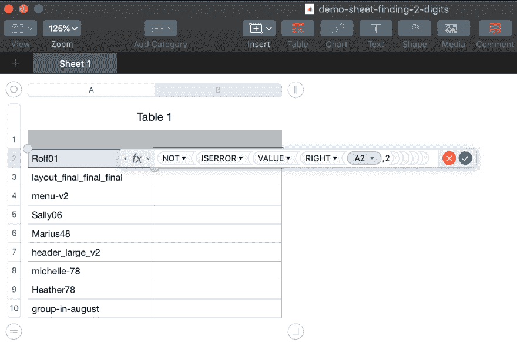
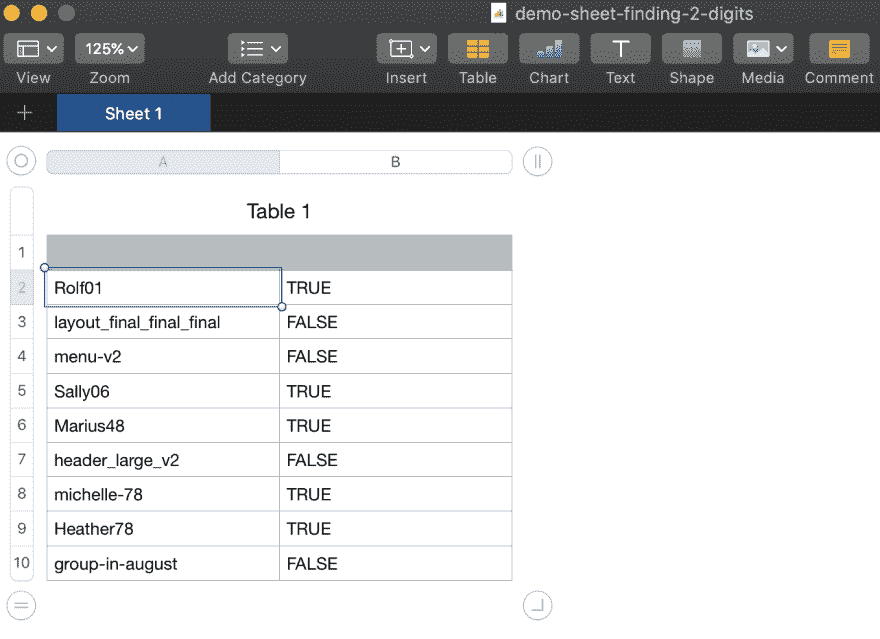
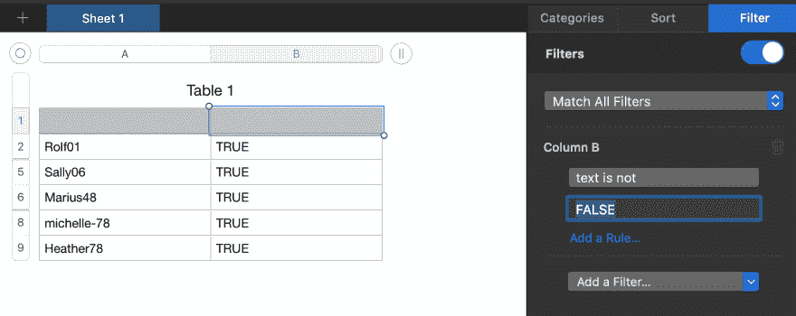
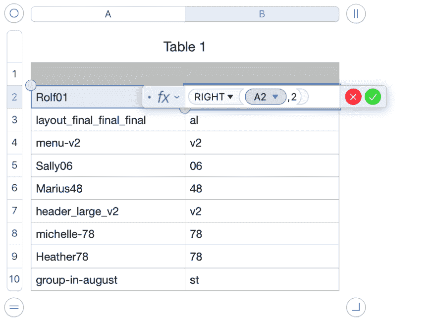
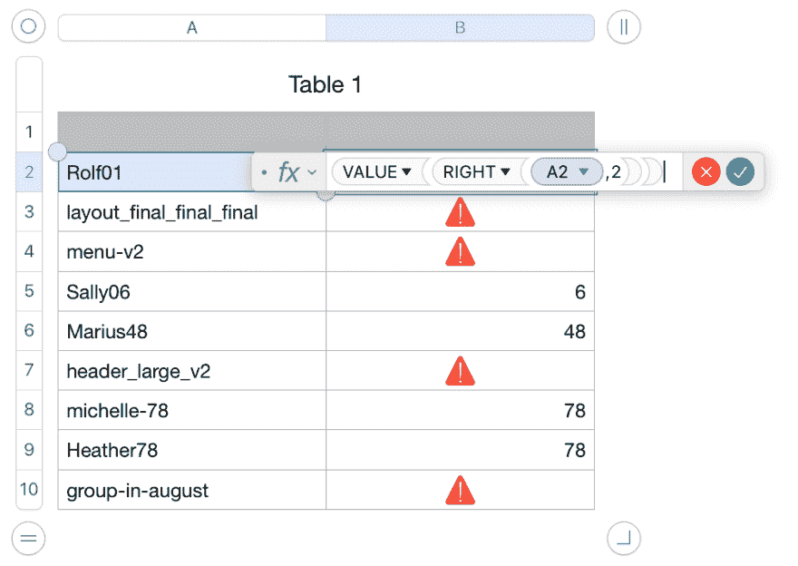
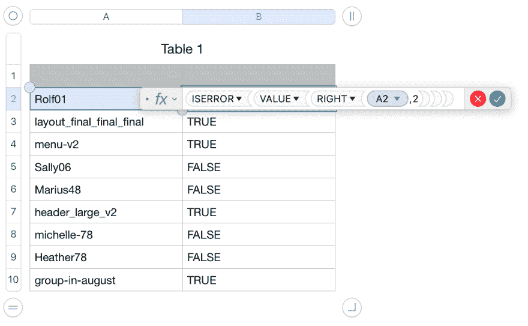
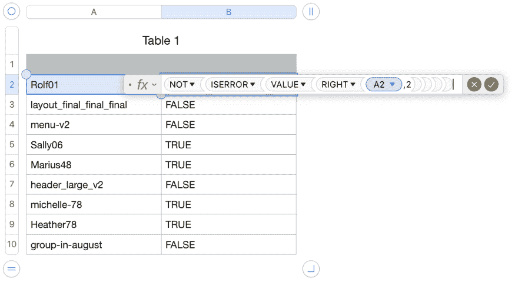
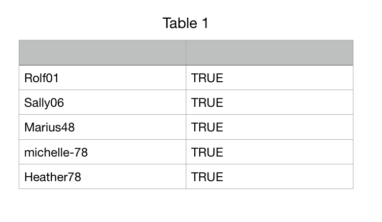

# 在 Numbers 电子表格中重新创建 Excel 的 ISNUMBER

> 原文：<https://dev.to/mmosley/recreating-excel-s-isnumber-in-a-numbers-spreadsheet-237i>

前几天，我必须检查一个. csv 文件中的一串字符串，并找出哪些字符串以两位数字结尾。

它们都是从有限的字符集创建的短字符串，包括英语字母表的所有字母、数字 0-9、破折号和下划线。比如:

*   Rolf01
*   布局 _ 最终 _ 最终 _ 最终
*   菜单-v2
*   莎莉 06
*   马里斯 48
*   header_large_v2
*   米歇尔-78
*   希思尔 78
*   八月组

我在 Numbers for Mac 中打开文件，完全打算用`ISNUMBER`来查找每个字符串的最后两个字符是否是数字。Excel 和 Google Sheets 都有这个功能。但事实证明，数字不会😬

### 公式和过滤器

在稍微研究了一下数字文档之后，我想到了一个替代方案。

我把这个公式放在一起，加到了 b 列。

`NOT(ISERROR(VALUE(RIGHT(A2,”2”))))`

如果最后两个字符是数字，则在单元格中打印出`TRUE`，如果最后两个字符不是数字，则打印出`FALSE`。

然后，使用 Numbers 的“组织”功能，我按 B 列过滤了工作表，其中的`text is not`为“假”。

这过滤掉了列`A`中的字符串不是以两位数字结尾的所有行。

### 公式如何工作

这个公式是关于`A`列字符串的一系列问题。问题从最内部的功能开始，然后向外延伸。

我的第一个问题是:A 列中字符串的最后两个字符是什么？作为一种功能:

`RIGHT(A2,”2”)`

该函数返回由单元格`A2`中字符串的*右*端的两个字符组成的新字符串。这是字符串中“最后两个”字符从左向右读的另一种说法。

一旦我有了这两个字符，我对函数的下两步提出的问题是“这两个字符是数字吗？”

`VALUE(RIGHT(A2,”2”))`

`VALUE`返回一个字符串的“数值”。这对于从包含货币符号的价格字符串中获取数字是很方便的。例如，它将从一个读为`$100`的字符串中返回`100`。

当字符串没有数字值时——例如，因为它是一串字母——`VALUE`函数将抛出一个错误。

所以在函数的这一点上，我用它来返回列`A`中字符串的最后 2 个字符的数值。

如果我停在这里，我会在字符串有数值的单元格中得到数字，在字符串没有数值的单元格中得到错误。

从技术上讲，这足以对工作表进行排序——我可以过滤掉 B 列的值不在 0 - 99 范围内的所有行。但是很乱。

为了保持整洁，我添加了一个检查功能，检查`VALUE`是否返回了一个错误。

`ISERROR(VALUE(RIGHT(A2,”2”)))`

如果其中的表达式返回错误，则`ISERROR`返回`TRUE`，如果其中的表达式不返回错误，则返回`FALSE`。

在这里，我要求它检查在`A2`中字符串的`RIGHT`末端的两个字符的数字`VALUE`是否返回一个错误。如果是，问题`ISERROR`用`TRUE`回答。

这就回答了我关于最后两个字符是否是数字的问题:`TRUE`表示在获取最后两个字符的数值时出现了错误，所以它们不是数字。`FALSE`表示获取它们的数值没有问题，所以它们是数字。

而且，这个答案足以组织我的工作表。我可以过滤掉该公式返回`TRUE`的行。

这是一个很好的简短公式，给出了我需要的答案，但我觉得公式的简洁妨碍了电子表格的清晰。

### 说是与真

因为我问这张纸的问题是“这个字符串是以两位数结尾的吗？”，用回车键`TRUE`回答“是”感觉比用`FALSE`回答“是”更好。

这就是公式的最后一部分:函数`NOT`。

`NOT(ISERROR(VALUE(RIGHT(A2,”2”))))`

在这里，当单元格`A2`中字符串的大多数字符`2` `RIGHT`的数字`VALUE`中存在`NOT`错误时，我要求公式说出`TRUE`。

每当字符串以两位数结尾时，这就给了我`TRUE`,如果不是，就给了我`FALSE`。

然后，当我组织工作表以过滤出答案为`FALSE`的所有行时，我得到了第`A`列中的字符串以两位数字结尾的所有行。

👍