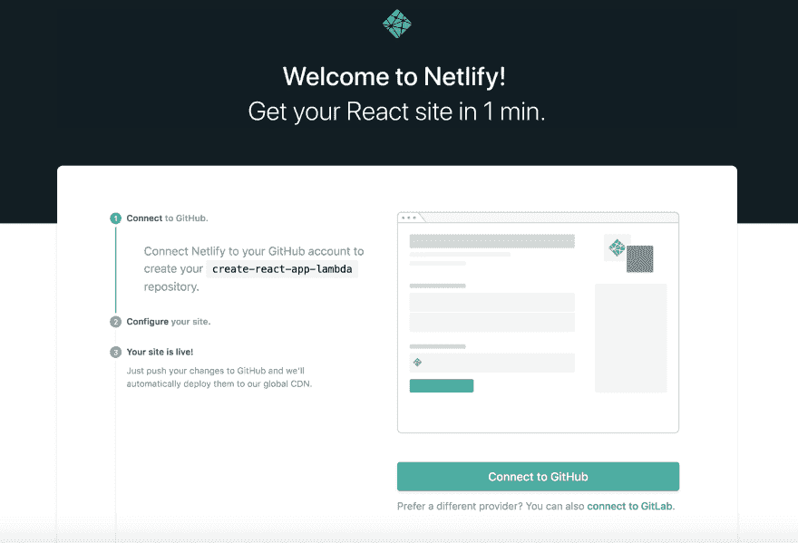
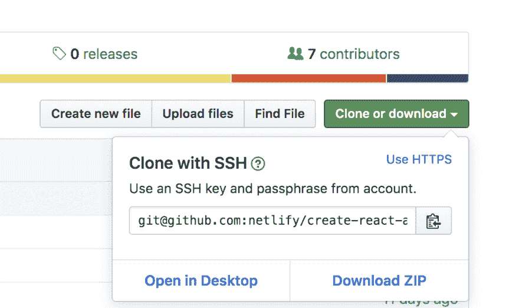

# 实习医生格蕾的解剖学 Lorem Ipsum 生成器教程

> 原文：<https://dev.to/m0nica/grey-s-anatomy-lorem-ipsum-generator-tutorial-1p3n>

本教程将介绍如何创建一个实习医生格蕾或其他主题的 Lorem Ipsum 生成器。我是《实习医生格蕾》(Grey's Anatomy)这部剧的超级粉丝，所以我早就应该制作一个以《实习医生格蕾》为主题的 Lorem Ipsum 生成器了。Lorem Ipsum 是生成的无意义文本，在设计和发布中用作占位符文本。传统上，Lorem Ipsum 是用拉丁语单词编写的，但也有一些变体涉及非拉丁语单词。

[](https://res.cloudinary.com/practicaldev/image/fetch/s--5Khc-hdx--/c_limit%2Cf_auto%2Cfl_progressive%2Cq_auto%2Cw_880/https://thepracticaldev.s3.amazonaws.com/i/ekb8qf4uciz0tsk8967y.png)

Grey ' s Anatomy Lorem Ipsum Generator 网站的实时版本可在此处查看，本教程的代码可在 Github 上查看
[。](https://github.com/M0nica/greys-anatomy-lorem-ipsum-generator/tree/loremIpsumTutorial)

以下是 Grey's Anatomy Lorem Ipsum 生成器生成的文本类型示例:

"真正的医院克里斯蒂娜·杨医生一个创伤外科医生一个糟糕的儿科主任乔治·埃利斯整形外科医生沙恩·罗斯医生大约是凯丽·托雷斯医生确切地说是伊兹·史蒂文斯医生伊兹整形外科主任麻醉师梅雷迪思的父亲佐拉西雅图埃里卡当然梅雷迪思医生沙恩·罗斯医生基本上是塔克可能是弗吉尼亚·迪克森医生无论谁是理查德·赛迪主任都非常好亚利桑那真正的非常科林·马洛·佐拉医生大部分事情泰迪·奥特曼而不是亚利桑那泰迪·奥特曼西雅图医生伊兹·史蒂文斯我的人"

上面的段落完全没有意义，但是如果你熟悉《实习医生格蕾》,里面有一些熟悉的术语。

## 要求

为了充分利用本教程，您应该:

*   熟悉 git 和 JavaScript
*   拥有 GitHub 或 GitLab 帐户(以便使用 Netlify 功能)。

## 目录

*   [设置](#set-up)
*   [验证设置](#verify-set-up)
*   [从 React 调用 Netlify 函数](#calling-the-netlify-function-from-react)
*   [添加 Lorem Ipsum 逻辑](#adding-lorem-ipsum-logic)
*   [方法论](#methodology)
*   [格式化响应](#formatting-response)
*   [展开](#deploy)

## 设置

为了快速启动这个项目，我使用了 Netlify 的[GitHub-Netlify/create-react-app-lambda](https://github.com/netlify/create-react-app-lambda)starter。Netlify 是一个专门托管 JAMstack 网站的托管服务，在撰写本教程时，它有一个非常全面的免费层，可以很好地将 GitHub 项目部署到万维网上。JAMstack 用于描述受 JavaScript、API 和标记影响的静态网站。你可以在这里了解更多关于什么是或者不是 JAMstack 的信息 [JAMstack | JavaScript、API 和标记](https://jamstack.org)，

`create-react-app-lambda`存储库将 Netlify 的功能与`create-react-app`集成在一起，这意味着您可以部署一个调用无服务器功能的 React 应用程序，您可能知道这就是 Amazon Web Services (AWS) Lambdas。这些函数可以进行异步调用和处理数据，但它们必须是无状态的，这意味着给定相同的输入，输出将是相同的。有了 Netlify，你可以在没有 AWS 账户的情况下部署和管理 AWS Lambda 的技术。你可以在 Netlify 上阅读更多关于无服务器 Lambda 函数的内容:[函数| Netlify](https://www.netlify.com/docs/functions/) 。

让我们从复制`create-react-app-lambda`开始。单击自述文件中的“部署到网络”按钮。
[](https://res.cloudinary.com/practicaldev/image/fetch/s--FxqzMvmE--/c_limit%2Cf_auto%2Cfl_progressive%2Cq_auto%2Cw_880/https://thepracticaldev.s3.amazonaws.com/i/ik1ue07vhfbcsqy0hldl.png)

这个一键式按钮允许我们设置 React + Netlify 功能，而不必做繁重的工作。实质上，当你点击这个按钮时，你在 Netlify 中创建了一个新的站点和一个连接的 GitHub 库。GitHub 存储库需要几分钟来填充文件，但是一旦填充完成，您应该可以访问 Netlify 并查看您的站点。如果你想更好地理解为什么事情在`create-react-lambda-app`中是这样设置的，那么看看[这个由王自如(swyx)制作的视频](https://www.youtube.com/watch?v=3ldSM98nCHI)了解更多的背景。

点击“部署到网络”按钮后，您应该会看到类似这样的内容:
[](https://res.cloudinary.com/practicaldev/image/fetch/s--ndFIX9O8--/c_limit%2Cf_auto%2Cfl_progressive%2Cq_auto%2Cw_880/https://thepracticaldev.s3.amazonaws.com/i/gqtabyzvj8rdm4kqudg5.png)

注意:自述文件中包含了与`create-react-lambda-app`项目交互的全面说明。我将强调与应用程序交互的最重要的部分，但鼓励探索自述文件以获取更多信息并进一步增强应用程序。

因此，一旦您在 Netlify 中创建的存储库被来自`create-react-app-lambda`的文件填充，您应该`git clone`repo。您要克隆的存储库应以您创建的存储库命名，即`git clone git@github.com:your_username/app-just-created`。在填充文件之前，您可能需要刷新存储库页面。
[T6】](https://res.cloudinary.com/practicaldev/image/fetch/s--17w9XO9I--/c_limit%2Cf_auto%2Cfl_progressive%2Cq_auto%2Cw_880/https://thepracticaldev.s3.amazonaws.com/i/9otr85x4yqqbtkgqgjnb.png)

一旦建立了项目，您应该`cd`进入项目目录并运行`yarn`来安装所有的依赖项。您可以运行`yarn test`来确保所有的测试都通过了，并且项目被正确地设置了。

网络功能应在`src/lambda`中创建。如果你在那个文件夹里找，有两个示例函数`async-dadjoke.js`和`hello.js`。对于我们的用例，我们不需要`async`函数，所以让我们看看`hello.js example`

在`hello.js`中，我们从事件中获取`queryStringParameters`以便记录它们。`queryStringParameters`可以通过`event.queryStringParameters`这样的事件或者`const {queryStringParameters} = event`这样的析构事件对象来访问。

```
export function handler(event, context, callback) {

  console.log(“queryStringParameters”, event.queryStringParameters)

  callback(null, {

    statusCode: 200,

    body: JSON.stringify({ msg: “Hello, World!” })

  })

} 
```

每个 Lambda 函数都有一个处理函数。这个处理函数可以接受事件、上下文和回调。该事件基于发出请求时端点收到的内容，可以包括 cookie 信息、标头、queryStringParameters 等内容。上下文对象提供了关于 Lambda 执行的额外洞察。你可以在这里的 AWS 文档中了解更多:
[node . js 中的 AWS Lambda 函数处理程序- AWS Lambda](https://docs.aws.amazon.com/lambda/latest/dg/nodejs-prog-model-handler.html)

## 验证设置

为了测试端点的功能，我们应该在我们刚刚克隆的目录中运行`yarn start:lambda`，它将运行所有的 Lambda 函数。然后你可以访问`http://localhost:9000/hello`或`/`，不管你的函数叫什么名字。在这个页面上，您应该看到:`{“msg”:”Hello, World!”}`，因为这是端点响应的主体。

## 从 React 调用 Netlify 函数

接下来，我建议定制项目中的命名约定，以更好地满足您的需求。我将`hello`重命名为`generate-lorem-ipsum`，所以首先我将`hello.js`文件重命名为`generate-lorem-ipsum`，然后在`app.js`的`LambdaDemo`组件中，我将按钮点击时对`hello`的调用替换为`generate-lorem-ipsum`。我还删除了与`async-dadjoke`相关的按钮和相关文件。所以我从

```
<button onClick={this.handleClick("hello")}>{loading ? "Loading..." : "Call Lambda"}
</button>

<button onClick={this.handleClick("async-dadjoke")}>{loading ? "Loading..." : "Call Async Lambda"}
</button> 
```

致:

```
<button onClick={this.handleClick("generate-lorem-ipsum")} className=“button”>
            {loading ? “Loading…” : “Generate Lorem Ipsum”}
</button> 
```

按钮在点击时调用 Netlify 函数，你可以查看`handleClick for more information`当你点击按钮时发生了什么，最初它返回 loading 作为状态，然后最终返回 response.msg。

注意:我在`App.js`中更新了对`LambdaDemo()`到`LambdaCall()`的引用，因为现在是表演时间！

为了检查 lambda 是否仍在被调用并返回响应，您应该运行`yarn start`(而`yarn start:lambda`正在另一个终端窗口中运行)。你应该能够访问 [http://localhost:3000](http://localhost:3000) 并看到 React 应用程序带有一个“生成 Lorem Ipsum”按钮。如果你点击“hello world ”,按钮下方的网站上会出现“hello world”字样。

## 添加逻辑逻辑

所以现在我们需要编辑`generate-lorem-ipsum.js`文件，使它返回 Lorem Ipsum 而不是“Hello World”。我们将通过在`words.js`中创建术语词库和在`generate-lorem-ipsum.js`文件中创建以下函数来实现这一点:
`handler()`
`generateLoremIpsum()`
`generateWords()`
`generateParagraphs()`
`getRandomInt()`

`handler()`是文件的入口点，因此任何需要执行的函数要么在`handler()`中调用，要么由`handler()`调用的函数调用。首先，我们析构事件以获得`queryStringParameters`。

例如，如果有人用下面的查询字符串参数
`/generate-lorem-ipsum?paragraphs=4&words=0`调用我们的端点

然后，我们将分解事件对象，以确定端点被请求返回 4 个段落和 0 个单词。

```
const event = {
queryStringParameters: {
paragraphs: “4”,
words: “0”
}
}; 
```

处理程序将调用一个函数`generateLoremIpsum`来实际处理文本的生成，它接受是否应该返回多个段落或者仅仅是单词。默认情况下，如果没有`queryStringParameters`，它将返回 4 个生成的段落。

`handler()`可能看起来像这样:

```
export function handler(event, context, callback) {
  const { queryStringParameters } = event;
  const { paragraphs = 0, words = 0 } = queryStringParameters;

  let isParagraph = Boolean(paragraphs);
  let count;

  if (paragraphs > 1) {
    count = paragraphs;
  } else if (words > 0) {
    count = words;
  } else {
    isParagraph = true;
    count = 4;
  }

  let response;
  try {
    response = isParagraph
      ? generateLoremIpsum(isParagraph, count).join("  ")
      : generateLoremIpsum(isParagraph, count);
  } catch (error) {
    console.log(error);
  }

  callback(null, {
    statusCode: 200,
    body: JSON.stringify({ msg: response })
  });
} 
```

在这个例子中,`generateLoremIpsum()`是一个由`handler()`调用的函数，它被用作一个岔路口，根据`isParagraph`是真还是假来决定是应该生成多个段落还是只生成一个段落。

```
export function generateLoremIpsum(isParagraph, count) {
  if (isParagraph) {
    console.log(`Trying to construct ${count} paragraphs`);
    return generateParagraphs(count);
  } else {
    console.log(`Trying to return ${count} words`);
    return generateWords(count);
  }
} 
```

如果我们正在生成一个单独的段落，那么`generateWords()`将被直接调用。这个函数创建了一个随机单词的数组(基于获取一个随机数并将该索引处的单词添加到数组中，直到我们到达期望的`wordCount`。一旦我们有了所有的单词，为了格式化这些单词，这些单词被格式化成类似`const formattedWords = <p>${words.join(" ")}</p>`的格式，以便稍后能够容易地将函数的响应转换成 HTML 段落。

```
export function generateWords(wordCount) {
  let words = [];
  console.log(wordCount);

  for (var i = 0; i < wordCount; i++) {
    words.push(WORDS[getRandomInt()]);
  }
  const formattedWords = `<p>${words.join("  ")}</p>`;

  return formattedWords;
} 
```

`generateWords()`函数中的随机 int 通过以下函数计算:

```
export function getRandomInt() {
  return Math.floor(Math.random() * Math.floor(WORDS.length));
} 
```

在我们生成段落的情况下，我们需要函数`generateParagraphs()`。这个函数将生成 50 个单词的 X 个段落，直到它达到 paragraphCount。它通过调用函数`generateWords()`X 次来实现，其中 X 等于传入的`paragraphCount`。

```
export function generateParagraphs(paragraphCount) {
  let paragraphs = [];
  for (var I = 0; I < paragraphCount; I++) {
    paragraphs.push(generateWords(50));
  }
  return paragraphs;
} 
```

为了让以上任何一条发挥作用，我们需要一个词库。在`generate-lorem-ipsum.js`的顶部我们应该`import { WORDS } from "./words";`然后在同一个目录下创建一个名为`words.js`的文件。在`words.js`中，我们将创建一个名为`WORDS`的数组，并将其导出，以便其他函数可以读取它。

我创建了一个只包含填充词(`fillerWords`)的数组和另一个包含 Grey 的解剖学和医学术语(`greysAnatomyWords`)的数组。
使用 ES6 扩展运算符将数组合并为一个。`export const WORDS = […greysAntomyWords, …fillerWords];`

完整的文件应该类似于:

```
const greysAnatomyWords = ["Meredith Grey", "Shonda Rhimes", "Epi", "Cardio"];

const fillerWords = [
  "actual",
  "actually",
  "amazing"
];

export const WORDS = […greysAntomyWords, …fillerWords]; 
```

## 方法论

在一个成熟的项目中，我们需要很多单词，否则会太重复。如果你想创建另一种类型的主题 Lorem Ipsum，那么你可以用你选择的主题中的单词替换`greysAnatomyWords`。

对于《实习医生格蕾》中的单词，我进行了头脑风暴，也找到了一些列表，比如《实习医生格蕾》中的婴儿命名文章,我可以重新利用这些列表。清理数据并格式化成有效的 JSON 的过程可能有点乏味，我确实在可能的地方找到并替换了格式，并根据需要进行了一些手动更新。这允许我用最少的努力获得尽可能多的数据(例如，自动抓取术语)。我最终为我的生成器准备了大约 140 个术语，但是如果我需要一个更大的数据集，那么考虑开发一个像 BeautifulSoup 或 Selenium 这样的工具来自动抓取数据源并将数据保存到一个有效的 JS 文件中可能是有意义的。

注意:根据数据的重复程度，可以创建映射或过滤器来确保单词数组只有唯一的值。

我决定添加填充词，这样生成的 Lorem Ipsum 文本除了主题外，还会有动词和副词的健康组合。我用谷歌搜索填充文本，找到了一个存储库，在那里我复制了来自 [fillers_data.txt](https://github.com/words/fillers/blob/master/data.txt) 的“填充词”。

现在，如果您运行`yarn start:lambda`并访问`http://localhost:9000/generate-lorem-ipsum/`，您应该会看到返回的 lorem ipsum 的 4 个生成段落。它应该看起来像:

```
“msg”:”<p>especially surgicial mostly try hospital anyway Seattle Dr. Lucy Fields Alex a trauma surgical fellow Dr. Mark Sloan my person heavily wherever Theodora Duquette Dr. Virginia Dixon cried a nurse a neurosurgeon really Margaret Dr. Mark Sloan Dr. April Kepner Meredith’s father literally Dr. Alex Karev Dr. Izzie Stevens an anesthesiologist Denny much necessarily Surgery a trauma surgical fellow surely hardly Owen rather Shepherd totally cried chief of pediatric surgery Theodora Dr. Robert Stark Olivia an anesthesiologist get her up to CT actually Cristina Dr. Finn Dandridge</p> <p>Tucker Virginia Callie Torres mostly hardly Maggie Maggie get her up to CT hardly get him up to CT quite stuff Dr. Mark Sloan whenever Dr. Richard Webber try George amazing Dr. Sydney Heron Dr. Jackson Avery actual quite nicely Richard stuff might Dr. Owen Hunt get her up to CT orthopedics Yang obviously mostly intubate her wherever orthopedic surgeon typically Margaret Karev effectively Alex Dr. Mark Sloan Seattle Dr. Alex Karev push one of epi try practically Dr. Alex Karev intubate him so</p> <p>start significantly start fairly get him up to CT slightly Dr. Alex Karev chief of plastic surgery slightly Dr. Robert Stark Meredith’s mother Norman actually completely Izzie Dr. Mark Sloan particularly Alex basically Adele clearly like usually Seattle Dr. Alex Karev typically chief of plastic surgery get him up to CT essentially ultimately my person exactly Norman specifically Virginia effectively O’Malley intubate her Virginia Tucker my person a surgery resident largely most a veterinarian basically she’s in V-Fib try simply Seattle</p> <p>heavily Dr. Callie Torres essentially Dr. Jackson Avery whoever a nurse Dr. Mark Sloan definitely my person Olivia Harper Dr. Alex Karev essentially approximately generally my person exactly Dr. Miranda Bailey Dr. Preston Burke right a plastic surgeon Norman Theodora basically a cardiac surgeon chief of plastic surgery chief of plastic surgery essentially Dr. Jackson Avery Tyler Christian much seriously Meredith’s mother slightly easily Mark my person maybe Mercy West Alex Erica Derek certainly badly rather hospital Denny Dr. Norman Shales Dr. Lexie Grey significantly Dr. Jackson Avery</p>” 
```

## 格式化响应

这个文本块还没有格式化，但我们会在 React 应用程序中担心这个问题。所以让我们切换回`app.js`。我们已经在打印消息了，如果你运行`yarn start`并转到`localhost:3000`，你会看到与我们刚刚看到的相同的正文。让我们使用一个库将响应格式化为实际的 HTML。

我们将使用“html-react-parser”包。它可以通过运行`yarn add html-react-parser`来安装，然后将这个`import parse from “html-react-parser”;`添加到您的`app.js`文件的顶部，以便导入它。让我们用`{msg && parse(msg)}`代替`msg`，而不是仅仅返回`LambdaCall`中的`msg`。这意味着解析`msg`的 HTML 并在有`msg`时返回它。

教程的这一部分是选择你自己的冒险。设置 Lorem Ipsum 文本生成逻辑后。我继续美化这个网站，让它看起来比标准的样板文件更个性化。我使用的工具之一是这个[花式按钮生成器](http://buttonoptimizer.com/)。我建议尝试一下 CSS，直到它符合你想要的审美。

### 部署

由于 Netlify 的持续部署，如果您在第一步中单击了“部署到 Netlify”按钮，那么一旦您将更改合并到项目存储库的主分支中，您的网站将被部署到 Netlify。此外，如果您打开一个拉取请求，Netlify 将生成一个预览。这应该反映了你在本地运行网站时所看到的。

最终的代码可以在[greys-anatomy-lorem-ipsum-generator](https://github.com/M0nica/greys-anatomy-lorem-ipsum-generator/tree/loremIpsumTutorial)库的`loremIpsumTutorial`分支上查看。

如果在阅读完本教程后，你最终创建了一个 Lorem Ipsum 生成器或其他具有 Netlify 功能的应用程序，请在 Twitter 上与我分享。