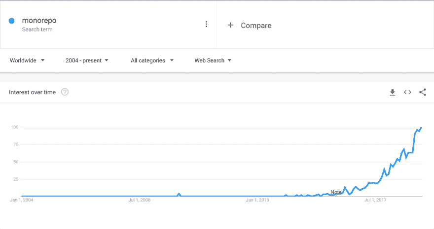
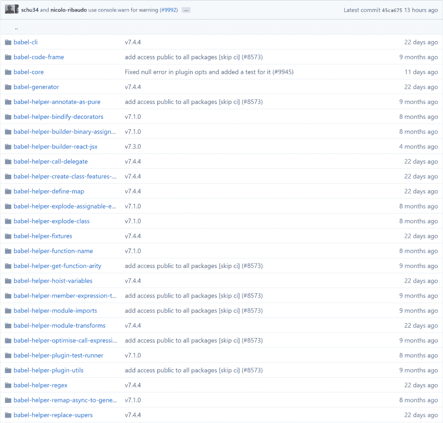

# monorepo 开发的要点

> 原文：<https://dev.to/ovidiubute/essentials-of-monorepo-development-26hf>

monorepo 这个词是由希腊语单词*中的 *mono* 和单词 repository 的缩写组成的。一个简单的概念，如果逐字逐句:**一个孤独的仓库**。这个领域是软件工程，所以我们指的是源代码、多媒体资产、二进制文件等等的家。但这一定义只是冰山一角，因为实际上的单一回购远不止**这么简单。***

在本文中，我计划提炼出将您公司拥有的每一段代码放在同一个存储库中的利弊。最后，你应该对为什么你应该考虑这样工作有一个好的想法，你将面临什么挑战，它将解决什么问题，以及你需要在它上面投资多少。

 
自 2004 年以来，对术语*单一回购*的相对兴趣，来源:谷歌趋势

从上面的图表中可以看出，这个词本身看起来就像 2017 年一样新。然而，认为以前没有人会把他们所有的代码存储在一个地方是错误的。事实上，在我 2009 年的第一份工作中，我工作的公司将每个项目都存储在一个 SVN 库中，每个项目一个目录。事实上，你可以追溯到更早的时候。但是，我们如何解释最近的爆炸性流行呢？

现实情况是，将代码存储在单个位置并不是主要卖点。在过去的几年里，主要的科技公司——谷歌、脸书或 Dropbox 都在展示他们在同一个存储库中大规模合作的方式。成千上万的工程师在一个存储库中合作的组织是一个令人敬畏的景象。也是一个工程难题。事实上是如此的困难，以至于这些公司投入了大量的资金来开发工具和系统，以使开发人员能够高效地工作。这些系统反过来解决了你可能都没有意识到的问题。这就是科技讲座中让人着迷的地方。这是自 2017 年以来推动搜索的因素。

*   在谷歌做前端开发，Alex Eagle:[https://medium . com/@ Jakeherringbone/you-too-can-love-the-mono repo-d 95 D1 D6 fcebe](https://medium.com/@Jakeherringbone/you-too-can-love-the-monorepo-d95d1d6fcebe)
*   谷歌单一回购演示，瑞秋·波特温:[https://www.youtube.com/watch?v=W71BTkUbdqE](https://www.youtube.com/watch?v=W71BTkUbdqE)
*   将 Mercurial 扩展到脸书代码库的规模，Durham Goode:[https://code . FB . com/core-data/scaling-Mercurial-at-Facebook/](https://code.fb.com/core-data/scaling-mercurial-at-facebook/)

我已经确定了谷歌或脸书审查过的 monorepo 提供的一些核心功能。这当然不是一个详尽的列表，但它是一个很好的起点。当讨论这些问题时，我考虑了没有它们生活会是什么样子，它们到底能解决什么问题。当然，在我们的工作领域，一切都是交易，没有什么是免费的。对于我列出的每一个专业人士，有人会发现与我直接矛盾的用例，但我对此没意见🙂。

## 所有的代码，不管是什么语言，都位于一个库中

将所有内容存储在一个地方的第一个优势可能不会立即显现出来，但是作为一名开发人员，能够自由地浏览所有内容是非常重要的。它有助于培养一种团队精神，也是一种非常有价值和廉价的信息传播方式。你有没有问过自己公司正在开发什么项目？前世今生？好奇某个团队在搞什么？他们是如何解决一个特殊的工程问题的？他们是如何编写单元测试的？

与单一回购直接相反，我们有多回购结构。每个项目或模块都有自己独立的空间。在这样的系统中，开发人员可能会花费相当多的时间来获得我上面列出的问题的答案。这项工作的分布性意味着没有单一的信息来源可以订阅。

在我的列表中，有一些公司通过仅遵循这一功能，从多回购布局过渡到了单回购布局。不过，这种结构不应该与本文的主题混淆。我把它定义为一个**并置多报告**。是的，所有的东西都在一个地方，但是这个列表中的其他特性要有趣得多。

## 你能够以一种可控和明确的方式组织模块之间的依赖关系

传统的、久经考验的处理依赖性的方法是将版本从持续集成系统发布到一个单独的存储系统，或者甚至从开发机器手动发布。这些都被版本化(或标记)以便于以后搜索。现在，在多报告设置中，每个项目都有一组对外部来源(第三方)或内部来源的依赖关系，例如，从同一公司内部发布。

为了让一个团队依赖另一个团队的代码，所有东西都需要通过依赖管理存储系统。例如 npm、MavenCentral 或 PyPi。我前面说过，只需将所有内容存储在一个地方，就可以轻松构建并置的 multirepo。这样的系统是间接可观测的。让我们来看看为什么这很重要。

作为开发人员，我们在阅读和编写代码上的时间分配非常不均衡。现在想象一下，必须调试一个根源在依赖关系内部的问题。我们可以在这里排除第三方，因为这是一个困难的问题。不，这个问题发生在贵公司另一个团队发布的包中。如果您的项目依赖于最新版本，那么您很幸运！只需导航到相应的目录，然后喝杯咖啡。

> 的确，花在阅读和写作上的时间比远远超过 10 比 1。作为编写新代码工作的一部分，我们不断地阅读旧代码。…[因此，]让它易于阅读会让它更易于书写。”
> ――罗伯特·c·马丁，《干净的代码:敏捷软件工艺手册》

不过更常见的是，您可能会依赖于旧版本。那你现在做什么？你试过用你的 VCS 通读旧代码吗？你会尝试阅读实际的工件而不是原始代码吗？如果它被缩小了呢，就像 JavaScript 通常的情况一样？

例如，与谷歌的系统形成对比——因为代码依赖是直接的，就像，本质上在任何地方都没有版本，可以说系统是**可直接观察到的**。你看到的代码几乎就是你的整个世界。我说主要是因为当然总会有一些小的例外，比如禁止你托管自己的外部依赖。但这不应该影响我们的讨论。

* * *

当我们谈到依赖性管理的话题时，我们应该触及限制的话题。想象一下，在一个项目中，您能够依赖于您需要的任何源文件。没有什么是不受限制的，你可以进口任何东西。对于那些至少在 10 年前开始职业生涯的人来说，这听起来像是当时一切如常。这是一个几乎完整的关于独石的定义。

这个名字意味着宏伟，规模，但更重要的是，独特。实际上，monolith 内部的每个源文件都不能存在于它之外。这里有一个与我们的讨论相关的基本原因:你没有一个明确的、可审计的方法来管理 monolith 内部的依赖关系。什么都是待价而沽，感觉又免费又便宜。因此，开发人员自然会创建一个复杂的导入和包含图。

如今，几乎每个人都在做微服务，这是毫无疑问的。如果有足够的规模，代码库就会变成一头野兽，因为所有的东西都不可避免地相互联系在一起。我确信许多开发人员会提出反驳，认为 monoliths 可以用一种干净、合理的方式进行管理，而不会落入这个陷阱。但是例外只是加强了最初的陈述。微服务通过定义明确的边界和责任来解决这一问题，monorepo 是这一理念的自然延伸。通常，模块提供一组公共导出，或 API，其他模块只能将它们作为合同的一部分使用。

## 软件模块复用公共基础设施

这是一个我非常关心的话题。我将在这个上下文中定义基础设施，即软件代码库，作为确保生产力和代码质量的必要工具。

我认为把你的公司押在 multirepos 上是一个错误的原因之一，与任何软件工程项目都应该满足的一系列基本要求有关:

*   一个能够可靠地生产可交付工件的构建系统。
*   一种运行自动化测试的方法。
*   一种静态分析代码中常见错误、潜在 bug 和实施最佳实践的方法。
*   一种安装和管理第三方依赖项(即贵公司外部的软件模块)的方式。

如果您将代码分割在多个存储库中，那么您需要在任何地方复制这项工作。不要低估这涉及到的工作量！上面列出的所有特性至少需要一组配置文件，这些文件需要永久维护。将它们复制到两个以上的地方，基本上保证了你总是会产生技术债务。

我知道一些公司竭尽全力将此事的影响最小化。他们将把自己的配置捆绑成脚手架(类似 create-react-app 或 yeoman)，并使用它们来建立新的存储库。但是正如我们在这一节之前看到的，没有办法强制每个人都使用这些样板文件依赖项的最新版本！在大型代码库中，单独升级每个存储库所花费的时间呈线性增长。给定足够的规模，实际上一个内部包的所有发布版本将同时被依赖！

有一句名言我非常喜欢，它与这个难题有关:

> 在规模上，统计数字不是你的朋友。任何东西的实例越多，其中一个或多个破裂的可能性就越大。可能是同时。——安妮·居里

如果你认为分布式系统仅仅指 web 服务，我不同意。你的代码库是一个相互联系的活系统。成千上万的工程师每天都在争分夺秒地将他们的代码投入生产，同时努力保持绿色构建和代码质量。如果有的话，对我来说，这听起来比一套微服务更可怕😁

## 变化总是反映在整个存储库中

这高度依赖于其余的特性。这是通过示例更容易理解的好处之一。

假设我在一家为全球客户构建 web 应用程序的公司工作。一切都被组织成模块，下面通过流行的开源项目 Babel 举例说明。在这家公司，我们都使用 ReactJS 进行前端工作，出于纯粹的巧合，我们所有的项目都使用相同版本的 react js。

 
巴别塔的万千模块:【https://github.com/babel/babel/tree/master/packages】T4

但是脸书的人发布了 React 的最新版本，我们意识到升级到它并不容易。为了提高效率，我们构建了一个可重用组件库，作为一个独立的模块。所有项目都依赖于它。这个新的 React 版本带来了许多影响它的突破性变化。我们有哪些升级选项？

这通常是 monorepo 的对手会否决整个概念的地方。很容易说，我们已经把自己逼到了一个角落，在这种情况下，多重回购结构将是一个更好的选择。事实上，在后一种情况下，我们要做的只是在我们的项目中一个接一个地逐步采用新的 React 版本，在此之前对我们的核心组件模块进行重大版本升级。

但我要说，这带来的问题比解决的问题还多。核心依赖破坏变更发布会在您的工程团队中造成分裂。您现在有两个核心需要维护:一个是新的，由几个勇敢的团队在几个项目中使用，另一个是旧的，仍然被几乎整个公司依赖。

让我们把这个问题放在更大的范围内进一步分析。我们公司可能有一些项目仍在生产中，但只是处于维护模式，没有任何活跃的开发团队分配给他们。这些项目可能是最后一批迁移的项目，延长了您同时在两个内核上工作的时间窗口。旧版本仍然会收到错误或安全修复，即使它已被否决，因为你不能拿你的客户的业务冒险。

所有这些都是在说，多回购解决方案促进并实现了技术债务的持续状态。有许多正在进行的迁移、依赖于其他模块的旧版本的模块，以及许多许多可能强制执行也可能不强制执行的弃用策略。

现在让我们考虑 React 升级问题的替代解决方案。通过将所有代码放在一个地方，并且直接相互依赖，没有版本控制，我们只剩下一个选择:我们必须在所有模块中同时做所有的前期工作。

如果这听起来像一个可怕的提议，我不怪你。一开始，想想就很可怕。然而，优势是显而易见的:没有迁移，没有技术债务，对我们的代码库状态的混淆更少。实际上，这种解决方案有一个需要克服的障碍——可能有数百、数千或数百万行代码需要一次全部更改。通过拥有独立的项目，我们可以一件一件地做，从而避免了大量的工作。变化的总量还是一样的，但是我们很自然地倾向于认为随着时间的推移会比一次性完成更容易。

为了解决这最后一个问题，大公司已经求助于**code MODS**——可以大规模运行的源代码的程序化转换。如果您感兴趣，有许多教程，但其要点是——您编写的代码首先检测源代码中的某些模式，然后对其应用特定的更改。以 React 为例，您可以编写一个 codemod，用一个新的 API 替换一个过时的 API，甚至在必要时应用逻辑更改。事实上，这就是脸书建议你从他们图书馆的一个版本迁移到下一个版本的方法。这是他们内部的做法。查看他们的开源示例。

从这个角度来看，迁移似乎没有以前那么可怕了。您预先做了所有的研究，您定义了您想要如何从根本上重写受影响的代码，并或多或少地一次应用这些更改。对我来说，这是一个稳健的解决方案。我见过它的行动，这是可以做到的。当它起作用的时候确实令人惊奇，最近越来越多的公司采用它。

## 弊端

古老的谚语*“天下没有免费的午餐”*当然也适用于此。我已经谈了很多优点，但是有一些缺点你需要考虑。

鉴于大家都在同一个地方工作，一切都是互联的，**测试**成为整个系统的血液。在没有自动化测试安全网的情况下，试图做出可能影响数千行(或者更多)代码的改变是不可能的。

为什么这与传统的存储代码的方式有什么不同呢？我认为版本化的模块隐藏了这个特殊的问题，代价是产生了技术债务。如果你拥有一个依赖于另一个团队代码的模块，通过严格的版本号，那么你负责升级它。如果您没有足够的测试覆盖率，那么您将会犯谨慎的错误，简单地延迟升级，直到您确信该模块不会影响您自己的项目。正如我们之前所讨论的，这有严重的长期后果，但它仍然是一个可行的策略。尤其是如果你的企业实际上并没有促进长期项目。

我们提到了每个贡献者能够访问组织中所有源代码的好处。如果我们颠倒一下，这对于某些类型的工作来说也是一个问题。没有简单的方法可以限制对项目的访问。如果您考虑政府或军事合同，这一点很重要，因为它们通常有严格的安全要求。

最后，让我们考虑持续集成。您可能使用诸如 Jenkins、Travis 或 CircleCI 这样的系统来管理代码测试和交付给客户的方式。当您有多个存储库时，通常会为每个存储库设置一个管道。一些团队甚至走得更远，每个项目都有一个专门的 CI 实例。这是一个灵活的系统，可以适应每个团队的需求。您的计费团队可能每周部署一次产品，而您的 web 团队可能会移动得更快，一天部署多次。

如果您正在考虑转向 monorepo，请警惕您的 CI 系统的功能。它需要做大量的工作。简单的任务，比如检查代码，或者构建一个工件，可能会变成影响生产力的长时间运行的任务。Google 开发并运行了自己的定制 CI 解决方案，这是有充分理由的。市场上没有足够好的产品。

现在，在你断定这是一个拦截器之前，我建议你仔细分析你的项目和你使用的工具。例如，如果您正在使用 git，那么有一种说法是它不能处理大型存储库。这显然是不准确的，最好的例子就是最初启发 git 的项目 Linux 内核。

做自己的研究，看看你有多少文件和代码行，并尝试预测你的项目将增长多少。如果你没有接近内核的规模，那么你就没问题。你也可以指出 git 不太擅长存储二进制文件。LFS 的目标就是解决这个问题。您还可以重写历史，删除旧的二进制文件，以优化性能。

同样，开源 CI 系统比你想象的要强大得多。例如，Jenkins 可以扩展到数百个工作、数十名员工，并且可以轻松满足大型团队的需求。它能做 Google scale 吗？绝对不行！但是你有几万个工程师天天推着生产吗？这些工具停止执行的平台是如此之高，以至于不值得考虑，直到你接近它。很有可能，当你接近的时候你会知道。

最后还有**成本**。你至少需要一个专门的团队来完成这件事。因为工作量肯定不是微不足道的，它需要激情和专注。这个团队将需要，我只是在这里总结一下，构建并永久维护本质上是存储代码、资产、构建工件、用于运行测试或静态分析的可重用开发基础设施的平台，以及能够承受大量工作负载和流量的 CI 系统。如果这听起来很可怕，那是因为它确实很可怕。但是说服开发人员加入这样的团队不会有任何问题，这种经验很难通过在家做兼职项目来积累。

## 在关闭

我已经谈到了在单一回购中工作的诸多优势、缺点，并提到了成本。这种设置并不适合所有人。我不鼓励你在没有准确评估你的问题和业务需求的情况下尝试它。当然，在做决定之前，要仔细考虑所有可能的选择。