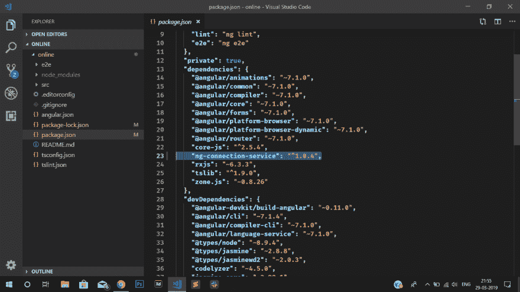
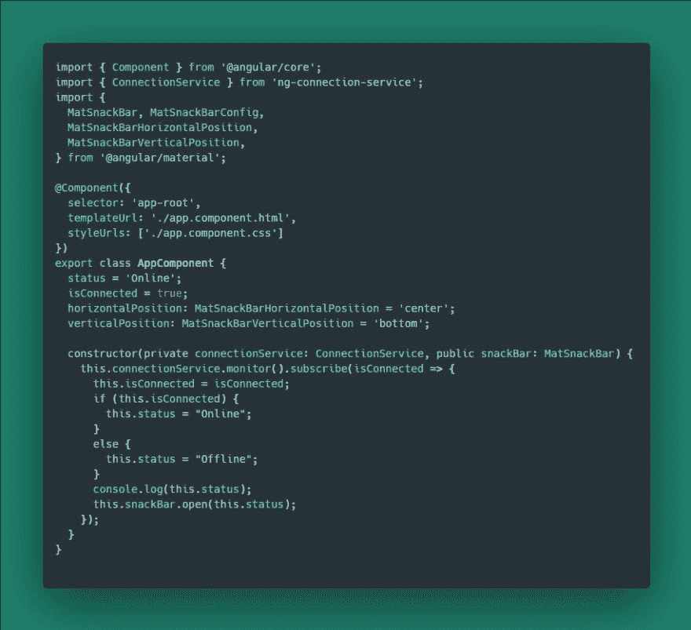
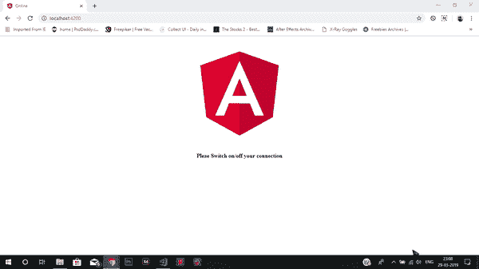

# 在一分钟内使用 Snackbar 在 Angular 中检查用户是否在线/离线！

> 原文：<https://dev.to/devam_mahajan/check-user-is-online-offline-using-snackbar-in-angular-in-a-minute-3eh3>

这是一个小而简单的 Angular 应用程序，使用 Angular material 来检查用户是否连接到互联网！

首先你必须安装一个名为 ng-connection-service 的软件包。让我们看看如何做到这一点。

使用 CLI 创建新的角度应用程序

*ng 新上线*

使用以下命令从 CLI 在应用程序中安装 ng-connection-service 包:

*npm 安装 ng-连接-服务-保存*

一旦你完成了这个过程，请检查你的 package.json 是否被添加

您应该会看到下图，

现在，是时候使用 CLI 将角度材质安装到项目中了

*安装-保存@ angular/material @ angular/CDK @ angular/animations*

现在，将其导入 app.component.ts，如下所示:

*从“@angular/material”导入{MatSnackBar，MatSnackBarConfig，MatSnackBarHorizontalPosition，MatSnackBarVerticalPosition }；*

最后，让我们将服务注入到组件中。如果你熟悉服务，你会知道要注入一个服务，我们去组件类的构造器，注入它如下:

*构造函数(私有 connection service:connection service，公共 snack bar:MatSnackBar){
})；*

现在是写检查互联网连接的逻辑的时候了。参见下面的代码:

最终结果如下所示:

最终输出你可以看到每当我关闭我的 wifi 连接时，Snackbar 会在底部弹出并显示离线状态。