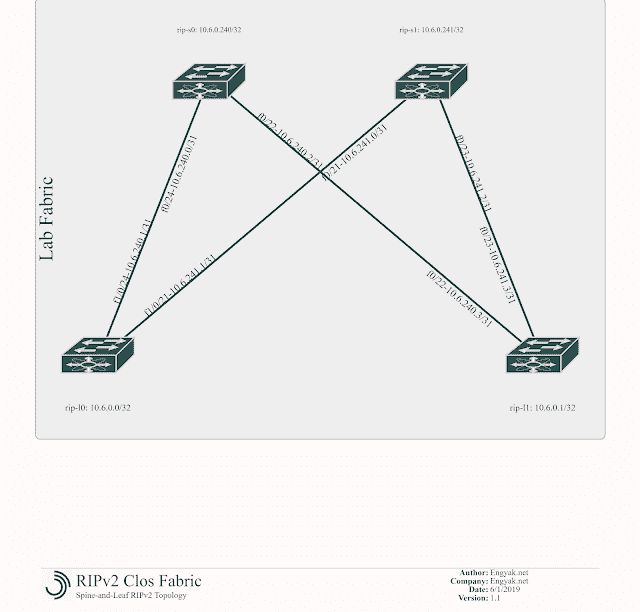

# 书脊和树叶的实际应用

> 原文：<https://dev.to/ngschmidt/spine-and-leaf-practical-applications-ripv2-1abh>

这只是一个小小的钓鱼，但主要是为了勾勒出主干和叶子网络的拓扑简单性，在某种程度上与 Cisco 类非常相似。

首先，这是图表。这是通过使用一组四个 Cat3560s 来实现的，这些 Cat3560s 获得企业许可并以冗余方形拓扑进行布线，以模拟各种各样的拓扑，而只需最少的修改。在某个时候，我也会发布这个设置，这是在《CCIE 路由和交换 5.1 版，弥合 CCNP 和 CCIE 之间的差距》一书中推荐的

[YAML 链接](https://raw.githubusercontent.com/ngschmidt/labfabric-diagram/master/ripv2-clos-fabric.yml)

[](https://1.bp.blogspot.com/-AIN2OiAbR5g/XPMSrda6xyI/AAAAAAAAAmM/YeIZ2McQiEUL4eaU_B6pL2dAkwFJ5yn-wCLcBGAs/s1600/RIPv2%2BClos%2BFabric%2B%25281%2529.png)

所以这实际上非常简单——因为所有的东西**都应该是第 3 层。我们从配置脊柱开始:** 

```
hostname rip-s0interface Loopback0 ip address 10.6.0.240 255.255.255.255interface FastEthernet0/22 no switchport ip address 10.6.240.2 255.255.255.254interface FastEthernet0/24 no switchport ip address 10.6.240.0 255.255.255.254hostname rip-s1interface Loopback0 ip address 10.6.0.241 255.255.255.255interface FastEthernet0/21 no switchport ip address 10.6.241.0 255.255.255.254interface FastEthernet0/23 no switchport ip address 10.6.241.2 255.255.255.254 
```

这里有一些解释:

*   我们使用/31s 来节省地址空间，因为叶-脊-叶链接数量众多，会像明日黄花一样吞噬地址空间。如果你想知道更多关于/31 的用法，这里是[。](https://tools.ietf.org/rfc/rfc3021.txt)
*   在实际的网络设计之前，我主要关注 IP 地址管理(IPAM ),分配预先计划好的前缀。在本例中，每台交换机都有一个虚拟号码，因此可以轻松地预配置和组织网络拓扑以进行扩展。记住，这都是为了处理大规模的频繁无循环变化——这很重要！

    *   s0:240(x/31，10.6.0.240)
    *   S1: 241 人
    *   L0: 0 (10.6.0.0)
    *   L1: 1 名(10.6.0.1)
*   无交换端口会强制端口进入第 3 层模式。

    然后是

```
hostname rip-l0interface Loopback0 ip address 10.6.0.0 255.255.255.255interface FastEthernet1/0/21 no switchport ip address 10.6.241.1 255.255.255.254interface FastEthernet1/0/24 no switchport ip address 10.6.240.1 255.255.255.254hostname rip-l1 interface Loopback0 ip address 10.6.0.1 255.255.255.255interface FastEthernet0/22 no switchport ip address 10.6.240.3 255.255.255.254interface FastEthernet0/23 no switchport ip address 10.6.241.3 255.255.255.254 
```

通常情况下，您会在这些设备上添加互连，但对于本例来说，环回就足够了。

这不支持路由，但属于功能性基本配置，因此我们打开路由(所有交换机):

```
ip routingrouter rip version 2 network 10.0.0.0 no auto-summary 
```

噗。起作用了。

```
rip-l0#show ip routeCodes: C - connected, S - static, R - RIP, M - mobile, B - BGP D - EIGRP, EX - EIGRP external, O - OSPF, IA - OSPF inter area N1 - OSPF NSSA external type 1, N2 - OSPF NSSA external type 2 E1 - OSPF external type 1, E2 - OSPF external type 2, E - EGP i - IS-IS, su - IS-IS summary, L1 - IS-IS level-1, L2 - IS-IS level-2 ia - IS-IS inter area, * - candidate default, U - per-user static route o - ODR, P - periodic downloaded static routeGateway of last resort is not set 10.0.0.0/8 is variably subnetted, 8 subnets, 2 masksC 10.6.0.0/32 is directly connected, Loopback0R 10.6.0.1/32 [120/2] via 10.6.241.0, 00:00:06, FastEthernet1/0/21 [120/2] via 10.6.240.0, 00:00:06, FastEthernet1/0/24C 10.6.240.0/31 is directly connected, FastEthernet1/0/24R 10.6.0.240/32 [120/1] via 10.6.240.0, 00:00:12, FastEthernet1/0/24C 10.6.241.0/31 is directly connected, FastEthernet1/0/21R 10.6.0.241/32 [120/1] via 10.6.241.0, 00:00:17, FastEthernet1/0/21R 10.6.240.2/31 [120/1] via 10.6.240.0, 00:00:13, FastEthernet1/0/24R 10.6.241.2/31 [120/1] via 10.6.241.0, 00:00:17, FastEthernet1/0/21 
```

奇怪的是，RIPv2 不应该支持 ECMP，但似乎在这里这样做。希望这是有启发性的——因为在这种情况下，当涉及到 IGP 时，这种拓扑非常简单。以这种方式部署 RIP 有一些缺点:

*   它很健谈，一直泛滥，所以所有的变化(网络的增加)都会导致重新收敛。
*   链路状态故障不会触发路径重新路由
*   是 RIP。生成的配置在这里是[，对于任何想要试验它们的人来说是](https://github.com/ngschmidt/lab-clos-fabric-configs/tree/master/RIPv2-Configs)。**