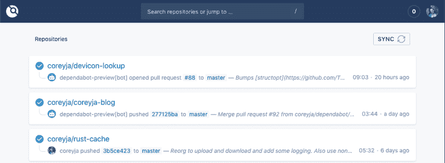

# 自托管无人机 CI 实例

> 原文：<https://dev.to/coreyja/self-hosting-a-drone-ci-instance-cj7>

[](https://res.cloudinary.com/practicaldev/image/fetch/s--I3ceByYD--/c_limit%2Cf_auto%2Cfl_progressive%2Cq_auto%2Cw_880/https://coreyja.com/static/516b79ae9f9a874ba4a9b21ea54c8939/a7b2a/drone-screenshot.png)

这是将无人机用作 CI 平台的多部分系列的第 1 部分！这里是这些系列的大概轮廓。这可能会改变，直到每个职位被释放！

*   第 1 部分:自托管无人机 CI 实例(本文)
*   第 2 部分:在 Drone CI 上运行测试并编写一个基本的`.drone.yml`文件
*   第 3 部分:高级技术
*   第 4 部分:缓存对 S3 的依赖

# 自托管无人机 CI 实例

我喜欢持续集成，在我的大部分个人项目中都有 CI 设置，即使它只是运行一些 linters。

我以前几乎只使用 [CircleCI](https://circleci.com/) 。他们提供了很好的服务，对于个人使用是免费的。在这种情况下，个人使用的“相当一部分”是每月 1000 分钟免费。这离 17 小时不到，16.666。

然而，有几个月我碰到了自由限制，这导致我的构建排队和变慢。所以我开始考虑我的选择。CircleCI 提供付费计划，所以我首先在那里寻找，但不幸的是，他们的第一个付费计划从每月 50 美元开始。[1]这个产品似乎更适合企业，而不是个人开发者，所以我继续探索我的选择。

[1]在撰写本文时，它实际上是 90 美元，但他们有一个 23 美元的计划即将推出[https://circleci.com/pricing/usage/](https://circleci.com/pricing/usage/)

我也有过自我托管的经历，最近我在云中租了一台相对较大的服务器，它基本上没有被使用，所以寻找自我托管 CI 选项是一场完美的风暴！

我最终选择的是[无人机](https://drone.io/)。我已经运行我的实例几个月了，最近已经从 CircleCI 迁移了我的大部分(但不是全部)项目。

## 安装无人机

我已经在我的服务器上运行了`Dokku`(见我之前关于[迁移到 Dokku 这里](https://coreyja.com/migrating-from-heroku-to-dokku/)的帖子)，所以如果可能的话，我想用它来安装和管理无人机。幸运的是，这两者都是建立在 Docker 之上的，到目前为止，它们合作得非常好。已经有一个 Dokku 服务器启动并运行，这无疑给了我一个让无人机运行的良好开端！

我创建了这个非常无聊的回购协议来帮助管理与多库([https://github.com/coreyja/drone-dokku](https://github.com/coreyja/drone-dokku))的部署。基本上，这只是一个包含单个 Dockerfile 文件简单 repo。这继承了官方的无人机图像，并暴露了正确的端口。现在，我可以将这个回购推给 Dokku，让它为我管理安装和网络。

Drone 确实依赖于 Docker 中的一些挂载卷，我也必须在 Dokku 中配置这些挂载卷，这是通过以下命令完成的

```
dokku storage:mount drone /var/run/docker.sock:/var/run/docker.sock
dokku storage:mount drone /var/lib/exampledrone:/data 
```

我期待着尽快将这个装置转移到 Kubernetes 上，如果我这样做了，我会发一个帖子来描述它。

## 配置无人机

由于他们的文档([https://docs.drone.io/installation/github/single-machine/](https://docs.drone.io/installation/github/single-machine/))，安装无人机也相对容易。这是单实例机器的文档，比如我用 Dokku 运行，用 Github 作为回购源。无人机还支持 GitLab、Gitea、Gogs 和 Bitbucket。

一旦我创建了正确的 Github 凭证，我就获取了我需要的两个凭证，并将它们添加为 Drone 可用的以下 ENV 变量:`DRONE_GITHUB_CLIENT_ID`、`DRONE_GITHUB_CLIENT_SECRET`。

那么只需要另外两个 ENV 变量:`DRONE_SERVER_HOST`和`DRONE_SERVER_PROTO`，主机名和协议放在这里。
例如，这是我对这两个变量的配置:

```
DRONER_SERVER_HOST=drone.dokku.coreyja.com
DRONE_SERVER_PROTO=https 
```

我还有`DRONE_RUNNER_CAPACITY=4`，这意味着我可以有 4 个容器并行运行。

就配置而言，这是让应用程序运行所需的全部内容🎉

## 启动 App 并登录

现在我们应该能够启动并登录到我们的自托管无人机实例了！

Drone 本身没有任何认证，完全依赖 Github 的 OAuth。我喜欢这种模式，因为这样可以少管理一个帐户。

这意味着你要做的第一件事就是通过 Github 登录 Drone，并允许它访问你的存储库。在此之后，您可以使用 Web UI 将特定项目添加到 Drone！

一旦你添加了一个项目，Drone 将向 Github 注册 web-hooks，并在有推送至 Github repo 时启动构建。

当然，前提是你的回购中有一个`.drone.yml`文件设置。幸运的是，这将是本系列的下一篇文章！😉

** Dev.to Banner 由 [@christopherkade](https://dev.to/christopherkade) 用牛逼的`Dev banner generator`生成，看看他的帖子吧！[https://dev . to/Christopher kade/introducing-a-banner-generator-for-your-articles-on-dev-353 a](https://dev.to/christopherkade/introducing-a-banner-generator-for-your-articles-on-dev-353a)