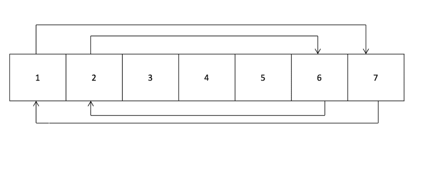

# 在适当的位置反转阵列

> 原文：<https://dev.to/theindiandev1/reversing-array-in-place-55gp>

嘿，嘿，嘿这是我的第一篇文章。我会长话短说。从今天开始学习数据结构和算法。我有过这样的想法，是否有一种方法可以在不使用额外空间的情况下反转一个数组(比如一个新的数组)。你猜对了，我们确实有办法。这是一个想法:

[](https://res.cloudinary.com/practicaldev/image/fetch/s--kPQpgEdP--/c_limit%2Cf_auto%2Cfl_progressive%2Cq_auto%2Cw_880/https://thepracticaldev.s3.amazonaws.com/i/kw3b8c3kc5xvk6t0vwm8.png)

我们将迭代(N/2)次(N =数组的长度),并将数组的前半部分与后半部分交换。我们只迭代了 n/2 次。太酷了，让我知道你们的想法。

代码:

```
class Array:
  def __init__(self):
    self.array = []
    self.length = 0

  def reverse(self):
    for i in range(len(self.array)/2):
      current_position = i
      swap_position = len(self.array) - (i + 1)

      temp = self.array[swap_position]
      current_value = self.array[current_position]
      self.array[swap_position] = current_value
      self.array[current_position] = temp

    return self.array

array = Array()
array.append(1)
array.append(2)
array.append(3)
array.append(4)
array.append(5)
array.append(6)
array.append(7)
print array.reverse() 
```