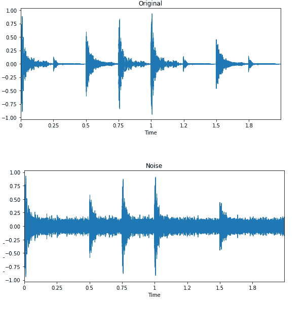
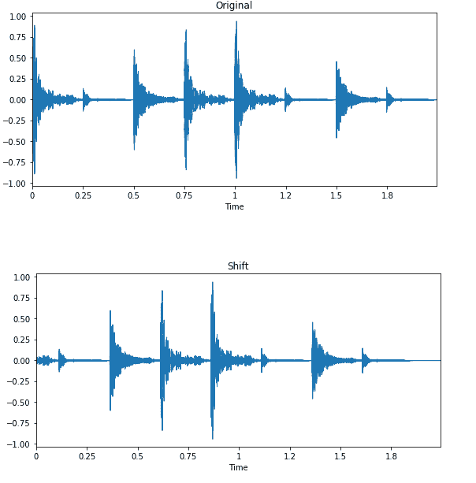
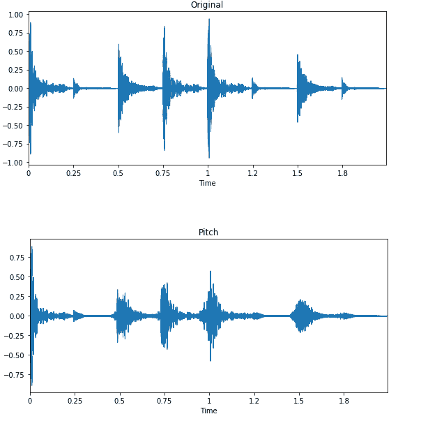
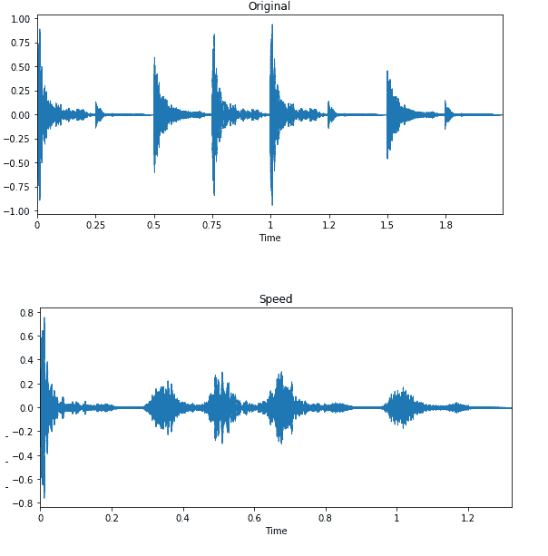

# 音频数据增强

> 原文：<https://dev.to/makcedward/data-augmentation-for-audio-5fii>

#### 数据增强

[](https://res.cloudinary.com/practicaldev/image/fetch/s--Y1Cawti---/c_limit%2Cf_auto%2Cfl_progressive%2Cq_auto%2Cw_880/https://cdn-images-1.medium.com/max/1024/0%2AQsYCC8milwRRx3Tf) 

<figcaption>照片由上[下](https://unsplash.com?utm_source=medium&utm_medium=referral)</figcaption>

尽管调优模型架构和超参数是构建出色模型的成功因素，但数据科学家也应该关注数据。不管你建立的模型有多神奇，**垃圾进，垃圾出(GIGO)** 。

直观地说，数据缺乏是实际数据科学问题中常见的问题之一。数据扩充有助于从现有数据集生成合成数据，从而提高模型的泛化能力。

在之前的[故事](https://dev.to/makcedward/data-augmentation-for-speech-recognition-3279-temp-slug-8408894)中，我们解释了我们如何玩声谱图。在这个故事中，我们将讨论一种基本的音频增强方法。这个故事和实现的灵感来自 [Kaggle 的音频数据增强笔记本](https://www.kaggle.com/CVxTz/audio-data-augmentation)。

### 用于音频的数据增强

为了生成音频的语法数据，我们可以应用噪声注入、移动时间、改变音调和速度。 [numpy](https://github.com/numpy/numpy) 提供了一种简单的方法来处理噪声注入和转换时间，而 [librosa](https://github.com/librosa/librosa) (用于识别和组织语音和音频的库)只需一行代码就可以帮助操纵音高和速度。

#### 噪声注入

它只是通过使用 numpy 将一些随机值添加到数据中。

```
import numpy as np

def manipulate(data, noise\_factor):
 noise = np.random.randn(len(data))
 augmented\_data = data + noise\_factor \* noise
 # Cast back to same data type
 augmented\_data = augmented\_data.astype(type(data[0]))
 return augmented\_data 
```

[](https://res.cloudinary.com/practicaldev/image/fetch/s--6sjTXR_o--/c_limit%2Cf_auto%2Cfl_progressive%2Cq_auto%2Cw_880/https://cdn-images-1.medium.com/max/604/1%2A43FyaaFTlz6qqHcZBy8RAw.png) 

<figcaption>原声和噪音声音的对比</figcaption>

#### 换挡时间

转移时间的想法很简单。它只是随机将音频向左/右移动一秒钟。如果将音频向左(快进)移动 x 秒，前 x 秒将标记为 0(即静音)。如果将音频向右(向后向前)移动 x 秒，最后 x 秒将标记为 0(即静音)。

```
import numpy as np

def manipulate(data, sampling\_rate, shift\_max, shift\_direction):
 shift = np.random.randint(sampling\_rate \* shift\_max)
 if shift\_direction == 'right':
 shift = -shift
 elif self.shift\_direction == 'both':
 direction = np.random.randint(0, 2)
 if direction == 1:
 shift = -shift

augmented\_data = np.roll(data, shift)
 # Set to silence for heading/ tailing
 if shift \> 0:
 augmented\_data[:shift] = 0
 else:
 augmented\_data[shift:] = 0
 return augmented\_data 
```

[](https://res.cloudinary.com/practicaldev/image/fetch/s--5P3-d6Dm--/c_limit%2Cf_auto%2Cfl_progressive%2Cq_auto%2Cw_880/https://cdn-images-1.medium.com/max/604/1%2AqAwU-YJYltf3nXkeF0qO8A.png) 

<figcaption>原声和变声的对比</figcaption>

#### 改变音高

这个增强是 librosa 函数的一个包装器。它随机改变音调

```
import librosa

def manipulate(data, sampling\_rate, pitch\_factor):
 return librosa.effects.pitch\_shift(data, sampling\_rate, pitch\_factor) 
```

[](https://res.cloudinary.com/practicaldev/image/fetch/s--T66pGbc5--/c_limit%2Cf_auto%2Cfl_progressive%2Cq_auto%2Cw_880/https://cdn-images-1.medium.com/max/604/1%2Aw5c8k9poONgevgYCvmQiuQ.png)

#### 改变速度

与改变音高一样，这种增强是由 [librosa](https://librosa.github.io/librosa/generated/librosa.effects.time_stretch.html) 函数执行的。它以固定的速率拉伸时间序列。

```
import librosa

def manipulate(data, speed\_factor):
 return librosa.effects.time\_stretch(data, speed\_factor) 
```

[](https://res.cloudinary.com/practicaldev/image/fetch/s--Qb3A0_VW--/c_limit%2Cf_auto%2Cfl_progressive%2Cq_auto%2Cw_880/https://cdn-images-1.medium.com/max/604/1%2AbEEmdjVd_ddPuEKpD_dPeQ.png) 

<figcaption>原声和变声之间的对比</figcaption>

### 带走

*   以上 4 种方法在 [nlpaug](https://github.com/makcedward/nlpaug) 包中实现(≥ 0.0.3)。您可以在几行代码内生成扩充数据。
*   数据扩充不能代替真实的训练数据。它只是帮助生成合成数据以使模型更好。
*   不要盲目生成合成数据。你必须了解你的数据模式，并选择适当的方式来增加训练数据量。

### 关于我

我是湾区的数据科学家。专注于数据科学、人工智能，尤其是 NLP 和平台相关领域的最新发展。欢迎在 [LinkedIn](https://www.linkedin.com/in/edwardma1026) 上与 [me](https://makcedward.github.io/) 联系，或者在 [Github](https://github.com/makcedward) 上关注我。

### 延伸阅读

*   [Kaggle 比赛中的音频数据增强](https://www.kaggle.com/CVxTz/audio-data-augmentation)
*   [自由自在](https://librosa.github.io/)
*   [自然语言处理中的数据扩充](https://towardsdatascience.com/data-augmentation-in-nlp-2801a34dfc28)
*   [文本的数据扩充](https://towardsdatascience.com/data-augmentation-library-for-text-9661736b13ff)
*   [声谱图数据增强](https://dev.to/makcedward/data-augmentation-for-speech-recognition-3279-temp-slug-8408894)

* * *