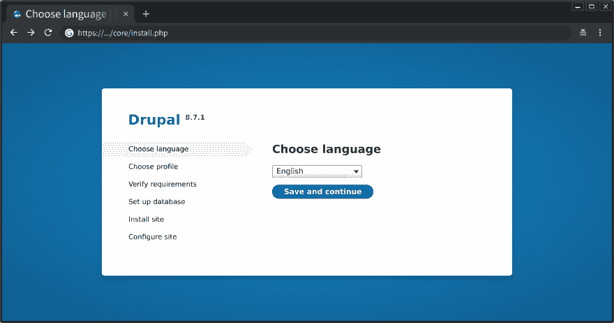
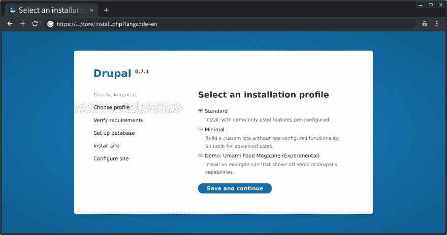
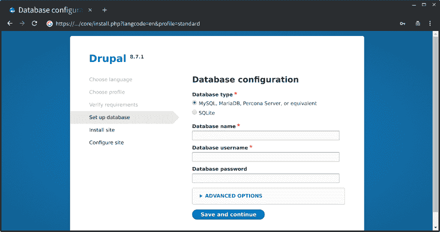
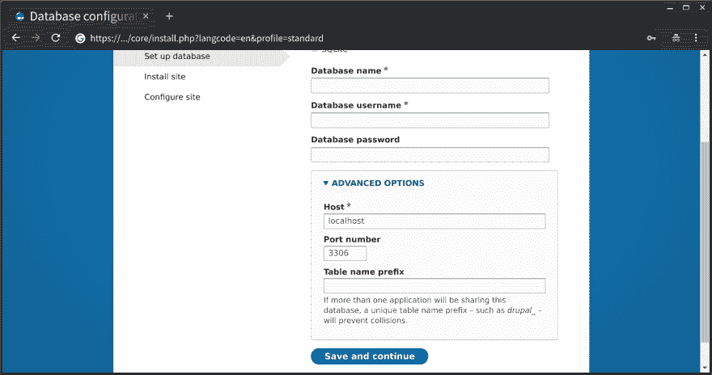
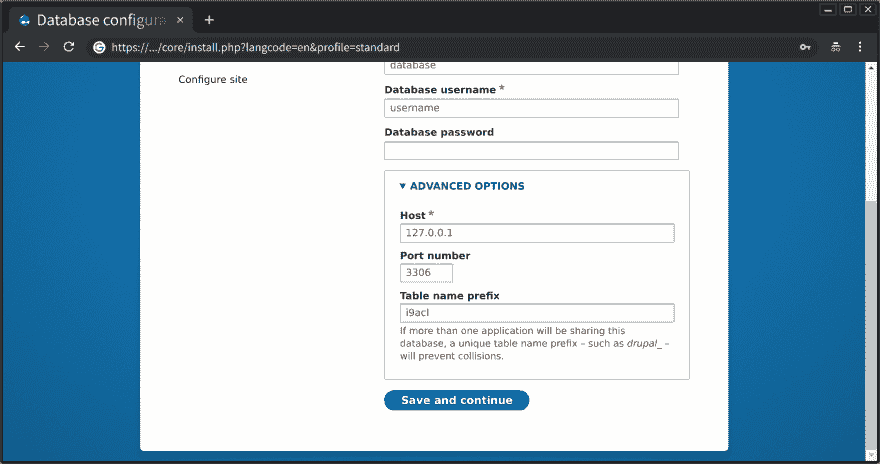
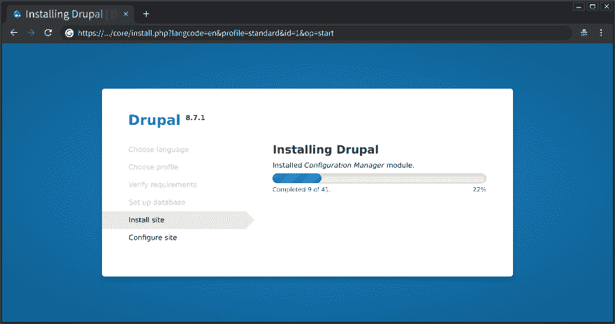
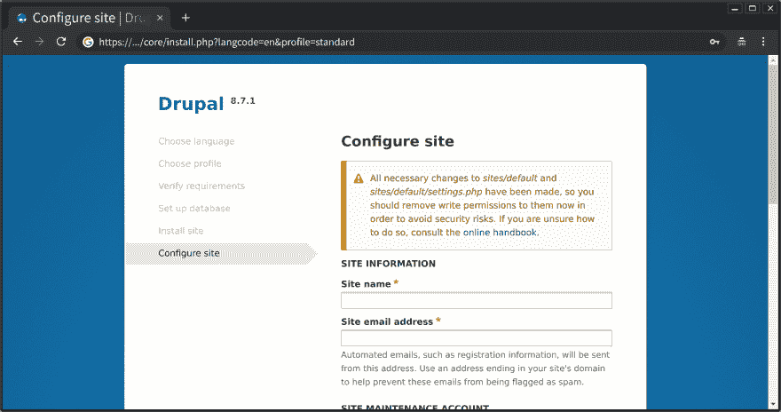
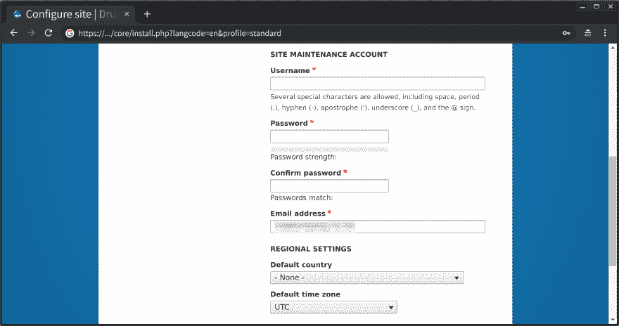
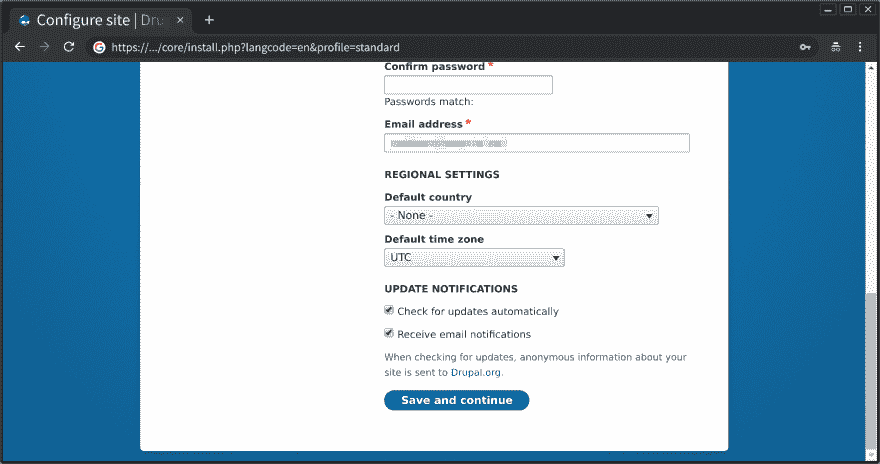
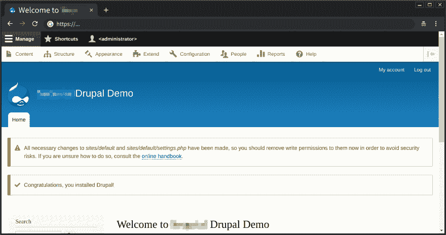

# OpenBSD 上的 Drupal 8

> 原文：<https://dev.to/nabbisen/drupal-on-openbsd-4n39>

**封面图片由 [jplenio](https://pixabay.com/users/jplenio-7645255/) 原创，经过精心编辑。*

* * *

## 简介

Drupal 是一个安全而强大的内容管理系统，又名 T2 内容管理系统。
这是一个开源平台，基于 [Symfony](https://symfony.com/) ，一个快速健壮的 [PHP](https://www.php.net/) web 框架。

[EC-CUBE](https://www.ec-cube.net/) 和 [Kimai 2](https://www.kimai.org/) 同样基于 Symfony。
我已经在 [OpenBSD](https://www.openbsd.org/) 上构建了他们的服务器。
我关于 EC-CUBE 安装的帖子是[这里](https://dev.to/nabbisen/ec-cube-4--openbsd-64--30pd)，Kimai 2 的是[这里](https://dev.to/nabbisen/time-tracking-kimai2-on-openbsd-2mk9)。

因此，我相信我可以在我最喜欢的操作系统 OpenBSD 上构建一个 Drupal 服务器。我做到了:)

关于 Drupal 安装的官方文档是:
[https://www.drupal.org/docs/8/install](https://www.drupal.org/docs/8/install)
还有，系统要求是:
[https://www . Drupal . org/docs/8/install/before-a-Drupal-8-installation](https://www.drupal.org/docs/8/install/before-a-drupal-8-installation)

#### 环境

*   操作系统 : OpenBSD 6.5
*   **数据库** : [MariaDB](https://mariadb.org/) 10.0
*   **网络服务器** : [httpd](https://man.openbsd.org/httpd.8)
*   **应用服务器** : PHP 7.2
    *   **CGI** : [PHP-FPM](https://php-fpm.org/)
    *   **包装经理** : [作曲](https://getcomposer.org/)
*   CMS : Drupal 8.7

* * *

## 安装教程

#### 创建数据库

创建数据库和用户:

```
CREATE DATABASE <database> CHARACTER SET utf8mb4 COLLATE utf8mb4_unicode_ci;
GRANT SELECT, INSERT, UPDATE, DELETE, CREATE, DROP, INDEX, ALTER, CREATE TEMPORARY TABLES ON <database>.* TO <dbuser>@'localhost' IDENTIFIED BY '<dbpassword>';
FLUSH PRIVILEGES; 
```

Enter fullscreen mode Exit fullscreen mode

#### 获取代码

最新套餐在这里:
[https://www.drupal.org/download](https://www.drupal.org/download)

首先下载并设置:

```
$  ftp https://www.drupal.org/download-latest/zip
$  unzip zip
$  mv drupal-* drupal
$  # optional:
$  rm ./zip
  $  cd drupal 
```

Enter fullscreen mode Exit fullscreen mode

* * *

##### 注:安装更简单

有一个替代安装。
“快速入门”写在包装中的`site/core/INSTALL.txt`里。
按照这个步骤，你可以少很多步骤，不需要网络安装和详细的配置。

* * *

接下来，通过 PHP Composer 安装依赖项。
在 OpenBSD 中，包管理器有它，但是`composer`命令链接到比现在 7.2 更低的 PHP 版本。
因此，[需要一个小技巧](https://dev.to/nabbisen/almost-php-72-composer-with-openbsd-64-100o)。
安装 Composer 后，运行此命令:

```
$  /usr/local/bin/php-7.2 /usr/local/libexec/composer.phar install --no-dev 
```

Enter fullscreen mode Exit fullscreen mode

结果是:

```
Loading composer repositories with package information
Installing dependencies from lock file
Nothing to install or update
Generating autoload files
> Drupal\Core\Composer\Composer::preAutoloadDump
> Drupal\Core\Composer\Composer::ensureHtaccess 
```

Enter fullscreen mode Exit fullscreen mode

#### 构建服务器

你必须[用 OpenBSD 的 httpd 建立一个 web 服务器](https://dev.to/nabbisen/setting-up-openbsds-httpd-web-server-4p9f)并且[得到一个](https://dev.to/nabbisen/lets-encrypt-certbot-for-openbsds-httpd-3ofd)[的证书](https://letsencrypt.org/)让我们预先加密。

像这样配置 [httpd.conf](https://man.openbsd.org/httpd.conf) 。
`fastcgi socket`通过 PHP-FPM 向 Drupal 发送请求:

```
server "<fqdn>" {
        listen on $ext_addr port 80
        block return 301 "https://$SERVER_NAME$REQUEST_URI"
}                                                  
server "<fqdn>" {
        listen on $ext_addr tls port 443
        tls {
                certificate     "/etc/letsencrypt/live/<fqdn>/fullchain.pem"
                key             "/etc/letsencrypt/live/<fqdn>/privkey.pem"
        }
        # optional:
        log {
                access  "<fqdn>-access.log"
                error   "<fqdn>-error.log"
        }

        root "/<...>/drupal"
        directory index index.php

        location "/*.php" { 
                fastcgi socket "/run/php-fpm.sock"
        } 
        location "/*.php[/?]*" { 
                fastcgi socket "/run/php-fpm.sock"
        }
        location match "^/(.*)/[^\.]+/?$" {
                fastcgi socket "/run/php-fpm.sock"    
                request rewrite "/index.php/%1"
         }
} 
```

Enter fullscreen mode Exit fullscreen mode

重新启动 httpd:

```
#  rcctl restart httpd 
```

Enter fullscreen mode Exit fullscreen mode

更改权限:

```
#  # files
#  chown -R :www sites/default
#  chmod -R g+w sites/default
#  # settings.php
$  cp sites/default/default.settings.php sites/default/settings.php
#  chmod g+w sites/default/settings.php 
```

Enter fullscreen mode Exit fullscreen mode

我们准备好了。

让我们访问 https:// <fqdn>。
您将看到 web 安装程序正在运行。
跟着它走:)</fqdn>

[](https://res.cloudinary.com/practicaldev/image/fetch/s--H0GKlQ9a--/c_limit%2Cf_auto%2Cfl_progressive%2Cq_auto%2Cw_880/https://thepracticaldev.s3.amazonaws.com/i/cm5nkg100z6n6qaugnvj.png)
[T6】](https://res.cloudinary.com/practicaldev/image/fetch/s--IJ-mkrFF--/c_limit%2Cf_auto%2Cfl_progressive%2Cq_auto%2Cw_880/https://thepracticaldev.s3.amazonaws.com/i/0yxt18bnbbmvieyxkwi4.png)

如果您使用“localhost”作为数据库主机，您可能需要将其替换为“127.0.0.1”。另外，从安全性的角度出发，我建议使用“表名前缀”。

[](https://res.cloudinary.com/practicaldev/image/fetch/s--06OWLJny--/c_limit%2Cf_auto%2Cfl_progressive%2Cq_auto%2Cw_880/https://thepracticaldev.s3.amazonaws.com/i/6usbhq03cgod9h71xavh.png)
[T6】](https://res.cloudinary.com/practicaldev/image/fetch/s--CifLAwVT--/c_limit%2Cf_auto%2Cfl_progressive%2Cq_auto%2Cw_880/https://thepracticaldev.s3.amazonaws.com/i/zmgy8ofzc4wexel23b7m.png)

[](https://res.cloudinary.com/practicaldev/image/fetch/s--gOSPzQXy--/c_limit%2Cf_auto%2Cfl_progressive%2Cq_auto%2Cw_880/https://thepracticaldev.s3.amazonaws.com/i/sb54vei14uevo3740ue3.png)

等待几秒钟。

[](https://res.cloudinary.com/practicaldev/image/fetch/s--I9StUwe2--/c_limit%2Cf_auto%2Cfl_progressive%2Cq_auto%2Cw_880/https://thepracticaldev.s3.amazonaws.com/i/ecg1tclkpdhg2vx65ljh.png)

站点配置将开始。

[](https://res.cloudinary.com/practicaldev/image/fetch/s--CI02fLEI--/c_limit%2Cf_auto%2Cfl_progressive%2Cq_auto%2Cw_880/https://thepracticaldev.s3.amazonaws.com/i/q9rvrncettv6ooyb7kp8.png)
[](https://res.cloudinary.com/practicaldev/image/fetch/s--HA0I7cbe--/c_limit%2Cf_auto%2Cfl_progressive%2Cq_auto%2Cw_880/https://thepracticaldev.s3.amazonaws.com/i/72m6qh6lx4q2tvd5x31w.png)
[](https://res.cloudinary.com/practicaldev/image/fetch/s--Pkq__wAS--/c_limit%2Cf_auto%2Cfl_progressive%2Cq_auto%2Cw_880/https://thepracticaldev.s3.amazonaws.com/i/dylva4d83q2v25z1fj7s.png)

已完成:)

[](https://res.cloudinary.com/practicaldev/image/fetch/s--C6BMN3cQ--/c_limit%2Cf_auto%2Cfl_progressive%2Cq_auto%2Cw_880/https://thepracticaldev.s3.amazonaws.com/i/yfw8386m5ndoqv0c58jl.png)

减少文件`sites/default/settings.php`和目录`sites/default`的写权限:

```
#  chmod g-w sites/default/settings.php
#  # The target is just a directory and therefore the `-R` option is unnecessary:
#  chmod g-w sites/default 
```

Enter fullscreen mode Exit fullscreen mode

系统的“健康检查”可能需要您注册可信的主机。
编辑`sites/default/settings.php`这样:

```
+ $settings['trusted_host_patterns'] = array(   
+   '^<fqdn>$',   
+ ); 
```

Enter fullscreen mode Exit fullscreen mode

不要忘记使用句点的转义序列，因为它意味着模式。
比如，“`^your.sub.domain$`”应该是“`^your\.sub\.domain$`”。

* * *

## 结论

感谢您的阅读:)
快乐计算。