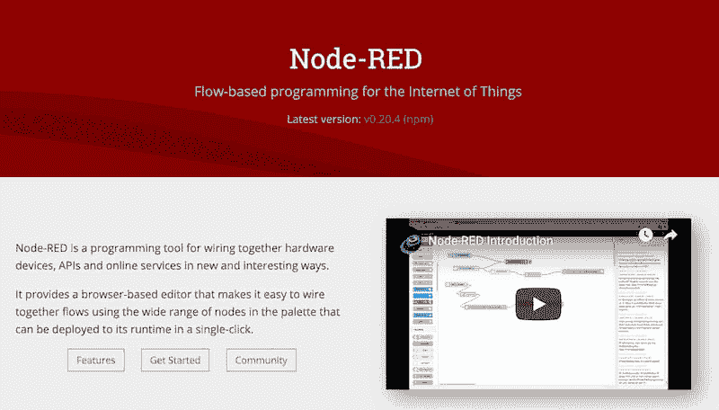
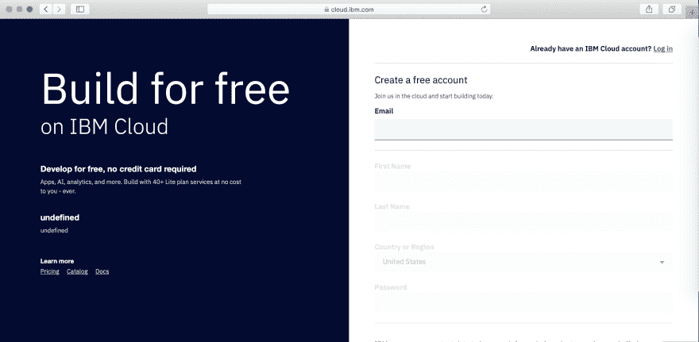
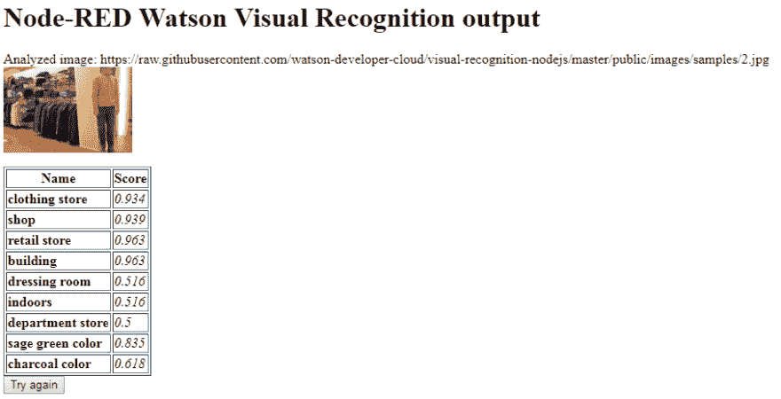
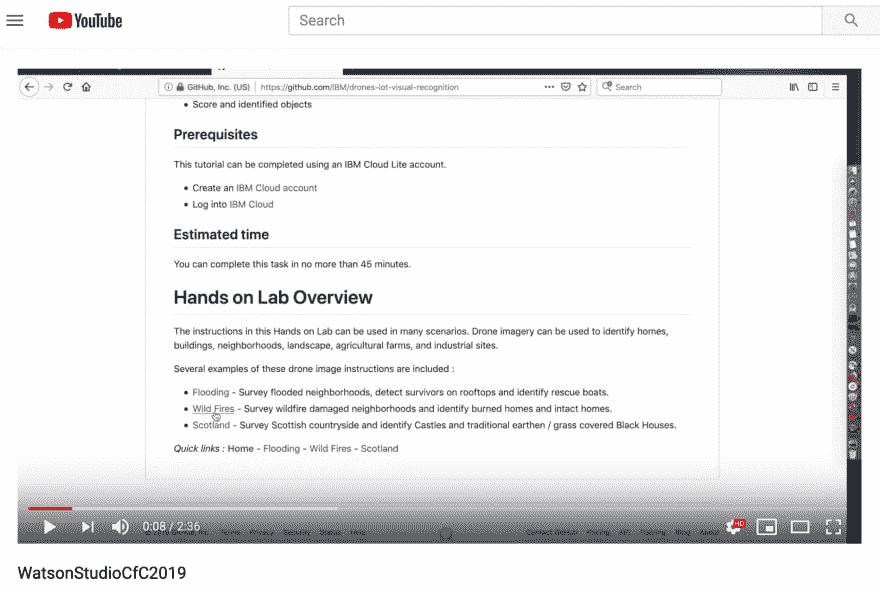

# 带有红色节点的视觉识别应用程序

> 原文：<https://dev.to/ibmdeveloper/visual-recognition-app-with-node-red-28hc>

这篇博文演示了如何在 10 分钟内毫不费力地让定制的人工智能服务参与到自己的解决方案中，并学习了一种基于 Node-Red 的新的节点流代码开发。

为了实现这一点，您将了解 Watson 视觉识别(这是一项经验丰富的商业-行业级人工智能服务，可通过 IBM Cloud 获得)，Watson Studio for fast machine learning，Node-Red -基于 javascript 的图形节点流语言，以在线模式使用创建的视觉识别分类器。

#### 这个为什么

我是一名全栈开发人员，一直在寻找可以在现代系统中使用的优秀技术。自从我创办了一家机器人初创公司以来，我一直对无人机和机器人的人工智能视觉识别服务的使用感到惊讶。在这篇博文中，我将与你分享现在让人工智能为你和你的系统/机器人/无人机做事情是多么容易。10 年前，我试图在一群机器人中使用自主机器人来探测武装入侵者——当时在我看来，如果没有巨大的财政资源，这个任务是不可能完成的。今天，解决方案可以在一整天的黑客马拉松后交付。_Man，我希望我那时就知道我现在要与你分享什么；) _

此外，联合国、红十字会和 IBM 等组织支持 CallForCode.org 黑客马拉松来帮助受灾难影响的人们。使用具有图像识别功能的无人机可能会影响并改善所有受影响者的福祉。我将展示检测受野火、洪水等影响的房屋的代码。所以为什么不接这个电话，为事业做贡献，帮助别人！

### 使用沃森视觉识别中的节点-红色

**沃森视觉识别**是一种经过训练的基于人工智能的服务，它可以告诉你它在经过预训练的分类器的图片上看到了什么。它可以检测颜色、人、脸、一些物体、食物等。你会非常喜欢的。【T2

Node-Red 是一个开源项目，而*是一个编程工具，用于以新的有趣的方式将硬件设备、API 和在线服务连接在一起。它提供了一个基于浏览器的编辑器，使用调色板中的大量节点可以很容易地将流连接在一起，只需单击一下就可以将这些节点部署到它的运行时中(*在 nodered.org 站点之后重复)*

所以让我们从 IBM 视觉识别开始——我最后一次检查是在 2019 年 5 月 30 日——<u>你可以使用一个 **IBM Cloud lite 帐户**</u> 免费调用该服务，每月大约一千次。你可以通过简单地点击我的个性化链接(如果你使用这个网址，我会被告知这个博客是一个好博客)，为自己获得一个免费的建兴账户(只需提供你的电子邮件地址):【https://ibm.biz/Bd2CUa

补充说明一下——只需使用 IBM Cloud Lite 帐户，您就可以轻松地为投资者准备一个可行的概念验证原型。

注册后，登录并打开目录，从人工智能类别中选择 Watson 视觉识别服务，然后创建它。之后，您还需要创建 Node-RED Starter 服务。这两种服务都可以在免费层工作！

提供节点红色服务后，将其与之前创建的 Watosn 视觉识别服务连接。将它们连接在一起后，您需要重新准备节点红色服务。当您设置服务运行时，您可以创建第一个流并使用以下 Node-RED lab:[https://github . com/Watson-developer-cloud/Node-RED-labs/tree/master/basic _ examples/visual _ recognition](https://github.com/watson-developer-cloud/node-red-labs/tree/master/basic_examples/visual_recognition)

*一个小提示:*在 Node-RED lab 页面的底部有一个链接，指向所需 Node-RED 流程的完整 JSON。只需复制流的 JSON，从剪贴板导入流编辑器中的 JSON，就可以在 1 分钟内启动这个服务！不要忘记使用“部署”按钮来安装新的或更改的流。*

您的服务将如下所示:

现在，您可以通过这个简单的 web 应用程序在您的 web 浏览器中尝试您的测试服务(只需使用带有 **/reco** 扩展名的链接)——例如:【http://my-node-red-app.mybluemix.com】**/***reco*

### 用自定义分类器自定义 AI 服务

如果你想添加一些新的东西——创建一个定制的分类器——你需要提供 1000 张图片用于阳性检测，正如我被告知的那样——这个数字的大约一半是“阴性”图片——即。不代表所选分类的图片。

最基本的例子是从十几张图片开始。John Walicki 提供了一个完美的例子，他训练了一个定制的分类器来检测无人机拍摄的照片中被烧毁的房屋。你可以使用他的一个实验室来做这样一个无人机分类器——这个基于 github 的实验室展示了创建一个分类器来检测被野火摧毁或被洪水淹没的房屋的实验室:[https://github.com/IBM/drones-iot-visual-recognition](https://github.com/IBM/drones-iot-visual-recognition)

我制作了一个简短的视频，展示了这是如何一步一步完成的(然而视频被加速了 2-3 倍):[https://youtu.be/kW7cjuWuPS0](https://youtu.be/kW7cjuWuPS0)

为了训练 Watson 视觉识别，您将**使用 IBM Watson Studio** 。为了概括，训练视觉识别服务所需的是提供单独的图片或将它们组合在 zip 文件中——一个是正面图片，一个是负面图片集。在自由层，你可以得到这样的两个等级。

现在，为了查看它-只需扩展您现有的节点-红色流，添加一个额外的功能节点，并用以下代码填充它。更多详细信息，请点击链接中的步骤 3-[https://github.com/blumareks/ai-visrec-under-10min](https://github.com/blumareks/ai-visrec-under-10min)

### 总结

使用创建的自定义分类器，您可以为您的无人机或软件配备检测灾难幸存者和受害者的能力。沃森视觉识别的能力可以用在好的方面，在 CallForCode.org 黑客马拉松和更远的地方。

你打算用它实现什么解决方案？让我知道！

在 Twitter 上关注我 [@blumareks](https://dev.to/blumareks)