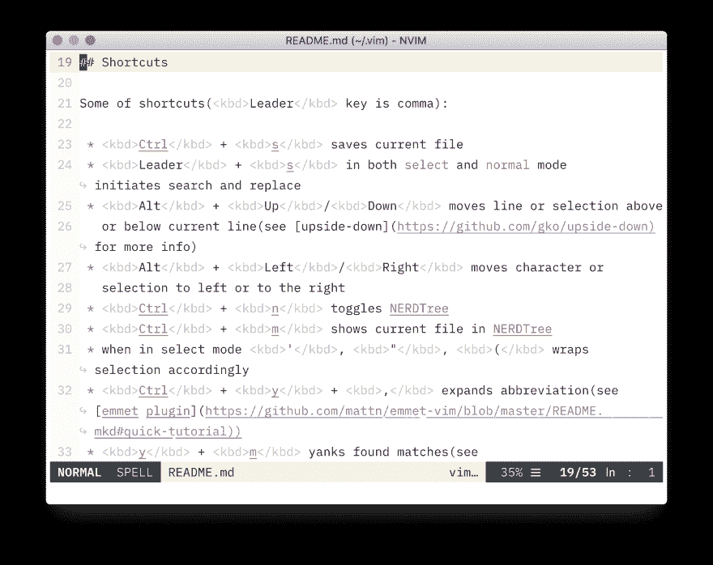
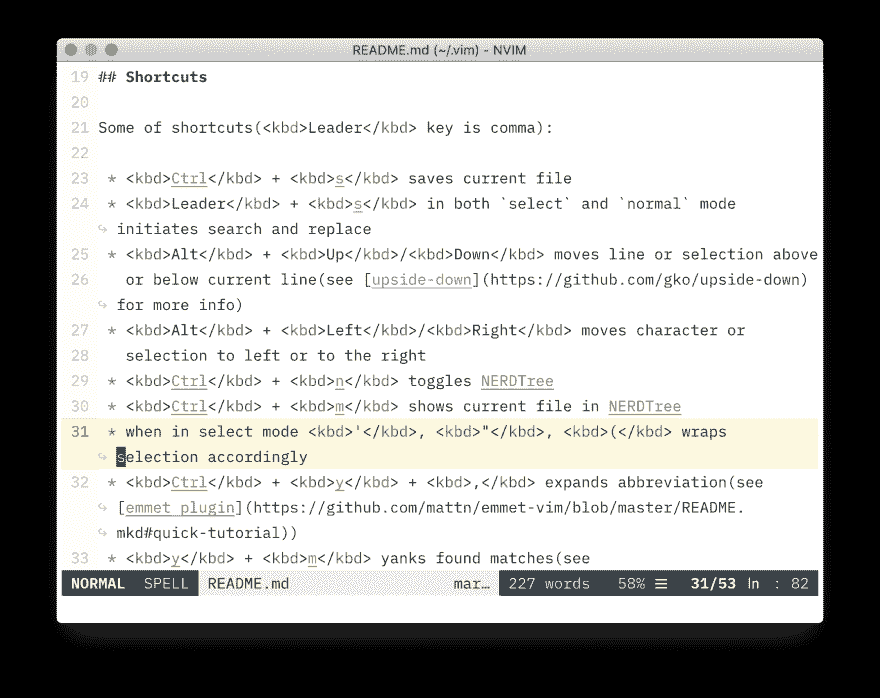
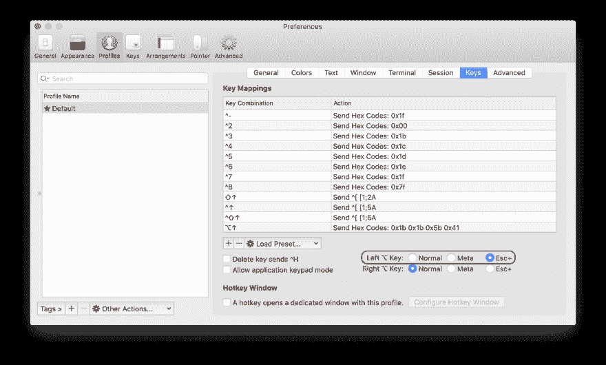

# 使用 vim 做笔记

> 原文：<https://dev.to/konstantin/taking-notes-with-vim-3619>

一段时间以来，我一直在寻找一个可以让我轻松记笔记的插件。我喜欢使用`markdown`，所以自然这个`plugin`必须支持这种格式。

最近我遇到了维姆维基 T2。它几乎拥有我想要的一切，尽管有一些瑕疵。但是因为它是`vim`它是非常容易自己修理他们。

## 安装`vimwiki`

如果您使用的是 [vim-plug](https://github.com/junegunn/vim-plug) ，您可以简单地通过在您的`~/.vimrc`文件中添加以下内容来安装它:

```
call plug#begin()

Plug 'vimwiki/vimwiki', { 'branch': 'dev' }

call plug#end() 
```

Enter fullscreen mode Exit fullscreen mode

我推荐使用`dev` branch，因为我发现它相当稳定，有很多错误修正。

## 使用`vimwiki`

`vimwiki`支持`wiki`格式以及`markdown`，但是因为我们的任务是使用后者，我们需要给`~/.vimrc`添加以下内容:

```
let g:vimwiki_list = [{ 'path': '~/Documents/notes/',
 \ 'syntax':'markdown', 'ext': '.md' }] 
```

Enter fullscreen mode Exit fullscreen mode

这将告诉插件所有笔记必须存储在`~/Documents/notes/`中，这与大多数操作系统兼容，你将自动受益于`iCloud`在`MacOS`中的同步。它还告诉我们默认使用的是`markdown`格式，我们默认的`root`音符将被称为`index.md`。要访问该便笺，您需要从任何 vim 缓冲区点击`Leader` + `w` + `w`。

在你打开任何一个`note`后，你可以在任何单词或选择上点击`Enter`，`vimwiki`将创建一个链接到一个子笔记(以那个单词或选择作为名称)和笔记文件本身。一旦创建了链接，您只需再次点击`Enter`即可导航至子笔记。神奇！

## 缺陷及如何修复

主要缺陷是`vimwiki`将自己替换为`markdown`文件的语法高亮器。比较:
`vimwiki`高亮
[](https://res.cloudinary.com/practicaldev/image/fetch/s--kPDxWK4C--/c_limit%2Cf_auto%2Cfl_progressive%2Cq_auto%2Cw_880/https://thepracticaldev.s3.amazonaws.com/i/4vt3xu1fxofsgc36xkeu.png) 
到 [vim-markdown](https://github.com/plasticboy/vim-markdown) 高亮
[](https://res.cloudinary.com/practicaldev/image/fetch/s--5Jq-b1pI--/c_limit%2Cf_auto%2Cfl_progressive%2Cq_auto%2Cw_880/https://thepracticaldev.s3.amazonaws.com/i/gbbgg5etzl2bv7ubz6gs.png)

我知道这取决于配色方案，但我在多个变体上看到了相同的结果。

第二个缺陷是它将`filetype`改为`vimwiki`,这样你会丢失所有链接到`markdown`文件类型的片段和其他好东西。

要解决这两个问题，您需要在`~/.vimrc` :
中添加以下行

```
autocmd FileType vimwiki set ft=markdown 
```

Enter fullscreen mode Exit fullscreen mode

这样，我们将`vimwiki`文件类型重置为 markdown，我之前提到的所有神奇功能都将保留。

您可以在我的 vim 设置报告中找到所有配置:

## [【gko】](https://github.com/gko)/[vimio](https://github.com/gko/vimio)

### 🎩易于安装/使用 vim 设置

<article class="markdown-body entry-content container-lg" itemprop="text">

# Vim 设置

[](https://github.com/gko/vimio/screenshot.png)

一篇[文章](https://dev.to/konstantin/configuring-a-perfect-editor-for-frontend-development-1pe5)描述了该配置的主要特性。

## 先决条件

为了获得所有功能，您可能需要安装以下软件包:

*   [fzf](https://github.com/junegunn/fzf)
*   [ripgrep](https://github.com/BurntSushi/ripgrep)
*   [npm](https://www.npmjs.com/get-npm)

## 装置

在 unix 和 windows 上(使用 bash，可以用 [git](http://msysgit.github.io/) 安装):

```
curl -L https://raw.github.com/gko/vimio/main/install.sh | bash
```

Enter fullscreen mode Exit fullscreen mode

### 马科斯

在 macOS terminal.app 中，不要忘记选中“使用”选项作为元键:

[](https://raw.githubusercontent.com/gko/upside-down/master/terminal.png)

iterm2 中的 Esc+选项:

[](https://raw.githubusercontent.com/gko/upside-down/master/iterm2.png)

## 快捷指令

一些快捷键(`Leader`键是逗号):

*   `Ctrl` + `s`保存当前文件
*   在`select`和`normal`模式下的`Leader` + `s`启动搜索和替换
*   `Alt` + `Up` / `Down`在当前行的上方或下方移动行或选择(更多信息见[颠倒](https://github.com/gko/upside-down)
*   `Alt` + `Left` / `Right`向左或向右移动字符或所选内容
*   `Leader` + `n` toggles NERDTree
*   `Leader` + `m`显示 NERDTree 中的当前文件
*   当处于选择模式`'`、`"`、`(`时，相应地对选择进行包装
*   `y` …

</article>

[View on GitHub](https://github.com/gko/vimio)

我在推特上的名字也是[康斯坦丁](http://twitter.com/konstantin)