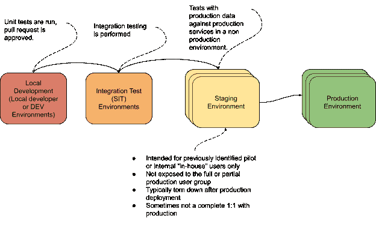
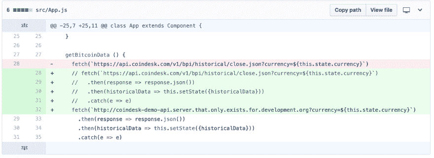
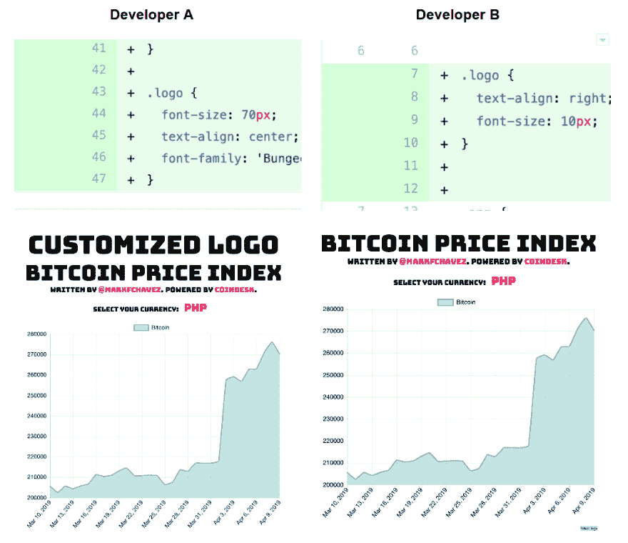
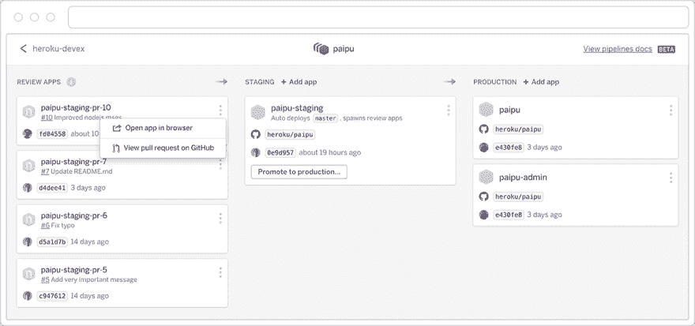

# 暂存环境被忽略了——这就是它们重要的原因

> 原文：<https://dev.to/heroku/staging-environments-are-overlooked-here-s-why-they-matter-3ghd>

许多开发团队忽略了为他们的应用程序准备一个登台环境。他们经常提交一个 PR，可能在 CI 系统中运行测试，合并到 master，然后部署到生产中。如果他们有一个试运行环境，由于缺乏工作量、复杂性或费用，它通常不是生产环境的真实反映。这是一个有风险的管道，因为没有真正的集成环境或正在执行的集成测试。更糟糕的是，如果出现问题，开发人员可能会进行“牛仔编码”，试图在他们的实际生产环境中解决问题。

在本文中，我们将讨论在您的软件开发生命周期中使用真正的登台环境的一些优势，以及为什么它们不需要复杂的设置。

# 什么是分期环境，真的吗？

登台环境是您在软件开发和部署过程中部署到的另一个环境。在部署到生产环境之前，先部署到临时环境。

暂存环境通常意味着与生产环境完全相同或几乎完全相同。这意味着它们具有相同的硬件、软件和配置。您越接近这一点，您的登台环境就越有用。

试运行和生产之间的这种相同程度确保了在试运行环境中的测试反映了在类似情况下生产中会发生什么。

与开发或有限集成测试环境不同，试运行环境利用相同的后端和上下游服务。它们还具有相同的体系结构、相同的规模，并且具有与生产环境高度相似或相同的配置。

根据任何监管因素(如 GDPR 要求)和您组织的数据匿名化能力水平，为了更接近真实世界的生产环境，暂存环境甚至可能具有匿名化或完整的生产数据集。这意味着通常不会向您的生产用户群发布或提供登台环境，而是向内部或试点用户群提供。

为了控制成本，您可以作为发布周期的一部分部署到您的临时环境中，然后在发布进入生产环境后将其拆除。

这种方法为您提供了发现任何代码质量问题、更高层次的数据质量问题、集成问题和/或其他依赖问题的能力，这些问题在集成测试环境或较低的本地或开发环境中是不存在或不明显的。

这种方法还让您能够高度自信地预测您的生产部署是否会成功，允许您回答诸如“我们编写的新服务在生产中启动时会挂起吗？”例如，如果我们使用的库在我们的计算机上工作，但在我们用来部署的 Linux VM 上工作不一样。

使用试运行环境迫使您验证您在开发过程中做出的所有假设，并确保您已经进行了确保部署成功所必需的相关思考练习。

## 采用暂存环境的传统部署

[](https://res.cloudinary.com/practicaldev/image/fetch/s--Lxtiy53q--/c_limit%2Cf_auto%2Cfl_progressive%2Cq_auto%2Cw_880/https://thepracticaldev.s3.amazonaws.com/i/cy5jlek57pztb90m3jy2.png)

# 部署而不暂存的风险

无论如何，本地测试或运行单元测试都不是对产品质量和功能的充分检验。单元测试是由人类编写的，人类是会犯错误的。如果你只测试已知的问题，那么你不能覆盖你不知道的问题。

人们经常忘记跨越服务边界的变更，或者掩盖与上游用户和数据库迁移的依赖性。有时，您正在使用的库可能在本地机器上工作，但在云中可能不工作，并且您唯一能发现依赖失败的时候，就是您部署到生产环境的时候。

通常，在较低环境中测试的数据集是生产环境中不切实际的模拟。有些人可能认为在使用 canary 或 blue/green 部署时没有必要使用暂存环境，因为问题会在早期被发现，但是您仍然会将用户暴露在错误和错误配置面前。

总而言之，这将用户暴露于潜在的破坏性更改，并且根据更改的级别，它可能会影响生产数据或其他相关服务和流程。

依靠信念和希望作为策略来确保成功的生产部署将不可避免地带来对您的产品质量产生负面看法的风险，并最终导致销售损失、客户流失以及可能违反您的客户 SLA。

与这些类型的部署或代码失败相关的成本包括:

*   必须提供即时修补程序
*   回滚版本
*   对开发时间表的影响
*   潜在的数据丢失
*   负面用户体验影响
*   错过的 SLA
*   声誉/品牌风险
*   交易/销售损失
*   流失的客户

使用暂存环境的好处是更高程度的质量保证和客户满意度。此外，通过减少产品中错误的影响或数量，您可以看到大量的间接成本节约。例如，您可以减少您必须花费在潜在回滚更改上的时间，或者减少花费在及时提供热修复上的时间，这些热修复也会通过将开发人员抽出来处理问题而影响您的常规开发周期。您还可以节省生产中潜在的故障排除成本，以及响应用户查询或错误报告所浪费的时间。

# 三个真实世界场景

让我们浏览一些潜在的场景，如果您使用暂存环境，这些场景可以很容易地避免。我们正在与马克·查韦斯开发的名为[比特币价格指数](https://bitcoinpriceindex.netlify.com/)的应用合作。这是一个简单的基于 React 的应用程序，它将用户连接到 [CoinDesk](https://www.coindesk.com/) API，根据所选货币提供比特币价格的趋势信息。

### 1。不正确的服务 URL

在我们的第一个场景中，当在我们较低的(开发/本地)环境中执行开发时，我们将我们的应用指向一个模拟 CoinDesk API 服务，以减少我们的 API 使用和控制成本。在部署到生产环境之前，这个 URL 应该指向真正的 CoinDesk API。

[](https://res.cloudinary.com/practicaldev/image/fetch/s--UGUc4ZkG--/c_limit%2Cf_auto%2Cfl_progressive%2Cq_auto%2Cw_880/https://thepracticaldev.s3.amazonaws.com/i/svwlyd3obugl8t0ltbv3.png)

正如您在上面看到的，这个模拟 URL 不知何故进入了我们的主服务应用程序代码。(我知道这是一种不好的做法，但这种情况比你想象的要经常发生！)

这一突破性的变化在开发人员环境中可以无缝地工作，因为模拟 URL 可能已经在开发人员的网络中可用。在模拟生产的阶段环境中，服务依赖性不会存在，这种突破性的变化会在直接进入生产之前被发现。

这就是拥有一个阶段环境的主要价值:通过提供一个镜像环境来测试和验证您的变更，防止您的重大变更直接进入生产环境。

### 2。源代码控制和审查中的错误

让我们看另一个例子:两个开发人员提交了具有相同样式名的新特性，但是在 CSS 文件的不同行中。在每个开发人员的单个特性分支中，风格和后续产品看起来都和预期的一样。

[](https://res.cloudinary.com/practicaldev/image/fetch/s--EPJASov1--/c_limit%2Cf_auto%2Cfl_progressive%2Cq_auto%2Cw_880/https://thepracticaldev.s3.amazonaws.com/i/x9b5htgsyvnjc57c8z4u.png)

然而，当每个开发人员发出 pull 请求以将其合并回开发中时，重叠的样式在评审期间不会被挑选出来，因为它们在不同的 pull 请求中。它们被错误地合并并部署到生产中。最终结果使产品处于不理想的状态。

### 3。未满足的依赖性

最后，让我们深入到老的开发者表述*“它在我的机器上工作”。*

在这里，一名开发人员将 [imagemagick](https://www.imagemagick.org/) 添加到堆栈中，以处理上传到网站的个人资料图像的修改。相关的 NPM imagemagick 库" [imagemagick](https://www.npmjs.com/package/imagemagick) "被安装并保存到 package.json，*，但是底层的 [imagemagick-cli](https://imagemagick.org/script/command-line-processing.php) 只安装在开发人员的机器上。*

因此，在本地测试时，该功能完全按照预期工作，但是当推向生产时，该功能不起作用，并且在日志中产生以下错误。

```
Error: Command failed: CreateProcessW: The system cannot find the file specified 
```

如果没有一个临时环境，这种类型的问题更容易一直出现在生产中。

所有这些例子的最终现实是，它们都是完全可以避免的错误。这些错误不可避免地会发生，如果没有试运行环境，在生产之前可能不会被发现。随着您的应用程序变得越来越复杂，出现这类错误的可能性也会呈指数级增长。

使用暂存环境作为 SDLC 和部署生命周期的一部分，可以降低这些错误成为公开错误或私人错误的风险。

# 暂存环境不需要复杂

不使用暂存环境的一个常见借口是它们设置起来太复杂或成本太高。这是有一定道理的，因为它们可能是额外的费用。相关的开发运维可能是一项成本高昂的工作，而且试运行环境的设置可能与您的生产环境一样困难。然而，这并不是必须的。

现代云平台提供了根据需要启动暂存环境的能力，并允许您自动将其部署为标准部署管道的一部分。他们可以防止会中断生产或阻止部署生产的错误。

最简单的开始方式是采用现代云提供商及其 DevOps 工具链，如 [Heroku Pipelines](https://devcenter.heroku.com/articles/pipelines) ，这可以使部署暂存环境变得更容易，甚至更具成本效益，而且相对来说更容易。

[](https://res.cloudinary.com/practicaldev/image/fetch/s--J3Qw9JOF--/c_limit%2Cf_auto%2Cfl_progressive%2Cq_auto%2Cw_880/https://thepracticaldev.s3.amazonaws.com/i/218td4mvefbe50gylh1v.png)

Heroku Pipelines 是 Heroku 的一个产品，它允许你管理一组共享相同代码库的 Heroku 应用程序。管道中的每个应用程序代表交付生命周期中的一个状态。当您部署到主分支时，Heroku 会自动启动一个临时环境。一旦您验证了应用程序，升级到生产就像点击一个按钮一样简单。

自动部署暂存环境的替代方法包括代码形式的基础设施和容器编排解决方案，如 Terraform 或 Kubernetes。

如果没有自动化流程来简化我们的流程，我们将不得不调配与我们的生产环境完全相同的机器或容器，然后手动部署它们。

最终，使用一个阶段化的环境可以帮助你接受现代的软件开发和发布方法来提高你的团队的生产力。更重要的是，它有助于提高您交付给客户的产品质量。