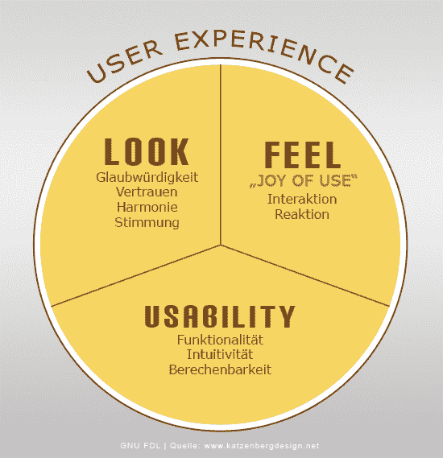

# 什么是可用性？

> 原文：<https://dev.to/eduardoramos/what-is-usability-ol8>

我先澄清一下:(以防万一！)可用性和用户体验(UX)不是一回事:产品的[可用性](https://www.interaction-design.org/literature/topics/usability)是塑造其 UX 的关键部分，因此属于 UX 的范畴。

虽然许多人可能认为可用性仅仅是关于产品的“易用性”，但它实际上包含了更多的东西。关于可用性的 ISO 9421 11 标准将其描述为:

> “产品在多大程度上可以被指定的用户使用，以实现指定的目标，在指定的[使用环境](https://www.interaction-design.org/literature/topics/context-of-use)中具有有效性、效率和满意度。”
> 
> –ISO 9421 人机系统交互工效学。

当你为了可用性而设计时，考虑效用
也很重要。可用性关注的是让功能简单易用，而实用性关注的是提供用户首先需要的功能。

 
*作者/版权所有者:GNU FDL 版权条款和许可:CC BY-SA 3.0*

只有当可用性与实用性相结合时，产品才会对用户有用。一个移动支付应用程序可以提供最有用的功能，在脸书上添加你周围的人，但因为该应用程序的大多数用户不需要这个功能，所以它对他们来说将是无用的。

如果不需要这个特性，你为构建最用户友好的特性所做的一切努力都将付之东流。

在这里阅读更多关于这个话题的内容: [**什么是可用性？**T3】](https://www.interaction-design.org/literature/topics/usability)