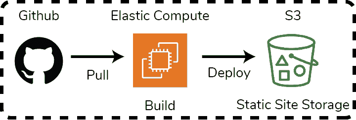
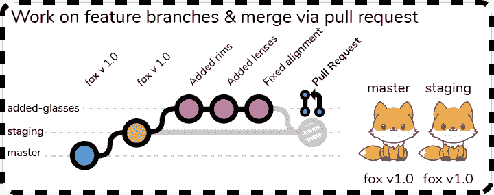

# 具有 AWS 放大器无服务器 Gatsby 流水线

> 原文：<https://dev.to/codemochi/serverless-gatsby-pipeline-with-aws-amplify-1eik>

现代网站是复杂的野兽，有许多事情你需要跟踪-控制网站功能的 javascript，样式和布局的考虑，以及你的后端 api，这只是几个广泛的主题。一个可能会耗费大量时间的方面是管理您的部署过程——也就是说，一旦您对代码进行了更新，您如何测试它的工作情况，并以可重复的方式进行部署，以便在安装了所有最新安全补丁以及正确设置了防火墙和服务器设置的服务器上与您的用户一起扩展。

无服务器部署正变得越来越受欢迎，因为您可以部署您的代码，并让您的云提供商处理所有繁琐的 DevOps 任务，包括部署您的基础架构、确保它随负载扩展、维护硬件故障备份等。

**AWS Amplify 如何融入我们的部署流程**

在本帖中，我们将介绍如何使用 AWS Amplify 为您实现整个管道的自动化。它将执行以下操作:

1.  当 Github 中的 staging 或 master 分支发生新的变化时，我们会触发 AWS Amplify。
2.  一个弹性计算实例将从 Github 中提取新代码，并运行任何自动化测试。
3.  然后，弹性计算实例将代码构建到工件中，并部署到 S3 存储桶中。

我们可以将这个部署管道与我们自己的 git 存储库管理实践相集成。让我们举一个例子，我们想给一只狐狸配一副时髦的新眼镜。我们有一个 staging 和 master 分支，它最初有我们的 fox 的 1.0 版本，这是简单而不加修饰的。

接下来，我们创建一个名为*附加眼镜*的新分支，我们致力于制造一些眼镜。我们在这方面做了很多工作，首先是制作镜架，然后是镜片，最后是校正校准。最后，工作完成后，我们发出一个拉请求。一旦批准，我们有一个新的承诺在我们的分期分支，这是我们的新更新的狐狸与她时髦的新眼镜。现在我们的管道开始运作——AWS Amplify 将构建这个新版本并将其部署到`staging.mydomain.com`

一旦代码在 S3 桶中，我们可以使用 Cloudfront，这是一个全球内容交付网络，将我们的代码分发到全球各地的服务器。Cloudfront 还将添加 SSL 证书管理，这将允许我们的网站使用`https://`而不是`http://`。在与用户交换敏感信息的任何时候，SSL 加密都是必要的，对于 SEO 来说也是很好的，因为它会提高你网站的搜索排名。这种东西设置起来可能会非常繁琐，所以 AWS 很好地解决了这个问题，基本上没有增加我们的工作量。

如果您通过 AWS 购买了域名，您可以通过 Amplify 自动连接域名。在幕后，Amplify 将设置您的 Route 53，以直接路由到您的 Cloudfront 发行版。

Amplify 的酷之处在于，我们可以为 staging 和 master 分支设置合并触发器，它们将彼此独立运行。这意味着您可以让您的登台分支将您的登台代码部署到`staging.yourdomain.com`，而您的主分支将仅在新的提交被发布到主分支时部署到您的`www.yourdomain.com`和`yourdomain.com`。这创建了两个完全独立的构建环境，允许我们在考虑合并到 master 之前测试或编写代码。

**为什么这如此伟大**

全栈开发人员的圣杯是只需担心编写前端和后端代码，并让其他一切，系统的手动测试、部署和扩展完全自动化和抽象化。Amplify 提供了几个主要特性来实现这一点:

1.  它建立了一个自动化的持续集成/持续部署(CI/CD)管道，以自动测试、构建和部署您的代码。
2.  Amplify 可以维护独立的环境，因此您可以将测试和生产分开。
3.  它将代码部署到 CDN 后面的 S3 桶中，这基本上是无限可扩展的。它还管理 SSL 证书。
4.  尽管超出了本文的范围，Amplify 还可以做许多其他事情，比如用户认证/授权、用户分析、错误报告和数据库部署。Nader Dabit 列举了几个在盖茨比身上体现这些特征的优秀例子。

**通过 AWS 自动部署 Gatsby 增强了分步指南**

在下面的视频系列中，我将带你一步一步地了解如何用 staging 和 master 分支建立自己的 Gatsby 项目。这涉及到我们在 Gatsby 项目中使用的 AWS Amplify 部署管道。这种无服务器的方法自动化了所有的部署步骤，因此您只需担心您的代码。

**第 1 部分:概述**

[https://www.youtube.com/embed/yFdBtOqCDMM](https://www.youtube.com/embed/yFdBtOqCDMM)

**第 2 部分:设置您的项目**

我们将在 Github 上创建一个空的存储库，然后在本地克隆它，以便修改我们的代码。然后，我们创建一个 starter Gatsby 项目，通过一个 feature 分支提交给 staging，最后将 staging 与 master 分支合并。

[https://www.youtube.com/embed/qDfp4s4fKC0](https://www.youtube.com/embed/qDfp4s4fKC0)

**第 3 部分:设置 AWS 放大器**

我们的代码库看起来状态很好——我们在阶段分支和主分支中都有一个工作项目。现在是时候将两个分支都连接到 AWS 代码部署管道了。

[https://www.youtube.com/embed/eUIv4d0pfQU](https://www.youtube.com/embed/eUIv4d0pfQU)

**第四部分:验证管道**

既然管道已经建立，我们需要验证它是否工作。在这里，我们将展示我们可以进行新的更改并将其提交到试运行，我们的试运行环境将会重建，但我们的生产环境不会。

[https://www.youtube.com/embed/Nx56HP_3gMI](https://www.youtube.com/embed/Nx56HP_3gMI)

**第五部分:设置自定义域**

此视频向您展示了如何将您自己的域名添加到您的两个环境中。到此结束时，您的试运行环境将位于`staging.yourdomain.com`，而您的生产将位于`www.yourdomain.com`。它还会经过重定向，这样我们就能确保所有的`http://`流量都被路由到`https://`，我们的 apex `yourdomain.com`域名也被重定向到`www.yourdomain.com`。当每个人都被定向到单个端点时，事情会变得容易得多，特别是出于分析目的，因此 Amplify 为我们提供了开箱即用的功能，这很好。

[https://www.youtube.com/embed/u1WtmMPnJ_Q](https://www.youtube.com/embed/u1WtmMPnJ_Q)

从那里来的还有更多！
[点击这里给我们您的电子邮件，我们会在发布新内容时通知您。](https://gmail.us20.list-manage.com/subscribe?u=37f38485b2c7cff2f3d9935b5&id=e3bc056dde)我们尊重您的电子邮件隐私，我们绝不会向您发送垃圾邮件，您可以随时退订。

最初发布于[codemochi.com](https://www.codemochi.com/blog/2019-05-29-serverless-react-gatsby-aws-amplify/)