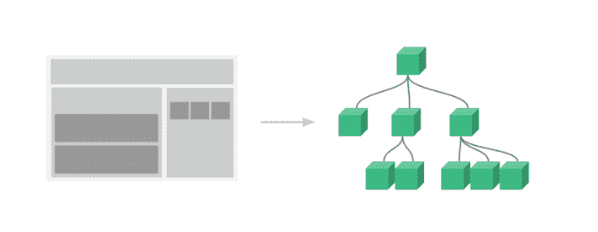
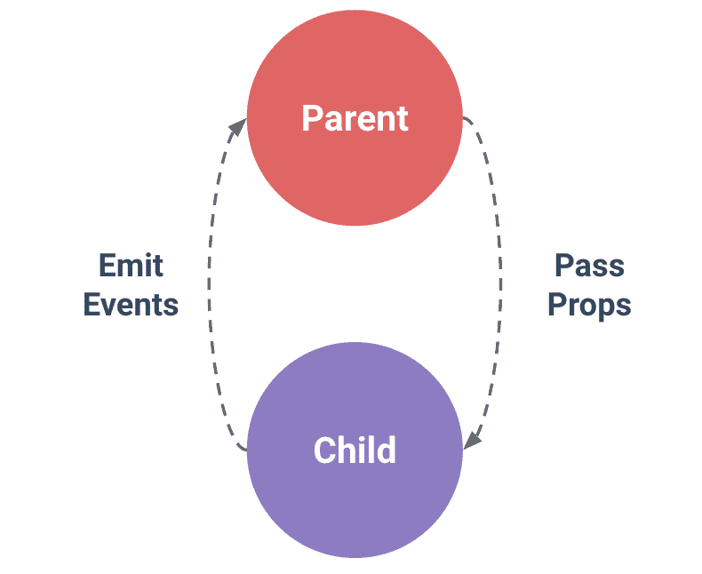

# 用 Vue 编码

> 原文：<https://dev.to/mstamstrom/coding-with-a-vue-ni8>

[](https://res.cloudinary.com/practicaldev/image/fetch/s--_RbQ_Hhx--/c_limit%2Cf_auto%2Cfl_progressive%2Cq_auto%2Cw_880/https://upload.wikimedia.org/wikipedia/commons/f/f1/Vue.png)

Vue 就是这个很酷，很流行，很容易学习的 UI 框架。你需要知道的只是 HTML、CSS 和 Javascript。因此，让我们深入研究并开始学习 Vue 如何工作，并使用 VueJS 构建一个应用程序。如果你已经知道 Vue 并且想直接跳到练习，这里有[链接](https://github.com/mStamstrom/vue-weather-app-exercises)

## 一个简介

Vue 是一个用于构建用户界面的渐进式框架。在这种情况下，渐进式意味着 Vue 既可以存在于现有的解决方案中，也可以通过其丰富的生态系统为整个网站提供动力。Vue 专注于 UI 更新，将路由和全局状态管理等部分排除在框架之外，但如果需要的话也很容易包含进来。

在 Vue 中构建应用程序时，每个页面都被分割成小的可重用组件，这些组件可以在组件和页面之间共享。
[](https://res.cloudinary.com/practicaldev/image/fetch/s--SY6E-52a--/c_limit%2Cf_auto%2Cfl_progressive%2Cq_auto%2Cw_880/https://thepracticaldev.s3.amazonaws.com/i/0nc7y6swxzwimnxmsfft.PNG) 
当把逻辑分解成更小的组件时，代码库变得更易管理，也更易测试。每个组件都有自己的状态，所以如果我们在几个地方重用一个组件，对一个组件的更改不会影响其他组件。

Vue 利用虚拟 DOM，因此可以决定何时最好地更新 DOM，并执行异步 DOM 更新。这提供了快速和优化的 UI 更新。

Vue.js 的核心是一个系统，它使我们能够使用简单的模板语法以声明方式将数据呈现给 DOM。考虑下面的例子。

```
 <div id="app">
    {{ message }}
  </div> 
```

```
 var app = new Vue({
    el: '#app',
    data: {
      message: 'Hello Vue'
    }
  }) 
```

```
 Hello Vue 
```

现在我们已经创建了我们的第一个应用程序，尽管它非常简单。然而，Vue 在幕后做了很多工作，现在已经将 DOM 与我们的组件数据联系起来。因此，当改变我们的数据时，视图也将改变，使得 Vue 组件是被动的。

### HTML、CSS 和 Javascript

学习 Vue 的唯一要求就是 HTML，CSS，Javascript。这也是每个组件的组成，分成不同的部分。每个 Vue 组件包括:

*   脚本标签，定义 Javascript

*   模板标签，定义 HTML

*   样式标签，定义 CSS

比如这是一个打印 Hello Vue 的组件！，正如我们所看到的，不外乎 HTML、CSS 和 Javascript。

```
 <script>
    export default {
      name: 'app',
      data: () => ({ message: 'Hello Vue!' }),
    }
  </script> 
  <template>
    <div class="app" >
      {{ message }}
    </div>
  </template> 
  <style scoped>
    .app {
      color: greeen;
    }
  </style> 
```

这是一个可导出的组件，可由任何其他组件使用。注意`<style scoped>`，这是包含在 Vue 中的东西，它使样式的作用范围局限于当前组件，不会影响其他类。

## 检视例项

每个 Vue 应用程序都是从使用函数`Vue`
创建一个 Vue 实例开始的

```
new Vue({
  render: h => h(App),
}).$mount('#app') 
```

在`main.js`文件中通常是这样的。这里我们创建了我们的 Vue 实例，并告诉 Vue 根组件是 App，它是在`main.js`中导入的。然后 Vue 将创建 App 组件及其所有子组件的组件树，依此类推。当 Vue 创建了组件树并计算了它的初始状态后，它会将组件树插入到`#app`元素中，通常是根 HTML 文件中的一个 div 元素。

### 数据

如果我们考虑根 Vue 实例，这个实例需要知道何时对组件树中的组件执行更新。这就是数据属性的用武之地。data 属性告诉 Vue 哪些属性应该触发该组件的重新呈现。

其工作原理是，当 Vue 创建组件树时，它检查所有组件数据属性中的所有属性，并为每个属性创建 getters 和 setters。当其中一个数据属性发生变化时，Vue 将收到一个事件，从而触发重新渲染。

```
 data: function() {
    return { message: '' };
  } 
```

所以在上面的例子中，当消息发生变化时，Vue 会触发这个组件的重新呈现。data 属性中的属性是直接在这个下面访问的，所以在这种情况下，`message`可以用`this.message`来修改

### 方法

方法是我们通常放置关于组件状态变化的逻辑的地方。考虑下面的

```
 <script>
    export default {
      name: 'app',
      data: () => ({
        clicks: 0,
      }),
      methods: {
        onClick() {
          this.clicks = this.clicks + 1;
        },
      },
    }
  </script> 
  <template>
    <div>
      <button @click="onClick">click me</button>
      <div>
        You clicked {{ clicks }} times!!
      </div>
    </div>
  </template> 
```

这个简单的组件计算每次点击。当我们单击时，我们调用 onClick 方法来更新这个组件的 clicks 数据属性。当 clicks 数据变量更新时，Vue 会注意到并执行该组件的重新呈现，然后显示该组件状态的正确值。

## 模板语法

Vue 使用了一种类似 HTML 的模板语法，这种语法非常强大，消除了在模板中编写 Javascript 的大部分需要。在模板中，我们编写 HTML，使用一些额外的 Vue 指令，并声明性地将呈现的 DOM 元素与 Vue 实例数据绑定。

最基本的数据绑定类型是双括号，用于将数据打印到 DOM

```
 <div>
    {{ message }}
  </div> 
```

### 数据绑定

当我们想要将某段数据绑定到模板中的组件或元素声明时，我们使用 v-on 指令。

```
 <h1 v-on:title="title">
    {{ message }}
  </h1> 
```

`v-on`告知`title`是 javascript 元素，应该位于组件的 script 标签中。`v-on`有一个常用的简写，`:`

```
 <h1 :title="title">
    {{ message }}
  </h1> 
```

### 事件

当我们想监听一个 DOM 事件时，比如 click，我们也用`v-on` vue 指令来监听。Vue 对事件有不同的简写，`@`

```
 <button v-on:click="actionOnClick">
    click me
  </button>

  <!-- shorthand -->
  <button @click="actionOnClick">
    click me
  </button> 
```

### v-if vs v-show

`v-if`和`v-show`是决定元素是否应该显示在 UI 中的两种不同方式。它们的一个关键区别在于，`v-if`在元素为假时从 DOM 中移除元素，而`v-show`设置`display:none`。

```
 <div v-if="show" />

  <div v-show="show" /> 
```

### v-for

`v-for`用于迭代模板中的元素。键“必须”给定，因为它是 Vue 绑定到元素的 DOM 的键。该元素的键必须是唯一的，提供不唯一的键将导致错误的更新。

```
 <div v-for="item in items" :key="item.id">
    {{ item.name }}
  </div> 
```

不要这样做

```
 <div v-for="(item, index) in items" :key="index">
    {{ item.name }}
  </div> 
```

因为索引不是特定于条目的，而是特定于迭代的，如果条目中的元素会改变位置，比如在排序或过滤时，错误的元素会更新。

## 元件通讯

正如我们在组件一节中看到的，Vue 应用程序中的页面是由组件树中的许多小组件组成的。我们经常想要在组件树中的组件之间进行通信。有两种沟通方式，向上和向下。当我们向下通信时，我们将数据向下发送到子组件，这将在子组件中作为道具可见。当子组件想要与父组件通信时，它们会发出一个事件。

[](https://res.cloudinary.com/practicaldev/image/fetch/s--4G2xSPO7--/c_limit%2Cf_auto%2Cfl_progressive%2Cq_auto%2Cw_880/https://thepracticaldev.s3.amazonaws.com/i/hw0ifrkkuciqgucy9sm6.png)

我们也举例说明一下

```
 <script>
    export default {
      name: 'animals',
      data: () => ({
        animalList: ['dog', 'cat', 'horse']
        selectedAnimal: '',
      }),
      methods: {
        onSelect(animal) {
          this.selectedAnimal = animal;
        },
      },
    }
  </script> 
  <template>
    <div>
      <dropdown :list="animalList" @selected="onSelect">
      <div v-if="selectedAnimal">
        You selected {{ selectedAnimal }}
      </div>
    </div>
  </template> 
```

首先，我们有一个动物组件，这个组件显示一个下拉列表和下拉列表中的选定值。我们将希望下拉列表显示的列表发送给该组件，并监听事件`selected`，为此我们设置了 selectedAnimal `data`属性。

```
 <script>
    export default {
      name: 'dropdown',
      props: ['list'],
      methods: {
        onSelect(event) {
          this.$emit('selected', event.target.value);
        }
      }
    }
  </script> 
  <template>
    <select @change="onSelect">
      <option v-for="item in list" :value="item" :key="item">{{item}}</option>
    <select>
  </template> 
```

dropdown 组件呈现 props 提供给它的列表，并在选择 dropdown 中的值时发出一个事件。这显示了数据如何通过 props 流向子组件，以及事件如何被父组件发出和监听。

## 计算属性

Computed 是组件中的 getters。getters 的结果被缓存，只有当它们在数据属性中依赖的值改变时，才会重新计算。Computeds 既可以在脚本标记中使用，也可以在模板标记中使用。

```
 computed: {
    getMessage() {
      return this.message.firstname + '' + this.message.lastname;
    }
  } 
```

因此，第一次使用这个 computed 时，结果将被缓存，只有在消息数据属性发生变化时才会被重新计算。

Computeds 也是放置 Javascript 代码的好地方，否则这些代码会放在模板中，这是 vue 模板指令没有涉及到的。例如，当我们只想在模板中迭代数组的一部分时。

```
 computed: {
    getFilteredArray() {
      return this.array.filter(item => item.message === this.message);
    }
  } 
```

然后我们可以过滤模板中计算的`getFilteredArray`,而不是直接在模板中使用 Javascript。

## 手表属性

在 watch 属性中，我们可以监听数据、计算数据或 props 中的变化，当它们发生变化时，会触发一个回调。喜欢

```
 watch: {
    message(value) {
      this.doStuff();
    }
  } 
```

在这种情况下，当消息改变时，我们将调用 doStuff。

### 生命周期事件

组件树中组件的每个实例都有一个生命周期，简而言之:

*   它是在插入 DOM 时创建的

*   如果属性或数据发生变化，它会在 DOM 中更新

*   当它应该从 DOM 中移除时，它被销毁了。

在一个 Vue 组件中，我们可以监听这些事件，当它们发生时，挂钩到这些事件并执行动作。例如，一个生命周期事件叫做 mounted，当组件实例被装载到 DOM 中时它被触发。这个事件将在每个组件实例的生命周期中发生一次，当这个事件发生时，我们可以决定在我们的组件挂载后做什么。例如:

```
 mounted() {
    this.fetchFromApi().then(res => this.resultFromApi = res);
  } 
```

最常用的生命周期事件有:

*   创建，在组件创建时，插入 DOM 之前

*   当组件被插入到 DOM 中时被挂载

*   组件将重新呈现时更新

*   销毁，当组件被销毁时

有关每个生命周期事件何时触发的完整示例，请参见 vues 文档中的[生命周期图。](https://vuejs.org/v2/guide/instance.html#Lifecycle-Diagram)

## 习题

看完这篇文章，希望你对 VueJS 有了很好的介绍。我创建了一系列练习来测试 VueJs 并构建一个天气应用程序。请查看我的 [github](https://github.com/mStamstrom/vue-weather-app-exercises) 上的练习。