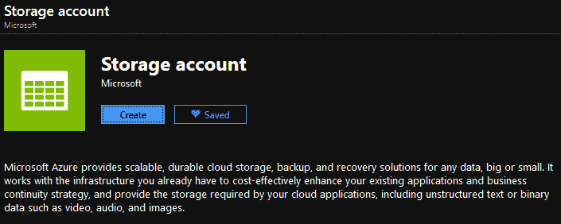
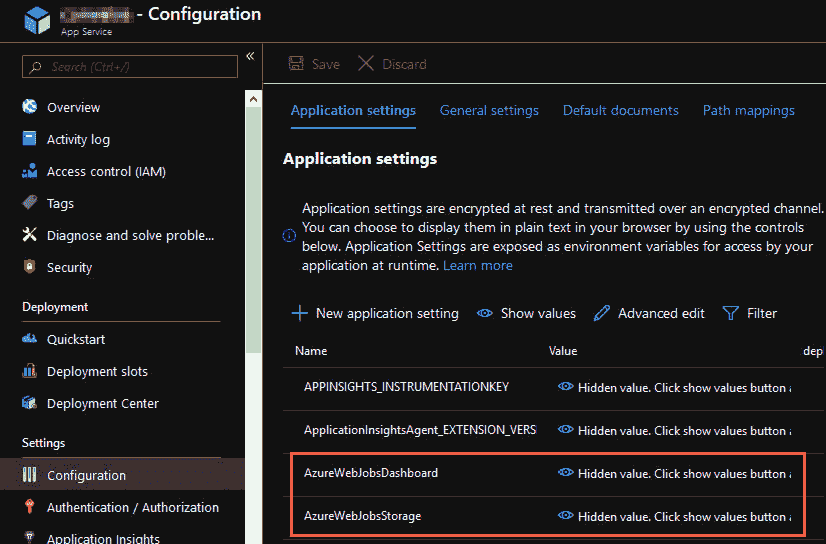
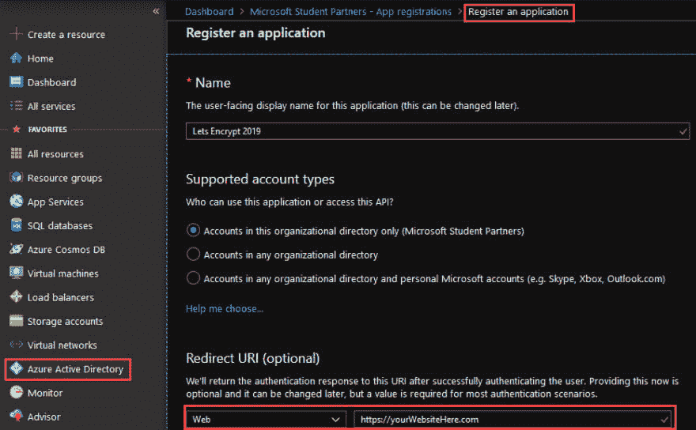
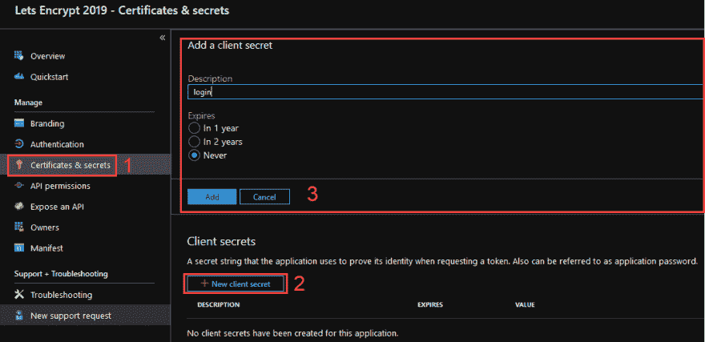
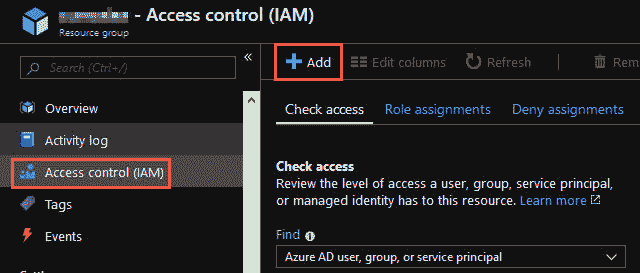
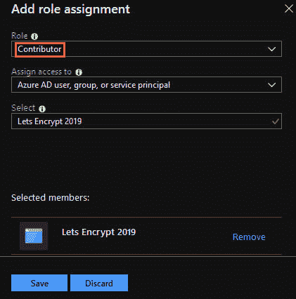
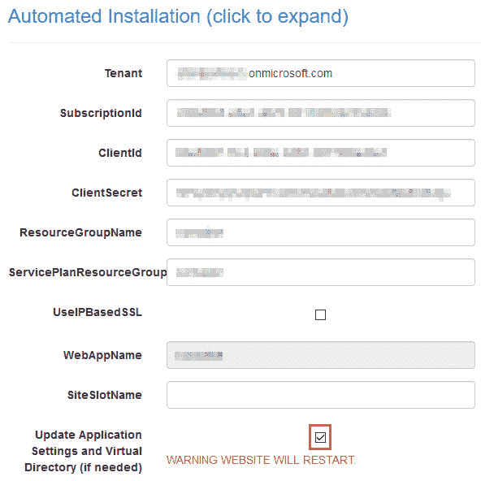

# 如何:让我们为 Azure Web App 服务加密证书

> 原文：<https://dev.to/jakob_vdh/how-to-let-s-encrypt-certificates-for-azure-web-app-service-524a>

# 如何在几分钟内用 SSL 免费保护你的 Azure 网站🔒

在这篇文章中，我将一步一步地指导你为 Azure 上的 [Web App 服务托管的任何 Web 应用添加免费的](https://azure.microsoft.com/en-us/services/app-service/web/) [Let's Encrypt Certificates](https://letsencrypt.org/) 。
Let ' s Encrypt SSL 证书的问题是它们只能持续 90 天。但是，嘿，没有自动化解决不了的问题。

本教程将基于 Simon J.K. Pedersen 的 Azure Web 应用程序站点扩展“Azure Let's Encrypt”。
(小声明:站点扩展是**不是微软支持的**，我用它做了很多小项目，到目前为止效果很好)。

## [sjkp](https://github.com/sjkp)/[let sencrypt-site extension](https://github.com/sjkp/letsencrypt-siteextension)

### Azure Web App Site Extension 便于安装和配置，让我们为自定义域名加密已颁发的 SSL 证书。

<article class="markdown-body entry-content container-lg" itemprop="text">

# 让我们加密站点扩展

这个 Azure Web App 站点扩展支持轻松安装和配置[让我们为您的自定义域名加密](https://letsencrypt.org/)颁发的 SSL 证书。

站点扩展要求您已经为自定义域配置了 DNS 条目，以指向 Azure Web App。

2019 年 11 月-微软最终承认，也许是时候为免费 SSL 证书添加一级支持了，请参见关于[应用服务管理证书](https://azure.microsoft.com/en-us/updates/secure-your-custom-domains-at-no-cost-with-app-service-managed-certificates-preview/)的公告，请注意，它处于预览阶段，目前**不支持**apex/naked 域。

## 如何安装

[https://github . com/sjkp/lets encrypt-site extension/wiki/How-to-install](https://github.com/sjkp/letsencrypt-siteextension/wiki/How-to-install)

## 已知问题

*   这个站点扩展是由微软支持的**而不是**，它是我自己基于 https://github.com/fszlin/certes[的工作——这意味着不要期望 24x7 的支持，我在我自己的几个较小的站点上使用它，但是如果你运行的站点很重要，你应该考虑花几美元买一个证书…](https://github.com/fszlin/certes)

</article>

[View on GitHub](https://github.com/sjkp/letsencrypt-siteextension)

## ✅要求:

1.  Azure 帐户([如果你是学生，请点击此处了解如何获得免费的 Azure 资源。](//bit.ly/tutorial-azure-for-students))
2.  使用应用程序服务 Web Apps 托管的 Web 应用程序(可以是简单的 HTML 和 CSS 或类似 React 的东西)
3.  您自己的自定义 DNS 条目配置为指向您的 Web 应用程序。

⚠:理想情况下，你的应用服务计划和应用服务在同一个资源组。

## Azure 存储账户

首先，我们将创建一个 Azure 存储帐户，以便扩展能够通过使用 Azure WebJobs 每 3 个月更新一次加密证书。

存储账户必须为`Storage`或`StorageV2`，`BlobStorage`无效

现在，我们需要添加两个应用程序设置，分别名为`AzureWebJobsDashboard`和`AzureWebJobsStorage`，以及我们之前创建的存储帐户的连接字符串。连接字符串应该是这样的:`DefaultEndpointsProtocol=https;AccountName=[myaccount];AccountKey=[mykey];`。

## 蔚蓝服务原则

为了让扩展在无人值守和没有我们人工干预的情况下工作，我们需要创建一个 Azure 服务原则，它基本上是作为一个“代表”委托 Azure AD 入口工作的。

1.  进入您想要用来创建新应用程序的 Azure Active Directory (AAD)目录。
2.  在目录面板中选择`App Registrations`。
3.  创建一个新的应用程序，如图所示进行设置。

    

4.  为应用程序创建新的客户端密码。请确保您保存了生成的密码，因为您将**而不是**能够再次以明文形式访问它！

    

5.  返回到 Overview 选项卡，并保存应用程序(客户端)ID。要继续，您现在应该有了**客户端秘密**和**应用程序 ID** 。

6.  现在，服务原则需要为您的应用服务和应用服务计划的资源组提供**访问权限。
    这可以通过访问资源组的`Access control (IAM)`菜单，然后点击“添加”按钮来完成。**

    

7.  在接下来的菜单中，选择`Contributor`角色并将其添加到创建的服务原则中。

    

⚠如果您在资源组中有进一步的服务，您还可以仅将`Contributor`角色添加到应用服务和服务计划中。

## 安装 let 加密站点扩展

现在我们已经设置了扩展工作的所有必要条件，我们可以安装和配置它了。

转到您的应用服务，在应用服务菜单中搜索扩展站点。在站点上通过 SJKP 添加扩展名`Azure Let's Encrypt`。

## 配置让加密站点扩展

要配置扩展，我们需要前往应用服务的`Advanced Tools`页面。你可以通过在菜单的搜索栏中搜索`Advanced Tools`来找到它，它会带你去一个像`https://<yourDomain>.scm.azurewebsites.net`这样的网站。
要进入扩展设置，你只需点击顶部菜单中的`Site extensions`按钮，然后点击扩展的“启动”按钮。它将带您到扩展的配置页面，如下图所示。

*   **租户**:是服务主体在其中创建的 Azure AD 目录(租户)——`<yourTenantDomain>.onmicrosoft.com`。
*   **SubscriptionId** :是您用于资源组的订阅的 Id(该 Id 也显示在您的资源组的“概述”页面上)。此外，您可以从([https://portal . Azure . com/# blade/Microsoft _ Azure _ Billing/subscription blade)【https://portal . Azure . com/# blade/Microsoft _ Azure _ Billing/subscription blade】](https://portal.azure.com/#blade/Microsoft_Azure_Billing/SubscriptionsBlade)%5Bhttps://portal.azure.com/#blade/Microsoft_Azure_Billing/SubscriptionsBlade%5D)获得您能够访问的 id。
*   **ClienId 和 ClientSecret** :是你希望从我们创建的**服务原则**中得到的 Id 和秘密。
*   **ResourceGroupName** :是您的应用服务的资源组的名称。
*   **ServicePlanResourceGroupName**:如果服务计划和 App 服务在同一个资源组，该名称与`ResourceGroupName`相同。否则，您必须输入服务计划所在的资源组的名称(如果是这样，请记住也要授予服务主体对该资源组的访问权限)。
*   **更新应用程序设置**:第一次运行时应设为 true，将所有设置保存为 web 应用程序设置。这是必需的，以便在 WebJob 续订证书时设置可用。

完成后，您将看到自定义域、SSL 绑定和证书的概述。因为您仍然需要生成它们，所以您应该继续到下一页。在那里，您可以选择您想要为其申请 SSL 证书的域(您可以通过按住 Ctrl 键来选择多个域)。在此之前，您需要提供一个电子邮件地址，该地址将收到“让我们加密”的警告，例如在证书未更新的情况下。

这就是你需要做的一切，玩得开心！🐱‍💻

## ⚠排除⚠故障

因为 Let's Encrypt 需要到达你的页面，才能授权你的域名，所以要确保这个 URL 是公众可以访问的:`http://<yourDomain>.com/.well-known/acme-challenge/`。在大多数错误情况下，无法访问此 URL，例如，因为 web.config 中的规则集或因为应用程序服务设置中强制使用 https。

