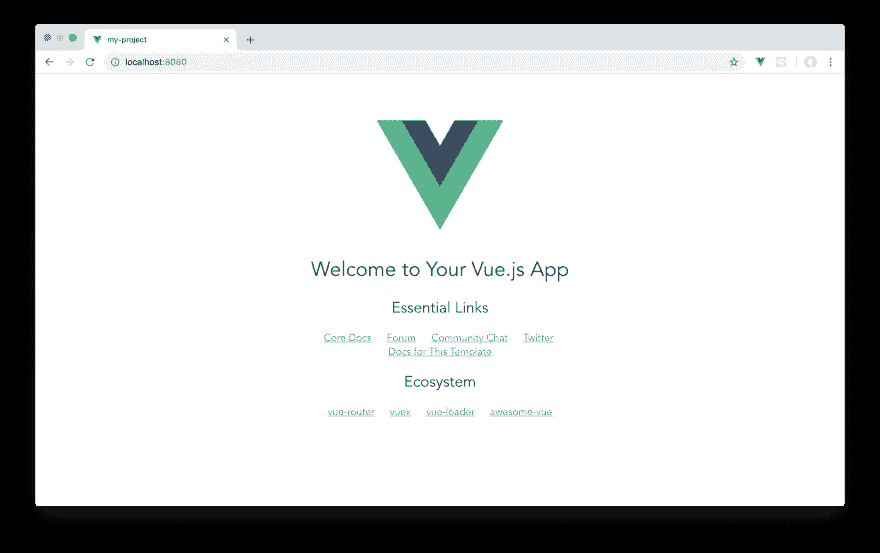
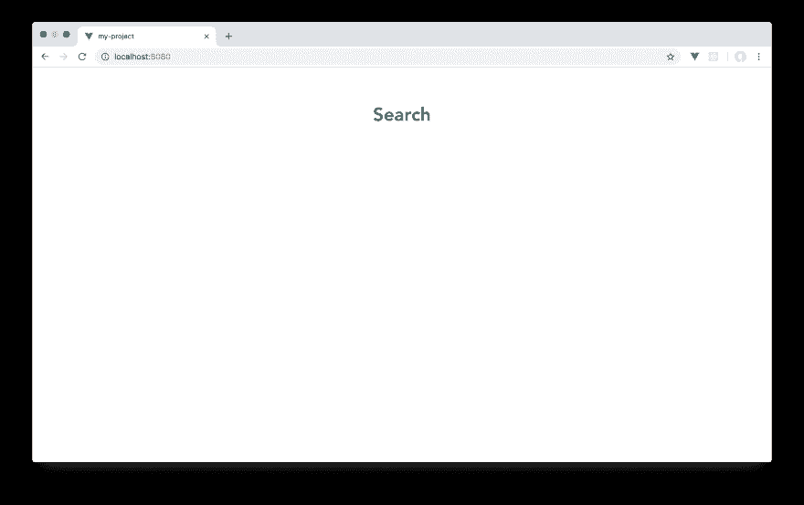
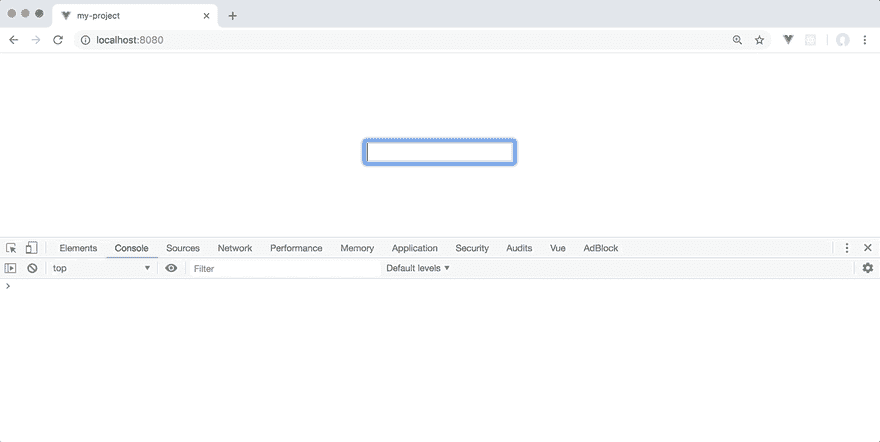
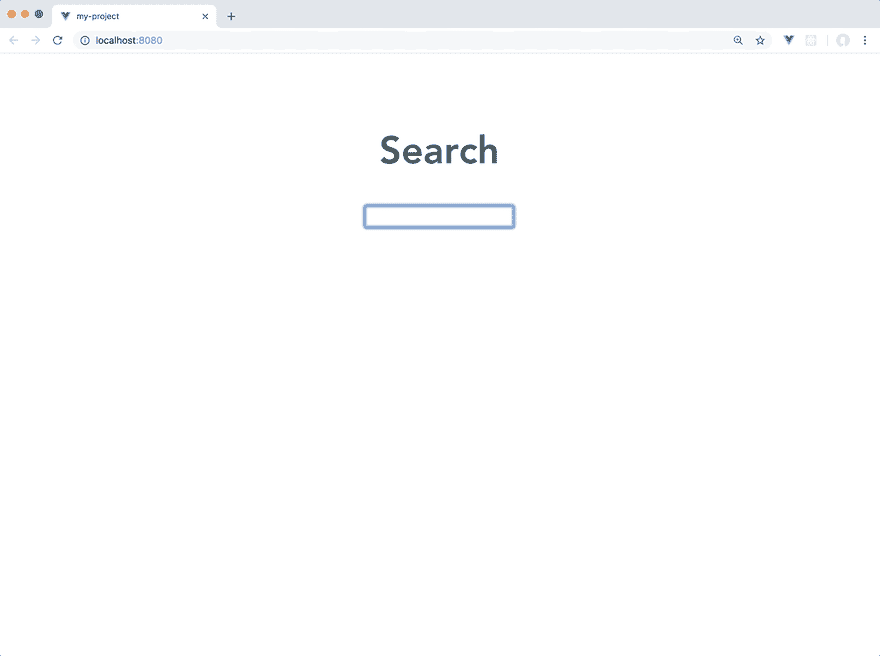

# 通过 Vue.js 和 axios 使用电影数据库(TMDb)

> 原文：<https://dev.to/mustafaturk/using-the-movie-database-tmdb-with-vue-js-and-axios-1dn8>

我们将创建一个可以搜索电影的应用程序。在这里，我们将使用 **Vue.js、电影数据库(TMDb)** 和 **axios** 。

## 入门

打开你的终端，输入以下命令:

```
$ vue init webpack my-project
$ cd my-project
$ npm install
$ npm run dev
$ npm install axios 
```

这将创建一个新的 Vue 应用程序并安装 axios。Webpack 将在端口`8080`上开始为您的项目提供服务。

[](https://res.cloudinary.com/practicaldev/image/fetch/s--n6uqVvHX--/c_limit%2Cf_auto%2Cfl_progressive%2Cq_auto%2Cw_880/https://thepracticaldev.s3.amazonaws.com/i/2dlxti4io6k62rqlwy3m.png)

## 我们来收拾一下吧！

在您最喜欢的文本编辑器中打开您的项目。打开`/src/App.vue`并删除第 3 行和第 4 行的`<HelloWorld/>`组件和``标签。

现在，让我们在`/src/components`文件夹中创建自己的组件，并将其命名为`Search.vue`。

在`Search.vue`组件内部，粘贴以下代码:

```
<template>
  <div class="search">
    <h1>Search</h1>
  </div>
</template>
<script>
import axios from 'axios'
export default {
  name: 'search',
  data () {
    return {

    }
  }
}
</script> 
```

这是我们组件的起始模板。让我们跳回`/src/App.js`并添加我们新创建的组件。
您可以复制并粘贴以下代码块:

```
<template>
 <div id='app'>
  <Search/>
 </div>
</template>
<script>
import Search from './components/Search'
export default {
 name: 'App',
 components: {
  Search
 }
}
</script> 
```

现在，您应该会看到类似这样的内容:

[](https://res.cloudinary.com/practicaldev/image/fetch/s--t7LNdJ28--/c_limit%2Cf_auto%2Cfl_progressive%2Cq_auto%2Cw_880/https://thepracticaldev.s3.amazonaws.com/i/v3ijimzjit90j2i3ywl8.png)

## 我们来听听输入

现在我们有了这个，我们可以继续添加更多的代码。我们要创建一个电影搜索应用程序，所以我们需要一个输入元素来搜索。

让我们在`Search.vue` :
中的`<h1>`元素下添加输入元素

```
<input type='text' v-model='query' @keyup='getResult(query)'> 
```

在每次击键时，我们都要运行`getResult`函数。让我们在脚本中声明。复制下面的代码，并用您的`<script>`标签替换它:

```
<script>
import axios from 'axios'
export default {
 name: 'search',
 data () {
 return {
  query: '',
}
 },
 methods: {
  getResult(query) {
   console.log(query)
  }
 }
}
</script> 
```

如您所见，我们已经添加了一个函数，该函数将记录控制台中每个 keyup 上的搜索查询。如果一切顺利，我们应该在控制台中看到搜索查询。

[](https://res.cloudinary.com/practicaldev/image/fetch/s--EiuHl06A--/c_limit%2Cf_auto%2Cfl_progressive%2Cq_66%2Cw_880/https://thepracticaldev.s3.amazonaws.com/i/1vh59bnhk2ozs8g7i7u1.gif)

## 使用 axios 的 HTTP 请求

现在让我们更改我们的`getResult`方法，这样我们就可以执行 HTTP 请求(用您自己的 API 键 [TMDb](https://www.themoviedb.org/documentation/api) 替换 hash tags):

```
<template>
  <div class='search'>
     <h1>Search</h1>
     <input type='text' v-model='query' @keyup='getResult(query)'>
  </div>
</template>
<script>
import axios from 'axios'
export default {
 name: 'search',
 data () {
  return {
   query: '',
   results: ''
  }
 },
 methods: {
  getResult(query) {
   axios.get('https://api.themoviedb.org/3/search/movie?  api_key=##################query=' + query).then(response => { this.results = response.data.results })
     console.log(this.results)
   }
 }
}
</script> 
```

这将执行 GET 请求并将结果传递给我们的结果数组。现在我们可以在控制台中看到 GET 请求的结果，但是仍然不能在页面上看到。让我们现在就做吧！

## 显示结果

我们将对结果数组进行循环，并在页面上打印结果。我们需要一个 div，在那里我们可以使用 v-for 指令并呈现我们的结果。在里面，我们可以放置一个`<p>`和``标签来显示电影的标题和海报。复制以下内容，并在`/src/components/Search.vue`用您的`<template>`替换:

```
<template>
 <div class='search'>
  <h1>Search</h1>
  <input type='text' v-model='query' @keyup='getResult(query)'>
  <div v-for='result in results' :key='result.id'>
   <p>{{result.title}}</p>
   
  </div>
 </div>
</template> 
```

[](https://res.cloudinary.com/practicaldev/image/fetch/s--42WrwnhC--/c_limit%2Cf_auto%2Cfl_progressive%2Cq_66%2Cw_880/https://thepracticaldev.s3.amazonaws.com/i/l64wd5011zsanp07lxdz.gif)

恭喜你，你成功了！👏👏👏