# 这就是如何轻松地将静态站点部署到 Azure

> 原文：<https://dev.to/azure/this-is-how-to-easily-deploy-a-static-site-to-azure-31on>

周末，我买了我的第一辆新车:一辆红色的轻便摩托车。那是我这个价位唯一能买到的东西。

[](https://res.cloudinary.com/practicaldev/image/fetch/s--smqrpM8Q--/c_limit%2Cf_auto%2Cfl_progressive%2Cq_auto%2Cw_880/https://cdn-images-1.medium.com/max/1000/1%2AigNXrT_-JvgxJSeJ745Owg.jpeg)

这是多么光荣的事情啊！风以惊人的每小时 35 英里的速度抽打着你的身体，你独自一人思考着。你思考宇宙的细微之处:存在主义的问题，如“我在这东西上看起来很傻吗”、“你能在死之前吃多少虫子”和“我有多少种方法可以将一个静态站点部署到 Azure”？

### 什么叫静地盘，助力车小子？

好问题。但是我们能不能不叫我“助力车男孩”？我是说它有 150 毫升。我可以做到 55 岁。顺风下坡。

像 [PHP](https://php.net/) 、【ASP.NET】T2 和 [Django](https://www.djangoproject.com/) 这样的框架在运行中组装页面。当一个站点被请求时，服务器执行一些查询或操作，组装标记并发送一个“页面”给你。

[](https://res.cloudinary.com/practicaldev/image/fetch/s--ftAJl7no--/c_limit%2Cf_auto%2Cfl_progressive%2Cq_auto%2Cw_880/https://cdn-images-1.medium.com/max/600/1%2A69aS6OhjDU3RBeSRqXiaFA.png)

“静态站点”是指任何使用服务器端框架的**而非**站点。它只是 HTML，CSS 和 JavaScript。如今，大多数静态网站都是用 Angular、React 或 Vue(按字母顺序排列，深呼吸)构建的某种形式的单页应用程序。我想我现在也应该把苗条列入那份名单了。

[](https://res.cloudinary.com/practicaldev/image/fetch/s--45IA8EIn--/c_limit%2Cf_auto%2Cfl_progressive%2Cq_auto%2Cw_880/https://cdn-images-1.medium.com/max/600/1%2Asar590LUigydRl6LkIqU7Q.png) 

<figcaption>我也不确定为什么心情这么差就把我的服务器画出来了。我想这是因为如果我是一个服务器，我会有这种感觉。吃力不讨好的工作。没人在乎，直到你倒下，然后每个人都疯了。</figcaption>

“那么这篇文章是关于如何托管 index.html 文件的？真的吗？”。

不。我是说，算是吧。实际上，是的。

### 天蓝色储物

Azure 存储是专门为尽快提供文件而设计的。静态站点只是文件。

[Azure 存储中的静态网站托管](https://docs.microsoft.com/azure/storage/blobs/storage-blob-static-website?WT.mc_id=personal-medium-buhollan)

因为上帝爱你，希望你幸福，所以有 VS 代码。而且因为微软爱你，所以有 Azure 存储扩展。

[Azure Storage-Visual Studio market place](https://marketplace.visualstudio.com/items?itemName=ms-azuretools.vscode-azurestorage&WT.mc_id=personal-medium-buhollan)

安装完成后，您将创建一个存储帐户。这非常简单快捷。短到可以放进这张 GIF 里。

[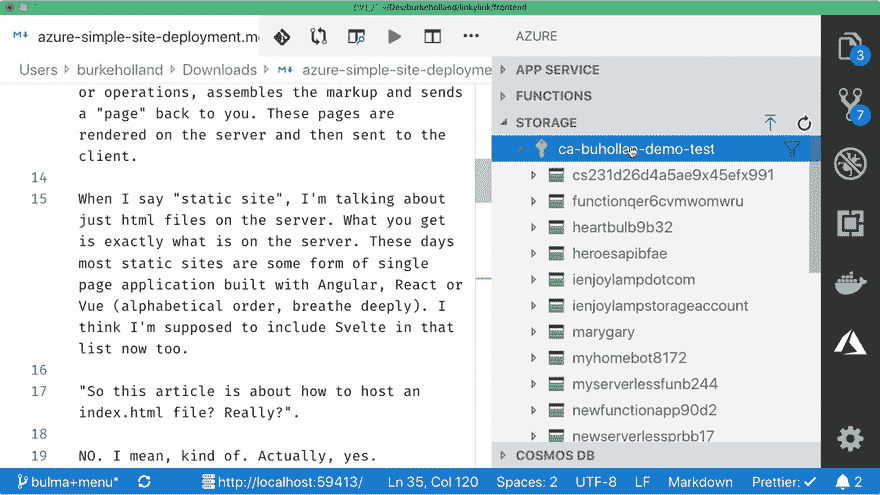](https://res.cloudinary.com/practicaldev/image/fetch/s--l25M0xwB--/c_limit%2Cf_auto%2Cfl_progressive%2Cq_66%2Cw_880/https://cdn-images-1.medium.com/max/1024/1%2APy8u-X-STzMXvL_YKOE1Iw.gif)

来自 Azure Functions 团队的 Jeff Hollan 前几天发了一条很酷的推文，内容是用“deleteme”命名临时资源组，然后用 PowerShell 函数每天删除它们。这样你就可以四处游玩，而不会最终收到一张你没有预料到的账单。

> 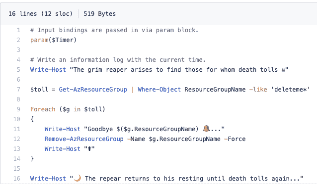杰夫·霍兰@杰夫·霍兰当我创建一个快速演示或再现时，我会在我的资源组前面加上“delete me”——但有时会忘记清理它们。刚刚写了一个快速 PowerShell[@ azure functions](https://twitter.com/AzureFunctions)每天晚上自动为我做！花了大约 10 分钟和 10 行🎉22:24PM-2019 年 5 月 26 日[](https://twitter.com/intent/tweet?in_reply_to=1132774507821748224)[](https://twitter.com/intent/retweet?tweet_id=1132774507821748224)83[](https://twitter.com/intent/like?tweet_id=1132774507821748224)384

该帐户将被创建并显示在存储扩展下的侧栏中。

[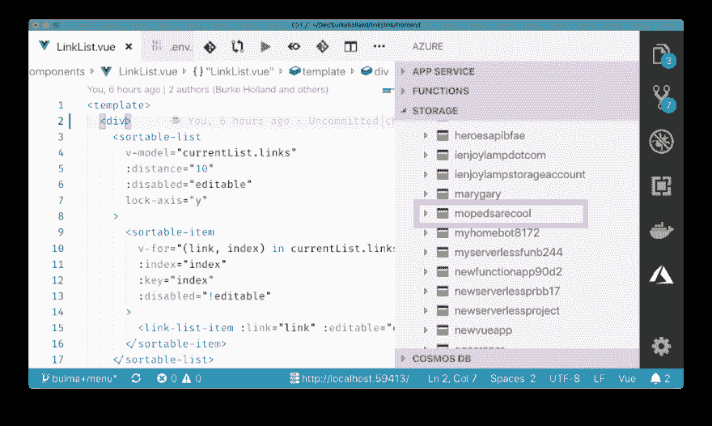](https://res.cloudinary.com/practicaldev/image/fetch/s--besE5aXX--/c_limit%2Cf_auto%2Cfl_progressive%2Cq_auto%2Cw_880/https://cdn-images-1.medium.com/max/1024/1%2A6IXOSL6kZcJ3GMizLC3u7g.png)

Azure 存储是用来服务文件的，所以我们需要告诉它，我们希望它像 web 服务器一样服务我们的文件。为此，打开命令调板，选择“配置静态网站”。

[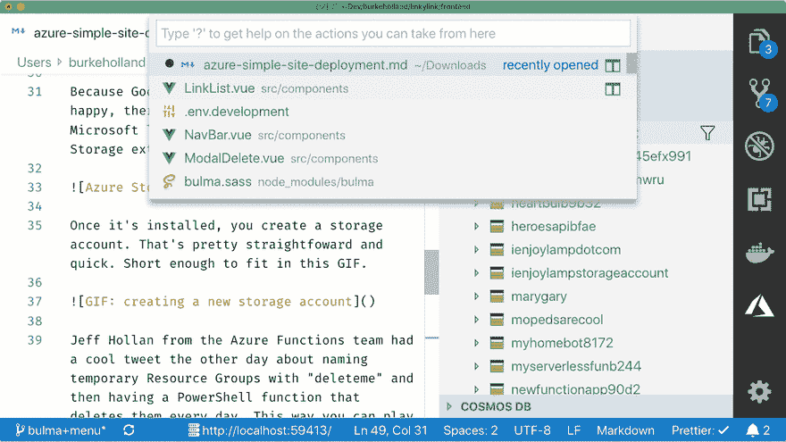](https://res.cloudinary.com/practicaldev/image/fetch/s--rFvfx5wL--/c_limit%2Cf_auto%2Cfl_progressive%2Cq_66%2Cw_880/https://cdn-images-1.medium.com/max/1024/1%2AOB5z_9Wv3mgy2XMrkN76dw.gif)

它询问“index.html”页面是什么。那通常只是“index.html”。然后它要求一个 404 页面。因为我们有一个单页面应用程序，所以我们要将所有流量重定向回“index.html”页面，并自己处理路由。

现在，我们只需要右键单击我们的“dist”或“build”或任何包含 Webpack 通过 Webpack 所做的任何事情(除了 [Sean Larkin](https://twitter.com/TheLarkInn) 没有人知道)而创建的构建资产的文件夹，然后选择“Deploy To Static Website”。在这种情况下，我将部署一个用 Vue 编写的站点。

[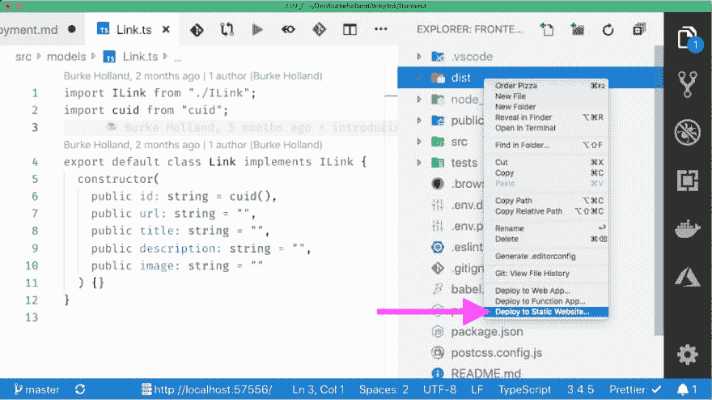](https://res.cloudinary.com/practicaldev/image/fetch/s---kmHcWjg--/c_limit%2Cf_auto%2Cfl_progressive%2Cq_auto%2Cw_880/https://cdn-images-1.medium.com/max/1024/1%2AyGN41vTumZskHeRHOoKYpA.png)

仅此而已。该扩展将提示您浏览网站。你会惊叹自己的生产力，考虑连续第三个晚上吃披萨。去吧。犒劳自己。

[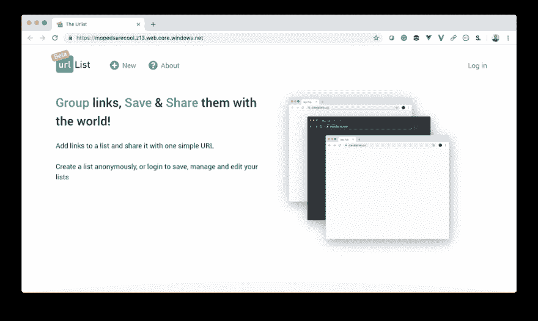](https://res.cloudinary.com/practicaldev/image/fetch/s--047w4U0k--/c_limit%2Cf_auto%2Cfl_progressive%2Cq_auto%2Cw_880/https://cdn-images-1.medium.com/max/1024/1%2A153NnRgd61tH9U4URyjCNg.png)

Azure 存储是托管静态站点的首选方法。原因如下…

*   很简单
*   它很快
*   它很便宜——每月每 g 存储 20 美分/每 g 出站数据传输 8 美分，但每月前 5g 是免费的。
*   它会自动缩放
*   它没有服务器。我用了一个流行词。你现在必须被说服。

### Azure App 服务

App Service 是 Azure 的平台即服务或“PaaS”。它不同于存储，因为它为您的服务器端项目提供了运行时。如果你有一个 ASP.NET 应用程序，你会在应用服务中运行它。你不能在 Azure 存储中运行它，因为存储不知道如何运行应用程序。

[Azure 应用服务文档-教程、API 参考](https://docs.microsoft.com/azure/app-service/?WT.mc_id=personal-medium-buhollan)

你可以在 App Service 中托管一个静态站点，但是因为它是为更强大的服务器端工作流设计的，所以我们需要稍微“巧妙”一些。

伙计们，小心点。

我将通过 VS 代码做所有事情，因为这是我生活中想做的所有事情。我很乐意接受 Outlook 的 VS 代码扩展。免费的创业想法就在那里。

[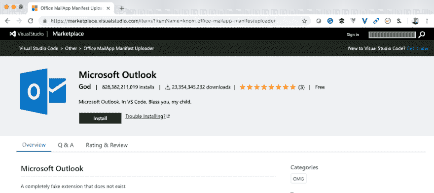](https://res.cloudinary.com/practicaldev/image/fetch/s--aPrs3vOy--/c_limit%2Cf_auto%2Cfl_progressive%2Cq_auto%2Cw_880/https://cdn-images-1.medium.com/max/1024/1%2AGvs5rpNLh3I6hTMApKe4PQ.png)

当你建立一个新的应用服务实例时，你可以在应用服务中选择 Linux 或者 Windows 主机，所以我将介绍如何将你的静态站点发布到这两者。当然，我们将通过应用服务扩展从 VS 代码中完成这一切。

[Azure 应用服务- Visual Studio Marketplace](https://marketplace.visualstudio.com/items?itemName=ms-azuretools.vscode-azureappservice&WT.mc_id=personal-medium-buhollan)

#### Linux

让我们通过 VS 代码扩展来设置新站点。

[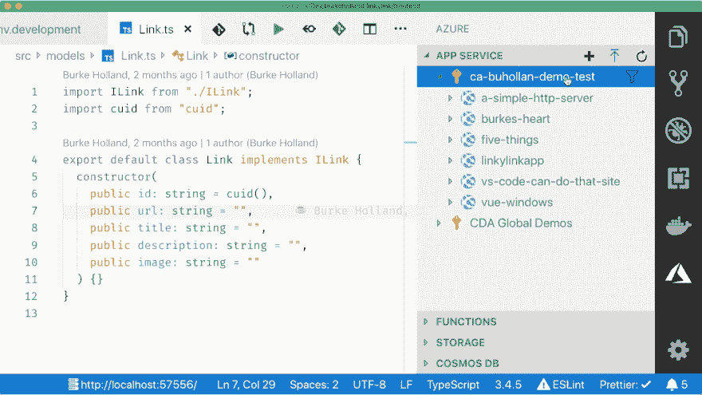](https://res.cloudinary.com/practicaldev/image/fetch/s--3bjfoYUV--/c_limit%2Cf_auto%2Cfl_progressive%2Cq_66%2Cw_880/https://cdn-images-1.medium.com/max/1024/1%2AYDJJsQI1h55O-yHkZUFQ_A.gif)

请注意，我选择了“LTS”作为我的节点版本。Azure 上的 LTS 意味着你可以获得 Azure 支持的最高节点版本。每当 Azure 支持新版本时，你的项目就会自动更新。

适用于 Linux 的应用服务没有内置的 web 服务器。所以你不能把你的静态网站扔在那里。Azure 会说，“我不知道你想从我这里得到什么”。你会说，“我想让你来管理这个网站”。而 Azure 会像“不知如何”。你会觉得没人理解你。

为了解决这个问题，我们需要发送一个带有我们文件的网络服务器。一个简单的方法是使用 npm 的 [serve](https://www.npmjs.com/package/serve) 包。

[发球](https://www.npmjs.com/package/serve)

你还需要某种方式告诉 Azure 开始“服务”。您可以通过将第二个 package.json 文件放在“dist”文件夹中来实现这一点。但是两包 JSON 有点恶心。不是很恶心，但绝对有点恶心。

相反，我们可以利用 Azure 将 [pm2](http://pm2.keymetrics.io/) 烘焙到 App Service 中的每个 Node.js 应用中。pm2 是 Node 的进程管理器，你可以用它启动应用。这意味着如果我们在项目中包含正确的文件，Azure 将会看到它并使用 pm2 来启动我们的项目。

这里有一个视频，更详细地解释了 pm2，以防你是 pm2 的新成员。

[https://www.youtube.com/embed/hYdSfH-0tVI](https://www.youtube.com/embed/hYdSfH-0tVI)

pm2 寻找的文件名为 ecoysystem.config.js，在那个文件中，告诉 pm2 启动“serve”。传递-s 标志使得“serve”route 把它找不到的每个请求都送回 index.html。我们希望这样，因为我们有一个 SPA，我们在客户端处理所有路由。

```
module.exports = {
 apps: [
   {
     script: "npx serve -s"
   }
 ]
}; 
```

我还使用 npx，因为这使我不必 ssh 到我的实例中并全局安装“serve”。

将此文件放入“dist”文件夹。然后将“dist”文件夹部署到 Azure。嘣——这就是你的静态站点。我在微软花了两年时间才找到这个简单的解决方案。如果 Vue 是你喜欢的，我为你创建了一个简单的 Github repo。

伯克霍兰/迪斯特普尔维阿泽

现在我意识到，您可能不想在以后的生活中一直右键单击和部署，因此，您可以使用 App Service 的功能来为您构建项目，而不是这样做。

#### 为 Linux 构建应用服务

如果在站点上启用本地 Git 或 GitHub 部署，然后签入，Azure 会拉代码，运行 npm install，然后自动运行 npm run build。在这种情况下，您可能希望生态系统. config.js 文件位于根目录，并指向构建步骤创建的“dist”文件夹。

```
module.exports = {
 apps: [
   {
     script: "npx serve dist -s"
   }
 ]
}; 
```

现在你的构建发生在 Azure 上。你需要做的就是将你的代码签入 Git——老实说，这已经够难的了。很高兴这剩下的“只是工作”。

> 请注意，在撰写本文时，您需要选择节点 10.14.1，以便自动构建能够生效。这个问题应该会在 LTS 很快得到解决(比如几周内)，所以我这样写是为了保持新鲜感。

#### 窗口

在 Windows 上，你的网站可以正常工作。算是吧。这是因为应用程序服务中的 Windows for Node.js 应用程序包括互联网信息服务(IIS)，它完全可以提供一些静态文件。这是我的应用程序的一个 Windows 实例，我所做的就是部署“dist”文件夹。

[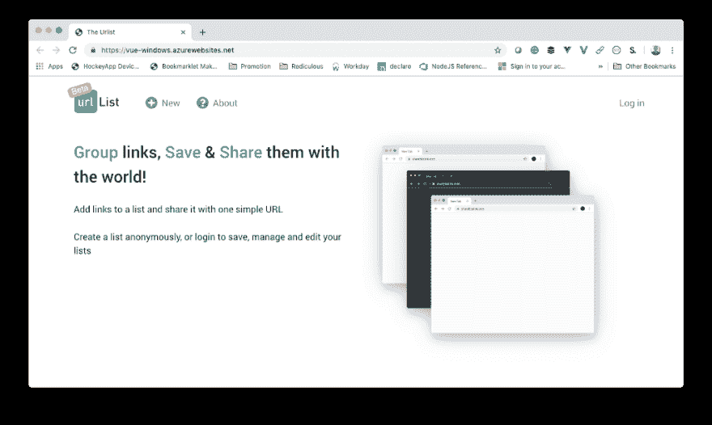](https://res.cloudinary.com/practicaldev/image/fetch/s--gcXg1eck--/c_limit%2Cf_auto%2Cfl_progressive%2Cq_auto%2Cw_880/https://cdn-images-1.medium.com/max/1024/1%2AtYRiq9ZPaojmrAossVw7HA.png)

太神奇了！但是——这里有一个问题。不能深度链接到你的 app。因此，如果你试图去 theurlist.com/build2019(这是一个有效的路线)，你会得到这个…

[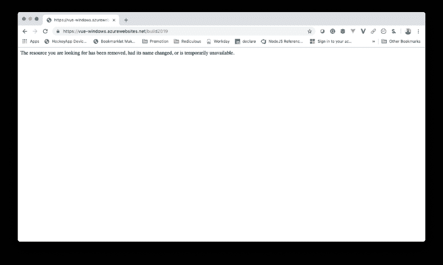](https://res.cloudinary.com/practicaldev/image/fetch/s--zExJ8q5v--/c_limit%2Cf_auto%2Cfl_progressive%2Cq_auto%2Cw_880/https://cdn-images-1.medium.com/max/1024/1%2AYNFHYjl3YdFVaoDU5lWwow.png)

这是因为 IIS 正在查找“the urlist . com/build 2019/index . html”，而该文件并不存在。我们需要告诉 IIS 只将任何和所有流量路由到“index.html”。为此，我们需要向“dist”文件夹添加一个 web.config。在内部，定义一个单一的路由规则来捕获所有流量。

```
<?xml version="1.0"?>
<configuration\>
  <system.webServer>
    <rewrite>
      <rules>
        <rule name="Vue" stopProcessing="true">
          <match url=".\*" />
          <conditions logicalGrouping="MatchAll">
            <add input="{REQUEST\_FILENAME}" matchType="IsFile" negate="true" />
          </conditions>
          <action type="Rewrite" url="/" />
        </rule>
      </rules>
    </rewrite>
  </system.webServer>
</configuration> 
```

像以前一样，将“dist”文件夹推入 Azure。请注意，我们在 Linux 上的自动构建不适用于 Windows。

### 用于容器的 Azure Web 应用程序

Azure App Service 实际上在每个网站的幕后都使用了容器——即使你只是在部署你的文件。因此，您也可以将容器部署到 App Service。

确保你已经安装了 [Docker](https://www.docker.com/) 。如果没有安装 Docker，它就不能很好地工作。

现在也是告诉你…等着吧…为 VS 代码安装 Docker 扩展。走吧。你知道会这样。

[Docker-Visual Studio market place](https://marketplace.visualstudio.com/items?itemName=PeterJausovec.vscode-docker&WT.mc_id=personal-medium-buhollan)

首先，我们需要向我们的项目添加一个`Dockerfile`。你可以把它放在根部。

[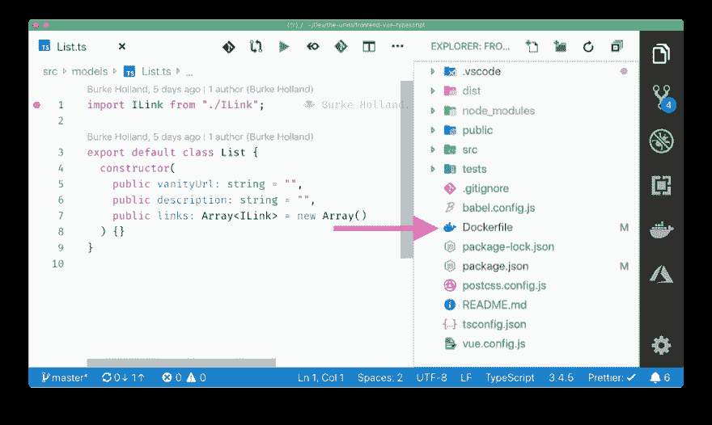](https://res.cloudinary.com/practicaldev/image/fetch/s--mZn-4FN9--/c_limit%2Cf_auto%2Cfl_progressive%2Cq_auto%2Cw_880/https://cdn-images-1.medium.com/max/1024/1%2Ayvq3BMrKuf-aMG1arlvlTg.png)

要在容器中运行站点，我们需要一个 web 服务器。既然我们在节点踢，我们就继续用“发球”吧。

> 看看这个要点，我发现它向你展示了一堆不同的 web 服务器，你可以用一行代码运行这些服务器。这些都可以在 Docker 中工作。

我们带有“serve”的 Docker 文件看起来像这样…

```
FROM node:alpine

# Copy in dist
COPY ./dist /app

# Install serve
RUN npm i -g serve

# Start it up
CMD serve /app -s 
```

从命令面板中选择“Docker: Build Image ”,用 VS 代码构建它。

[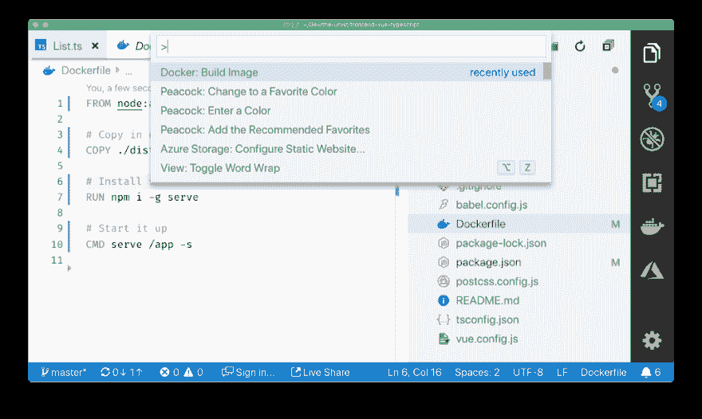](https://res.cloudinary.com/practicaldev/image/fetch/s--pokpaAhg--/c_limit%2Cf_auto%2Cfl_progressive%2Cq_auto%2Cw_880/https://cdn-images-1.medium.com/max/1024/1%2AdFnsJSaDEpvtB0ZyZ3R85A.png)

该图像将显示在“Docker”资源管理器下的 VS 代码中。

[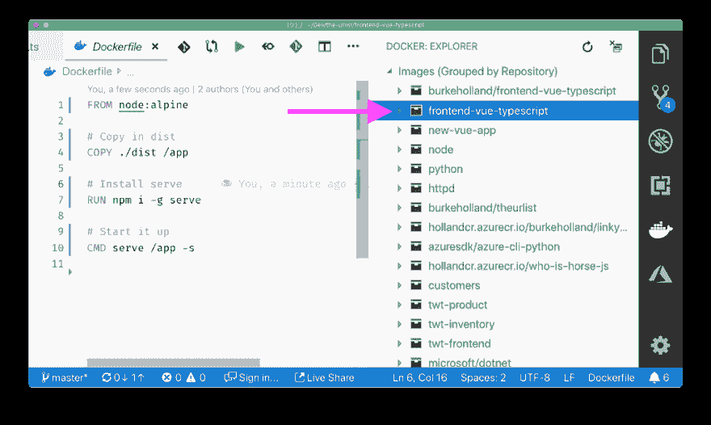](https://res.cloudinary.com/practicaldev/image/fetch/s--dUC6LQJW--/c_limit%2Cf_auto%2Cfl_progressive%2Cq_auto%2Cw_880/https://cdn-images-1.medium.com/max/1024/1%2A9hyAvTUWZXs9RzYHygnStA.png)

现在把它推到码头中心。为此，请展开节点并右键单击“最新”图像，然后选择“选择标签”。然后，您需要首先输入您的 Docker Hub 用户名。“最新”标签仅仅意味着这是该图像的最新版本。

再次右键单击并选择“推送”。这会把它推到码头中心。如果失败或显示“拒绝访问”，请确保您通过终端登录到 Docker Hub

```
\> docker login 
```

现在图像已经在 Docker Hub 中了，我们可以把它放到 Azure 中。我们需要一个网站来做这件事。我们可以通过门户网站进行配置，但这……并不令人兴奋，所以让我们使用 [Azure CLI](https://docs.microsoft.com/cli/azure/install-azure-cli?view=azure-cli-latest&WT.mc_id=personal-medium-buhollan) 。还有，这篇文章越来越长，手指也累了。你的眼睛可能在流血。

创建资源组…

```
az group create -n deleteme-vue-docker 
```

创建服务计划。请记住，这是我们选择想要从 Azure 获得多少资源的地方。换句话说，这就是你花钱的地方。

```
az appservice plan create -n vuedocker -g deleteme-vue-docker — is-linux -l “East US” — sku S1 
```

创建新的实例，并从 Docker Hub 拉入容器…

```
az webapp create -n vue-docker -g deleteme-vue-docker -p vuedocker -i burkeholland/frontend-vue-typescript:latest 
```

该命令完成后，如果您在 CLI 输出中向上滚动，您将看到您站点的 URL

[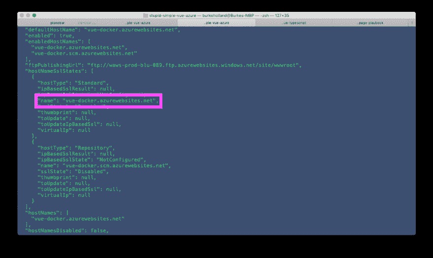](https://res.cloudinary.com/practicaldev/image/fetch/s--klb7KiXN--/c_limit%2Cf_auto%2Cfl_progressive%2Cq_auto%2Cw_880/https://cdn-images-1.medium.com/max/1024/1%2AKf0GREvsy7b0Meo6bcXopA.png)

> 免责声明:在生产中使用功能更全面的 web 服务器而不仅仅是“服务”是一个好主意。这样做的原因是“serve”相当简单，并且没有您将来可能想要的一些高级功能。这将是像 gzip 或 brottli 压缩，最大工作者连接，MIME 类型映射等等。为此，我会推荐使用 [nginx](https://hub.docker.com/_/nginx/) 。它的设置远没有那么简单，但它拥有所有的功能。

### 和…..完成的

你还和我在一起吗？一路上我们损失了多少人？谁死于痢疾？

对于那些仍然清醒、警觉、活跃和热情的人，让我们回顾一下我们现在所知道的关于在 Azure 中托管静态站点的知识。

*   **首选** : Azure 存储
*   带有生态系统. config.js 文件的 Linux azure 应用服务
*   使用 web.config 为 Windows 提供 Azure 应用服务
*   带有容器的 Azure 应用服务

选择自己的命运。这里有一些额外的链接，你可能会发现对你的静态站点搜索有帮助。一路平安。

*   [带有 Visual Studio 代码的 Azure 应用服务](https://code.visualstudio.com/tutorials/app-service-extension/getting-started?WT.mc_id=personal-medium-buhollan)
*   [使用 Azure 存储的网站部署](https://code.visualstudio.com/tutorials/static-website/getting-started?WT.mc_id=personal-medium-buhollan)

* * *