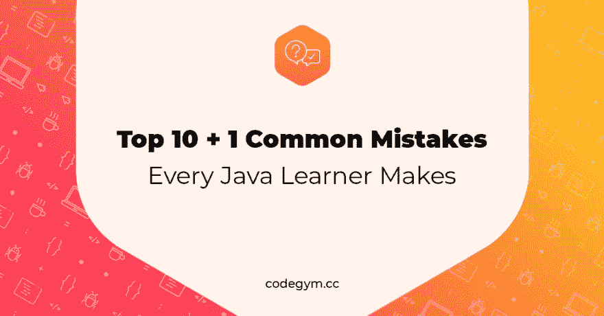

# 每个 Java 学习者都会犯的 10 + 1 个常见错误

> 原文：<https://dev.to/codegym_cc/top-10-1-common-mistakes-every-java-learner-makes-4b6i>

[](https://res.cloudinary.com/practicaldev/image/fetch/s--nsZGxVj_--/c_limit%2Cf_auto%2Cfl_progressive%2Cq_auto%2Cw_880/https://cdn-images-1.medium.com/max/1200/1%2AJwxyCPl0o8-skeAj01XzMA.png)

有人说，“你的朋友会吞下你的错误，你的敌人会把它们放在盘子里”。我绝对不是你的敌人，但我想给你指出一些错误，具体到每个 Java 初学者，我会在这个博客“板块”上指出。当然只有一些，我从 CodeGym.cc 课程分析系统收集的。如果你还不知道， [CodeGym](https://codegym.cc/) 是一门从零开始到中高级的实用 Java 课程。

所以，他们来了。

## 0。赋值还是比较？

这是从零开始学 Java 的学生最先犯的错误之一。很容易混淆 **=** 是赋值操作符，而 **==** 是关系操作符。那是自然的错误，因为在数学中“=”更接近 Java 的“ **==** ”，而不是 Java 的“=”。通常编译器会捕捉这样的错误，但是它们可能被隐藏起来。例如:

```
boolean myBoolean; 
If (myBoolean = true) {
doSomething; 
} 
```

看到了吗？这个块无论如何都是真的，因为你把它赋值为真…

## 1。用==运算符比较字符串。

在你完成你的第一个 Java 任务(通常有一些控制台输出和算术问题)后，你学习 String 类。然而，初学者经常忘记，特定的字符串不是 char 或 int 之类的基本类型的代表，它是一个对象。不能使用`==`运算符比较对象。记住使用[string . equals(Object Object)](https://docs.oracle.com/javase/8/docs/api/java/lang/String.html#equals-java.lang.Object-)函数来比较字符串(或其他对象)，而不是使用`==`操作符。Equals 检查字符串的内容，而`==`操作符检查对对象的引用是否相等。

跟你说实话，字符串常量一般都是“内定”的。这意味着两个具有相同值的常数实际上可以与`==`进行比较，但不要真的依赖于此。使用. equals。

## 2。不同的类名和代码所在的文件。

这个错误在几年前非常流行(甚至可能是最主要的)。现在，即使初学者也在使用现代 IDE，它已经濒临灭绝。无论如何，记住 Java 中文件名和类名应该相同是很有用的。例如，如果你把你的文件命名为 Test.java，并在那里写一些 class CodeGymTest 代码:

```
//File name: Test.java 

public class CodeGymTest { 
   public static void main(String[] args) { 
        System.out.println("Hello world"); 
   } 
} 
```

您将获得下一个输出:

```
Test.java:9: error: class CodeGymTest is public, should be
                    declared in a file named CodeGymTest.java
public class CodeGymTest 
^
1 error 
```

顺便说一下，如果您从类名中删除 **public** 修饰符，您的程序将会运行。

## 3。从 main 方法或其他静态方法访问非静态成员

初学者通常不知道如何处理静态上下文。静态变量是一个类的所有实例共享的变量。因此，只有一个副本由所有对象共享。所以我们不能以“静态方式”处理非静态变量。这种错误通常发生在`main()`方法中(它是静态的！)，当程序员新手试图访问实例变量或方法时。如果你尝试这样的代码

```
public class MyExample {
    public String myString;  

public static void main(String[] args) {
        myExample.String = “non static String”;    
}
  } 
```

我们遇到了编译错误:

```
non-static variable number cannot be referenced from a static context. 
```

我们该怎么做才能避免这种情况？首先我们可以使我们的变量成为静态的，但这并不总是符合程序的目的。解决方法之一是创建一个我们类的对象:

```
public class MyExample {
    public String myString;  

public static void main(String[] args) {
MyExample myExample = new MyExample(); 

        myString = “non static String”;    
}
  } 
```

请记住，您可以在静态或非静态上下文中使用静态变量或方法。您可以使用对象引用来处理非静态元素。

## 4。数组索引超出了数组界限

这是初学编程的学生中非常普遍的错误。这种流行的原因是，最初的或多或少复杂的任务是关于数组和循环的。非常简单的例子:

```
String[] name = { "Snoopy", "Woodstock", "Charlie Brown" };
for (int i = 0; i <= name.length; i++) {
    System.out.println(name[i]);
} 
```

循环从零元素“Snoopy”开始，然后到第一个“Woodstock”和第二个“Charlie Brown”…并试图打印第三个元素，但我们没有它(我们的“third”是“second”如“first”是数字零)。这里的错误很明显，但并不总是这样。

周期和数组对新手来说很难。但是，实践出钻石。CodeGym 上有数百个数组&循环任务。尝试解决它们(从现在开始是免费的！)来获得自信的技能。

## 5。正在放置“；”循环或条件句错误

在下面的块中，不打印数组的任何成员。首先，循环以“；”结束所以什么都没发生。更重要的是:程序不会工作，因为你的 int i 只在循环中工作，并且以“；”结尾。

```
public static void main(String[] args)  {

            int [] myArray = {2,5,7};
            for (int i=0; i<3; i++);
            {
                System.out.println(myArray[i]);
            }
        } 
```

如果你尝试这样的事情:

```
public static void main(String[] args)  {

            int [] myArray = {2,5,7};
            int i = 0;

            for (i=0; i<3; i++);
            {
                System.out.println(myArray[i]);
            }
        } 
```

您已经得到了`java.lang.ArrayIndexOutOfBoundsException`，因为 System.out.println 试图打印元素#3 并且只打印这一个，但是我们没有这样的数组成员。最后一个是第二个，是 7。

同一个故事；和条件。例如:

```
public static void main(String[] args)  {

            int [] myArray = {2,5,7};
           if (myArray[0] > myArray[1]);
            System.out.println("it is");
        }
    } 
```

此处不满足条件，但“它是”将被打印出来，因为“；”if 施工后。

如果你开始学习 CodeGym，你将会在第 4 级 [Java 语法](https://codegym.cc/quests/QUEST_JAVA_SYNTAX)任务中获得你的第一个循环编码任务。我想解决了足够多的问题后，你会忘记这种错误的。

## 6。Switch-Case 构造中缺少“break”关键字

错过“break”关键字的尴尬之处在于没有编译器错误。然而你的代码以错误的方式工作。

看看下面的代码示例，我们忘记在“case 0”中添加一个分隔符。该程序将工作，但它打印“0”和“1”，因为开关结构结束其工作与休息。

```
public static void switchCasePrimer() {
        int counting = 0;

        switch (counting) {
            case 0:
                System.out.println("0");
            case 1:
                System.out.println("1");
                break;
            case 2:
                System.out.println("2");
                break;
            default:
                System.out.println("Default");
        }
} 
```

这条规则有一个例外。**开关**闭塞可以通过**返回**操作员
完成工作

```
public class test {
    public static void main(String[] args) {
        System.out.println(showSwitch(1));
    }

    public static int showSwitch(int condition) {
        switch (condition) {
            case 1:
                System.out.println(1);
                return 1;
            case 2:
                System.out.println(2);
                return 4;
            case 3:
                System.out.println(3);
                return 8;
            default:
                System.out.println("default");
                return 256;
        }
    }
} 
```

在这种情况下，交换机在情况 1 之后立即完成其工作。

## 7。混淆按值传递和按引用传递

如果将一个基本数据类型(如 char、int 或 double)传递给一个方法，则是通过值传递。这意味着数据类型的副本将被复制并传递给方法。如果在方法内部修改了数据，对方法外部的“原始”数据没有影响。

```
public class Main {

    public static void swap(int i, int j)
    {
        int temp = i;
        i = j;
        j = temp;
        System.out.println("from swap method i = " + i + ", j = " + j);
    }

    public static void main(String[] args) {

        int i1 = 1;
        int j1 = 2;
        swap(i1,j1);
        System.out.println("from main method i = " + i1 + ", j = " + j1);

    }
} 
```

当你传递一个 Java 对象，例如，数组或字符串给一个方法时，这意味着你传递的是一个引用(数据的地址)，而不是一个副本。因此，如果您更改方法中的数据，它也会在方法之外被更改。

```
public class Main {

    static int[] outer = new int[3];

    public static void swap(int[] array) {
        System.out.println("(swap) Before swap :" + Arrays.toString(array));
        int first = array[0];
        int last = array[array.length - 1];
        array[0] = last;
        array[array.length - 1] = first;
        System.out.println("(swap) After swap :" + Arrays.toString(array));
    }

    public static void main(String[] args) {
        outer[0] = 0;
        outer[1] = 1;
        outer[2] = 2;

        swap(outer);

        System.out.println("(main) After swap :" + Arrays.toString(outer));
    } 
```

## 8。尝试使用未初始化的字段或变量

使用一个没有初始化对象类型是非常危险的。

类变量由默认值初始化(0 表示 int，0.0 表示 double，false 表示 boolean，null 表示非原始类型(对象)。

```
public class Test2 {
    static String test;

    public static void main(String[] args) {

     System.out.println(test);
    }
} 
```

**输出为:**

```
Null 
```

当你使用局部方法变量时，你需要手动初始化它们，否则你会得到一个编译错误。

```
public class Test2 {

    public static void main(String[] args) {
        String test2;
     System.out.println(test2);
    }
} 
```

**输出为:**

```
Error:(6, 28) java: variable test2 might not have been initialized 
```

## 9。忘记整数除法

如果你把一个整型数除以另一个整型数，你会再次得到整型数。So = 0，而不是本例中的 0.5:

```
public static void main(String[] args) {

        int i = 1;
        int j = 2; 
  int k = i/j; //here we’ve got 0 
  } 
```

你可以从 CodeGym 的 [Java Syntax quest](https://codegym.cc/quests/QUEST_JAVA_SYNTAX) 中了解除法和实数类型，并解决大量与主题相关的编码任务。

## 10。打乱子对象中调用构造函数的顺序

当您尝试创建子类的实例时，首先调用 Child，然后调用 Parent。父子关系中构造函数的执行顺序是从基本(父)类到继承(子)类。

```
public class Test3 {
    static class Parent {
        Parent() {
            System.out.println("a Parent is created");
        }
    }
    static class Child extends Parent {
        Child(){
            System.out.println("a Child is created");
        }
    }

    public static void main(String[] args) {
        Child child = new Child();
    }
} 
```

**输出:**

```
a Parent is created
a Child is created 
```

如果你加入 CodeGym，你会在 [Java Core Quest](https://codegym.cc/quests/QUEST_JAVA_CORE) 中遇到 OOP 和继承。这个题目的任务真的很多。所以迟早你会对 OOP 原则有一个微妙的理解。

# 结论

我推测，没有一篇文章可以把 Java 新手的潜在错误全部积累起来。然而，这样的列表对于避免常见的错误非常有用……并且有时间找到不那么琐碎的问题！Praemonitus，praemonitus(*预先警告就是预先武装)。

然而，最重要的步骤不是避免错误，而是练习编码本身。这就是我们创建 [CodeGym](https://codegym.cc/) 的原因，这是一门 Java 核心课程，包含 1000 多项练习任务、有趣的讲座以及对您的改进的即时反馈。当你犯了一个错误时，无论是常见的还是罕见的，CodeGym 系统都会警告你，并给出避免错误的建议。你可以自己试试这门课程，从现在开始它是免费的。

不要停止练习，你肯定会成为一名更好的软件开发人员。祝你学习顺利！

附:你有没有从这篇文章中犯过错误？你在学习过程中面临过哪些错误？请在评论中告诉我们！

* * *

计算机软件行业爱好者 Alex Yelenevych 和 CodeGym.cc. First 的 CMO 在 CodeGym 媒体博客上发表了这篇文章。