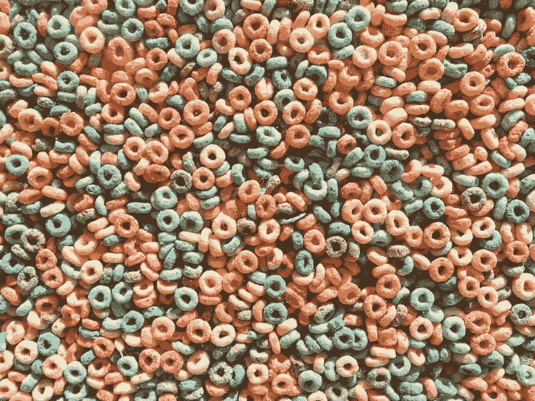

# 围棋中的数组和循环

> 原文：<https://dev.to/codetips/arrays-and-loops-in-go-1b4d>

[](https://res.cloudinary.com/practicaldev/image/fetch/s--bGJaYu1j--/c_limit%2Cf_auto%2Cfl_progressive%2Cq_auto%2Cw_880/https://images.unsplash.com/photo-1504308805006-0f7a5f1f0f71%3Fixlib%3Drb-1.2.1%26q%3D80%26fm%3Djpg%26crop%3Dentropy%26cs%3Dtinysrgb%26w%3D1080%26fit%3Dmax%26ixid%3DeyJhcHBfaWQiOjExNzczfQ)

在阅读本文之前，你应该已经了解了[数组](https://www.codetips.co.uk/beginner/what-are-arrays/)、[类型](https://www.codetips.co.uk/beginner/what-is-a-data-type/)和[循环](https://www.codetips.co.uk/beginner/what-are-loops/)。

在“[编写你在 Go](https://www.codetips.co.uk/languages/go/writing-your-first-go-programme/) 中的第一个程序”中，我们编写了一个输出你的姓名、年龄和职业的程序。在这篇文章中，我们将扩展这个程序，让它打印出你所有的爱好。

**注意:**在“[编写你的第一个围棋程序](https://www.codetips.co.uk/languages/go/writing-your-first-go-programme/)”结束时，你还被要求完成三个挑战。我们假设你已经完成了。如果你还没有，这篇文章向你展示了解决方案，所以请确保你至少尝试一下。

完成所有三个挑战后，您应该会得到类似于以下内容的结果:

```
package main

import "log"

func main1() {

    // Start of our code

    var name string = "Simon"
    var age int = 29
    var profession string = "Developer"
    var favouriteAnimal string = "Dog"

    log.Printf(
        "Welcome to my first Go programme. My name is %s. I am %d years old. I work as a %s. My favourite animal is a %s",
        name, age, profession, favouriteAnimal,
  )

  // End of our code

} 
```

我们现在想添加另一条信息；我们的爱好是什么。

我有三个主要爱好，所以显而易见的是创建三个新变量，并像我们之前做的那样将它们打印到终端:

```
package main

import "log"

func main() {

    // Start of our code

    name := "Simon"
    age := 29
    profession := "Developer"
    favouriteAnimal := "Dog"

    hobby1 := "Coding"
    hobby2 := "Walking"
    hobby3 := "Watching TV"

    log.Printf(
        "Welcome to my first Go programme. My name is %s. I am %d years old. I work as a %s. My favourite animal is a %s",
        name, age, profession, favouriteAnimal,
    )

    log.Printf("My hobbies are: %s, %s, %s", hobby1, hobby2, hobby3)

    // End of our code

} 
```

**注意:**我们已经将我们的变量改成了简写形式(例如`name := "Simon"`而不是`var name string = "Simon"`)，因为在这种情况下，放手去推断类型是安全的，而且更简洁。

我们现在添加了第二个`Printf`语句，将我们的爱好打印到屏幕上。很漂亮吧？实际上，没有。

为了三个爱好这样做可能看起来可以接受，但是如果你有十个爱好呢？

```
package main

import "log"

func main() {

    // Start of our code

    name := "Simon"
    age := 29
    profession := "Developer"
    favouriteAnimal := "Dog"

    hobby1 := "example1"
    hobby2 := "example2"
    hobby3 := "example3"
    hobby4 := "example4"
    hobby5 := "example5"
    hobby6 := "example6"
    hobby7 := "example7"
    hobby8 := "example8"
    hobby9 := "example9"
    hobby10 := "example10"

    log.Printf(
        "Welcome to my first Go programme. My name is %s. I am %d years old. I work as a %s. My favourite animal is a %s",
        name, age, profession, favouriteAnimal,
    )

    log.Printf(
        "My hobbies are: %s, %s, %s, %s, %s, %s, %s, %s, %s, %s",
        hobby1, hobby2, hobby3, hobby4, hobby5, hobby6, hobby7, hobby8, hobby9, hobby10,
    )

    // End of our code

} 
```

它开始看起来有点乱，不是吗？如果我们有 100 个爱好会怎么样？

一定有更好的办法！谢天谢地，有。[数组](https://www.codetips.co.uk/beginner/what-are-arrays/)！

在 Go 中，数组只能包含一个[类型](https://www.codetips.co.uk/beginner/what-is-a-data-type/)，并使用`[]`后跟它将保存的类型来声明。

**注意:**在 Go 中，数组的长度是固定的(它能容纳的项数)；[]中的数字是数组的大小。

```
var stringArr [2]string
var intArr [2]int
var boolArr [2]bool 
```

在上面的例子中，我们没有在数组中放入任何值，所以它们将是空的。

我们可以通过在类型声明后使用`{}`立即将项目添加到数组中。

```
var stringArr = [2]string{"string1", "string2"}
var intArr = [2]int{1, 2}
var boolArr = [2]bool{true, false} 
```

在我们继续之前，请尝试完成以下挑战:

*   取十个`hobby`变量，并将它们转换成一个`hobbies`数组。

*   修改`Printf`语句，打印出新的数组，而不是十个变量。

完成了吗？非常好。您最终应该会得到与此类似的结果:

```
package main

import "log"

func main() {

    // Start of our code

    name := "Simon"
    age := 29
    profession := "Developer"
    favouriteAnimal := "Dog"

    hobbies := [10]string{"example1", "example2", "example3", "example4", "example5", "example6", "example7", "example8", "example9", "example10"}

    log.Printf(
        "Welcome to my first Go programme. My name is %s. I am %d years old. I work as a %s. My favourite animal is a %s",
        name, age, profession, favouriteAnimal,
    )

    log.Printf("My hobbies are: %s", hobbies)

    // End of our code

} 
```

现在运行您的应用程序(`go run main.go`)应该会得到以下输出:

```
2019/05/29 17:14:53 Welcome to my first Go programme. My name is Simon. I am 29 years old. I work as a Developer. My favourite animal is a Dog
2019/05/29 17:14:53 My hobbies are: [example1 example2 example3 example4 example5 example6 example7 example8 example9 example10] 
```

现在我们有了我们的`hobbies`数组，我们可以轻松地添加和删除项目，而不必创建新的变量或修改`Printf`语句。

所以我们的代码现在看起来漂亮整洁，但是我仍然不太喜欢我们输出到终端的内容；我们已经有了那些难看的方括号(`[]`)，如果我们添加一个由多个单词组成的新爱好会怎么样呢？

```
hobbies := [4]string{"example1", "mountain biking", "example2", "example3"} 
```

它将打印:

```
2019/05/29 17:25:44 My hobbies are: [example1 mountain biking example2 example3] 
```

是“山地车”还是“山地车”“自行车”？

那么我们必须回到分离变量吗？谢天谢地没有！我们可以用一个[循环](https://www.codetips.co.uk/beginner/what-are-loops/)！

在我们改变程序之前，让我们举一个简单的循环例子来理解这个概念。

如果我们想打印数字 1-10，我们可以写 10 个不同的`Print`语句，这是非常手工的，或者我们可以写一个循环来完成。在以下示例中:

1.  `init statement`。在循环的第一次迭代之前执行，我们定义了一个新的变量(`i`)并给它赋值`1`(`i := 1`)。

2.  `condition expression`。在循环的每次迭代之前执行，它检查表达式(`i <= 10` -是否`i`小于或等于 10？)是真的。如果是，它将运行另一个迭代。

3.  `post statement`。在循环的每次迭代后执行，它简单地增加`i`的值(例如，如果`i`的值是 3，运行`i++`将增加它，现在它将是 4)

4.  然后我们在每次迭代中打印出`i`的值。

```
package main

import "log"

func main() {

    for i := 1; i <= 10; i++ {
        log.Println(i)
    }

} 
```

我们现在可以使用这种新技术来打印我们的爱好。在以下示例中:

1.  我们添加了一个新的`Printf`语句，打印我们的爱好数量。`len`方法简单地返回数组的长度；在这个例子中是 4。

2.  我们定义我们的`init statement`，并将`i`的值设置为`0`。我们将它设置为`0`而不是`1`，因为 Go 数组索引从 0 开始。

3.  我们定义我们的`conditional expression`，将条件设置为`i < len(hobbies)`(`i`是否小于爱好长度)。我们使用“小于”(`<`)而不是“小于或等于”(`<=`)，因为 Go 数组索引从 0 开始。

4.  我们定义了我们的`post statement`并增加了`i`的计数，就像我们在前面的例子中所做的那样。

5.  然后我们打印出`hobbies`的每个元素。

```
package main

import "log"

func main() {

    // Start of our code

    name := "Simon"
    age := 29
    profession := "Developer"
    favouriteAnimal := "Dog"

    hobbies := [4]string{"example1", "mountain biking", "example2", "example3"}

    log.Printf(
        "Welcome to my first Go programme. My name is %s. I am %d years old. I work as a %s. My favourite animal is a %s",
        name, age, profession, favouriteAnimal,
    )

    log.Printf("I have %d hobbies, and they are: ", len(hobbies))

    for i := 0; i < len(hobbies); i++ {
        log.Println(hobbies[i])
    }

    // End of our code

} 
```

下面是我们的数组索引和值之间的链接的图示:

```
| 0 | 1 | 2 | 3 |
*----------*-----------------*----------*----------*
| example1 | mountain biking | example2 | example3 | 
```

我们理解这是大量的信息，所以如果有任何不合理的地方，请随时联系我们。

请记住，我们已经建立了一个新的 Slack 社区，以更实时地帮助人们。你可以在这里加入我们。