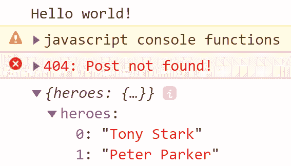
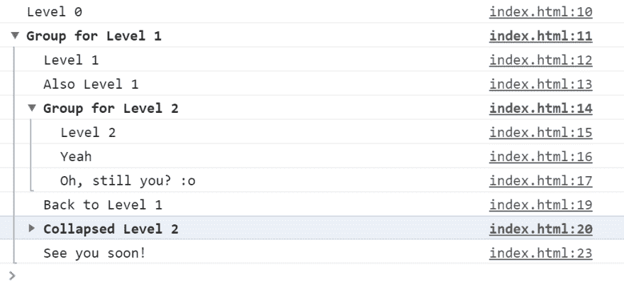

# 如何正确使用 JavaScript 控制台！

> 原文：<https://dev.to/webdeasy/how-to-use-the-javascript-console-correctly-1110>

所有 web 开发人员都很熟悉 JavaScript 控制台。但只有少数人知道，它隐藏了许多未知的功能。这篇文章给黑暗带来了光明！

[](https://res.cloudinary.com/practicaldev/image/fetch/s--xuoQHHvG--/c_limit%2Cf_auto%2Cfl_progressive%2Cq_auto%2Cw_880/https://webdeasy.de/wp-content/uploads/2019/05/js-console-functions.png)

默认情况下，使用 *console.log()* 函数。这个函数允许我们输出字符串和整数，也可以输出数组和对象。控制台对象提供了更多的功能。

并非所有功能在每个浏览器中都可用。[在这里](https://developer.mozilla.org/de/docs/Web/API/Console#Browserkompatibilit%C3%A4t)你可以找到浏览器兼容性列表。

## 目录

*   [停止次数- console.time()](#console-time)
*   [输出警告- console.warn()](#console-warn)
*   [Clear Console-Console . Clear()](#console-clear)
*   [分组输出- console.group()](#console-group)
*   [标记错误消息- console.error()](#console-error)
*   [输出属性-console . log()&console . info()](#console-log)

## 停止次数- console.time()

这个函数非常适合比较两个或更多的算法。它可以测量执行的时间。这是一个实际例子的样子:

```
console.time('example');
for (let i = 0; i < 1000000; i++) {
    document.getElementById('app').innerHTML = i;
}
console.timeEnd('example'); 
```

Enter fullscreen mode Exit fullscreen mode

这里， *console.time('example')* 函数获取一个标识符来停止计时器。在本例中，一个循环遍历 1.000.000x，并在每次运行时将该数字写入 HTML。循环结束后，我们通过*控制台停止计时。我们在控制台中的输出如下所示:*

[](https://res.cloudinary.com/practicaldev/image/fetch/s--gj-tXcBr--/c_limit%2Cf_auto%2Cfl_progressive%2Cq_auto%2Cw_880/https://webdeasy.de/wp-content/uploads/2019/05/console-time.png)

## 输出警告- console.warn()

尤其是当我们为 JavaScript 编写自己的库时，在出现错误或警告时通知用户是非常重要的。

然而，当我写这篇文章时，我发现这个功能不标准，不适合公共网站！由于这个原因，我在这里不详细介绍它的确切功能，而是参考 Mozilla 的[文档，里面有解释。](https://developer.mozilla.org/de/docs/Web/API/Console/warn)

## 清除控制台- console.clear()

一个很小但非常有用的功能是清空控制台。而这正是 *console.clear()* 所要做的。该函数不需要任何参数:

```
console.clear(); 
```

Enter fullscreen mode Exit fullscreen mode

将从控制台中删除所有以前的条目，并将显示以下消息:

[](https://res.cloudinary.com/practicaldev/image/fetch/s--q9Te_SWQ--/c_limit%2Cf_auto%2Cfl_progressive%2Cq_auto%2Cw_880/https://webdeasy.de/wp-content/uploads/2019/05/console-clear.png)

## 分组输出- console.group()

如果你想构造不同的值，这个函数很有用。例如，你可以将它与文件夹进行比较。实际上，这个函数非常适合输出文件和文件路径。在下面的例子中，函数 *groupEnd()* 用于返回上一级。函数 *groupCollapsed()* 与 *group()* 一样，创建另一层，不同的是 *groupCollapsed()* 折叠内容。

可选地，可以给 *group()* 和 *groupCollapsed()* 一个带有组标题的参数。

```
console.log('Level 0');

console.group('Group for Level 1');
console.log('Level 1');
console.log('Also Level 1');

console.group('Group for Level 2');
console.log('Level 2');
console.log('Yeah');
console.log('Oh, still you? :o');
console.groupEnd();

console.log('Back to Level 1');

console.groupCollapsed('Collapsed Level 2');
console.log('collapsed content');
console.groupEnd();

console.log('See you soon!'); 
```

Enter fullscreen mode Exit fullscreen mode

这就是这个问题的样子。“折叠的第二层”组可以通过一次点击打开:

[](https://res.cloudinary.com/practicaldev/image/fetch/s--GS-zjmRh--/c_limit%2Cf_auto%2Cfl_progressive%2Cq_auto%2Cw_880/https://webdeasy.de/wp-content/uploads/2019/05/console-group.png)

## 标记错误消息- console.error()

*error()* 函数的工作方式类似于 *log()* 、 *warn()* 或 *info()* 函数。它可以输出任何属性，可以是字符串、整数、对象或数组。关于 *error()* 函数的特别之处在于，它用彩色背景和 x 图标突出显示。特别是对于有自己库的错误消息，也有自己函数的错误消息，应该使用这个函数。

```
console.error('This is an fatal error!'); 
```

Enter fullscreen mode Exit fullscreen mode

产生以下输出:

[](https://res.cloudinary.com/practicaldev/image/fetch/s--ZeePSR99--/c_limit%2Cf_auto%2Cfl_progressive%2Cq_auto%2Cw_880/https://webdeasy.de/wp-content/uploads/2019/05/console-error.png)

该函数的各种输出选项(参数符号)将在下一项中详细描述。

## 输出属性-console . log()&console . info()

最后，但并非最不重要的是最流行的控制台功能。这些函数在控制台中显示属性。下面的例子也参考了 *warn()* 和 *error()* 函数:
调用这些函数有两种不同的语法:

```
console.log(obj1 [, obj2, ..., objN]);
console.log(msg [, subst1, ..., substN]); 
```

Enter fullscreen mode Exit fullscreen mode

一方面，可以传递不同的对象，这些对象只是简单地一个接一个地输出:

```
const obj1 = {
    name: 'Peter Parker',
    username: 'i_am_a_spider'
};
const obj2 = {
    name: 'Tony Stark',
    username: 'jarvis'
};
const obj3 = Math.PI;
console.log(obj1, obj2, obj3); 
```

Enter fullscreen mode Exit fullscreen mode

该代码产生以下输出:

[](https://res.cloudinary.com/practicaldev/image/fetch/s--kdgZnP7Z--/c_limit%2Cf_auto%2Cfl_progressive%2Cq_auto%2Cw_880/https://webdeasy.de/wp-content/uploads/2019/05/console-log.png)

在第二种变体中，您可以使用替换字符串(替换值)。 *%o* 和 *%O* 成为一个对象， *%d* 和 *%i* 成为一个整数， *%s* 成为一个字符串， *%f* 成为一个浮点数。实际上看起来是这样的:

```
const obj1 = {
    name: 'Peter Parker',
    username: 'i_am_a_spider'
};
console.log('This is object is between to sentences. Here: %O. And I think that is really cool!', obj1);

console.log('This is a very, very big integer: %d', 42);

console.log('This is %s. And I am %s!', 'Me', 'a web developer');

console.log('This is a nice float: %f', Math.PI); 
```

Enter fullscreen mode Exit fullscreen mode

费用会是这样的。在第一个示例中，可以展开对象并查看所有属性。

[](https://res.cloudinary.com/practicaldev/image/fetch/s--D93RDsYn--/c_limit%2Cf_auto%2Cfl_progressive%2Cq_auto%2Cw_880/https://webdeasy.de/wp-content/uploads/2019/05/console-writing.png)

你知道这些功能或者你知道其他有用的功能吗？那就写在评论里吧！:)

来源:https://developer.mozilla.org/de/docs/Web/API/Console

感谢你阅读这篇文章！如果你喜欢这篇文章，我会很高兴你能在我的[博客](https://webdeasy.de/en/web-development-server-administration-tutorials/)上看到更多文章，并在[推特](https://twitter.com/WebDEasy)上关注我！:)