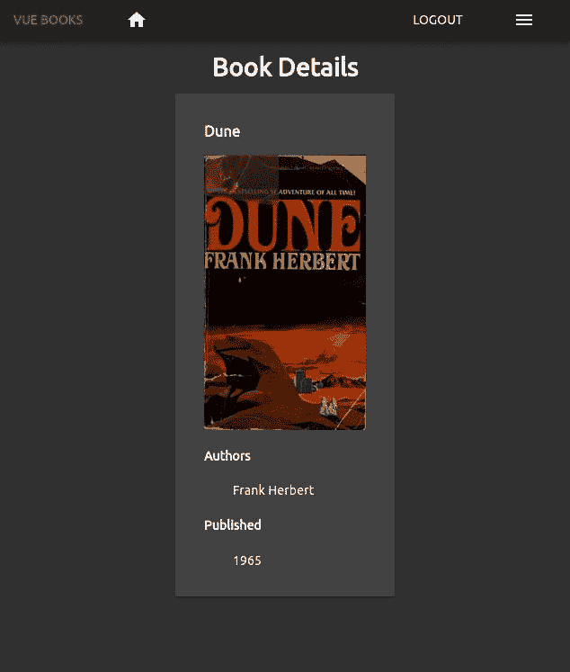
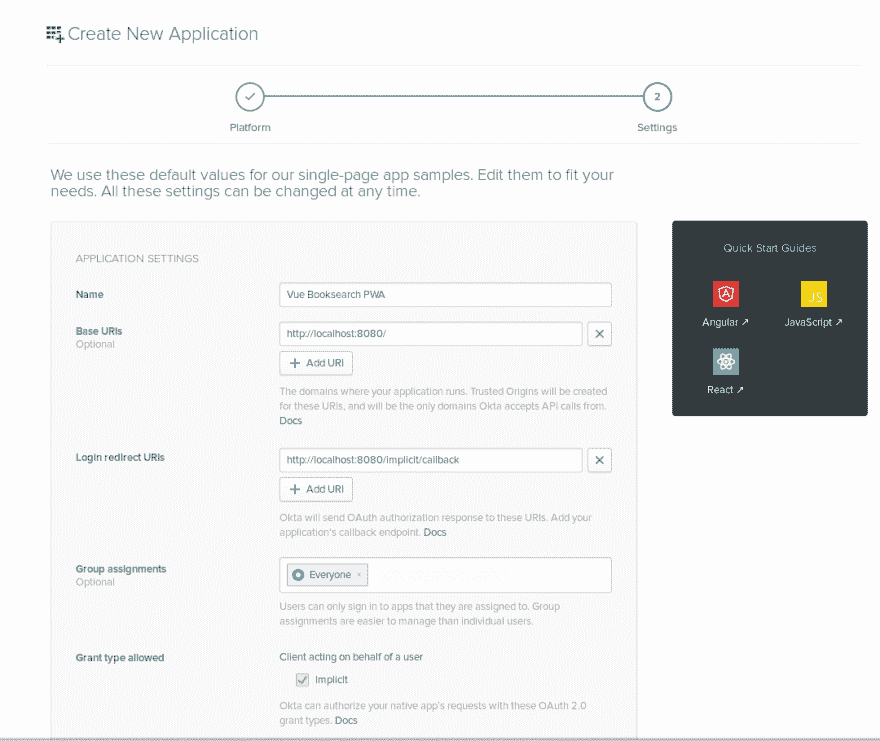
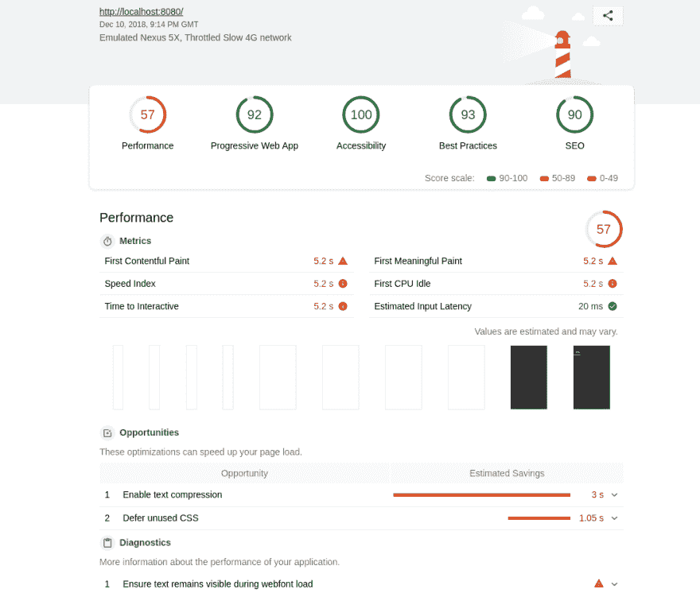

# 使用 Vue 和 TypeScript 构建您的第一个 PWA

> 原文：<https://dev.to/oktadev/build-your-first-pwa-with-vue-and-typescript-51b0>

随着过去几年移动设备使用的不断增加，预测用户在这些设备上的需求对 web 开发人员来说变得越来越重要。第一步是满足不同屏幕尺寸的能力，因此产生了对响应用户界面设计的需求。随着时间的推移，用户的需求不断增加，现在提供独立于网络连接的高质量用户体验变得更加重要。用户已经习惯于在离线时使用可本机安装的应用程序。他们越来越希望基于浏览器的网络应用程序也能如此。

渐进式 Web 应用程序(或 PWAs)满足了这种期望。PWA 是一个普通的 web 应用程序，它利用许多现代浏览器技术来改善整体体验。PWA 的核心组成部分是服务人员。服务工作器是一段 JavaScript 代码，它在独立于主 JavaScript 应用程序的线程中运行，并拦截来自服务器的任何浏览器资源请求。如果服务工作者发现它在高速缓存中具有该资源的最新版本，它将改为提供高速缓存的资源。此外，应用程序清单允许应用程序安装在浏览器中。这使得在移动设备上启动 PWA 成为可能，即使该设备是离线的。

在本教程中，我将向您展示如何使用 Vue 框架开发一个小型 PWA。Vue 是一个已经存在了一段时间的框架。它最近越来越受欢迎，因为开发人员已经意识到 Vue 在低水平的可攻击性和高水平的过度设计之间取得了良好的平衡。该应用程序将允许用户浏览图书目录。它将利用 OpenLibrary API 来提供数据。

## 创建您的 Vue 应用程序

首先，您需要安装 Vue 命令行工具。我假设您对 JavaScript 和节点包管理器(npm)有所了解。我还假设您的系统上安装了`npm`。打开一个 shell 并键入命令:

```
npm install -g @vue/cli@3.7.0 
```

这将安装全局`vue`命令。根据您的系统，您可能需要使用`sudo`来运行这个命令。一旦安装了 Vue 命令行工具，您就可以创建您的第一个 Vue 应用程序了。导航到您选择的目录并运行命令

```
vue create vue-books-pwa 
```

系统会提示您进行一些选择。第一题选择**手动选择特征**。这很重要，因为您希望将 PWA 特性包括在内，Vue 可以将这些特性安装到新的应用程序中。

在下面的提示中，您有许多选择。确保您选择了**渐进式网络应用(PWA)支持**和**路由器**选项。您将使用 TypeScript 实现客户端，因此您还需要选择 **TypeScript** 选项。保持选择**通天塔**选项。对于本教程，您可能还想取消选择**棉绒**选项。在较大的应用程序中，我建议保持 linter 打开，以确保整个应用程序的代码风格一致。总的来说，选择应该如下所示。

```
? Check the features needed for your project:
 ◉ Babel
 ◉ TypeScript
❯◉ Progressive Web App (PWA) Support
 ◉ Router
 ◯ Vuex
 ◯ CSS Pre-processors
 ◯ Linter / Formatter
 ◯ Unit Testing
 ◯ E2E Testing 
```

做出选择后，按**回车**继续。当向导问你**使用路由器的历史模式吗？**你必须回答**否**。对于所有其他问题，只需接受默认选项。

`vue create`命令将创建一个目录，并用一个框架应用程序填充它。该应用程序由一个`App`基本组件和两个路由组件`Home`和`About`组成。所有组件都存储在`.vue`文件中。

一个`.vue`文件可以包含由 XML 标签标识的三个部分:`<template>`、`<style>`和`<script>`。

*   `<template>` -包含用于呈现组件的 HTML 模板
*   `<style>` -包含任何专门应用于该组件的 CSS
*   `<script lang="ts">` -包含在类型脚本代码中实现的组件逻辑

在开始实现 Book 应用程序的组件之前，您需要安装一些将在本教程中使用的附加库。导航到新创建的`VueBooksPWA`目录并发出以下命令。

```
cd vue-books-pwa
npm i vue-material@1.0.0-beta-10.2 axios@0.18.0 vue-axios@2.1.4 
```

这将安装 Vue 的材质设计包以及 axios 包，您将使用这些包来创建对 OpenLibrary API 的 HTTP 请求。因为使用的是 TypeScript，所以还需要安装 Vue 素材库的类型定义。这些必须从他们的 GitHub 库中取出。运行命令:

```
npm i git+https://github.com/calebsander/vue-material-types.git 
```

要使用材料设计 CSS 样式和图标，打开`/public/index.html`并将以下行添加到`<head>`部分。

```
<link href="https://fonts.googleapis.com/icon?family=Ubuntu|Material+Icons" rel="stylesheet"> 
```

`public/index.html`文件包含应用程序的基本 HTML 容器，Vue 将在其中呈现其输出。`/public`目录的内容作为静态资产。该目录还包含`favicon.ico`，您可能想要为生产而更改它。

应用程序的其余部分包含在`/src`目录中。这是您的 Vue 组件的所有代码、它们的模板和样式应该存储的地方。在这个目录中，`src/main.ts`是 Vue 应用程序的主要入口点。打开该文件，在导入语句后粘贴以下内容，保留任何默认内容。

```
import axios from 'axios'
import VueAxios from 'vue-axios'
import VueMaterial from 'vue-material'
import 'vue-material/dist/vue-material.min.css'
import 'vue-material/dist/theme/default-dark.css'

Vue.use(VueMaterial);
Vue.use(VueAxios, axios); 
```

应用程序的主要组件在`src/App.vue`中定义。该文件充当布线元件的容器。用下面的内容替换文件的内容。

```
<template>
  <div id="app">
  <md-toolbar color="primary" class="expanded-toolbar">
    <span class="branding">
      <md-button><router-link to="/">{{title}}</router-link></md-button>
      <md-button><router-link to="/"><md-icon>home</md-icon></router-link></md-button>
    </span>
    <md-menu md-direction="bottom-start">
      <md-button md-menu-trigger><md-icon>menu</md-icon></md-button>
      <md-menu-content>
        <md-menu-item><router-link to="/">Home</router-link></md-menu-item>
        <md-menu-item><router-link to="/search">Search</router-link></md-menu-item>
      </md-menu-content>
  </md-menu>
  </md-toolbar>
  <router-view/>
  </div>
</template>

<script>
export default {
  data: () => ({
    title: "Vue Books"
  })
}
</script>

<style>
#app {
  font-family: 'Ubuntu', sans-serif;
}

.branding {
  flex: 1;
  text-align: left;
}

h1 {
  text-align: center;
}
</style> 
```

模板中的`<md-topbar>`元素定义了应用程序的顶栏。它包含一个带有不同子组件链接的菜单。闪屏包含在`src/views/Home.vue`中。打开它，添加标题和副标题。

```
<template>
<div class="home">
  <h1>Vue Books PWA</h1>
  <h2>A simple progressive web application</h2>
</div>
</template> 
```

由`vue-cli`创建的默认应用程序包含了`About.vue`组件。您将不会使用该组件。相反，提供主要功能的中心组件将是一个组件，用户可以在其中搜索书籍并在表格中查看搜索结果。将`src/views/About.vue`更名为`src/views/Search.vue`。将内容替换为以下内容。

```
<template>
  <div class="search">
    <form v-on:submit.prevent="search">
      <div class="input-group">
        <md-field class="input-group-field">
          <label>Search</label>
          <md-input v-model="query"></md-input>
        </md-field>
        <div class="input-group-button"><md-button class="md-raised" v-on:click="search"><md-icon>search</md-icon></md-button></div>
      </div>
    </form>
    <h2>Search Results</h2>
    <md-table>
      <md-table-row>
        <md-table-head>Title</md-table-head>
        <md-table-head>Author</md-table-head>
        <md-table-head>Pub. Year</md-table-head>
        <md-table-head>View</md-table-head>
      </md-table-row>
      <md-table-row v-for="book in books">
        <md-table-cell>{{book.title}}</md-table-cell>
        <md-table-cell>{{book.author_name && book.author_name.join(', ')}}</md-table-cell>
        <md-table-cell md-numeric>{{book.first_publish_year}}</md-table-cell>
        <md-table-cell><md-button v-on:click="viewDetails(book)"><md-icon>visibility</md-icon></md-button></md-table-cell>
      </md-table-row>
    </md-table>
  </div>
</template>

<script>
const baseUrl = 'http://openlibrary.org';

const searchData = {
  books: [],
  query: ''
}

export default {
  data: function (){
    return searchData;
  },
  methods: {
    search() {
      this.$http.get(baseUrl+'/search.json', {params: {title: this.query}}).then((response) => {
        this.books = response.data.docs;
      })
    },
    viewDetails(book) {
      this.$router.push({ path: 'details', query: {
        title: book.title,
        authors: book.author_name && book.author_name.join(', '),
        year: book.first_publish_year,
        cover_id: book.cover_edition_key
      }});
    }
  }
}
</script>

<style>
.input-group {
  margin-top: 1rem;
  display: flex;
  justify-content: center;
}

.input-group-field {
  margin-right: 0;
}

.input-group .input-group-button {
  margin-left: 0;
  border: none;
}

.input-group .md-raised {
  margin-top: 0;
  margin-bottom: 0;
  border-radius: 0;
}
</style> 
```

这个文件包含了相当多的内容，所以让我们逐一讨论每一部分。顶部包含 HTML 模板。它由一个搜索表单和一个显示搜索结果的表格组成。

搜索组件的`<script>`段包含逻辑。它包含搜索查询和在`books`数组中的搜索结果。该组件包含两个方法。`search()`方法获取搜索词并对 OpenLibrary API 执行一个`GET`请求。

当结果返回时，`books`数组中会填充搜索结果。`viewDetails`方法将使路由器导航到`Details`组件(您将很快实现它)。表中的每个条目都包含一个链接到该方法的按钮，允许用户查看图书的详细信息。最后，`Search.vue`中的第三部分包含一些 CSS 样式。

需要实现的最后一个组件显示了这本书的细节。创建一个新文件`src/views/Details.vue`，并用下面的代码填充它。

```
<template>
<div class="details">
  <h1>Book Details</h1>
  <div class="content">
    <md-card class="details-card">
      <h3>{{book.title}}</h3>
      
      <h4>Authors</h4>
      <p> {{book.authors}} </p>
      <h4>Published</h4>
      <p>{{book.year}}</p>
    </md-card>
  </div>
</div>
</template>

<script>
export default {
  data: function() {
    return {
      book: {
        title: this.$route.query.title,
        cover_id: this.$route.query.cover_id,
        authors: this.$route.query.authors,
        year: this.$route.query.year,
      }
    }
  },
  methods: {
    getImageSrc() {
      return "http://covers.openlibrary.org/b/OLID/"+this.book.cover_id+"-M.jpg"
    }
  }
}
</script>

<style>
.content {
  display: flex;
  justify-content: center;
}

.details-card {
  max-width: 800px;
  padding: 1rem 2rem;
}

.details-card p {
  padding-left: 2rem;
}
</style> 
```

这个组件只是显示从路线的查询参数中获得的图书的详细信息。唯一的方法`getImageSrc()`返回封面图片的 URL。

当应用程序由`vue`命令行工具生成时，它也在`src/components/HelloWorld.vue`创建了一个`HelloWorld`组件。这在应用程序中是不需要的，所以可以删除它。如果您删除这个文件，您还需要删除在`src/views/Home.vue`中对它的引用。

为了显示子组件，必须向路由器注册它。打开`src/router.ts`并用下面的代码替换它。

```
import Vue from 'vue'
import Router from 'vue-router'
import Home from './views/Home.vue'
import Search from './views/Search.vue'
import Details from './views/Details.vue'

Vue.use(Router)

const router = new Router({
  routes: [
    {
      path: '/',
      name: 'home',
      component: Home
    },
    {
      path: '/search',
      name: 'search',
      component: Search,
    },
    {
      path: '/details',
      name: 'details',
      component: Details,
    }
  ]
})

export default router; 
```

这就完成了基本的应用程序。要进行试验，您可以运行命令:

```
npm run serve 
```

打开浏览器并导航至`http://localhost:8080`。你可以搜索一本书，点击眼睛图标来查看这本书的详细信息。

[](https://res.cloudinary.com/practicaldev/image/fetch/s--GaPw1ltT--/c_limit%2Cf_auto%2Cfl_progressive%2Cq_auto%2Cw_880/https://developer.okta.com/assets-jekyll/blog/vue-pwa/book-details-619d3b37801824ecadd31ff972330d623d35dd17d50c817ddf55cc952f23a974.png)

## 为您的 Vue PWA 添加安全认证

在许多情况下，您会希望限制注册用户对应用程序部分的访问。您可以开始实现自己的用户注册和登录机制。这不仅很麻烦，而且如果用户注册测试不正确，还会给你带来安全风险。幸运的是，Okta 提供了单点登录服务，可以让您轻松地添加安全的用户身份验证。在这一节中，我将向您展示如何限制注册用户访问`/search`和`/details`路线。

首先，您需要创建一个 Okta 帐户。访问[developer.okta.com](https://developer.okta.com/)，点击**报名**按钮。在下一个屏幕上，输入您的详细信息并点击**开始**。

一旦您完成注册过程，您将被带到开发者仪表板。您想要使用 Okta 身份验证的每个应用程序都必须进行注册，并且会收到自己的客户端 ID。点击**添加应用**，在下一个屏幕上，选择**单页应用**。当您点击下一个的**时，您将看到一个带有设置的屏幕。确保端口设置为`8080`。这是 Vue 用来为应用程序提供服务的端口。**

[](https://res.cloudinary.com/practicaldev/image/fetch/s--6gYf7Tn6--/c_limit%2Cf_auto%2Cfl_progressive%2Cq_auto%2Cw_880/https://developer.okta.com/assets-jekyll/blog/vue-pwa/create-new-app-6c49d3faaeec62bf31a49744480146f2da36ff70dd4d4c362f43d58397125086.png)

一旦你完成，你会得到一个`clientId`。在配置 Okta 时，您的应用程序中需要用到这一点。现在在您的应用程序目录中运行以下命令。

```
npm i @okta/okta-vue@1.1.0 @types/okta__okta-vue@1.0.2 
```

这将为 Vue 安装 Okta SDK。要用您的应用程序设置 Okta，请打开`src/router.ts`。在 import 语句后添加以下行。

```
import Auth from '@okta/okta-vue';

Vue.use(Auth, {
  issuer: 'https://{yourOktaDomain}/oauth2/default',
  client_id: '{yourClientId}',
  redirect_uri: window.location.origin + '/implicit/callback',
}); 
```

`Vue.use(Auth, ...)`语句设置 Okta。您需要从 Okta 开发人员控制台复制客户端 ID 作为`client_id`参数。

在`routes`数组中，添加以下条目。

```
{
  path: '/implicit/callback',
  component: Auth.handleCallback()
} 
```

这个路由将在用户登录后处理来自 Okta 的回调。

向底部的路由器添加一个`beforeEach()`条件，如果需要认证，则设置重定向。

```
router.beforeEach(Vue.prototype.$auth.authRedirectGuard()); 
```

最后，您必须添加身份验证防护。在`/search`和`/details`的路由器条目中，添加以下属性。

```
meta: {
  requiresAuth: true,
}, 
```

这样，您的应用程序就受到了保护。如果您现在尝试导航到`/search`路线，您将被重定向到 Okta 登录页面。除了保护某些路由，应用程序还应该让用户知道用户是否登录，并提供到 Okta 登录页面的直接链接。打开`src/App.vue`。在模板部分，将以下内容添加到`<md-toolbar>`中。

```
<md-button v-if="authenticated" v-on:click="logout" id="logout-button"> Logout </md-button>
<md-button v-else v-on:click="login" id="login-button"> Login </md-button> 
```

用以下内容替换脚本部分的内容。

```
export default {
  data: () => ({
    title: "Vue Books",
    authenticated: false
  }),
  created() {
    this.authenticated = this.isAuthenticated();
  },
  watch: {
    $route: "isAuthenticated"
  },
  methods: {
    async isAuthenticated() {
      this.authenticated = await this.$auth.isAuthenticated();
    },
    login() {
      this.$auth.loginRedirect("/");
    },
    async logout() {
      await this.$auth.logout();
      await this.isAuthenticated();

      this.$router.push({ path: "/" });
    }
  }
}; 
```

标志`authenticated`跟踪登录状态。这控制了**登录**和**注销**按钮的可见性。这就完成了 Vue Books 应用程序的实现。

## 在 Vue 中创建 PWA

到目前为止，我已经指导您创建了一个标准的 web 应用程序。创建 PWA 的唯一步骤是在应用程序的初始设置期间选择支持 PWA。事实证明，这几乎是所有需要做的事情。你可以使用谷歌 Chrome 的 Lighthouse 扩展来检查应用程序的性能。

为了正确测试您的应用程序，您需要在生产模式下服务它。首先，通过运行命令:
构建应用程序

```
npm run build 
```

这将把应用程序编译到`dist/`子目录中。接下来，您需要通过运行以下命令来安装`http-server-spa`包。

```
npm install -g http-server-spa@1.3.0 
```

然后通过运行:
启动服务器

```
http-server-spa dist index.html 8080 
```

打开 Chrome 浏览器，导航至`http://localhost:8080`。你可以安装 [Lighthouse 扩展](https://chrome.google.com/webstore/detail/lighthouse/blipmdconlkpinefehnmjammfjpmpbjk?hl=en)或者使用 Chrome 开发者工具中的**审计**标签来运行 Lighthouse。

如果您安装了扩展，您会在导航栏中看到一个小小的灯塔图标。如果你点击它，一个小面板就会打开。选择**生成报告**，Lighthouse 将开始分析您的应用程序。有一些检查，你应该得到 92 分的进步网络应用评分。如果您通过 HTTPS 协议使用安全服务器提供应用程序，您可能会得到 100 分。

[](https://res.cloudinary.com/practicaldev/image/fetch/s--AeuXr9cm--/c_limit%2Cf_auto%2Cfl_progressive%2Cq_auto%2Cw_880/https://developer.okta.com/assets-jekyll/blog/vue-pwa/lighthouse-report-d723c4c2d00f849777619d618b10d553524d7153e4bd126cb1a4c08260404712.png)

你可以在这里停下来说，你已经创造了一个完美的评分 PWA。但是你可以做得更好一点。如果应用程序被修改为缓存过去的搜索请求，即使设备离线，用户也可以重新发出过去的搜索，并仍然可以获得结果。`axios-extensions`库包括一个可以开箱即用的缓存层。安装扩展件。

```
npm i axios-extensions@3.0.4 
```

打开`src/main.ts`并添加以下导入。

```
import { cacheAdapterEnhancer } from 'axios-extensions'; 
```

然后用以下内容替换`Vue.use(VueAxios, axios)`。

```
Vue.use(VueAxios, axios.create({
  adapter: cacheAdapterEnhancer(axios.defaults.adapter as any)
})); 
```

就是这样！您已经使用 Vue 创建了一个 PWA。服务工作者缓存对服务器资源的访问。对外部 API 的请求被缓存，允许用户在没有网络连接的情况下使用应用程序。`vue`命令行工具还在`public/manifest.json`中创建了一个清单，在`public/img/icons`中创建了一组图标。这允许浏览器在本地安装应用程序。对于生产应用程序，您应该编辑清单并更新图标。

## 了解更多关于 Vue 和 PWAs 的信息

本教程向您展示了如何使用 Vue 创建 PWA。随着越来越多的移动设备与不稳定的互联网连接，pwa 变得越来越受欢迎。Vue 是开发 web 应用程序的优秀框架，它使添加 PWA 特性变得简单。正如您所看到的，用 Okta 添加身份验证也很容易。

你可以在 GitHub 上的[okta developer/okta-vue-books-pwa-example](https://github.com/oktadeveloper/okta-vue-books-pwa-example)找到这个教程的源代码。

如果您想了解有关 Vue、PWAs 或安全认证的更多信息，请查看以下链接:

*   [用 Go 和 Vue 构建单页应用](https://developer.okta.com/blog/2018/10/23/build-a-single-page-app-with-go-and-vue)
*   [渐进式网络应用的终极指南](https://developer.okta.com/blog/2017/07/20/the-ultimate-guide-to-progressive-web-applications)
*   [向您的 Angular PWA 添加认证](https://developer.okta.com/blog/2017/06/13/add-authentication-angular-pwa)
*   [用 Angular 和 Spring Boot 构建你的第一个渐进式网络应用](https://developer.okta.com/blog/2017/05/09/progressive-web-applications-with-angular-and-spring-boot)

为了在我们将来发布博客文章时得到通知，[在 Twitter 上关注@ okta dev](https://twitter.com/oktadev)。如果你喜欢视频，请订阅[我们的 YouTube 频道](https://www.youtube.com/c/oktadev)。