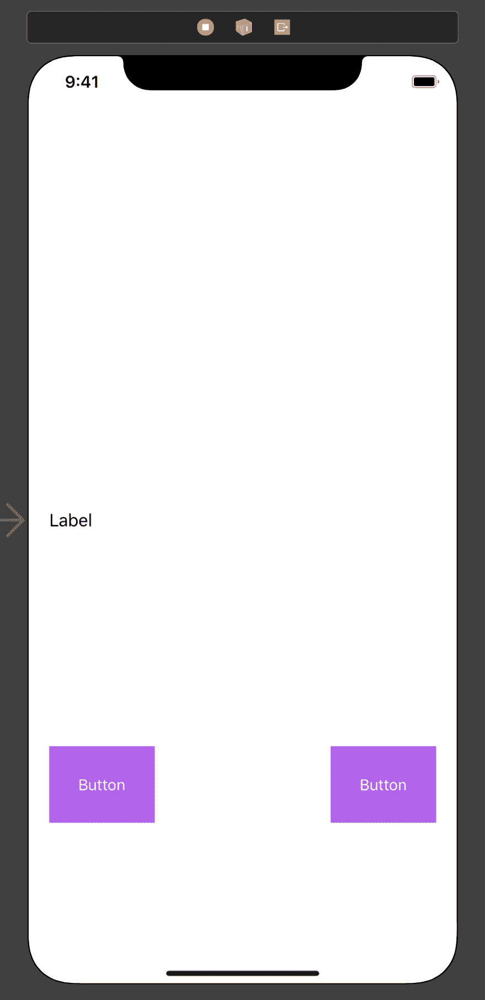
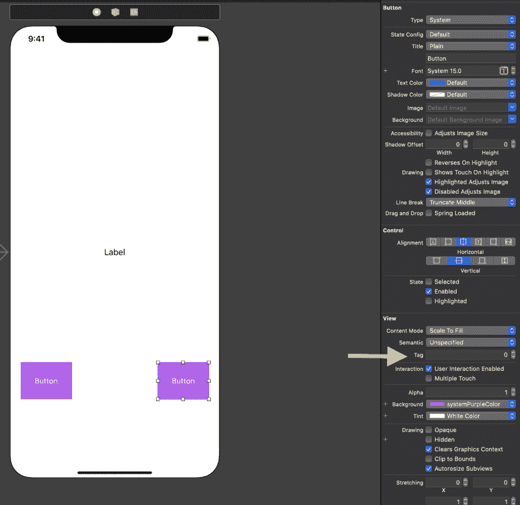

# 如何使用多个按钮实现相同的功能

> 原文：<https://dev.to/maeganwilson_/how-to-use-the-same-action-function-with-multiple-buttons-357k>

一些 iOS 应用程序要求按钮在点击时使用相同的功能，想想计算器应用程序中的数字按钮。计算器上的数字按钮将执行相同的操作，存储与之相关的数字。不要为每个按钮声明一个函数，而是创建一个使用 button 标签的函数。

这篇文章也可以叫做“如何将多个按钮链接到一个`@IBAction`”

在这篇文章的底部找到 GitHub repo。

# 创建项目和" UI "

创建一个新的 iOS 单视图应用程序，并将其命名为“按钮操作”。

给`Main.storyboard`增加两个按钮。您可以为按钮添加样式，以便于查看。我要添加一个背景，并使有点大。

给`Main.storyboard`添加标签。

[](https://res.cloudinary.com/practicaldev/image/fetch/s--4uxkoiUz--/c_limit%2Cf_auto%2Cfl_progressive%2Cq_auto%2Cw_880/https://github.com/maeganjwilson/buttons-single-action-tutorial/blob/master/tutoriimg/pic_1.png%3Fraw%3Dtrue)

## 给按钮添加标签值

当在两个按钮上使用相同的功能时，需要有一种方法来区分这两个按钮。一种方法是利用标签。这可以在检查器中找到。

[](https://res.cloudinary.com/practicaldev/image/fetch/s--MaewE7E9--/c_limit%2Cf_auto%2Cfl_progressive%2Cq_auto%2Cw_880/https://github.com/maeganjwilson/buttons-single-action-tutorial/blob/master/tutoriimg/tag.png%3Fraw%3Dtrue)

将左侧按钮的`Tag`设置为 0，将右侧按钮的`Tag`设置为 1。

## 将标签 IBOutlet 添加到`ViewController.swift`。

点击“显示助理编辑按钮”，这样`Main.storyboard`和`ViewController.swift`可以并排打开。
将下面的代码添加到类中:

```
class ViewController: UIViewController {
        //add the line below this comment

        @IBOutlet weak var label: UILabel!

        //do not adjust the code below this comment
    override func viewDidLoad() {
        super.viewDidLoad()
        // Do any additional setup after loading the view.
    }
} 
```

Enter fullscreen mode Exit fullscreen mode

## 为按钮编写一个函数

现在，我们需要为按钮编写一个函数来执行。
该功能将根据按下的按钮改变标签。
左边的按钮会让标签说“按钮 1 已按下”，右边的按钮会让标签说“按钮 2 已按下”。

在`viewDidLoad(){}`下面添加以下内容，但仍在类内:

```
@IBAction func buttonPressed(_ sender: UIButton) {
        label.text = "Button \(sender.tag + 1) was pressed"
    } 
```

Enter fullscreen mode Exit fullscreen mode

## 将按钮关联到功能

将功能旁边的圆圈拖到按钮上。这就是将两个或多个按钮关联到一个功能的全部过程。

# 运行 app

现在，构建并运行应用程序。
点击左边的按钮，标签应该变为“按钮 1 被按下”。单击右边的按钮，标签应该变为“按钮 2 被按下”。

这里是[完成的 GitHub 回购](https://github.com/maeganjwilson/buttons-single-action-tutorial)。

##  [梅根威尔逊](https://github.com/maeganwilson) / [按钮-单动作-教程](https://github.com/maeganwilson/buttons-single-action-tutorial)

### 一个关于如何使用多个按钮的单个动作的教程项目。

<article class="markdown-body entry-content container-lg" itemprop="text">

# 按钮-单动作-教程

这是一个关于如何使用多个按钮的单个动作的教程项目。

# 邮件在哪里？

该帖子可在以下位置找到:

*   [开发到](https://dev.to/maeganwilson_/how-to-use-the-same-action-function-with-multiple-buttons-357k)
*   [中等](https://medium.com/@maeganwilson_/how-to-use-the-same-function-with-multiple-buttons-c927912eb359)
*   本报告中`/tutorial`的 Readme.md

# 你喜欢这个吗？

如果你喜欢这个帖子和教程，请考虑通过点击[上的](https://www.patreon.com/maeganwilson_)或点击这个回购中的赞助商来支持我。

如果你赞助，我会把你的名字列为我现在和将来所有项目的赞助人。它将在应用程序和回购中列出。

</article>

[View on GitHub](https://github.com/maeganwilson/buttons-single-action-tutorial)

* * *

如果你喜欢我的帖子，请考虑分享或者请我喝杯咖啡！

[](https://www.buymeacoffee.com/appsbymw)