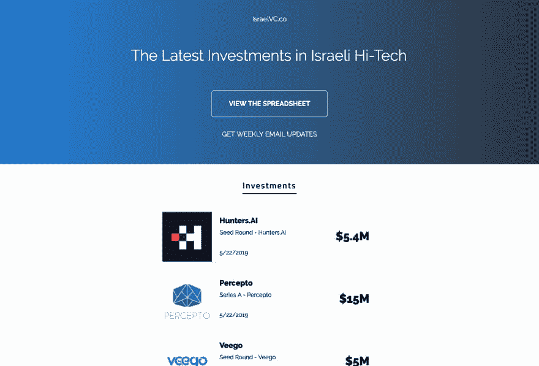

# 我是如何建造的:以色列——盖茨比，谷歌表单，现在没有服务器

> 原文：<https://dev.to/elie222/how-i-built-this-israelvc-gatsby-google-sheets-now-serverless-4b56>

我最近启动了一个迷你副业项目，名为[IsraelVC.co](https://israelvc.co/)，记录以色列高科技领域的最新投资。

这是一个简单的网站:一个页面包含最近在以色列发生的 20 项投资的列表。它还连接了一个 Google Sheet，作为网站的数据库。该数据库包含 4000 项投资。在不久的将来，这个网站也会显示所有的投资。

[](https://res.cloudinary.com/practicaldev/image/fetch/s--2y-DgtFj--/c_limit%2Cf_auto%2Cfl_progressive%2Cq_auto%2Cw_880/https://cdn-images-1.medium.com/max/2400/1%2A-AC79hu0Zlrsv7y-hVj_HA.png)

这篇文章是关于我是如何建造它的。

### 技术堆栈

*   盖茨比(反应过来)
*   谷歌工作表
*   现在无服务器
*   Netlify
*   Mailchimp

### 盖茨比

Gatsby 是一个基于 React 的静态站点生成器。它可以让你轻松地创建网站，是闪电般的速度和搜索引擎友好。

托管盖茨比网站很简单。您可以使用 Netlify 或 Now 等服务免费托管该网站。免费并不意味着这些服务不好。这些服务是最好的。他们将通过位于您用户附近的 CDN 提供您的内容。在不需要维护任何服务器的情况下，您无法要求更高的速度和无限的可扩展性。赢了。赢了。赢了。

Netlify 和 Now 都设置了连续部署。这意味着你可以推送你的 GitHub repo，你的网站会自动更新。如果您在一个开发分支上更新并提交一个提交，那么一个新的部署将会在它自己的 url 上发布。每一次提交都有一个公开的网站。这是一个很棒的全方位开发者体验。如果您现在使用，您也可以使用他们的命令行工具进行部署，只需输入`now`。

### Google Sheets

我使用谷歌表作为该项目的数据库。一个典型的网站将使用 PostgreSQL，MongoDB 或其他一些数据库。这个项目很小，我可以依靠工作表来完成这项工作。

使用工作表作为数据库可能会让一些人感到惊讶。那不是你如何发展的，我听到你在喊！

那么为什么要用床单呢？

首先，它使用起来非常简单。任何人都可以使用它。要添加信息，你只需打开它，开始输入。与传统数据库相比。你必须是一个开发者才能更新它或者读取其中的信息。

Sheets 提供了基于权限的现成读/写访问。没有必要建立一个管理面板。

您不必担心服务器维护或扩展。那是谷歌的工作。如果我必须列出数百万的投资，我可能会遇到问题，但这不是我必须处理的案例。

在这个具体的例子中，我还想让用户能够方便地访问数据，这样他们就可以随心所欲地使用数据。电子表格本身是公开的。Sheets 内置了大量的功能。例如，能够对成千上万的投资进行分类或搜索。这省去了我自己构建功能的麻烦。

你可以做的另一件事是将谷歌表单连接到工作表，表单响应直接进入电子表格。

传统数据库有其优势。大多数网络或移动应用需要一个带有数据库的后端。性能、大规模、模式、备份、触发器、连接、细粒度用户访问控制。这样的例子不胜枚举。您可能会想出一种方法来使用电子表格实现其中的一些功能，但最终这可能不是一个好主意。幸运的是，以色列并不需要这些好处。

**替代品**

有一些床单的替代品。一种是简单地将信息作为 JSON 存储在 repo 中。另一种选择是在包含数据的回购中存储降价文件。典型的盖茨比博客就是这样建立起来的。例如，丹·阿布拉莫夫的[https://overreacted.io/](https://overreacted.io/)，但是像这样的科技博客不胜枚举。

IsraelVC 的第一次迭代其实就是这么做的。我用了 Netlify CMS 来帮忙。它给了你一个简单的管理界面，你可以在其中更新你的博客文章(或网站上的任何其他数据)。一旦你点击“发布”,它会将修改提交给你的 git repo，如果你使用的是 CD 工具，它会自动更新你的网站。

对于想要轻松更新数据的博客或登录页面，Netlify CMS 是一个很好的选择。你可以直接写回购协议，对于许多开发人员来说这是一个好的解决方案，但是如果你想让你的团队中不太懂技术的成员在不需要你帮助的情况下更新项目，CMS 是一个更好的解决方案。

网络 CMS 有它的缺点。发布和更新帖子有点慢。对于偶尔的博客文章来说，这没关系，但是如果你经常输入大量的数据，这可能会很烦人。

其他无头 CMS 系统包括 Contentful、Prismic 和 GraphCMS。Wordpress 也提供了一个无头 CMS 系统。我没有使用过这些，所以我不会对它们进行评论，但我认为它们提供了比 Netlify CMS 更广泛的解决方案，对许多团队来说是更好的选择。

### 现在无服务器

我使用 Now 作为我的站点的 API。API 所做的就是查询我的谷歌投资清单并返回它。

你可以在 GitHub 上看到它的代码:

总而言之，它有 60 行代码，您可以使用一个命令来部署它:

```
now 
```

现在只需点击几下鼠标就可以设置连续部署，但是我还没有这样做。

我想在这里谈谈几件神奇的事情。

我不需要维护服务器，它是无限可扩展的，而且是免费的(我只支付了很少的费用，但是你也可以使用免费计划，获得同样的功能)。

它很快。现在最近推出[无服务器预渲染
(SPR)](https://zeit.co/blog/serverless-pre-rendering) 。它的作用是缓存来自无服务器函数的响应。我的函数调用 Google Sheets API，这可能需要几秒钟的时间来响应。我不希望我的用户等待几秒钟的回应。他们有更重要的事情要做，比如投资创业公司。

SPR 在 CDN 边缘缓存响应，并立即响应。在后台，该函数获取最新的工作表数据或它正在做的任何事情，并为下一个访问该网站的用户更新 CDN。

要启用 SPR，您必须向函数中添加一行代码:

```
res.setHeader(‘Cache-Control’, ‘s-maxage=30, stale-while-revalidate=3600, max-age=0’) 
```

`s-maxage=30` —告知 CDN 缓存响应 30 秒。

`stale-while-revalidate=3600` —告知 CDN，如果数据过时(即缓存数据在 30 秒前更新)，则应提供网站的过时版本。并且缓存将在后台更新，以便数据对于下一个访问该站点的用户来说是新鲜的。如果有人很长时间没有访问网站，并且陈旧数据超过 3600 秒(1 小时)，CDN 将被指示不提供陈旧数据，而是从工作表中获取最新数据，并直接提供给客户端。

`max-age=0` —告诉客户端不要缓存响应。客户将总是从我们的 API 请求最新的数据。

为了在本地测试无服务器功能，我使用了`now dev`。这是一种新工具，也有它的问题。它偶尔会随机崩溃，热重装需要一段时间。Now 团队一直致力于此并发布更新。最近它工作得更好了，但它仍然不是最好的体验。

Netlify 还提供无服务器。这叫做网络函数。我在设置这个的时候遇到了一点麻烦。在`netlify.toml`文件中需要的设置令人困惑，而且`netlify dev`看起来比`now dev`还要麻烦。

`netlify dev`和`now dev`都很新，所以我会放他们一马。这是两家非常棒的公司，如果我还没有说清楚我对它们的感觉的话:)

### Netlify

我目前使用 Netlify 进行前端托管。我喜欢使用 Netlify 进行静态部署。太好用了。正面 10/10。它是免费的，甚至有像自动无损图像压缩这样的功能，现在已经没有了。开箱即用的 CD 设置是一种享受，尤其是在团队开发项目时。

现在让前端托管在 Netlify 上而让无服务器后端运行有一个缺点。在未来，我可能会移动前端到现在。主要原因是我想避免额外的 DNS 查找，当 API 和前端在不同的域时会发生这种情况。这是一点微优化，严格来说没有必要，但看到 API 的 DNS 查找需要 2.5 秒，我想把它去掉。另一个解决问题的方法是将后端转移到 Netlify 函数，但我更喜欢现在的无服务器。

**更新:**

在发表了这篇文章之后，Gatsby 的团队指出了另一种不需要 Now API 服务器就可以将 Gatsby 与工作表集成的方法。

有一个盖茨比床单插件:
[https://www . gatsbyjs . org/packages/Gatsby-source-Google-Sheets/](https://www.gatsbyjs.org/packages/gatsby-source-google-sheets/)

这个插件在构建时从你的电子表格中获取数据。您使用 Gatsby graphql 查询从工作表中获取您想要的数据。

采用这种方法，只要图纸数据发生变化，就需要触发站点的重建。您可以通过使用 Netlify API 访问您的 Netlify 管理员，或者通过在工作表中添加一个按钮来调用 Netlify API 并在单击时重建站点。这第三种方法很酷，在这里有记录[。](https://jmolivas.weknowinc.com/how-use-google-spreadsheet-manage-content-and-trigger-deployment-your-gatsbyjs-site?source=post_page-----714ed5023bd3----------------------)

### Mailchimp

这里没什么可写的。我将每周发送一份电子邮件简讯，介绍那一周的投资，所以我在网站上添加了一个简单的 Mailchimp 表单。它对多达 2000 名用户免费，没有任何麻烦。现在，我将手动发送电子邮件。将来我可能会自动完成这个过程，并使用 Mailgun 或 SendGrid 之类的解决方案来完成发送。

### 总结

有一些很棒的工具可以大大加快开发速度，减少维护，降低成本。

处理服务器、扩展和性能都是令人头疼的问题。每月为你发起的每个迷你副业项目支付几美元也很烦人。现在你可以免费使用最好的。

我介绍的堆栈很简单，但是非常强大。作为一名自由开发者，我每周都要处理数据库和部署。我还维护着一个拥有成千上万用户的网站。由于缺乏其他选择，我没有选择使用这个堆栈。我选择它是因为它是一个很棒的解决方案。部署到现在还是 Netlify 感觉像是作弊，其实不是。在许多情况下，这是明智的选择。

我很乐意在下面的评论中听到你的想法或任何问题。

如果你喜欢这篇文章，并想在未来阅读更多类似的文章，请点击下面的关注按钮。请随时在 Twitter 上联系我:

或者在我的网站: [elie.tech](https://elie.tech/) 。

*   [Netlify](https://medium.com/tag/netlify?source=post)
*   [现在](https://medium.com/tag/now?source=post)
*   [无服务器](https://medium.com/tag/serverless?source=post)
*   [启动](https://medium.com/tag/startup?source=post)
*   [盖茨比](https://medium.com/tag/gatsbyjs?source=post)