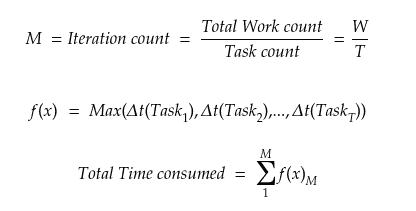
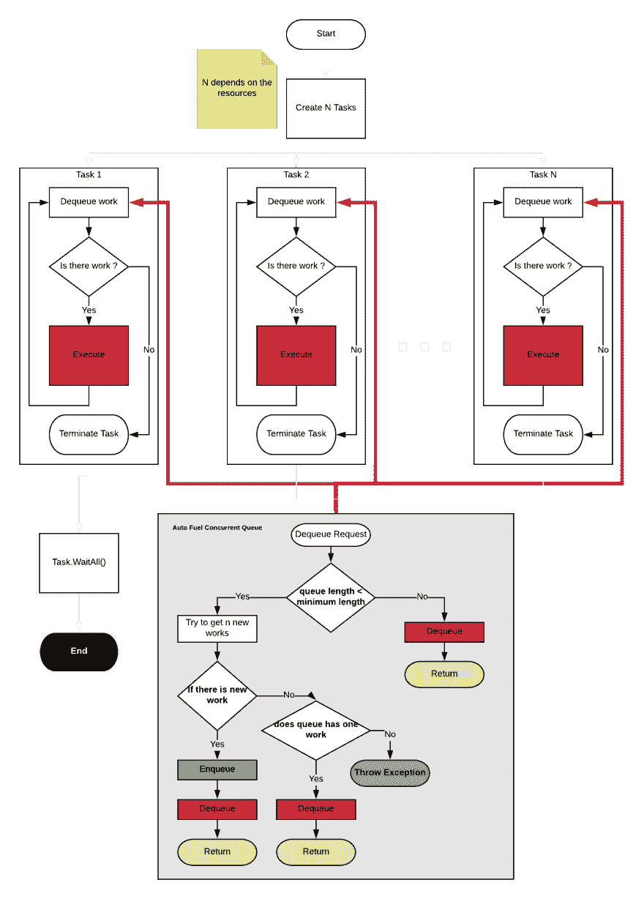

# 通过“自动加油并发队列”在批处理中实现更快更简单的多线程处理

> 原文：<https://dev.to/alialp/faster-easier-multi-treading-with-auto-fuel-concurrent-queue-5437>

假设我们需要处理 1，000，000，000 笔银行交易，而我们的时间跨度有限，在这种情况下，并行性是提高整体完成时间的唯一解决方案。

如果计算机集群不可用，那么多线程是当前可用的最佳解决方案，但多线程中唯一棘手的问题是线程的适当数量，如此之少，完成时间将永远持续，太多，CPU 的上下文切换将适得其反，因此明智的开发人员将始终考虑系统的资源，然后得出线程计数的神奇数字，如 CPU 的核心计数、内存等...

无论如何，让我们假设适当的数量已经被确定为 10，000 个线程，这意味着我们必须将 1，000，000，000 个作业分成 10，000 个块，这意味着我们将最终得到每个线程 100，000 个操作。我们假设每个操作最多需要 5 秒钟完成，因此

```
(100,000 * 5 seconds) / (24 * 3600) = 5.7 Days 
```

Enter fullscreen mode Exit fullscreen mode

看起来很直截了当，对吧？除了每个操作的 5 秒完成时间是一个愿望，没有保证，每个操作将花费最多 5 秒来完成其任务，原因可能是因为数据库中的锁定，或网络延迟或许多其他原因，总之在现实中，我们唯一可以确定的是最小完成时间，最大值总是未知的，它只能通过超时来限制，因此 5.7 天只是一个乐观的猜测。

上述解决方案的根本问题是，尽管我们已经将操作并行化(忽略上下文切换)为 10，000 个线程，但在每个线程中，一切都是按顺序发生的，这意味着在每个线程中，100，000 个操作将一个接一个地处理，因此，如果线程 1 中的第一个操作停滞 1 小时，线程 1 的完成时间将向前移动 1 小时，并且在 1，000，000，000 个操作中极有可能遇到这种复杂情况，尤其是当

本文将向您介绍“Auto Fuel Concurrent Queue ”,它可以帮助您最大限度地减少上面解释的阻塞操作所导致的整体性能不足，它可以通过不预先将作业分配到线程中来实现这一点，相反，通过创建 10，000 个饥饿的线程，每个线程可以一次处理一个作业，在完成该作业后，它会立即请求另一个作业，这一过程将重复进行。 另一方面,“Auto Fuel Concurrent Queue”将充当这些饥饿线程的母亲，并且一旦它从这些线程中的任何一个接收到对新作业的请求，它将尝试通过使用其数据提供者接口来检索它，并且如果还有更多新作业，它将向该线程提供它，因此该线程可以继续保持活动，否则它必须杀死自己。

就像这样，如果一个线程阻塞了一个小时，那就没关系了，因为其他线程会替它处理，一旦它结束，就可以立即加入其他线程。

说了这些，让我们深入细节，弄清楚这种方法到底有多有用，它是如何工作的，要实现这 10 亿个就业机会有点难以想象，所以，让我们从 20 个开始:)

假设我们有 20 项工作需要尽快完成，为了清晰起见，我们知道每项任务的持续时间如下

```
public static class Jobs
{
    public static readonly List<int> TaskDurations = new List<int>()
    {
        1, 2, 3, 22, 4,
        5, 2, 1, 2, 3,
        4, 9, 10, 1, 2,
        3, 4, 5, 2, 1
    };
} 
```

Enter fullscreen mode Exit fullscreen mode

如果你想知道为什么不用这个

```
var tasks = new List<Task>();

foreach (var duration in Jobs.TaskDurations)
{
    tasks.Add(Task.Delay((int) TimeSpan.FromSeconds(duration).TotalMilliseconds));
}

await Task.WhenAll(tasks); 
```

Enter fullscreen mode Exit fullscreen mode

随着任务数量的增加，比方说要处理 1，000，000，000 条记录，使用简单的 for 循环的可能性正在消失。

## 典型的多任务分块方法

```
private readonly ConcurrentQueue<int> _queue = new ConcurrentQueue<int>();

[SetUp]
public void Setup()
{
    //populate the queue 
    foreach (var data in Jobs.TaskDurations)
    {
        _queue.Enqueue(data);
    }
}

[Test]
public async Task TestTypical()
{
    var sw = new Stopwatch();
    sw.Start();

    for (var i = 1; i <= 4; i++)
    {
        var iSw= new Stopwatch();
        iSw.Start();

        var tasks = new Task[5];
        for (var j = 0; j < 5; j++)
        {
            tasks[j] = Task.Run(async () =>
            {
                //do the operation 
                _queue.TryDequeue(out var delay);
                await Task.Delay((int) TimeSpan.FromSeconds(delay)
                    .TotalMilliseconds);
                Console.Write($"{delay},");
            });
        }

        await Task.WhenAll(tasks);

        iSw.Stop();
        Console.Write($"Iteration: {i} Time: {iSw.Elapsed}\n");
    }

    sw.Stop();
    Console.WriteLine($"Total Time consumed: {sw.Elapsed}");
} 
```

Enter fullscreen mode Exit fullscreen mode

##### 总运行时间:41 秒

[](https://res.cloudinary.com/practicaldev/image/fetch/s--qCntlhFx--/c_limit%2Cf_auto%2Cfl_progressive%2Cq_auto%2Cw_880/https://i.ibb.co/5TRcZ0p/image.png)

| 循环 | 任务 1 | 任务 2 | 任务 3 | 任务 4 | 任务 5 | 最大持续时间 |
| --- | --- | --- | --- | --- | --- | --- |
| one | one | Two | three | Twenty-two | four | Twenty-two |
| Two | five | Two | one | Two | three | five |
| three | four | nine | Ten | one | Two | Ten |
| four | three | four | five | Two | one | five |
| # |  |  |  |  | 总数 | 42 秒 |

到目前为止一切顺利，对吗？通过应用多任务并同时执行我们的任务，我们已经将总持续时间减少了 50%，但这种方法仍然存在一些问题:

*   您需要预先知道整个操作的数量，以便在线程/任务之间公平地分配它们
*   如果其中一个任务停滞在任何迭代中，那么该迭代将被阻塞，这将导致阻塞整个操作
*   在操作开始后，没有简单的方法可以动态地将新作业注入到操作中

说了这么多，你准备好迎接同时运行这些任务的最快和最有效的方法了吗，所以请继续关注我，因为从现在开始事情会变得有点棘手:)

## “自动加油并发队列”方式

```
private AutoFuelConcurrentQueue<int> _autoFuelConcurrentQueue;
private IDataProvider<int> _dataProvider;
private const int TaskCount = 5;

[SetUp]
public void Setup()
{
    _dataProvider = new MyDataProvider();
    _autoFuelConcurrentQueue = new AutoFuelConcurrentQueue<int>(10, _dataProvider);
}

[Test]
public async Task Test()
{
    var sw = new Stopwatch();
    sw.Start();

    var dataCounter = 0;
    var tasks = new Task[TaskCount];
    for (var i = 0; i < TaskCount; i++)
    {
        var i1 = i;
        tasks[i] = Task.Run(async () =>
        {
            while (true)
            {
                try
                {
                    var delay = await _autoFuelConcurrentQueue.DequeueAsync();
                    Interlocked.Increment(ref dataCounter);
                    await Task.Delay((int) TimeSpan.FromSeconds(delay).TotalMilliseconds);
                    Console.WriteLine($"{DateTime.Now:mm:ss.fff};Task_{i1};{delay}");
                }
                catch (EndOfQueueException)
                {
                    Console.WriteLine($"{DateTime.Now:mm:ss:fff};Task_{i1};end_of_queue");
                    break;
                }
            }

            return Task.CompletedTask;
        });
    }

    await Task.WhenAll(tasks);
    sw.Stop();
    Console.WriteLine($"Total Time consumed: {sw.Elapsed}");
} 
```

Enter fullscreen mode Exit fullscreen mode

“AutoFuelConcurrentQueue”需要定义一个 DataProvider 类来获取它的新任务

```
public class MyDataProvider : IDataProvider<int>
{
    private int _consumedCount = 0;
    public async Task<IEnumerable<int>> GetNewData(int count)
    {
        await Task.Delay(0);

        //get limit number of new data
        var result = Jobs.TaskDurations.AsQueryable().Skip(_consumedCount).Take(count);
        _consumedCount += count;
        return result;
    }
} 
```

Enter fullscreen mode Exit fullscreen mode

##### 总操作持续时间:22 秒

[](https://res.cloudinary.com/practicaldev/image/fetch/s--_f9lfnqu--/c_limit%2Cf_auto%2Cfl_progressive%2Cq_auto%2Cw_880/https://i.ibb.co/DkJShdZ/image.png)

这就是它在幕后工作的方式

[](https://res.cloudinary.com/practicaldev/image/fetch/s--EidJuM_Q--/c_limit%2Cf_auto%2Cfl_progressive%2Cq_auto%2Cw_880/https://i.ibb.co/q0ZcL9G/Auto-Fuel-Concurrent-queue-Auto-Fuel.png)

> 注意:您可以动态地将任务添加到数据源，并且您不需要担心这一点，因为每次任务空闲时，它都会向数据提供程序请求新的作业，并且数据提供程序会在整个操作进行过程中检查新的数据

你可以试试从[nu get](https://www.nuget.org/packages/AutoFuelConcurrentQueue/)

```
Package Manager
Install-Package AutoFuelConcurrentQueue -Version 1.1.0

.Net CLI
dotnet add package AutoFuelConcurrentQueue --version 1.1.0 
```

Enter fullscreen mode Exit fullscreen mode

或者你可以在这里查看源代码

快乐编码:)