# Google 行动入门

> 原文：<https://dev.to/botreetech/getting-started-with-google-actions-581l>

[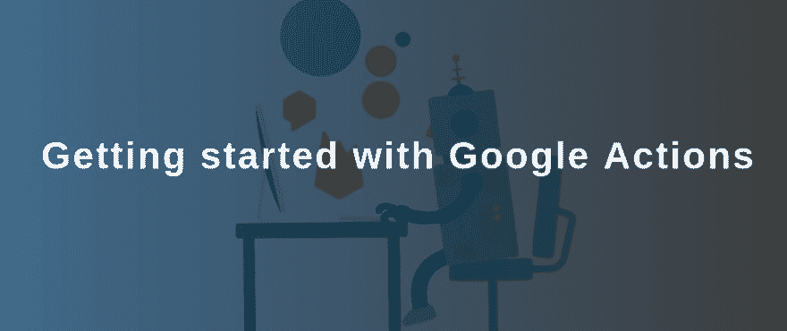](https://res.cloudinary.com/practicaldev/image/fetch/s--406dDnit--/c_limit%2Cf_auto%2Cfl_progressive%2Cq_auto%2Cw_880/https://www.botreetechnologies.com/blog/wp-content/uploads/2019/05/Getting-started-with-Google-Actions.png)

## 什么是动作？

动作是您为助手构建的交互的起点。用户可以通过键入或对助理说话来与您的操作对话。

为了开始使用 action 与您的助手交谈，用户说或键入短语，如“嘿，谷歌播放一些音乐”，整个句子是话语，而短语“嘿，谷歌”是触发器。我们再举一个例子，“嘿谷歌，和预约调度器说话”。这里，“Hey Google”是触发器，“Appointment Scheduler”是调用名。

## 设置谷歌动作

*   打开 [Google Actions 控制台](https://console.actions.google.com/?pli=1)，使用您的 Google 帐户登录并添加一个新项目。
*   选择“对话”选项，构建定制的对话体验。
*   您现在位于项目的概述页面。现在点击“快速设置”和“决定如何调用你的动作”。
*   设置调用显示名称和 Google Assistant voice 并保存更改。

[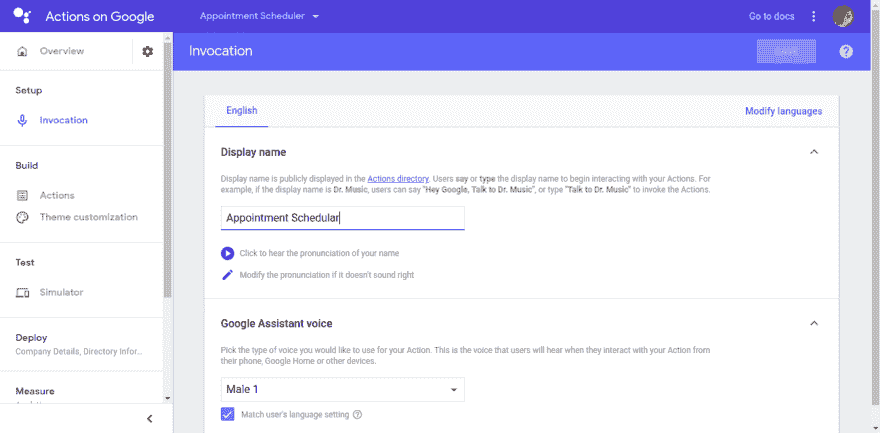](https://res.cloudinary.com/practicaldev/image/fetch/s--vlVPASMV--/c_limit%2Cf_auto%2Cfl_progressive%2Cq_auto%2Cw_880/https://www.botreetechnologies.com/blog/wp-content/uploads/2019/05/output-1-2.png)

*   转到“构建”部分的“操作”。并添加您的第一个动作，保持默认选择“custom intent”不变。它将带您到对话流控制台。

### 什么是对话流？

对话流程是[自然语言处理](https://www.linkedin.com/pulse/natural-language-processing-using-python-top-5-libraries-barot/)。对话流使用机器学习模型处理将自然语言翻译成机器可读数据的工作。

以下是对话流如何处理用户话语的示例。

[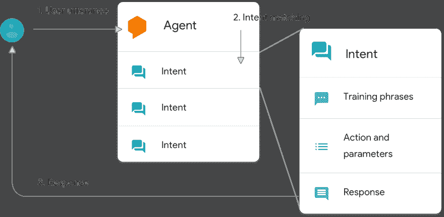](https://res.cloudinary.com/practicaldev/image/fetch/s--xoB432Im--/c_limit%2Cf_auto%2Cfl_progressive%2Cq_auto%2Cw_880/https://www.botreetechnologies.com/blog/wp-content/uploads/2019/05/output-2-2.png)

**关键术语**:

*   代理人
*   目的
*   实体
*   完成

### 阅读另- [使用谷歌云视觉 OCR 和 Ruby 从图像中提取文本](https://www.botreetechnologies.com/blog/extracting-text-from-image-using-google-cloud-vision-ocr-with-ruby)

**代理人**

*   我们首先创建一个带有对话流的代理，代理就是你的整个聊天机器人应用程序

哪个特工会？

1.  收集用户的意见
2.  将其映射到一个意图
3.  对其采取行动
4.  提供响应

*   这一切都始于称为话语的触发事件。这就是用户调用聊天机器人的方式。

*   让我们创建一个代理。

输入新的代理名称或保留默认名称，然后点击“创建”。

**意图**

*   意图是让你获取任何正常的对话/文本，并从中提取计算机可理解的信息。

*   举个例子:如果你说“我要预约”。“设置约会”是这里的一个意图。或者如果你问“你们的营业时间是什么时候”，那么这里的“营业时间”就是故意的。

*   对话流然后用更多相似的短语训练[机器学习模型](https://www.botreetechnologies.com/machine-learning-solutions)，并最终将用户的阶段匹配到正确的意图。这个过程称为意图匹配(参考上面的示例图)。

*   对话流有两个默认意图，一个是欢迎意图，另一个是后退意图。欢迎意图有助于问候用户，默认的回退意图有助于捕捉软件不理解的所有短语。您可以尝试在屏幕上测试控制台(最后一个面板)的“立即尝试”部分写一些短语。

*   让我们创建我们的自定义意图。

写下意向名称，我们使用的是“日程安排”并点击“保存”。现在让我们跳过上下文和事件，我们将添加训练短语和回答。

[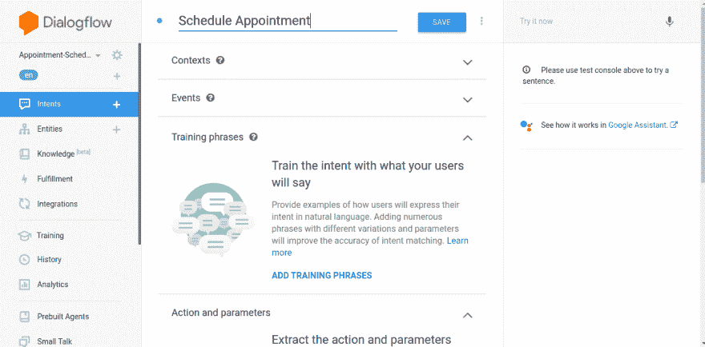](https://res.cloudinary.com/practicaldev/image/fetch/s--wXO99MFg--/c_limit%2Cf_auto%2Cfl_progressive%2Cq_auto%2Cw_880/https://www.botreetechnologies.com/blog/wp-content/uploads/2019/05/output-3.png)

单击“添加训练短语”，当您添加短语并按 enter 键时，您将看到日期和时间实体会自动突出显示。

[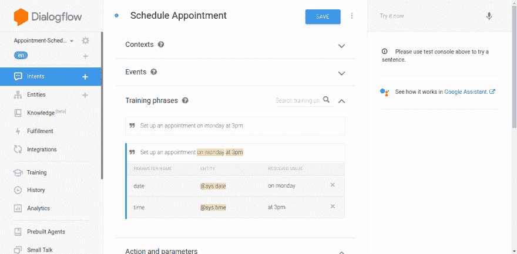](https://res.cloudinary.com/practicaldev/image/fetch/s--Wp7PYypW--/c_limit%2Cf_auto%2Cfl_progressive%2Cq_auto%2Cw_880/https://www.botreetechnologies.com/blog/wp-content/uploads/2019/05/output-4.png)

单击“添加响应”，为提到的培训短语键入您想要的响应。为了显示日期和时间，在响应中使用我们的系统变量$date 和$time。这里的“$”符号有助于访问实体值。

[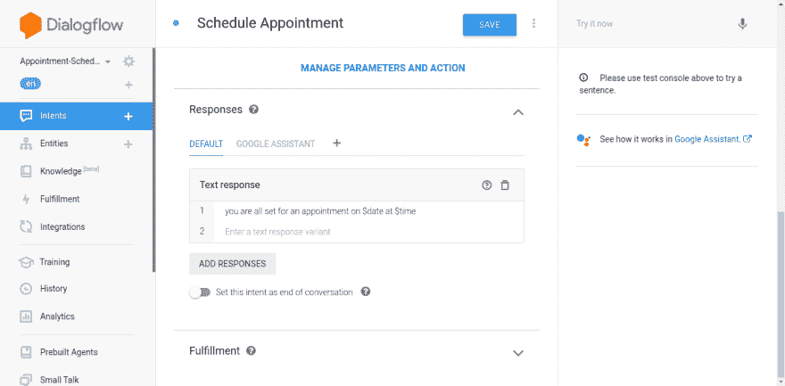](https://res.cloudinary.com/practicaldev/image/fetch/s---GYVgdUF--/c_limit%2Cf_auto%2Cfl_progressive%2Cq_auto%2Cw_880/https://www.botreetechnologies.com/blog/wp-content/uploads/2019/05/output-5.png)

现在，在测试控制台中测试它。在“立即尝试”中键入您的短语，然后按 enter 键。

[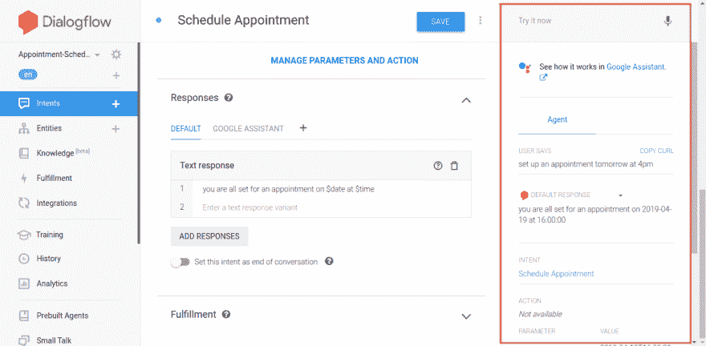](https://res.cloudinary.com/practicaldev/image/fetch/s--Ep0-JUy4--/c_limit%2Cf_auto%2Cfl_progressive%2Cq_auto%2Cw_880/https://www.botreetechnologies.com/blog/wp-content/uploads/2019/05/output-6.png)

瞧...有用！

**实体**

*   语句中的关键信息来完成某项任务。这些是您想要定义和收集的变量。

*   比如:“约好明天下午 4 点”。下午 4 点和明天是两个实体

*   DialogFlow 有一些预定义的实体，如日期、时间、地址、城市等，这些被称为系统实体。

*   我们还可以在代理中定义自定义实体，我们称之为开发人员实体。

现在，如果有人写下“设置一个约会”这个短语会怎么样。我们还没有处理过这种情况，为了支持这种情况，我们有一种叫做槽填充的东西。在这里，我们根据需要创建实体，对话流将确保询问缺少的所需实体。

让我们将上述场景添加到我们的软件中。

*   在动作和参数部分点击“管理参数和动作”。

*   标记所需的实体，并点击“定义提示”来定义所需实体的提示。

你可以添加更多的变量，如果你想，只需点击“保存”。

[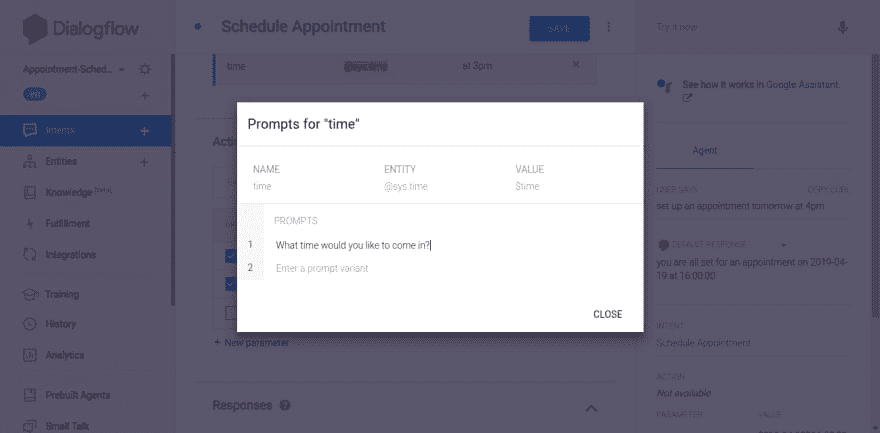](https://res.cloudinary.com/practicaldev/image/fetch/s--NhsKWrhM--/c_limit%2Cf_auto%2Cfl_progressive%2Cq_auto%2Cw_880/https://www.botreetechnologies.com/blog/wp-content/uploads/2019/05/output-7.png)

现在，再次在测试控制台中测试它。

[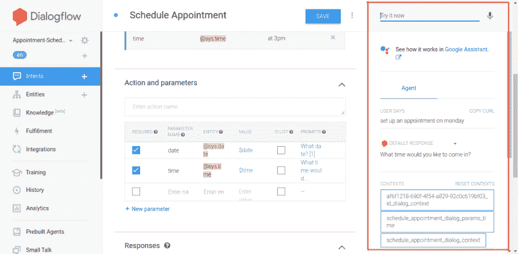](https://res.cloudinary.com/practicaldev/image/fetch/s--CuMNfcru--/c_limit%2Cf_auto%2Cfl_progressive%2Cq_auto%2Cw_880/https://www.botreetechnologies.com/blog/wp-content/uploads/2019/05/output-8.png)

耶…它起作用了。

如果你想给软件添加任何自定义逻辑或计算，那么你可以使用履行。我们将在下一篇博文中讨论。

我们在测试控制台中做了所有的测试。想把自己做的这个软件分享给朋友怎么办？

要分享它，只需点击侧边栏中的“集成”并启用“网络演示”。你可以分享链接，也可以把它框在你的网站或手机应用程序里。

### 部署应用程序

停留在“集成”页面，点击“集成设置”。你可以“测试”应用程序，如果一切正常，然后点击“管理助理应用程序”。

[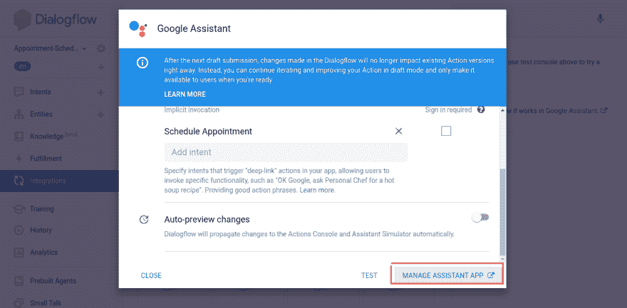](https://res.cloudinary.com/practicaldev/image/fetch/s--y0I2Tuw2--/c_limit%2Cf_auto%2Cfl_progressive%2Cq_auto%2Cw_880/https://www.botreetechnologies.com/blog/wp-content/uploads/2019/05/output-9.png)

单击“准备部署”。填写详细信息，然后返回并单击“发布”选项。深入了解纽约市的[专业网络开发人员，了解提高或构建项目质量以及整个公司的各种方法。](https://www.botreetechnologies.com/usa/web-development-company-new-york)

[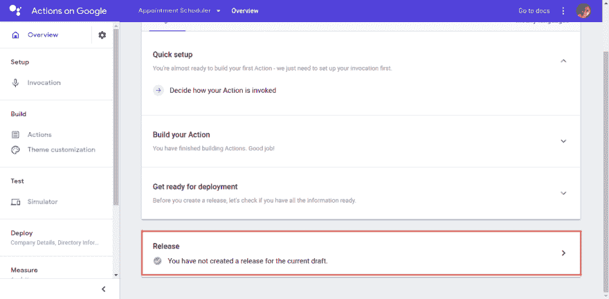](https://res.cloudinary.com/practicaldev/image/fetch/s--YBi-ueKv--/c_limit%2Cf_auto%2Cfl_progressive%2Cq_auto%2Cw_880/https://www.botreetechnologies.com/blog/wp-content/uploads/2019/05/output-10.png)

暂时就这样了。