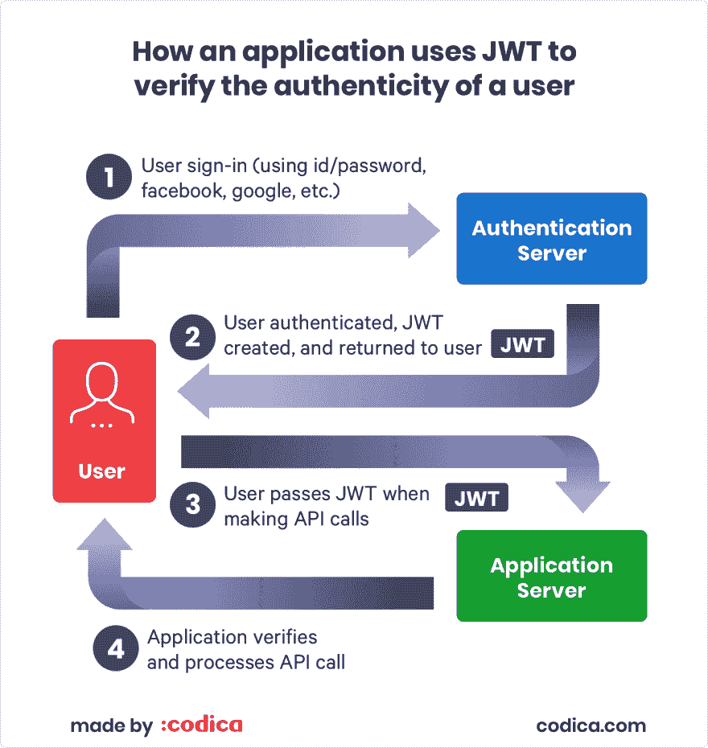

# 我们不能没有的 40 颗最好的红宝石。第一部分

> 原文：<https://dev.to/codicacom/40-best-ruby-gems-that-we-use-part-1-2ch8>

现在，web 开发人员能够访问现成的解决方案，而不是从头开始编写功能，这当然对开发速度有很大的积极影响。

当我们从这个角度来看 Ruby 时，它之所以引人注目，是因为它有大量被称为 Ruby gems 的库。它们为您构建的 Ruby 应用程序提供特定的功能。假设你想在你的程序中有一个认证功能——你不需要写一个，你可以以 gem 的形式得到它。这只是成千上万免费红宝石中的一个例子。

在[文章](https://www.codica.com/blog/top-ruby-gems-we-cant-live-without/)的第一部分，我们将揭示我们在以下 [web 开发](https://www.codica.com/services)领域使用的顶级 Ruby 宝石:**代码质量、调试、测试、部署和认证&授权**。

## 我们使用的顶级红宝石

要么我们为初创公司建立一个 [MVP，要么重构一个](https://www.codica.com/blog/why-build-startup-with-ruby-on-rails)[多领域财务分析平台](https://www.codica.com/case-studies/finance-analytics-platform)代码库，Ruby gems 代表主要开发工具。

在本文中，我们准备了一份红宝石清单。实际上，它只是所有帮助我们创造优质产品的宝石中的一小部分。

### 代码质量

为了移除庞大的代码块并正确处理重构，我们使用了以下 Ruby gems。

[Rubocop](https://github.com/rubocop-hq/rubocop) 是分析和格式化 Ruby 静态代码的瑰宝。RuboCop 非常灵活，其行为的大多数方面都可以通过各种配置选项进行调整。

[Overcommit](https://github.com/brigade/overcommit) 是一个配置 Git 挂钩的工具。这对于保持高质量的代码是非常好的。它允许在每次提交之前为 linters 启动调整 git 挂钩。

### 调试

实际上，即使是高质量的项目也肯定会出现错误和 bug。出于这个原因，我们的开发团队使用以下 Ruby gems 进行调试。

[Better_errors](https://github.com/BetterErrors/better_errors) 是显示错误的宝石。它显示关于错误的有用数据，并具有出色的视觉效果。Better_errors 取代了标准的 Rails 错误页面。

Byebug 是一个易于使用且功能丰富的 Ruby 调试器。这个 gem 允许逐行执行代码，在任务和执行代码之间暂停，在运行中改变变量。

### 测试

一般来说，没有应用程序的质量保证，任何开发过程都是不可能的。在这种情况下，我们来测试，让您评估质量。为了方便和顺利地开始和控制测试，我们的团队使用了下面的 gem。

RSpec 代表 Ruby 的行为驱动开发。与 TestUnit 标准测试库相比，它提供了更具可读性的 DSL。此外，它可以顺利地与帮助测试您的应用程序的其他 gem 协作和集成。

您可能会对我们关于 RSpec 最佳实践的 [GitHub repo](https://github.com/codica2/rspec-best-practices) 感兴趣。

[Capybara](https://github.com/teamcapybara/capybara) 是一个针对 web 应用的验收测试框架。它完美地配合了 RSpec 的测试目的。该工具负责模拟用户在浏览器中的行为的集成测试。它允许用几行代码描述授权场景，然后建议各种方便的测试调试方法。

[水豚截图](https://github.com/mattheworiordan/capybara-screenshot)是在水豚场景崩溃时自动保存截图的瑰宝。与 Capybara 和 Cucumber、RSpec 或 Minitest 一起，gem 允许查看源代码，并对测试套件中的每个故障进行截图(如果相关的话)。

[Parallel_tests](https://github.com/grosser/parallel_tests) 让 TestUnit、RSpec 和 Cucumber 编写的测试在多个 CPU 上并行运行时通过得更快。

Simplecov 是最有用的测试工具之一。它为您提供了单元测试覆盖的代码的百分比。因此，gem 鼓励开发人员编写经过全面测试的代码。

[数据库清理器](https://github.com/DatabaseCleaner/database_cleaner)为 Ruby 1.9+提供了强大的配置库和跨测试套件的覆盖自动合并。

[RSpec::Retry](https://github.com/NoRedInk/rspec-retry) 是一个工具，它提供:重试随机失败的 RSpec 示例。它为偶尔失败的 RSpec 模式添加了:retry 选项。

### 部署

部署是 web 开发的一个重要阶段，有一个库可以帮助我们平稳地运行这个过程。

Mina 是一个快速部署者和服务器自动化工具。与[卡皮斯特拉诺](https://github.com/capistrano/capistrano)相比，米娜的工作速度要快得多。它以 Bash 脚本的形式生成整个过程，并在服务器上远程运行。

此外，我们的开发团队为 Mina 创建了自己的工具，名为 mina-multideploy。它为您提供了在多台服务器上并行部署应用程序的机会。

更多信息请查看我们在 [Mina Multi-deploy](https://github.com/codica2/mina-multideploy) 上的 GitHub 库。

### 认证和授权

如今，几乎所有的 web 应用都需要一个认证和授权系统。因此，为了实现最佳的用户数据保护，我们使用以下 gem:

**[设计](https://github.com/plataformatec/devise)** 是一个基于 Warden 的灵活的 Rails 认证方案。Devise 为您提供任何复杂程度的服务——从通过电子邮件和密码进行身份验证到推荐系统。简而言之，它有 10 个模块，包括:

*   [可确认](https://www.rubydoc.info/github/plataformatec/devise/master/Devise/Models/Confirmable):发送带有确认指令的邮件，验证账户在登录时是否已经确认；
*   [可恢复](https://www.rubydoc.info/github/plataformatec/devise/master/Devise/Models/Recoverable):重置用户密码，发送重置指令；
*   [可记忆](https://www.rubydoc.info/github/plataformatec/devise/master/Devise/Models/Rememberable):管理令牌生成和清除，以便从保存的 cookie 中记住用户；
*   [可追踪](https://www.rubydoc.info/github/plataformatec/devise/master/Devise/Models/Trackable):追踪登录账号、时间戳和 IP 地址。

Ruby-JWT gem 是 T2 RFC 7519 OAuth JSON Web Token(JWT)T3 标准的一个简单的 Ruby 实现。它代表双方之间最安全的信息传输系统之一。

对于这个宝石的实际应用，查看我们的[博客文章](https://www.codica.com/blog/time-tracking-with-slack-bot),其中我们详细说明了在为 Slack 创建时间机器人时，我们是如何实现 JWT 的。

在该方案中，应用服务器被配置为检查传入的 JWT 是否是由认证服务器生成的。

## 最后的话

在这一章中，我们提供了我们在不同开发领域中实现的各种 Ruby gems。它们都有助于我们保持高水平的代码质量，简化调试和测试过程，加速和增强应用程序的部署，并最终保护用户的数据。

我们相信这一章会对你和你的开发团队(如果有的话)有用。在下一章中，我们将告诉你在 Codica 中有哪些 Ruby gems 用于以下开发方面:**上传文件、搜索、管理面板，以及更多用于不同任务的牛逼 gem**。

敬请关注，点击这里阅读全文:[我们使用的 40 种最佳红宝石](https://www.codica.com/blog/top-ruby-gems-we-cant-live-without/)。