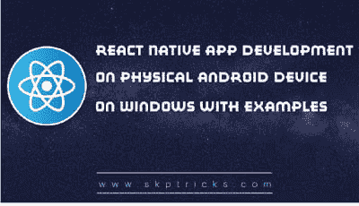

# 在 Windows 上的物理 Android 设备上开发本地应用

> 原文：<https://dev.to/skptricks/react-native-app-development-on-physical-android-device-on-windows-4m5i>

来源:[React Windows 上物理 Android 设备上的原生应用开发](https://www.skptricks.com/2019/05/react-native-app-development-on-physical-android-device-on-windows.html)

本教程解释了如何在 windows 平台上的物理 android 设备上运行 react native 应用程序。最初，每个移动应用程序开发者在仿真器中针对各种 android 版本测试 android 应用程序，然后在开发者将 android 应用程序安装在真实设备中之后，查看应用程序在真实移动设备中的实际性能。

我们需要在物理 android 设备上进行 react 原生应用开发的原因有很多，主要原因如下:
如果我们的硬件配置不好，Android Studio 和 Android Emulator 的负载太重。
如果我们正在开发相机等任何硬件专用应用，那么就不可能在 Android 模拟器上使用相机。因此，我们需要在物理 android 设备上运行 react 原生应用程序，以便使用相机。
如果我们希望看到我们的应用在物理 android 设备上的外观，那么这也是在物理 android 设备上进行原生应用开发的原因。
在 Windows 上的物理 Android 设备上开发本地应用。

[在 Windows 上的物理 Android 设备上开发本地应用](https://www.skptricks.com/2019/05/react-native-app-development-on-physical-android-device-on-windows.html)

[点击此处阅读更多信息](https://www.skptricks.com/2019/05/react-native-app-development-on-physical-android-device-on-windows.html)