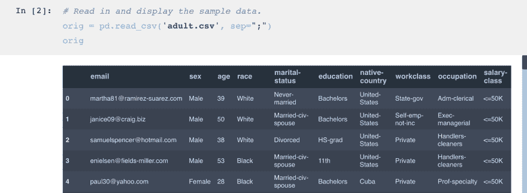
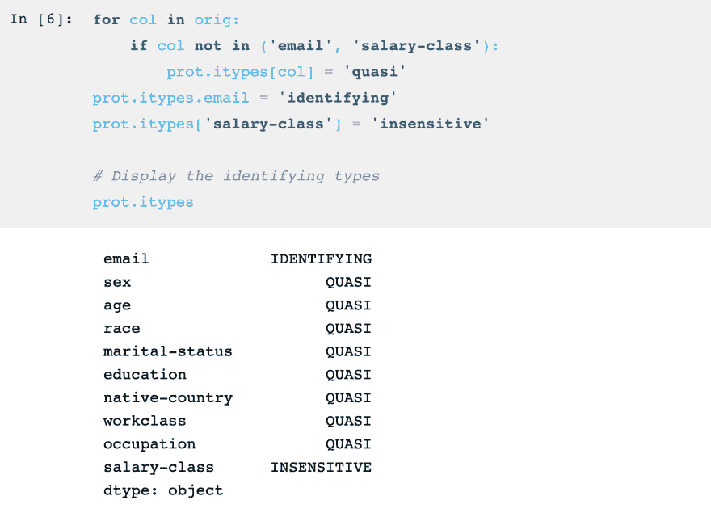
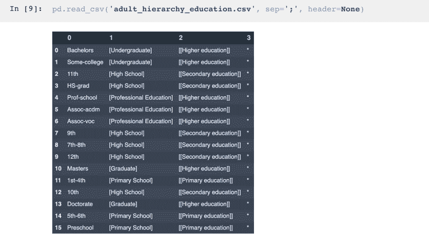
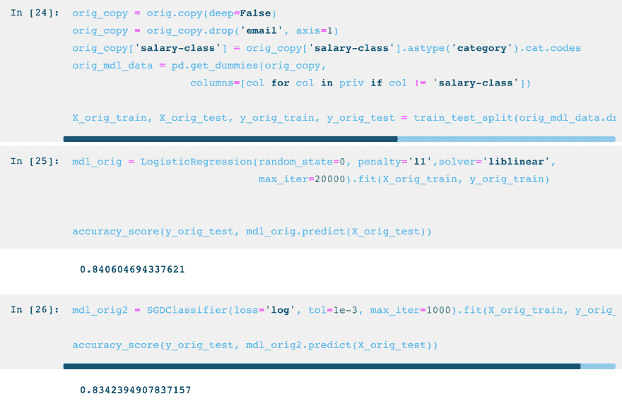
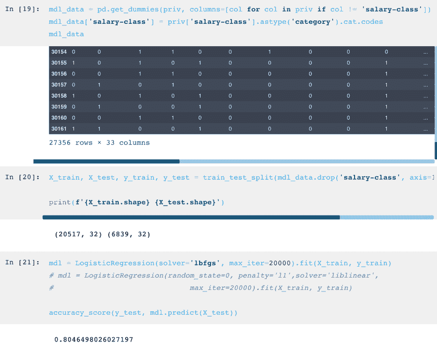

# 使用 Python 和 Pandas 保护数据集隐私的简单方法

> 原文：<https://dev.to/roberto/an-easy-way-to-privacy-protect-a-dataset-using-python-and-pandas-1b38>

使用包含敏感信息的数据集是有风险的，作为一名数据科学家，每当数据集中出现这种类型的数据时，您都应该非常小心。处理敏感信息的人通常会有这样的误解，即删除姓名、身份证和信用卡号就消除了隐私风险。虽然删除直接标识符有所帮助，但数据集中有更多的信息元素可用于重新识别个人。比如，哈佛量化社会科学研究所(IQSS)数据隐私实验室主任拉坦亚·斯威尼(Latanya Sweeney)证明，87%的美国人口可以通过邮政编码、性别和出生日期重新识别。

在这篇文章中，我将向你展示如何有效地降低数据集的隐私风险，同时保持其对机器学习的分析价值。

在下面的例子中，我们将使用 Jupyter Notebooks(数据科学家中流行的环境),使用原始数据和受隐私保护的数据来预测工资等级。我们将使用加密数字的隐私库进行隐私算法，使用 sklearn 进行回归。([在这里你可以访问加密数字隐私库的文档](http://link.cryptonumerics.com/956)

我们开始吧。

首先要做的是导入库。

现在让我们把数据集读入熊猫。

接下来，我们来选择隐私模型。在这种情况下，我们将使用 k-匿名。如果每个个体不能与 k-1 个个体区分开，则数据集被认为是 k 匿名的。换句话说，对于数据集中的每个数据点，它都在一个至少包含 k 个数据点的组中，攻击者无法区分所有这些数据点。我们将 k 设置为 5，但是，这可以根据风险要求进行调整。

之后，我们将选择优质型号。如果隐私模型被定义为隐私的约束，那么质量模型就是我们在这些约束下试图优化的。这种情况的默认情况是信息丢失或简单的丢失。基本上，我们希望获得一个被认为是私有的数据集，但同时尽量减少我丢失的信息量。

概括地说，我们有两种方法可以修改数据集以提供隐私保护，但也因此导致信息丢失:

**一般化**，用更通用的数据版本替换整个列。例如，邮政编码可以概括为密文字符，因此 12345 和 12346 都可以替换为 123**。或者类似地，年龄 19、25、26 由诸如[10-19]和[20-29]之类的范围代替。

**抑制**，从数据集中删除整行(替换为空字符*)。当存在难以归纳的唯一数据点时，这很有用。例如，如果只有一个人在[60-80]年龄范围内，我们不希望他们是可识别的，而不是创建一个更大的年龄范围(比如[40-80])，我们可以简单地从数据集中删除此人，并保留更多信息，但更私人的信息。

但是，像许多参数一样，应用抑制也是一种权衡。我们可以设置一个抑制限制，为算法提供它可以抑制的最大行数比例。通过将其设置为 0.1，不超过 10%(可能更少)的行将被编校。您可以将此视为允许高达 10%的数据被视为可以移除的“异常值”。

现在，我们将为数据分配隐私属性。有四种不同的属性:

身份识别:数据的类型，如社会安全号码，可以很容易地使用它们自己来重新识别一个人。

**准识别**:数据类型，这些数据本身几乎没有被重新识别的风险，但在一起使用时，可以可靠地与公共记录中的信息相关联。准识别属性的例子有性别、邮政编码、出生日期。

**敏感信息**:不存在重新识别风险的数据类型，但如果个人记录通过重新识别而被披露，一旦公开将对客户造成损害。敏感属性的示例包括医疗诊断、政治献金、互联网搜索历史。

**不敏感**:不存在隐私风险的数据点。

在对数据集进行隐私保护之前，最后要做的事情是创建层次结构。

使用层次结构是为了让算法知道如何概括列。例如，一个层次结构可以告诉 protect，它允许用区间[10-14]、[10-19]或[0-19]替换年龄 11，这取决于需要进行的泛化程度。

有几种方法可以自动创建层次结构，也可以在数据帧中手动指定。首先，我将使用 OrderHierarchy 为 age 自动创建一个。OrderHierarchies 是最容易生成的层次结构之一，通常可以满足许多用途。第一个参数“interval”表示输出的格式应该是[min-max]。其余的论点说(乘法)间隔应该有多大。例如，5，2，2，意味着我们给出 5，10 和 20 大小的区间的选项。然而，OrderHierarchies 总是从数据集的最小元素开始，这意味着最小间隔总是类似于[17-26]。

对于其余的等级，我们将使用中的数据框来指定它们。csv 文件。下图显示了教育的层次结构。每一列都指定了一个泛化程度，其中第一列包含所有可能的原始数据值，后续的每一列都显示了进一步的泛化程度。最后一级是完全移除柱。请注意，我使用方括号来表明使用了哪种程度的泛化，但在实践中，这是不必要的。

既然已经设置了所有的参数，我们就在 protect 对象上调用 Protect()来应用转换。它返回符合隐私模型标准的匿名数据帧(只要存在)。请注意，形状与原始形状相同，因为被移除和一般化的单元格被简单地替换为*。

让我们来看看一些重要的统计数据:
信息损失是指被编辑的信息的百分比。这就是价值优化。

最高风险是数据集的隐私风险。有 20%的概率在数据集中重新识别个体。

最小班级规模是 k 值。我早些时候把它调到五点了。

我们现在将运行两个逻辑回归来比较应用隐私保护如何影响数据集的分析值。

首先，我们将对原始数据进行处理:

最后，我们可以对受隐私保护的数据做同样的事情:

[T6】](https://res.cloudinary.com/practicaldev/image/fetch/s--Uby39Gpf--/c_limit%2Cf_auto%2Cfl_progressive%2Cq_auto%2Cw_880/https://thepracticaldev.s3.amazonaws.com/i/gui0raqayxjabiex407r.png)

正如我们所看到的，我们在准确性上有一点损失(0.26%)，但现在已经为底层数据增加了隐私保护。

在实践中，数据集越大，性能越好:更多的观察意味着更多的机会观察将落入相同的等价类(k 组)，从而更容易满足我们的隐私模型约束。这意味着随着数据集大小的增加，我们应该获得更好的准确性。