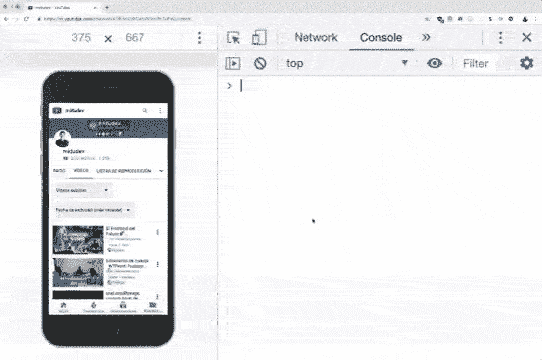

# 使用 CSS 可以实时编辑文档

> 原文：<https://dev.to/carlillo/document-is-editable-in-realtime-using-css-1o38>

前几天看我的 twitter 时间线时，我发现了一个真正的 CSS 向导的技巧，给我留下了深刻的印象。

这条推文是西班牙语的，但我必须承认，他值得我们转发，他肯定会是一个伟大的专业人士(尽管他用西班牙语写作)。

我留下了一个他可以教我们修改 CSS 的一个简单属性的动画:

> document.designMode 控制整个文档是否可编辑。有效值为“开”和“关”。根据规范，该属性默认为“关”。火狐遵循这个标准。早期版本的 Chrome 和 IE 默认为“继承”。从 Chrome 43 开始，默认为“关”，不再支持“继承”。在 IE6-10 中，值是大写的。-MDN([https://developer . Mozilla . org/en-US/docs/Web/API/Document/design mode](https://developer.mozilla.org/en-US/docs/Web/API/Document/designMode))

感谢 [@midudev](https://twitter.com/midudev) 。

*最初发表于[https://twitter.com/midudev/status/1132918283332706304](https://twitter.com/midudev/status/1132918283332706304)。*