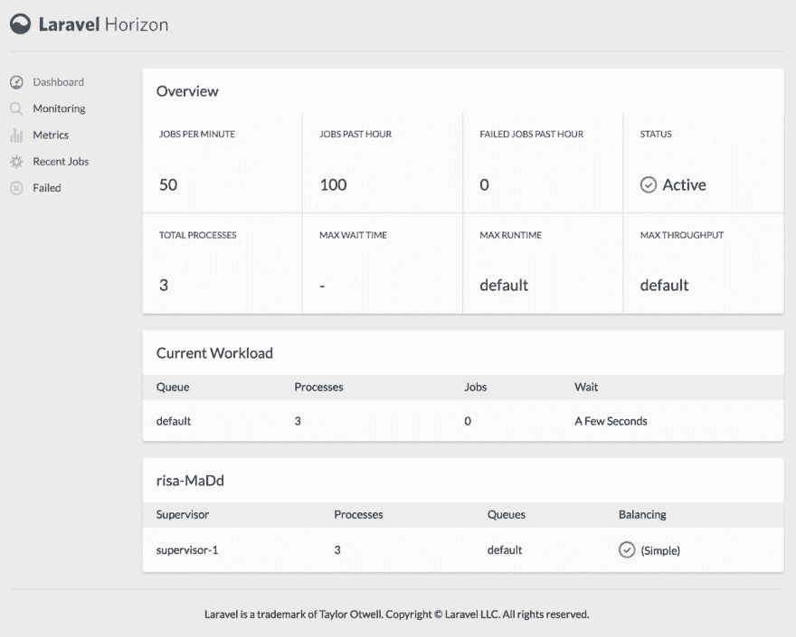

# 在 DigitalOcean 上使用 Nginx 和 Ubuntu 18.04 的 Laravel Horizon

> 原文：<https://dev.to/shuv1824/laravel-horizon-with-nginx-and-ubuntu-18-04-on-digitalocean-1fod>

几个月前，我一直在使用电子商务 SaaS 应用程序。它的一部分是用 Laravel 5 构建的，应用程序托管在 Ubuntu 服务器上的 DigitalOcean 上。它还没有投入生产，但是设置还是一样的。我的特定服务器环境是 Ubuntu 18.04 操作系统、Nginx 1.14 网络服务器和 PHP 7.2

该应用程序有许多排队和计划的任务要处理。许多任务已经使用 Laravel 的调度程序实现了自动化，所有的邮件工作都进行了排队。我使用了 Laravel 的一个非常方便的工具 Horizon 来监控和维护队列、时间表和事件。我在这里的目的是记录我设置环境所遵循的过程，以及我是如何使它正常工作的。

我不打算在数字海洋水滴上部署一个 laravel 项目的细节。我直接进入了 Horizon 设置，它适用于 laravel 以上的任何版本。我用`redis-server`作为 laravel 的队列管理存储。

### 第一步:在 Ubuntu 18.04 上安装 Redis 服务器

* * *

首先，我们必须通过 ssh 进入我们的 DigitalOcean droplet，成功登录后，我们将获得 Ubuntu 服务器的 root 访问权限。

我们必须使用以下命令来安装 Redis

```
$ apt-get update
$ apt-get upgrade
$ apt-get install redis-server
$ systemctl enable redis-server.service 
```

Enter fullscreen mode Exit fullscreen mode

Redis 可以在没有配置文件的情况下使用内置的默认配置启动。但是要进行任何额外的参数更改，我们可以使用它的配置文件，即:`/etc/redis/redis.conf`。我们必须在文本编辑器中编辑 Redis 配置文件来进行更改

```
$ vim /etc/redis/redis.conf 
```

Enter fullscreen mode Exit fullscreen mode

上述配置告诉 Redis 在达到最大内存 256mb 时使用 LRU 算法删除任何密钥。保存配置文件并重新启动 Redis 服务:

```
$ systemctl restart redis-server.service 
```

Enter fullscreen mode Exit fullscreen mode

使用 redis-cli 工具验证 redis 服务器和 redis-cli 之间的连接。

```
$ redis-cli

127.0.0.1:6379> ping
PONG
127.0.0.1:6379> 
```

Enter fullscreen mode Exit fullscreen mode

### 第二步:安装 Predis 以便与 Laravel 一起使用 redis

* * *

在使用 Redis 和 Laravel 之前，您需要通过 Composer:
安装`predis/predis`包

```
$ composer require predis/predis 
```

Enter fullscreen mode Exit fullscreen mode

在安装了`predis`之后，我们必须为我们的应用程序配置它。redis 的配置文件位于`config/database.php`配置文件中。在这个文件中，您将看到一个包含您的应用程序所使用的 Redis 服务器的`redis`数组:

```
/* config/database.php file */
'redis' => [

    'client' => 'predis',

    'default' => [
        'host' => env('REDIS_HOST', '127.0.0.1'),
        'password' => env('REDIS_PASSWORD', null),
        'port' => env('REDIS_PORT', 6379),
        'database' => env('REDIS_DB', 0),
    ],

    'cache' => [
        'host' => env('REDIS_HOST', '127.0.0.1'),
        'password' => env('REDIS_PASSWORD', null),
        'port' => env('REDIS_PORT', 6379),
        'database' => env('REDIS_CACHE_DB', 1),
    ],

], 
```

Enter fullscreen mode Exit fullscreen mode

### 第三步:安装地平线

* * *

我们必须使用`composer`来获得整个 Laravel Horizon。

```
$ composer require laravel/horizon 
```

Enter fullscreen mode Exit fullscreen mode

安装 Horizon 后，使用 horizon:install Artisan 命令发布其资源:

```
$ php artisan horizon:install 
```

Enter fullscreen mode Exit fullscreen mode

我们还应该创建 failed_jobs 表，Laravel 将使用它来存储任何失败的队列作业:

```
$ php artisan queue:failed-table
$ php artisan migrate 
```

Enter fullscreen mode Exit fullscreen mode

Horizon 的主要配置文件将位于`config/horizon.php`。这个配置文件允许我们配置我们的工人选项，并且每个配置选项包括其用途的描述。在文件中，我们必须将连接定义为`redis`。

```
/* config/horizon.php file */
'environments' => [
        'production' => [
            'supervisor-1' => [
                'connection' => 'redis',
                'queue' => ['default'],
                'balance' => 'simple',
                'processes' => 10,
                'tries' => 3,
            ],
        ],

        'local' => [
            'supervisor-1' => [
                'connection' => 'redis',
                'queue' => ['default'],
                'balance' => 'simple',
                'processes' => 3,
                'tries' => 3,
            ],
        ],
    ], 
```

Enter fullscreen mode Exit fullscreen mode

现在 Horizon 安装完毕。我们必须使用 Artisan 命令启动 horizon，并保持命令运行，以便能够在此时使用 horizon 处理队列。为此，导航到项目根目录并运行:

```
$ php artisan horizon 
```

Enter fullscreen mode Exit fullscreen mode

Horizon 运行后，我们可以在`http://project.link/horizon`找到它。我们将看到如下所示的仪表板页面:

[](https://res.cloudinary.com/practicaldev/image/fetch/s--uWyniCqN--/c_limit%2Cf_auto%2Cfl_progressive%2Cq_auto%2Cw_880/https://res.cloudinary.com/dtfbvvkyp/image/upload/v1537195039/photos/Test.png)

### 第四步:仪表板授权

* * *

但是这只能在应用程序的`local`环境中工作。为了在生产中使用它，我们必须向它添加`dashboard authorization`,这样没有人可以在没有登录的情况下访问页面。在`app/Providers/HorizonServiceProvider.php`文件中，有一个 gate 方法。此授权门控制非本地环境中对 Horizon 的访问。您可以根据需要自由修改此入口，以限制对您的 Horizon 安装的访问:

```
/**
 * Register the Horizon gate.
 *
 * This gate determines who can access Horizon in non-local environments.
 *
 * @return void
 */
protected function gate()
{
    Gate::define('viewHorizon', function ($user) {
        return in_array($user->email, [
            'admin@application.com',
        ]);
    });
} 
```

Enter fullscreen mode Exit fullscreen mode

这将允许使用电子邮件`admin@application.com`的用户访问`/horizon`路线并使用 horizon。

### 第五步:自动化 Horizon

* * *

如果我们将 Horizon 部署到一个活动服务器，我们应该配置一个进程监视器来监视 php artisan horizon 命令，如果它意外退出，就重新启动它。在将新代码部署到我们的服务器时，我们需要指示主 Horizon 进程终止，以便它可以由您的进程监视器重新启动，并接收您的代码更改。为了处理这个问题，我们需要`supervisor`。安装`supervisor` :

```
$ apt-get install supervisor 
```

Enter fullscreen mode Exit fullscreen mode

安装完成后，我们必须运行以下命令在启动时运行`supervisor`。

```
$ systemctl enable supervisord 
```

Enter fullscreen mode Exit fullscreen mode

现在我们必须在`/etc/supervisor/conf.d/`中创建一个名为`horizon.conf`的新文件，并添加下面的配置:

```
[program:horizon]
process_name=%(program_name)s
command=php /full/path/to/our/application/artisan horizon
autostart=true autorestart=true user=root
redirect_stderr=true stdout_logfile=/full/path/to/our/application/horizon.log 
```

Enter fullscreen mode Exit fullscreen mode

现在，为了读取和重新加载配置并重新启动该过程，我们必须运行以下命令:

```
$ supervisorctl reread
$ supervisorctl update
$ supervisorctl start horizon 
```

Enter fullscreen mode Exit fullscreen mode

这将正确设置 Laravel horizon，并使其在服务器上自动运行。但是，如果对队列或时间表进行了某些更改，必须重新启动 Horizon，以使这些更改在服务器上生效。为此，导航到项目根目录并运行:

```
$ php artisan horizon:terminate 
```

Enter fullscreen mode Exit fullscreen mode

这些是我在数字海洋 droplet 上安装 Ubuntu 18.04 服务器上的 Laravel Horizon 的基本步骤。希望这个指南能帮助你们中的一些人轻松地完成任务，并更有成效。