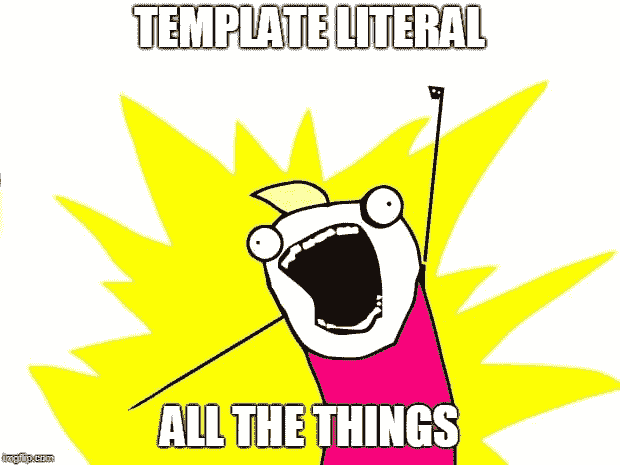

# 带有 hyperHTML-2、事件和组件的简单应用程序

> 原文：<https://dev.to/pinguxx/easy-apps-with-hyperhtml-2-hbi>

西班牙文版

[Chinese version](http://www.lofter.com/lpost/1f16161f_12b7a08fe)

第 2 部分作者

## [伊凡](/pinguxx)

[standard geek](/pinguxx)

[pinguxx](https://twitter.com/pinguxx)[pinguxx](https://github.com/pinguxx)

## [保罗·汤普森](/paritho)

[lover of dogs and javascript. and coffee. and writing.](/paritho)

[帕里托](https://github.com/paritho)

1.  [介绍，焊线/绑定](https://dev.to/pinguxx/easy-apps-with-hyperhtml-1-31cc)
2.  **事件和组件**
3.  [关于组件和简单状态管理的 Moar】](https://dev.to/pinguxx/easy-apps-with-hyperhtml-3-1m3l)
4.  [电线类型和自定义定义(意图)](https://dev.to/pinguxx/easy-apps-with-hyperhtml-4-38k3)
5.  [用 hyper 定制元素](https://dev.to/pinguxx/easy-apps-with-hyperhtml-5-13hc)
6.  [定制我的定制元素](https://dev.to/pinguxx/easy-apps-with-hyperhtml-6-1e73)
7.  [测试！](https://dev.to/pinguxx/easy-apps-with-hyperhtml-7-5b9g)
8.  [异步加载、占位符和带超链接的提前输入](https://dev.to/pinguxx/easy-apps-with-hyperhtml-8-async-loading-5d96)
9.  [搬运路线](https://dev.to/pinguxx/easy-apps-with-hyperhtml-9-routing-59k0)
10.  [第三方库](https://dev.to/pinguxx/easy-apps-with-hyperhtml-10-3rd-party-libraries-2n7b)

如果您跟随了第 1 部分的学习，那么您现在已经知道了开始使用 hyperHTML 的基础知识。我们现在可以深入更复杂的话题。回想一下我们在第 1 部分中制作的表格:

[https://stackblitz.com/edit/basics-table?embed=1&&](https://stackblitz.com/edit/basics-table?embed=1&&)

让我们从在列标题中启用排序开始。

### 事件

首先，我们将把上一个例子中的渲染部分移到一个函数中，这样我们就可以重用它了。我们从这个开始: