# 使用 Cube.js 测试自动化分析

> 原文：<https://dev.to/cubejs/test-automation-analytics-using-cube-js-4pbg>

*原载于[媒体](https://medium.com/quick-code/test-automation-analytics-using-cube-js-e3ee0fa84981)T3】*

我从事质量工程和测试自动化已经十年了，我的观察是，当谈到测试自动化时，通常缺少的是可见性。是啊！你没听错。**能见度！**

> 通常情况下，技术方面和非技术方面一样无关紧要。

有时，我甚至有一种感觉，当团队的每个成员都对质量方面负责的时候，测试自动化正在变成仅仅是 QAs 的责任。其原因也是有时缺少测试自动化的可见性。因为你看不到每天发生的事情，所以你不会为此负责。有时，我也看不出它有什么价值。在某种程度上—

> 眼不见心不烦。

实践敏捷的团队相信的首要事情之一是可见性。在实践敏捷的团队中，以故事墙、晴雨表(跟踪整体冲刺进度)、构建监视器、烧毁图表、冰淇淋计量器(谁按时参加了站立会议，谁没有)的形式出现的可见性是非常普遍的。

自动化的可见性不仅对质量分析师或测试自动化工程师很重要，对 Scrum 团队的每个成员也很重要，比如 BAs、dev、UX 设计师、产品所有者、产品经理和商业利益相关者。测试自动化度量是产品健康的直接指示器，因此具有非常重要的意义。度量有助于做出有效的决策。

我创建的第一个测试自动化仪表板正好是十年前使用 JSP 和 MySql 创建的。在那之后，我不时地使用 Spring Boot、MySql 和 UI 框架。但是，随着 Node.js 的兴起和 js 框架的飞速发展，这一次我想探索传统堆栈之外的东西。

当我在探索各种选择时，吸引我注意力的是 [Cube.js](https://cube.dev/) 。我在 Cube.js 网站上查看了一些[示例](https://github.com/statsbotco/cube.js#examples)用例。看着现场演示，我意识到这就是我一直在寻找的。我快速浏览了一下文件，发现它条理清晰，内容详细，符合要求。加入了[休闲频道](https://cube-js.slack.com/)看看支持度如何，还不错。几乎所有的查询都以下降的周转时间回答。我的个人经历——我在 Slack 频道上问了两个问题，都在几分钟内得到了解决。

所以准确地说，Cube.js 需要用户对你的数据库有充分的了解。并且它在布线或链接组件方面做了繁重的工作。一点点准备工作就能让节目在几个小时甚至几分钟内开始运行。在不到两天的时间里，我创建了这个测试自动化仪表板。我用过的数据库是 MySql。数据库模式如下图所示。

## 数据库模式

[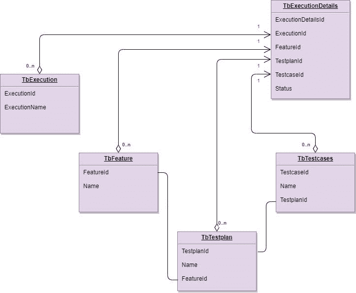](https://res.cloudinary.com/practicaldev/image/fetch/s--Fkf50Gap--/c_limit%2Cf_auto%2Cfl_progressive%2Cq_auto%2Cw_880/https://media.graphcms.com/Yu40OxawT5Ozs39PkXM5)

让我们看看这些表格中的每一张

*   **TbExecution** —这个表格保存了关于测试自动化执行的细节。每当测试自动化执行被触发时，一个新的执行条目就会被添加到这个表中。
*   **TbFeature** —该表包含特定产品的所有特性的详细信息。
*   **TbTestplan** —该表保存了所有特性中测试计划的详细信息。这里的关系是多对一的，即一个特性将有多个测试计划。
*   这个表格包含了属于所有测试计划的所有测试用例。这里的关系是多对一的，即一个测试计划将有多个测试用例。
*   **TbExecutionDetails** —这是保存所有自动化运行的执行结果的表格。它拥有一个测试计划中每个测试用例的执行状态，在一个特定的测试自动化执行过程中跨特性执行。

[](https://res.cloudinary.com/practicaldev/image/fetch/s--ADyM8gD---/c_limit%2Cf_auto%2Cfl_progressive%2Cq_auto%2Cw_880/https://media.graphcms.com/zE4iXvuRjOoAki7KTt3o)

关于 MySql 和 Cube.js 的整个设置的一个基本事情是，它是测试自动化框架不可知的。这意味着，无论您使用 TestNG-Selenium 或 TestNG-RestAssured 或 Jasmine-量角器或 Mocha-SuperTest 或您选择的任何其他框架，您需要关注的是在自动化执行结束后更新 MySql 数据库。只要用于测试自动化的底层语言能够连接到 MySql 数据库并在执行后更新结果，Cube.js 就会显示所需的图表/指标。

## 测试自动化框架& Cube.js

[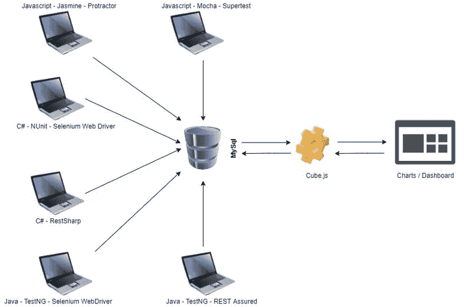](https://res.cloudinary.com/practicaldev/image/fetch/s--3aeRqmzM--/c_limit%2Cf_auto%2Cfl_progressive%2Cq_auto%2Cw_880/https://media.graphcms.com/G2hM6IUzRMWKKwI1udKS)

*用不同语言测试自动化框架，更新 MySql 数据库中的结果*

创建这个测试自动化仪表板的目标是回答一些关于整个测试覆盖的问题。像这样的问题-

在最近 5 次自动化执行中，总的测试用例通过率是多少？

[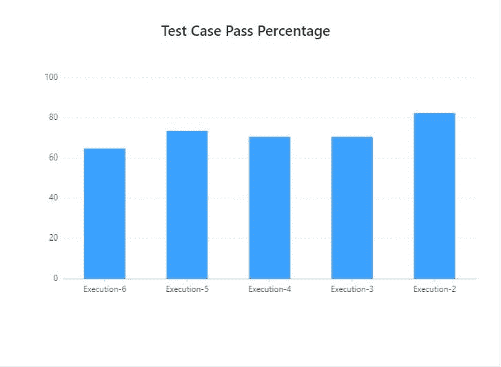](https://res.cloudinary.com/practicaldev/image/fetch/s--R2Qx7PQB--/c_limit%2Cf_auto%2Cfl_progressive%2Cq_auto%2Cw_880/https://media.graphcms.com/hZLkVvhRIm8NoNAzvqAg)

1.  在最近 5 次自动化执行中，在执行的所有测试用例中，通过失败的测试用例总数是多少？

[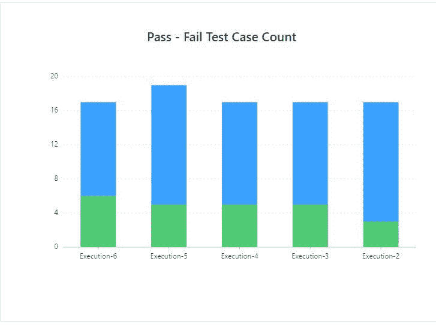](https://res.cloudinary.com/practicaldev/image/fetch/s--ov5hik5w--/c_limit%2Cf_auto%2Cfl_progressive%2Cq_auto%2Cw_880/https://media.graphcms.com/Z7jhDV7qSbO1kbX1SWEo)

1.  最近 5 次执行的测试用例总数、通过、失败和通过百分比是多少？

[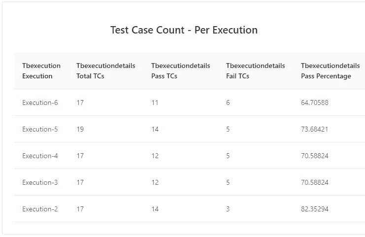](https://res.cloudinary.com/practicaldev/image/fetch/s--p_iwuC37--/c_limit%2Cf_auto%2Cfl_progressive%2Cq_auto%2Cw_880/https://media.graphcms.com/MVyL8ISiTwCKxDMBfgxJ)

1.  在每个特性的测试计划中，执行、通过、失败的测试用例总数是多少？

[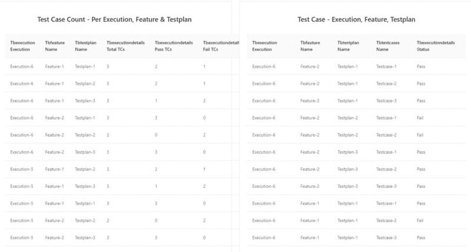](https://res.cloudinary.com/practicaldev/image/fetch/s--tViNJegw--/c_limit%2Cf_auto%2Cfl_progressive%2Cq_auto%2Cw_880/https://media.graphcms.com/2I0D48tMQ1eor2uCspB4) 
现在，我们已经了解了开发这个仪表板的目的，让我们来看看它的文件夹结构。数据库模式和文件夹结构可以从[克隆到这里](https://github.com/Shreyasc27/testautomationdashboard-cubejs)。文件夹结构如下图所示。
[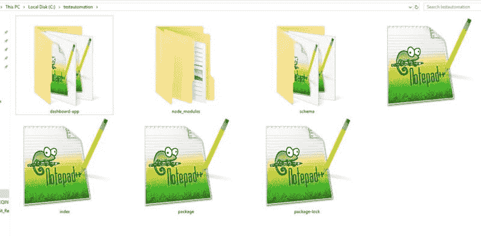](https://res.cloudinary.com/practicaldev/image/fetch/s--VXRAbwBP--/c_limit%2Cf_auto%2Cfl_progressive%2Cq_auto%2Cw_880/https://media.graphcms.com/8SxoHMSXWC469ijA0yNQ)

在克隆的 git 存储库中，您看到的附加文件夹— mysql-schema 是保存 mysql 数据库模式的文件夹。这是示例测试数据和数据库模式，我们将使用它们来生成上面快照中的图表。

## 先决条件

*   [节点](https://nodejs.org/en/)
*   [npm](https://www.npmjs.com/)
*   [MySql](https://medium.com/r/?url=https%3A%2F%2Fwww.mysql.com%2F) 的实现

## 逐步引导

**步骤 1:** 验证先决条件是否正确安装-

a.NodeJs 与 npm

[](https://res.cloudinary.com/practicaldev/image/fetch/s--nkUEm7ic--/c_limit%2Cf_auto%2Cfl_progressive%2Cq_auto%2Cw_880/https://media.graphcms.com/SSrwc5RxSe2rcaHbxDQ9)

b.关系型数据库

[](https://res.cloudinary.com/practicaldev/image/fetch/s--jRSeJ7K1--/c_limit%2Cf_auto%2Cfl_progressive%2Cq_auto%2Cw_880/https://media.graphcms.com/vl0d3klNTOOAwC9jmnFn)

**步骤 2:** 使用“mysql-schema”文件夹中的“testautomationresults.sql”文件设置“testautomationresults”数据库。

[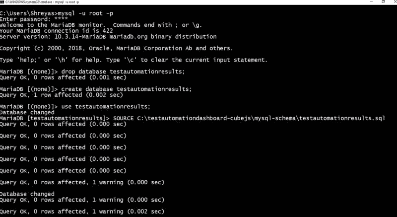](https://res.cloudinary.com/practicaldev/image/fetch/s--hX5yCd24--/c_limit%2Cf_auto%2Cfl_progressive%2Cq_auto%2Cw_880/https://media.graphcms.com/S17yN3OjT4eC876v72Zk)

**步骤 3 :** Git 使用下面的命令克隆存储库

```
git clone https://github.com/Shreyasc27/testautomationdashboard-cubejs.git 
```

Enter fullscreen mode Exit fullscreen mode

**第四步:**

```
cd testautomationdashboard-cubejs 
```

Enter fullscreen mode Exit fullscreen mode

用适当的 MySql 细节编辑`.env`

[](https://res.cloudinary.com/practicaldev/image/fetch/s--bETBCSzt--/c_limit%2Cf_auto%2Cfl_progressive%2Cq_auto%2Cw_880/https://media.graphcms.com/z3HzXhlTJCIn90Kcfdwv)

**第五步:**

```
cd testautomationdashboard-cubejs
npm install npm run dev 
```

Enter fullscreen mode Exit fullscreen mode

[](https://res.cloudinary.com/practicaldev/image/fetch/s--heBjYoyG--/c_limit%2Cf_auto%2Cfl_progressive%2Cq_auto%2Cw_880/https://media.graphcms.com/wIkhv38qT02H7wkSzPNk)

就像上面的 cmd 一样，打开 url `http://localhost:4000`。将显示如下所示的开发环境。

[](https://res.cloudinary.com/practicaldev/image/fetch/s--8id5ZyJp--/c_limit%2Cf_auto%2Cfl_progressive%2Cq_auto%2Cw_880/https://media.graphcms.com/y2swLtXkROSyXkekr6iK)

要进一步探索这个开发环境，请参考 [Cube.js 网站](https://cube.dev/)上的文档。

**第六步:**

```
cd testautomationdashboard-cubejs\dashboard-app
npm install npm run-script
npm run-script build 
```

Enter fullscreen mode Exit fullscreen mode

运行以上命令将在`dashboard-app`中生成一个`build`文件夹。

[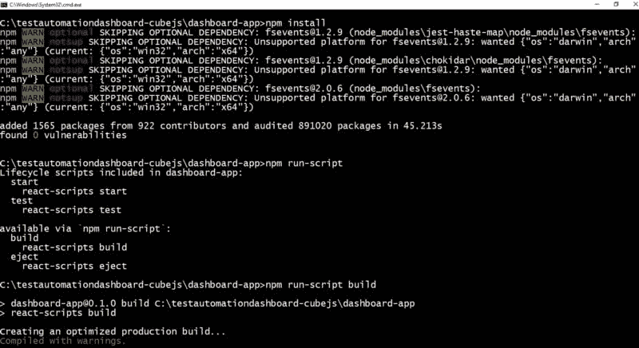](https://res.cloudinary.com/practicaldev/image/fetch/s--mk8XrWaH--/c_limit%2Cf_auto%2Cfl_progressive%2Cq_auto%2Cw_880/https://media.graphcms.com/Z1zeeuDTjucZYcyALJvf)

**第七步:**

```
cd build
npm install http-server -g
http-server 
```

Enter fullscreen mode Exit fullscreen mode

[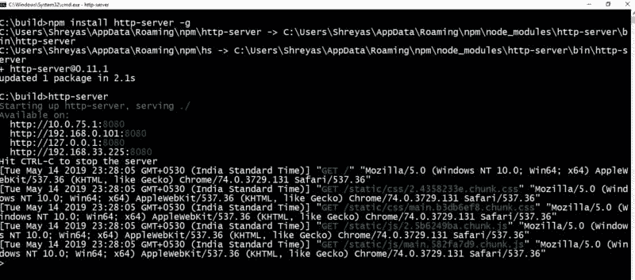](https://res.cloudinary.com/practicaldev/image/fetch/s--bmgDjnze--/c_limit%2Cf_auto%2Cfl_progressive%2Cq_auto%2Cw_880/https://media.graphcms.com/8A9ETtiaTPOfOhbx7l7H)

将生成的“build”文件夹复制到任何其他目录

**第八步:**点击任何一个列出的网址。测试自动化仪表板应该启动并运行。【T2[](https://res.cloudinary.com/practicaldev/image/fetch/s--r--xybv2--/c_limit%2Cf_auto%2Cfl_progressive%2Cq_auto%2Cw_880/https://media.graphcms.com/uWBrrvJnTN6fKQxs9G28)
[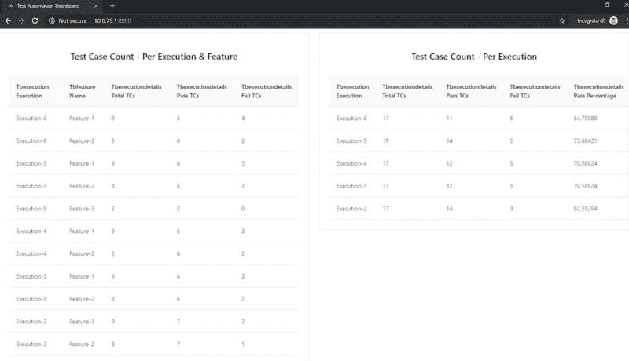](https://res.cloudinary.com/practicaldev/image/fetch/s--suqAxQS3--/c_limit%2Cf_auto%2Cfl_progressive%2Cq_auto%2Cw_880/https://media.graphcms.com/rbDbuqiOQ4mek7RSjJVC)
[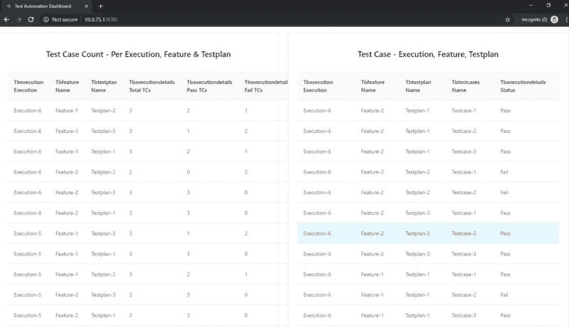](https://res.cloudinary.com/practicaldev/image/fetch/s--dY_dDtUW--/c_limit%2Cf_auto%2Cfl_progressive%2Cq_auto%2Cw_880/https://media.graphcms.com/x0TPV9LQXisZhabdMseD)